# 1、scratch

​		python是一种更现代，更高级的语言，python的流行源于它的相对可读性，最终我们将看到它的生态系统多么强大充实。

​	python不需要显式的去编译

​		python也没有主方法main，但是C语言和Java都是需要一个程序的主入口的main方法

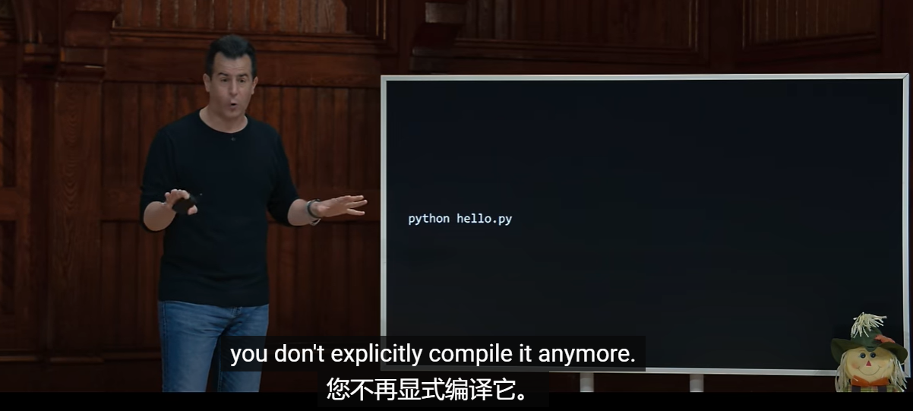

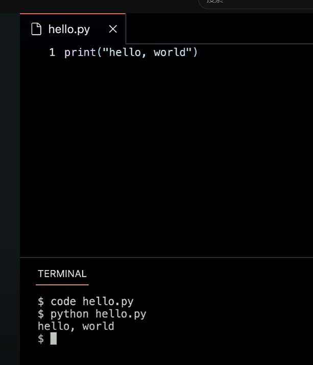

https://www.youtube.com/watch?v=EHi0RDZ31VA

​		循环 可以使用in range

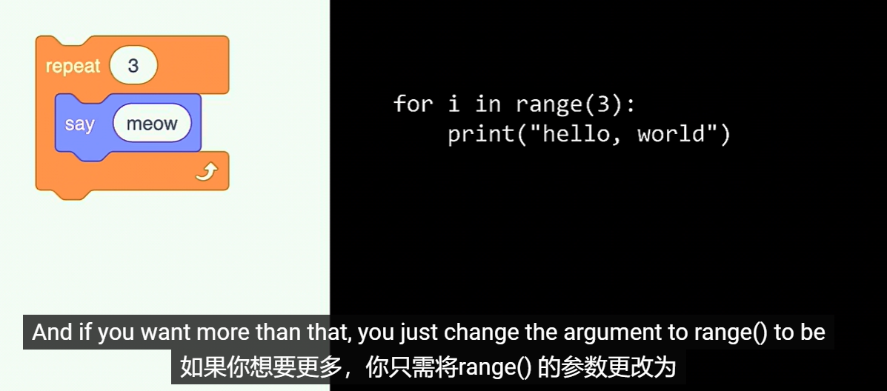

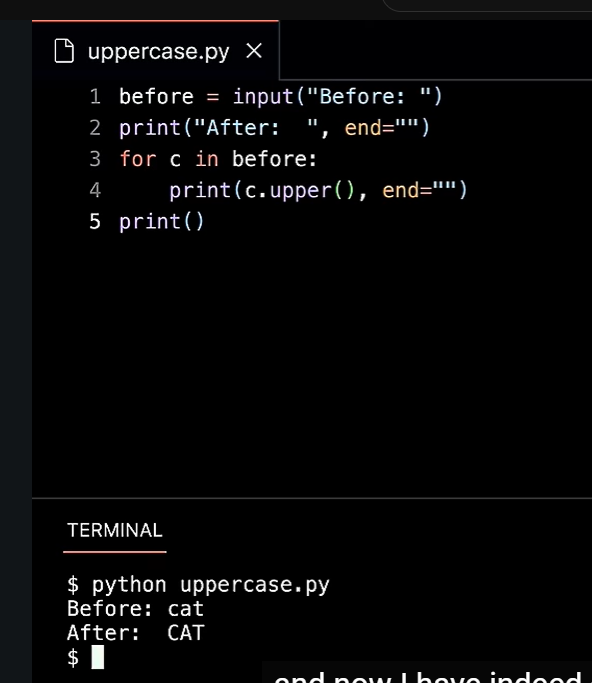

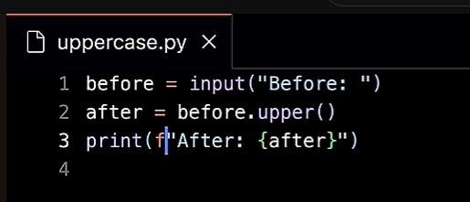

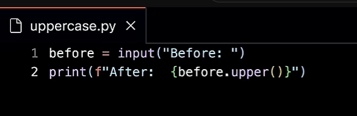

​		计算

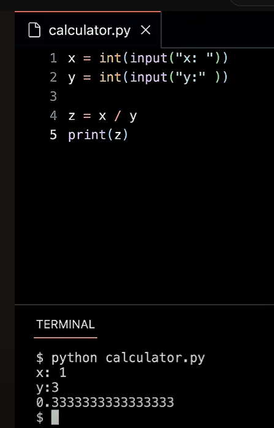

#### 	Exception

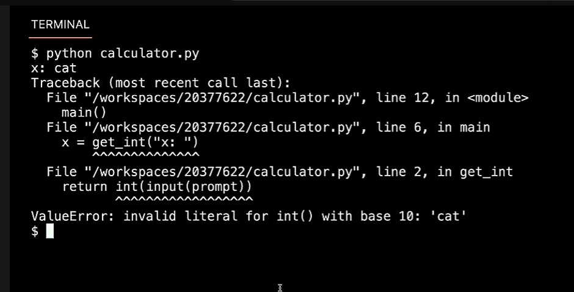

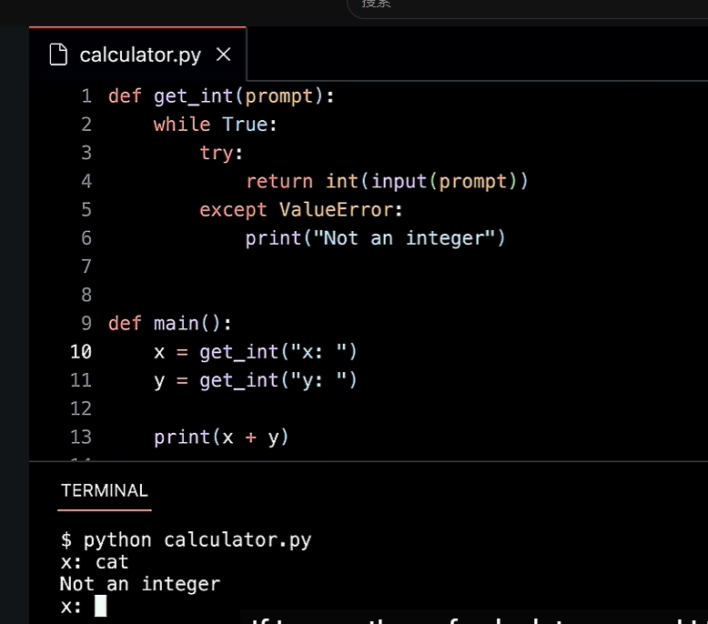

#### 	List

​			平均值计算

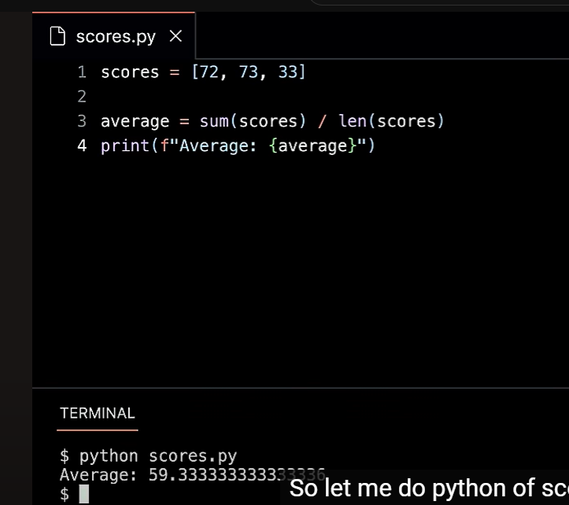

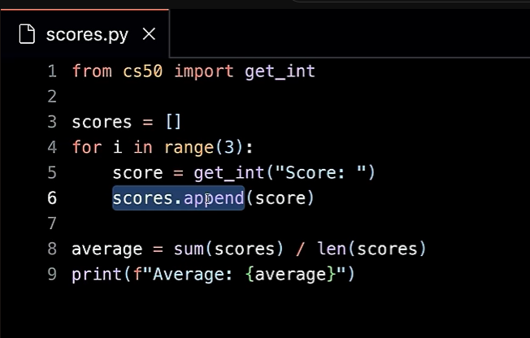

​		人员查找

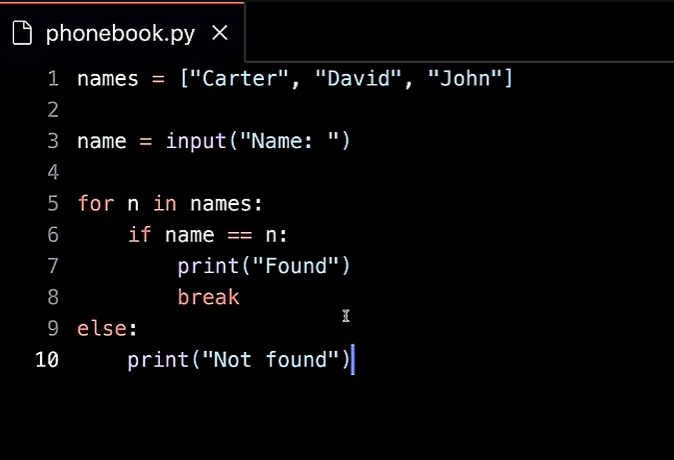

​		使用in

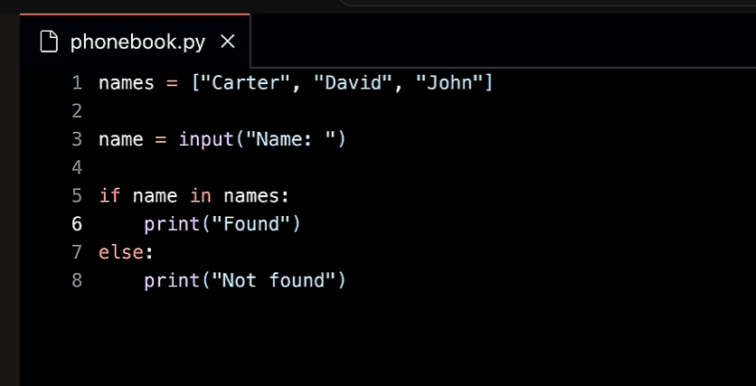

#### 	dict 字典

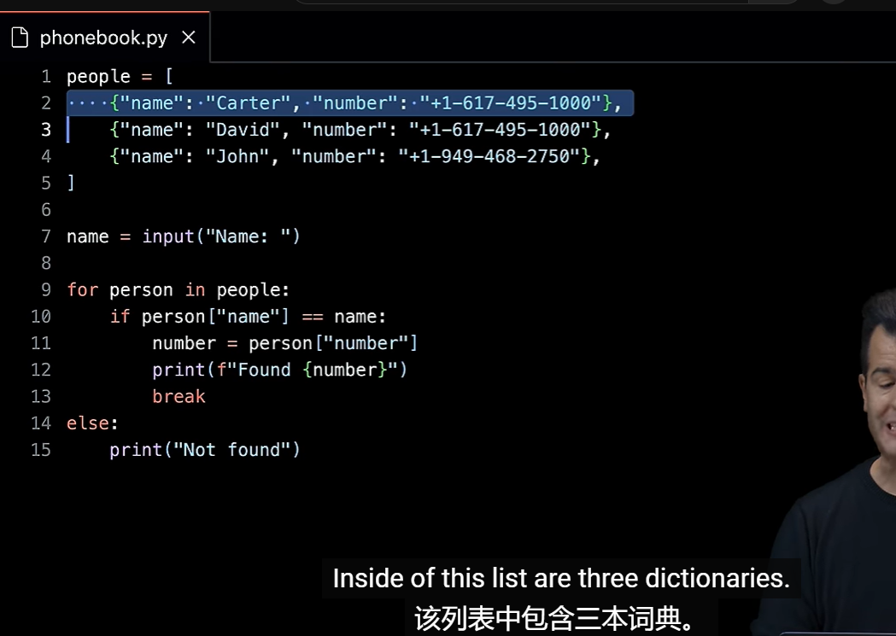

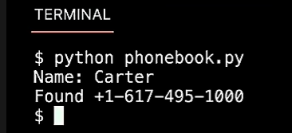

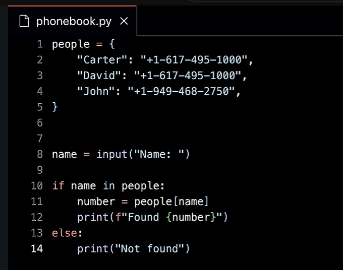

#### sys 系统库

#### Pip

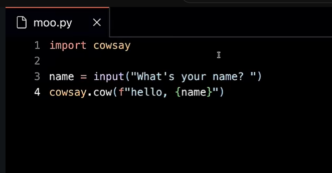

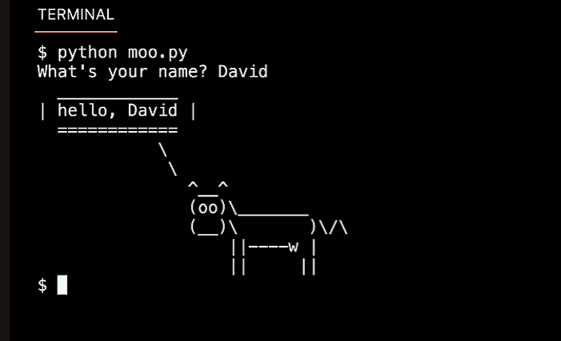

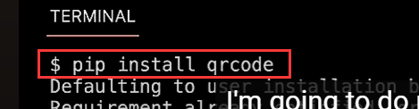

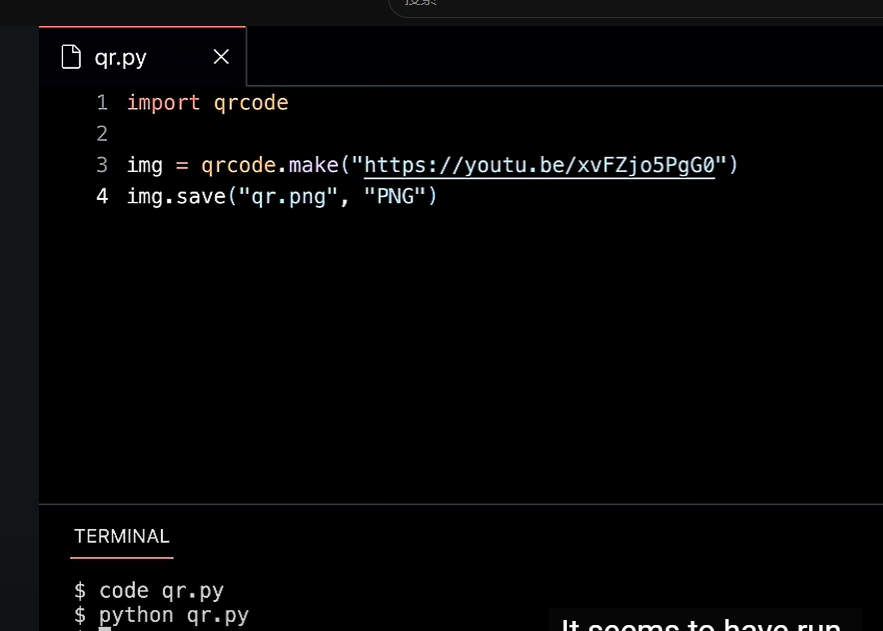

