```
title: 5、数据结构
```


# 5、数据结构

​	

## 1、抽象数据类型

#### 	1、queues 队列

​		例如，实际上有一种计算机很常见 的数据类型，称为队列queues，从现实世界来看我们大多数人都熟悉队列，也就是排队。

​		具体来说，队列提供了一种特性那么就是 先进先出FIFO，像这样的结构实际上提供了有意义的特定操作，在队列的上下文中，我们通常将这些操作描述为 入队enqueue 和 出队dequeue


​	现在如何在代码中C语言 实现队列呢？

​	借助数组

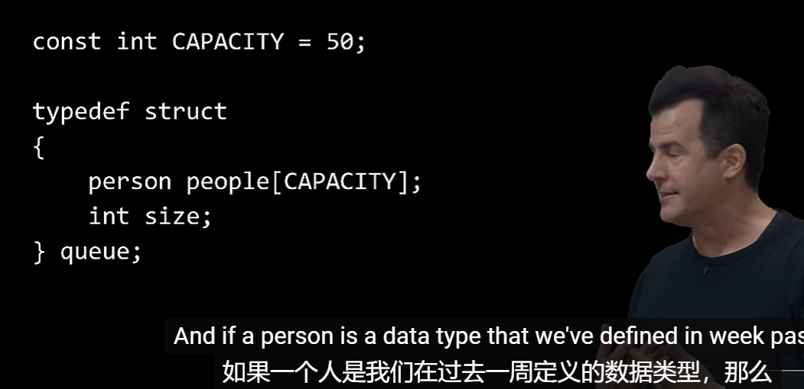


#### 	2、stack 堆栈

​		另一种抽象数据类型 称为stack 栈

​	堆栈实际上无处不在，尽管它不一定是我们刚刚队列一样展示的效果（不是 先进先出）

​	栈实际上是LIFO，即 后进先出，这与队列是相反的，所以说后进先出不能保证与传统队列相同的公平保证。

​	事实上，例如我们将收到的email邮件，基本上会视为一个堆栈stack，因为当我们收到新的邮件，它实际上是位于我们收件箱的顶部，而我们可能是有上往下看的顺序。

​		push 是堆栈的 入队

​		pop 是堆栈的 出队

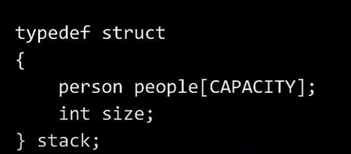


#### 3、可变数组 Resizing Arrays

​		假如我们现在有一个 3个位置的数组，那么后续如果想继续往里加数据，就会有个问题，就是数据在内存中的连续性， 我们可以通过 copy原来的数组 然后添加进来新的数据，分配新的内存 这样虽然可以保证数据在内存中的连续性，但是这样操作的话 如果数据一直在累加 那么每次都需要 循环的复制 和分配资源 删除内存资源，效率实在是非常的浪费低下。

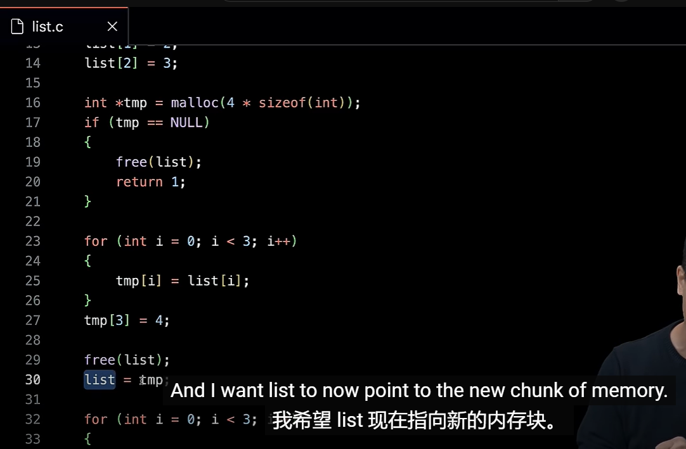

​		所以说这样的操作虽然可以实现，但实际上非常的繁琐复杂，及消耗性能


​	那么我们为什么不分配一个默认就比较大的数组，例如分配一个30,300,3000大小的数组呢？然后跟踪我们实际使用了多少，这将解决不让自己这么快陷入困境的问题，这里还有个问题如果设置为3000那么超过3000大小的数组还是会遇到这样的问题，也许有更好的解决方案


​	我们可以更巧妙的使用内存，我们有了指针，他们实际上只是让我们指向内存中不同的位置，这样我们就可以开始以一种有趣的方式将事物拼接在一起，因此，我们真正需要的是将内存中的事物拼接在一起，并构建有趣的结构。

​	之前我们使用*号和. 组合来操作指针，今天我们将使用 -> 来替换他们，因为之前使用.或者 *号不太容易理解，这个 -> 从外观看起来就像是指向某个地方，后续我们操作链表来看一下它 -》


#### 4、链表 Linked Lists

​			我们只要将气球代表每一块内存空间，只要将这些空间联系起来这样就无论这个内存是在什么位置我们都不用担心了，即使不连续，只要我们可以联系起来就ok了

​	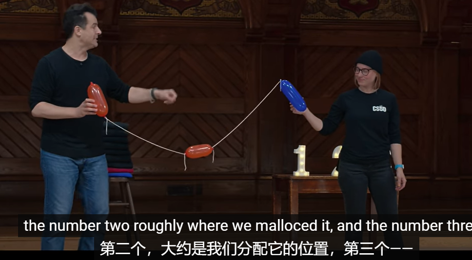


​		如何进行连接呢，那就是每个元素都分配额外的内存空间，用于存放 连接下个节点的内存地址，如果到最后的值那么它的连接地址就是 0x0 也就是null 空指针

​		这里的缺点就是使用的内存空间大于原来固定数组值的2倍，优势就是现在我们不需要担心复制和移动这些数据。

​		随着时间推移，对于真正大型的程序来说，大数据集很可能对我们来说是一件好事，是一场胜利。这就是链表的概念。

		

​		我们可以将这些指针称为 元数据，它是真实的数据帮助我们解决的问题是从 一个节点找到下一个节点，但元数据与数据不同，因为我们根本上不关心这些元数据，这只是实现的细节，帮助我们组织实际数据的细节。

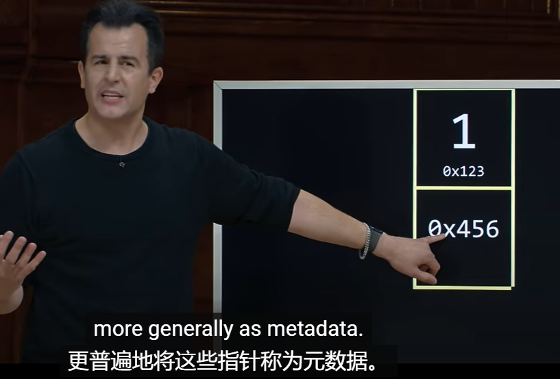


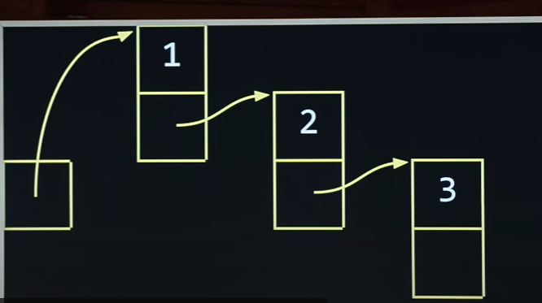


​		我们如何才能将其转换为实际的代码呢？

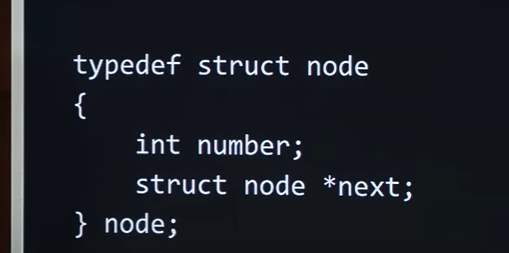

​			我们需要给list定义一个初始的 指针地址

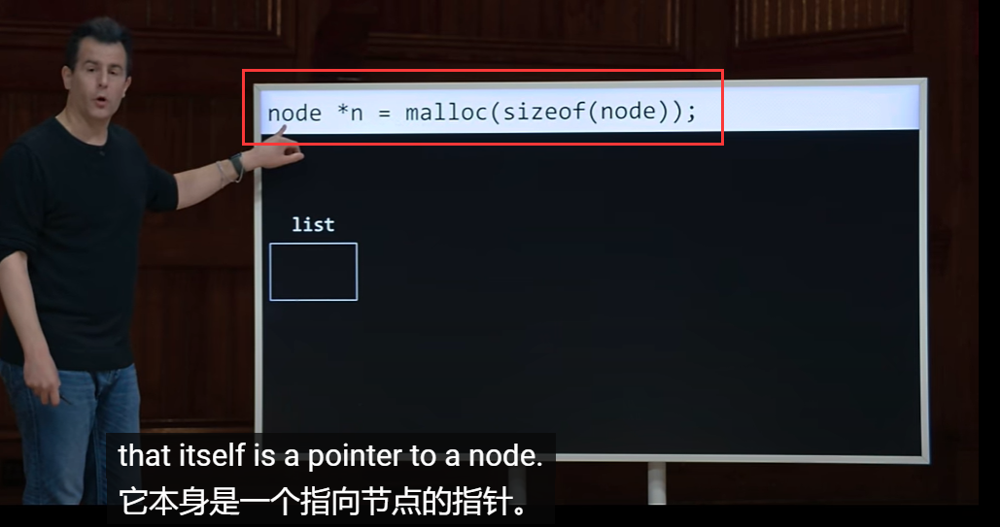

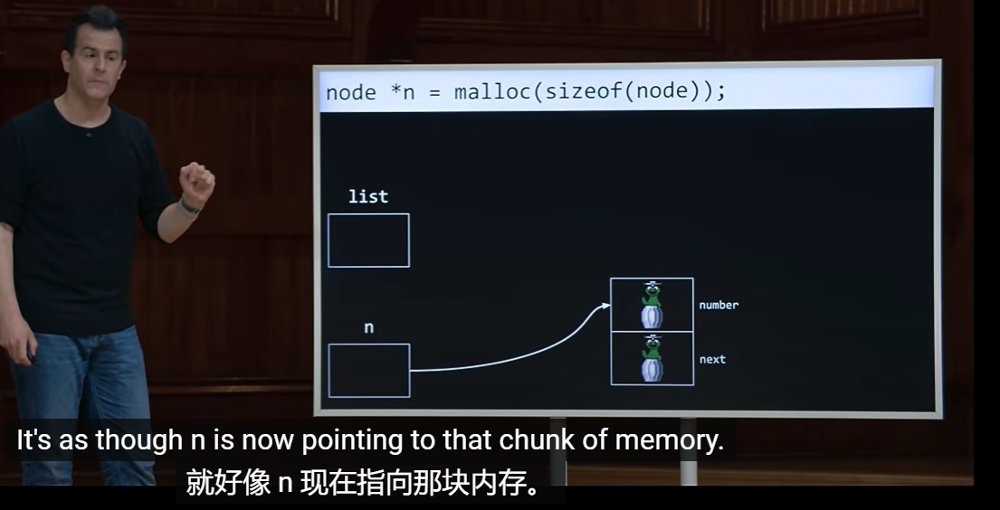


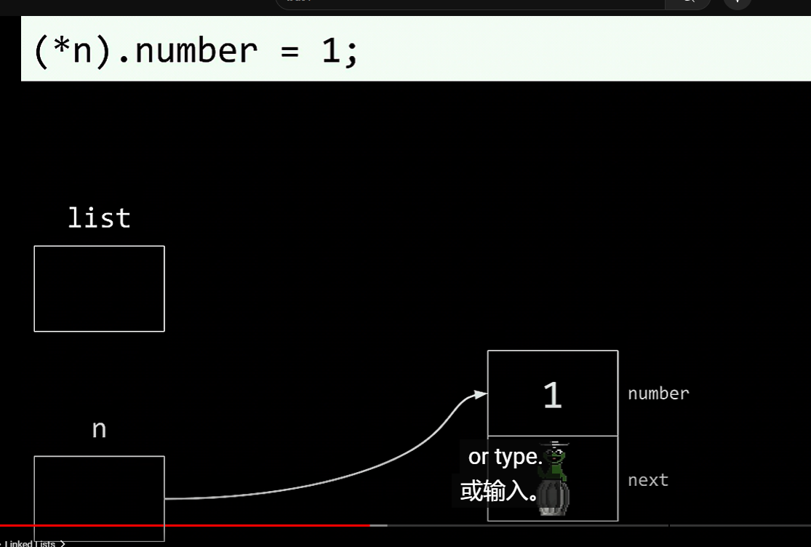


​	可以将* 和.简化为 -> 指向 指针

​			number是 n这个对象数据结构中的属性

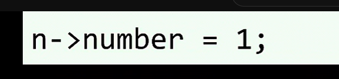


​	那么我们如何设置第二个值，也就是指针值，我们设置为null因为如果设置了默认值，它会去连接寻找下一个节点

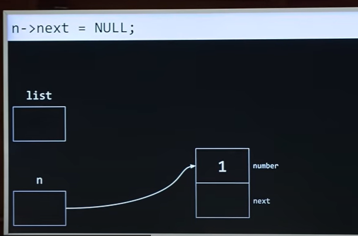

https://www.youtube.com/watch?v=0euvEdPwQnQ		50分钟


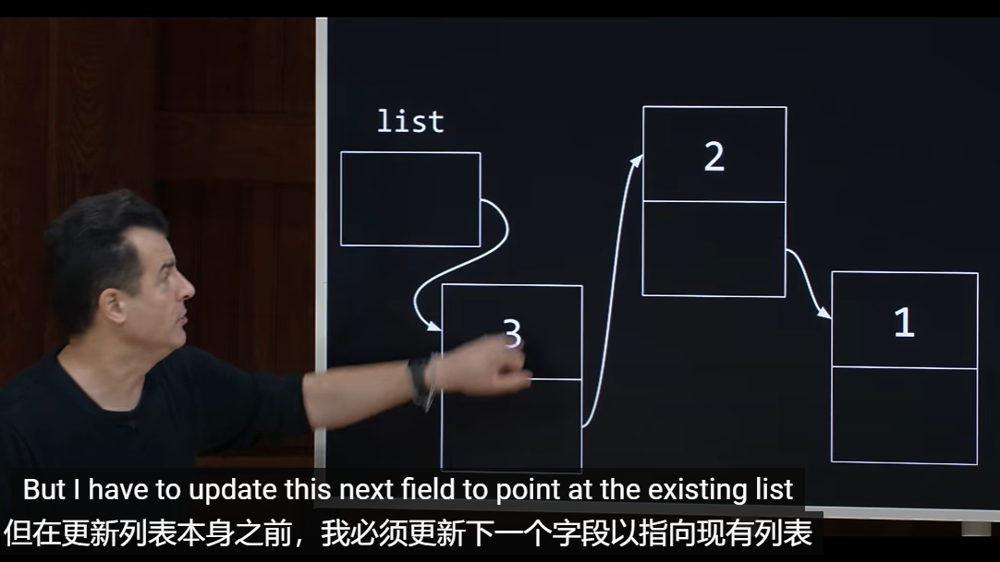


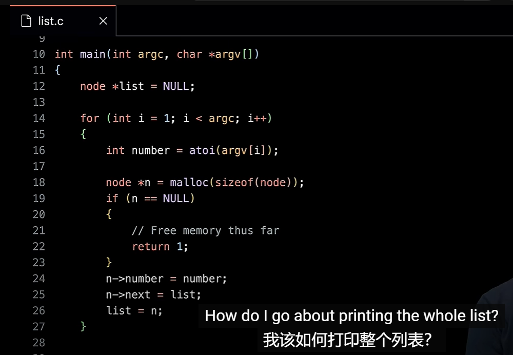


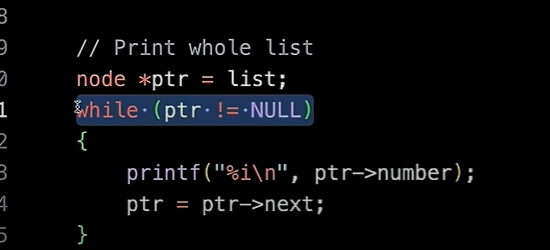

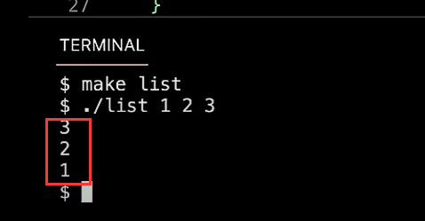


​		链表的插入速度是O1再多的链表也是相当的快速的

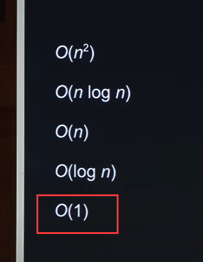

​	但是随着列表的增加 那么查找列表中的内容，运行时间是多少？

在我们之前的数组 是可以使用2分查询的，因为它是一个连续的整体的内存地址，而链表不是，链表的每个地址都不固定，所以不能使用二分查询，它的查询只能是一个一个的节点进行查询比对 所以查询是log n

​		但是目前可以通过 节点指针的修改和替换，可以做到 有序等优化处理 -- 后续还需继续了解


#### 5、树结构 Tree

​		回顾一下，数组是有问题的，因为它们大小固定，这有可能给我们带来麻烦，或者它会导致我们先发制人的浪费更多的空间，使我们可能永远也不会使用多余的数组内存，因此，我们引入的链表来解决这个问题，链表更加动态，而且按需分配内存，但是 我们为指针花费了额外的空间，如果我们将数据直接添加到列表，我们可能获得更高的性能，但如果我们按排序顺序追加或插入数据，我们会再次浪费一些时间来修改指针。

​		因此，即使我们知道这些优缺点，我们也不清楚是否会取得明显的性能提升。但也许有一种方法可以俩全其美，通过尝试捕捉按排序顺序保存信息的好处，这些信息允许我们仍然可以进行分而治之，但仍然给我们提供了增长或缩小数据的能力，因此 我们诞生了trees 树结构。


​		我们探索的是数组和链表这些想法的变体，看看我们是否可以将其中一些构建模块 混合搭起来，然后创建更有趣、更引人注目的解决方案，甚至不是一维的 左右的解决方案，可能是二维并且具有不同的轴或维度。


​	我们可以给每个节点设置一个数值和俩个指针，即所谓的 左子节点 ，右子节点


​	那么在最下面的叶子节点 不需要指针

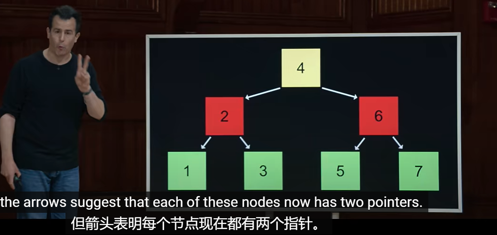


​		这就是二叉树，但它是一种按序保存的数据结构，例如我们在这颗树选择任意节点，比如4，它的左侧所有节点都会更小，右侧所有节点都会更大，因此，从某种意义上说，这是一个递归数据结构，因为你可以对每个节点做同样的事情，每个子树都组成一个更大的树。

​		我们如何使用代码实现？

​	我们先实现一个节点

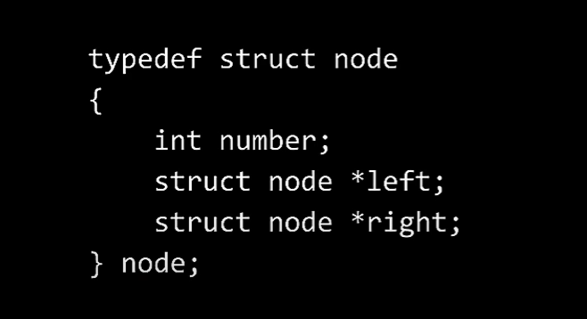

​		树结构的查询需要多久？

​		log n 的运行时间，还包括链表的动态优点，还可以增长收缩，并且不需要连续的内存空间。

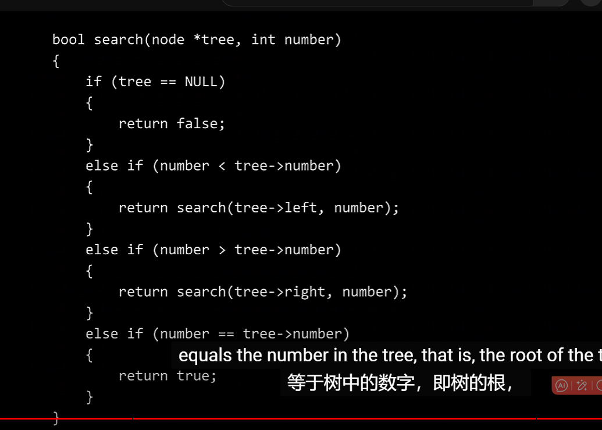


​	后续我们还需要学习 二叉树中的插入和删除的操作

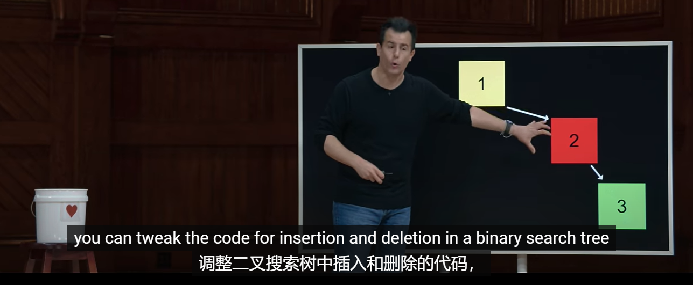


#### 6、字典 Dictionaries

​		字典是另一种抽象数据类型

​		其本质与堆栈和队列类似，你可以以不同的方式实现，字典是一种存储 key和value的数据结构


​	这里我们就会接触到hash - 散列值

​	hash table -- 散列表，就是数组和链表的组合，数组里面存放的是链表，链表可以随意扩缩


​		查询效率是 On


​		如何缩短这个链表的长度呢，避免冲突


#### 7、Tries  数组树


​			比如TOAD 的值

​	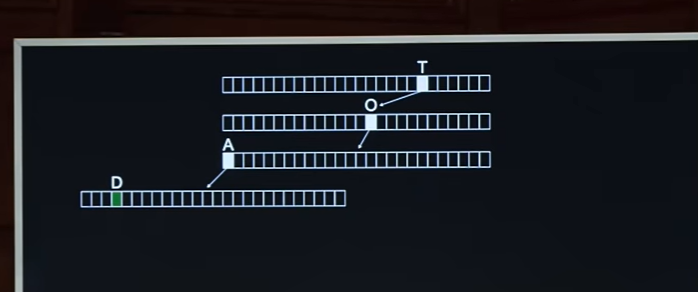


​		另一个key 在绿色下面 有新的指针

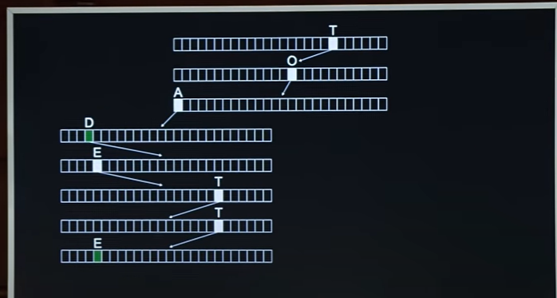

​		

​			这种数据结构的缺点是，可能会浪费很多的内存资源

，		但是它可以给我们恒定的查询时间，这就是权衡我们该处于什么场景适用于什么数据结构


​	

​				数据结构无处不在


​	


