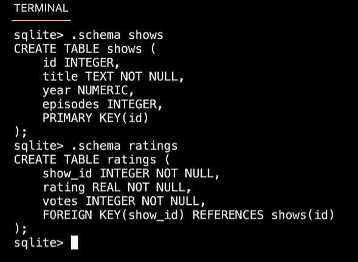

```
title: 7、SQL
date: 2024-06-19
categories:
 - cs50
tags:
 - cs50
```


# 7、SQL


​			我们将电子表格的表 称为工作表，而在数据库中的电子表格 称为 表


​	SQL也有轻型版本 -- Sqlite

​	Sqlite也非常流行，移动开发使用的更多一些


​	那么实际是如何运行Sqlite的,它只是内置于代码空间中的命令，它是可以安装在自己的PC或者是Mac上的程序，然后就可以使用了


#### 		1、创建数据库


#### 	2、设置csv模式，导入csv文件


​				Sqlite可以设置很多种模式


​				设置导入后的表名称


#### 		3、查看数据库文件


#### 		4、查看数据库的架构

​			使用.schema -- 可以看到数据库的架构信息


#### 		5、查询数据表

​	


​			截断查询


#### 6、内置了很多函数功能


​			例如COUNT 统计


​	可以组合嵌入的使用函数


#### 	7、数据过滤查询


​	排序


#### 	8、设置别名


## 	2、IMDB-导入数据库	

​				imdb将我们的操作 后台传入sql然后进行数据的插入


​		和我们导入的csv的约束架构不同




#### 	1、关系表嵌套查询


#### 	2、JOIN

​			连接表---展示更多的列，需要有共同的关联关系


#### 	3、计时查询

​			我们可以查询执行的时间通过定时器timer


#### 	4、添加索引

​			


​		对比建立索引前后的查询效果


​		索引一般建立在常用的查询条件--以增加查询效率----索引其实是放在B-Tree中，查询快的原因是建立索引后，它总是在叶子中第一时间就可以找到索引。


​			这里需要权衡的是什么？为什么不每一列都添加索引呢？

​				因为这是以空间换时间，太多的索引会增加数据库的内存使用空间

​				而且是过度添加索引--会导致 插入，更新，删除的速度


## 3、Python and SQL


#### 	1、sql注入


​				


​			视频地址：	https://www.youtube.com/watch?v=1RCMYG8RUSE&list=PLhQjrBD2T381WAHyx1pq-sBfykqMBI7V4&index=9


