# 9、Flask--服务容器

​		创建一个web服务器---

​		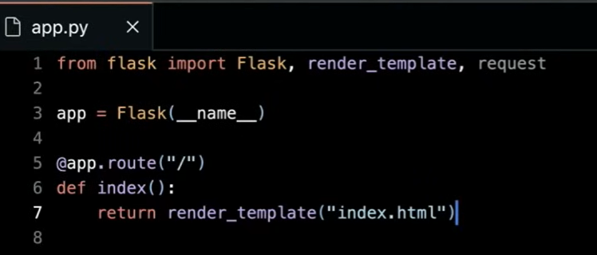

​	页面设置变量

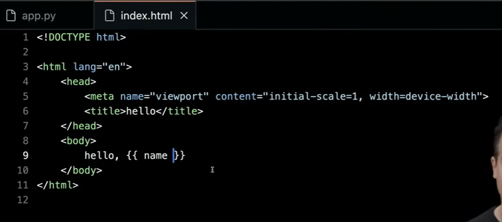

​				注意将name改为placeholder

​	服务器传递参数			

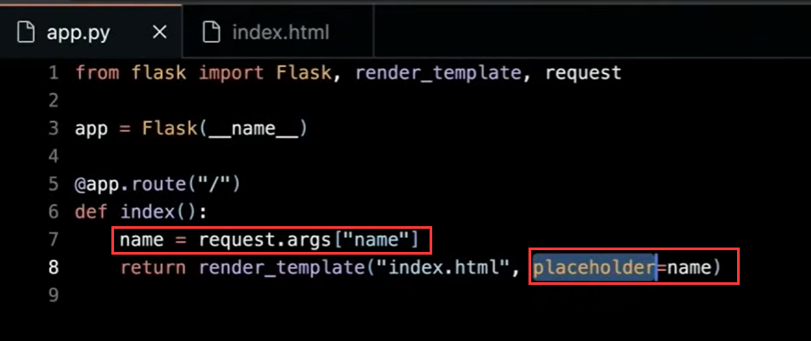

浏览器测试

​	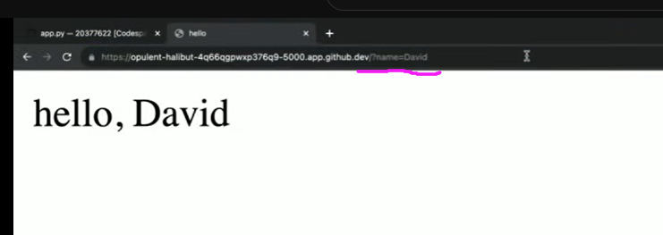

​		修改变量值的判断

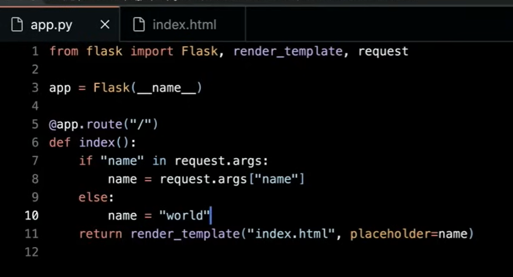

​		或者是这样

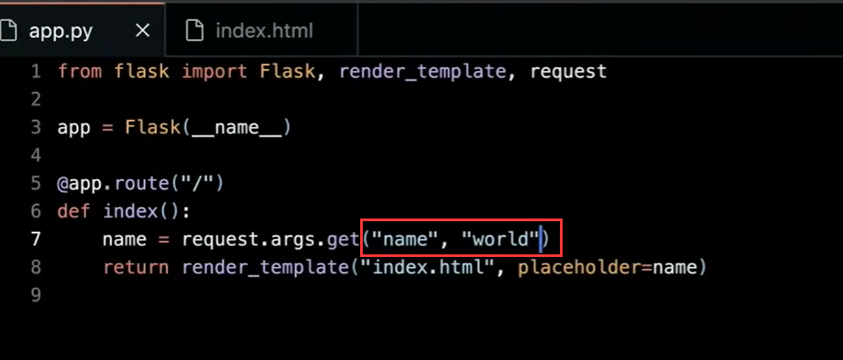

​		添加路由

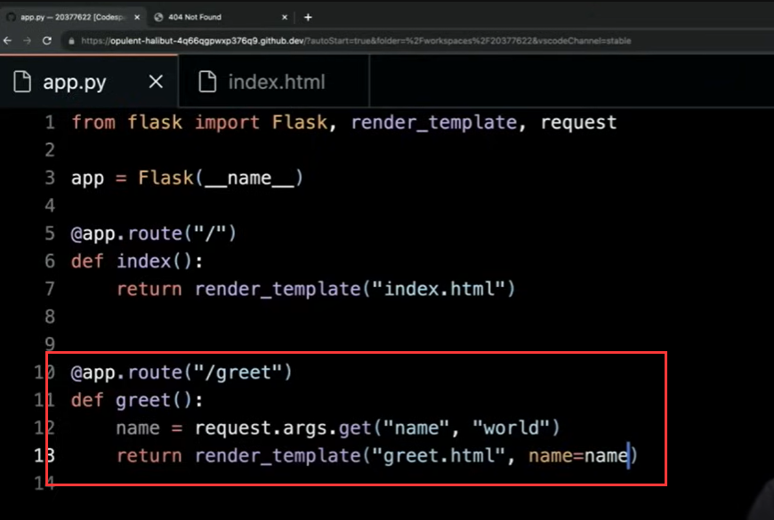

​	form表单提交

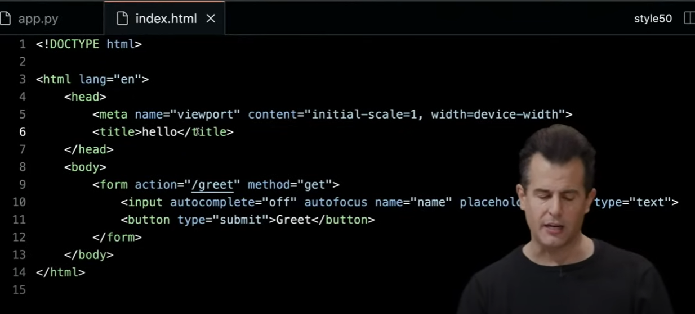

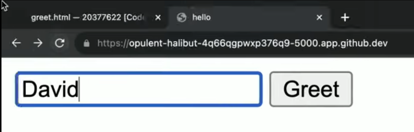

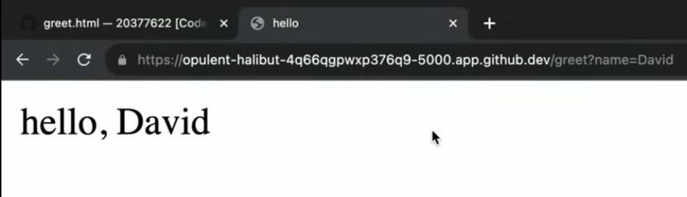

#### 		创建模板代码

​					因为有很多重复的内容 -- 我们可以尝试做单页面模板

​		 代码块占位符 

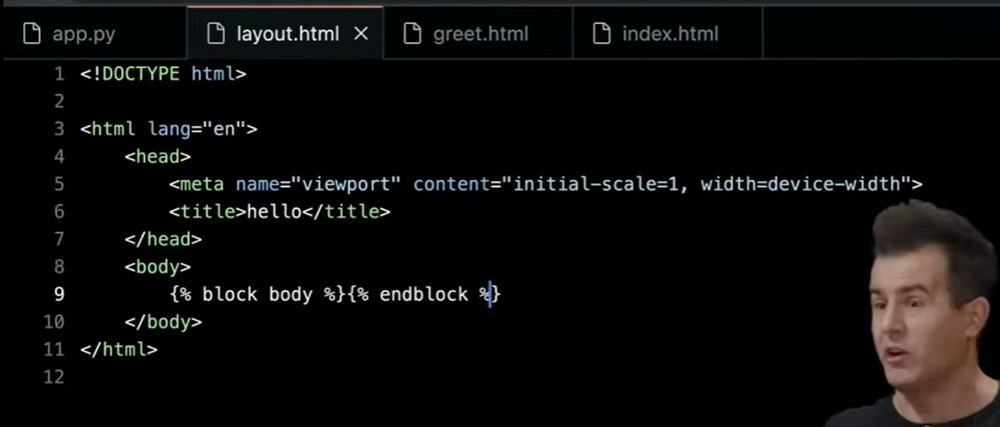

​	使用继承的方式使用模板

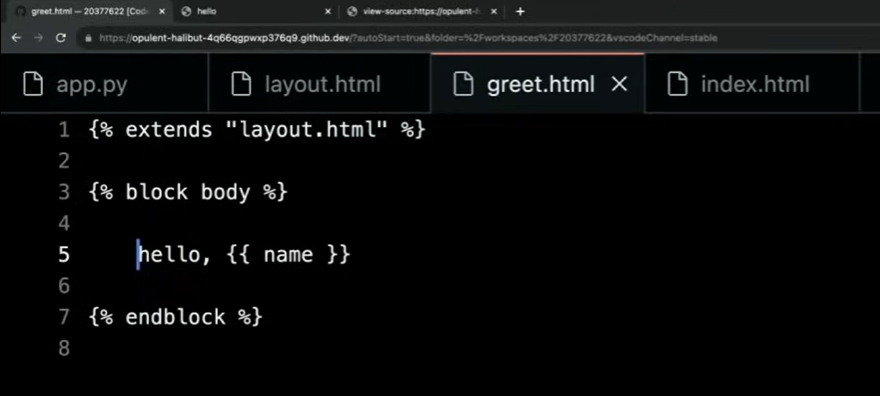

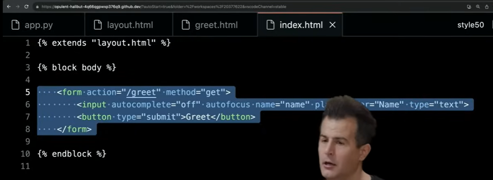

#### 	POST请求

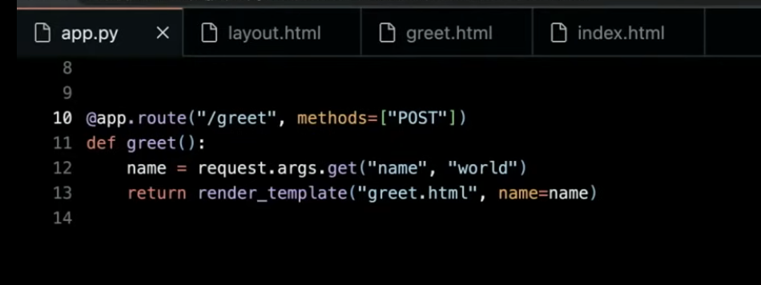

​		同时支持GET和POST

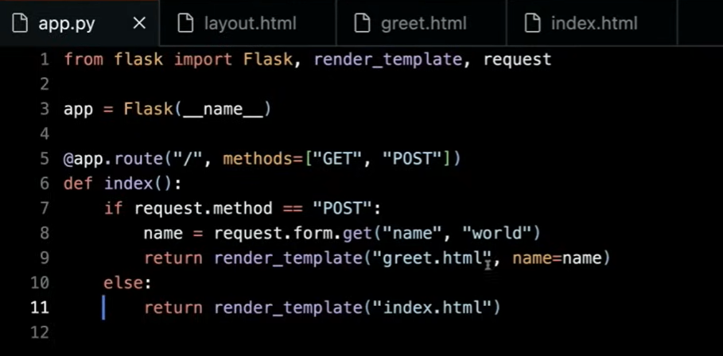

​	

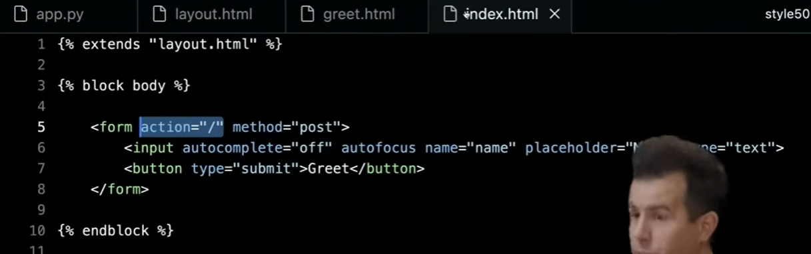

