# 10、颜色主题

​			我们了解一下RGB和HSB的东西，我们探索我们可能不会自然选择的颜色。

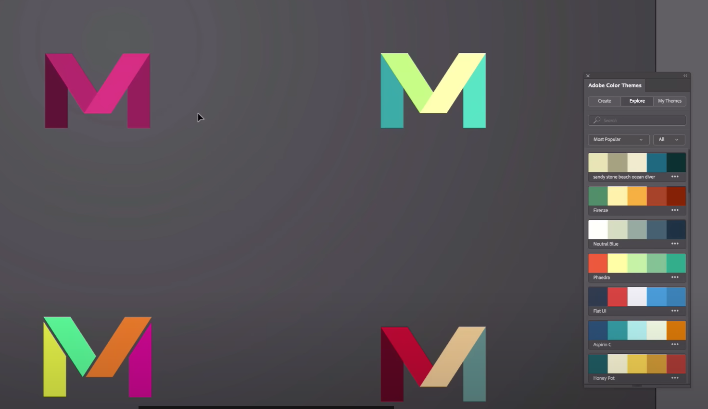

#### 1、打开文件

​		文件----打开 color.ai这个文件

​		这个是我们之前练习的版本logo

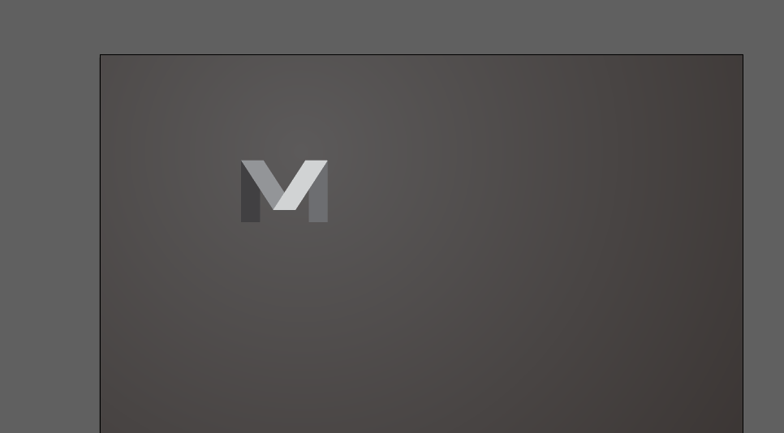

​	现在我们深入了解一下颜色的本质

​	首先，在属性面板中，在视图中也确保我们打开了 智能参考线（因为这个会给我们提供方便）

​	假设我想将这种颜色从黑色和白色，改为其他颜色

​	我们可以使用调色板 -- 可以通过选取，也可以通过RGB的值来设置

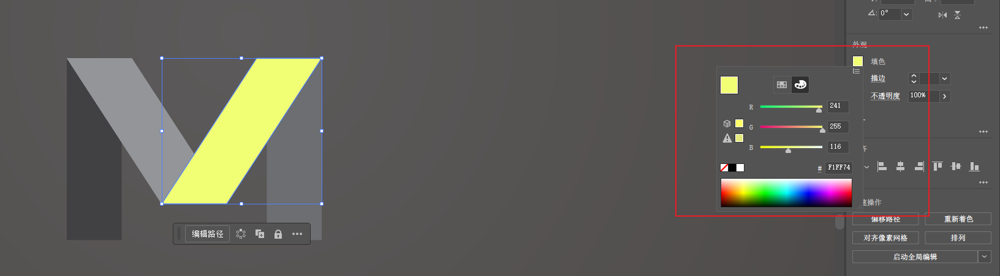

​		如果在这里使用的是CMYK，那么你使用哪种色域并不重要，可以通过 文档 --- 文档颜色模式 -- 然后进入RGB来设置切换使用哪种方式。

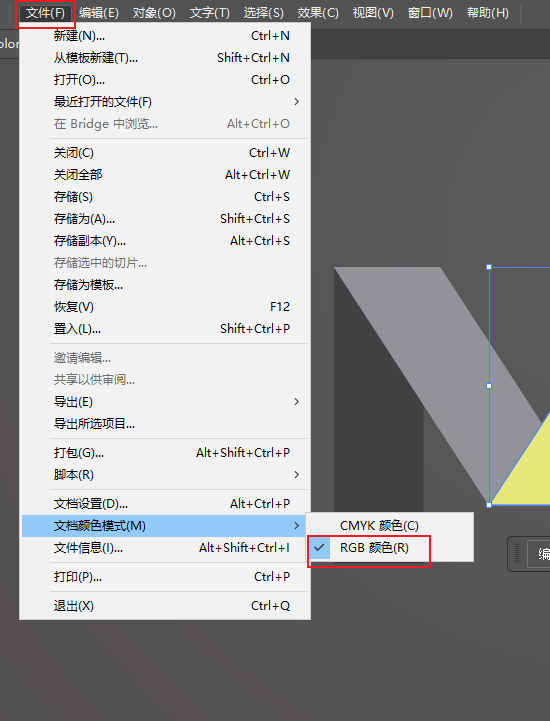

#### 		2、颜色调节

​		如果我们想把颜色调整的更暗一些

​	我们可以使用调色板的 HBS，HBS和RGB是同一个东西，这只是描述颜色的不同方式 ，这显示了红色，绿色，蓝色的混合

​		H -- 改变色调， S改变饱和度，B--是亮度

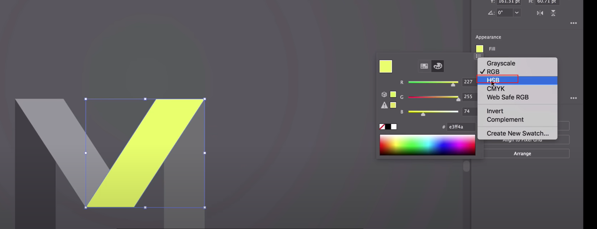

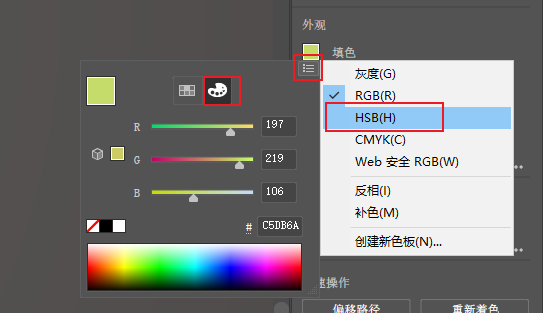

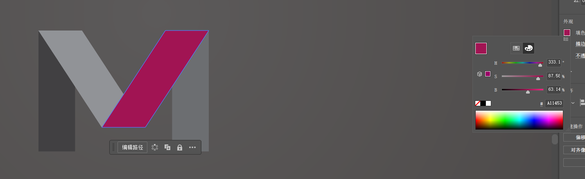

​			切换到我的样本，样本是一种预先制作的颜色，选择我们刚刚调整的颜色元素，然后点击--新建色板

​	然后给色板起个名字

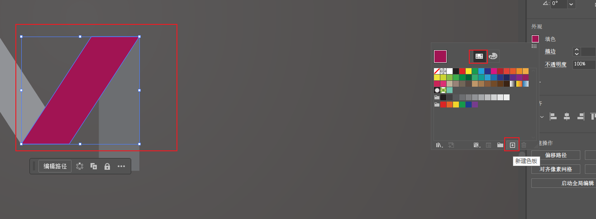

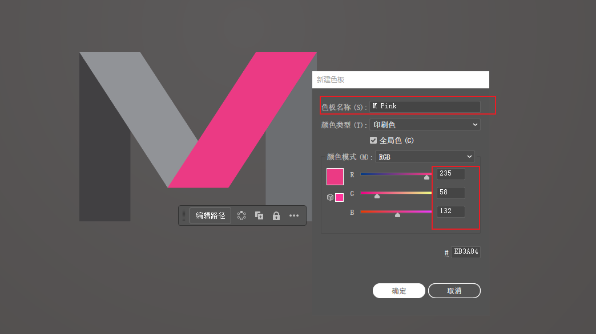

​		这里就是新加的色板

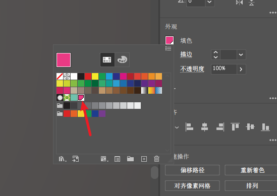

#### 	3、应用HSB

​	然后我们将其他的元素也使用这个新色卡，然后使用HSB进行微调，这样整体的色差就不会差别很大，这样就能够显得 整体色域很一致，更具艺术感。

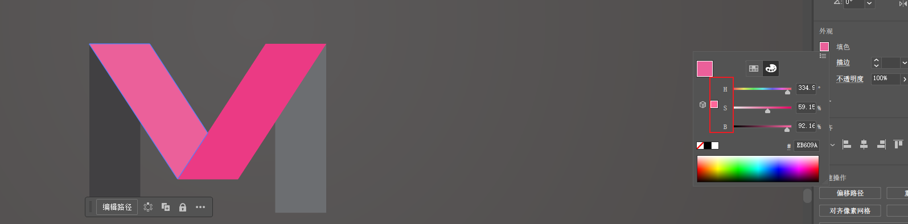

最终的效果

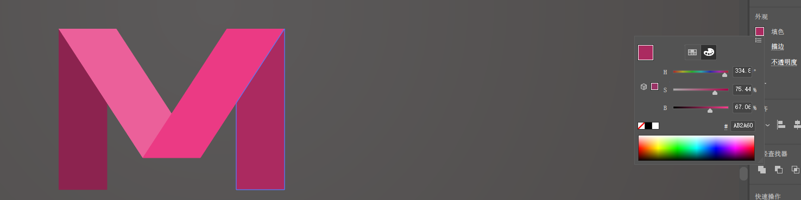

#### 4、颜色主题color Themes和copy

​	我们copy这个logo，然后设置一些其他的颜色。

​	使用  窗口 -- 颜色主题 ---这个需要登录你的Creative Cloud账户

​	在这里，我们得到了Adobe Color中使用最流行的颜色，这是一个在线网络事务，人们可以上传他们的颜色，并对其进行投票，这对我们选择颜色非常棒。

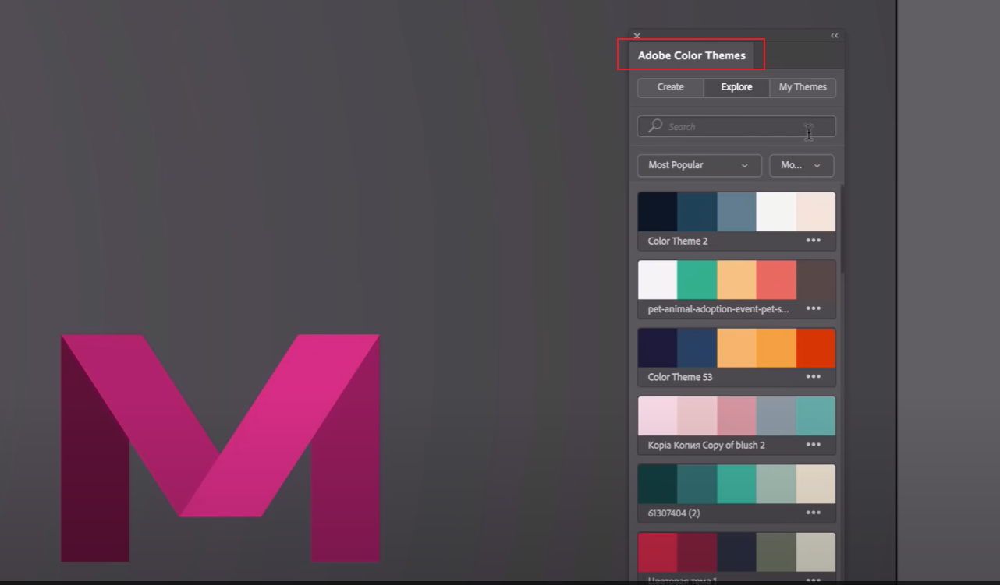

​	对于喜欢的色板，我们可以直接添加到自己的色板中

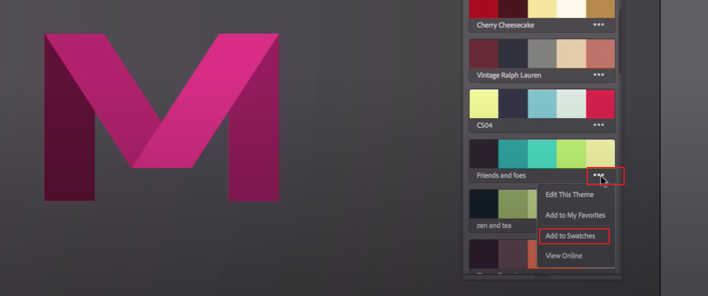

​	这样我们就可以使用刚刚添加的色板了

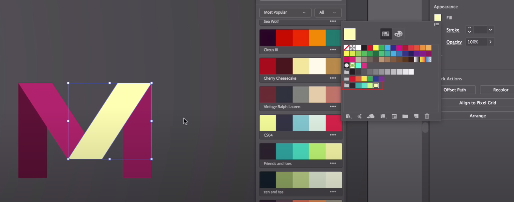

​		达成的效果

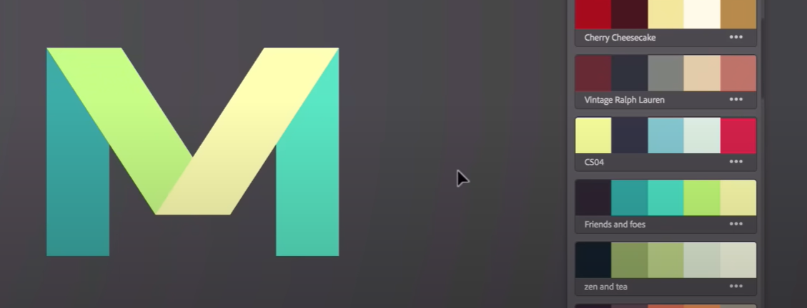

​	我们可以按住alt键，然后拖动元素，这样也可以达到copy副本的效果

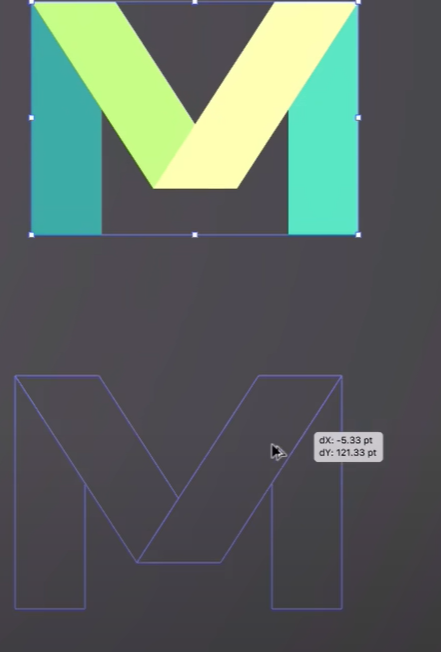

#### 5、颜色搜索

​			在放大镜中可以搜索你需要的颜色

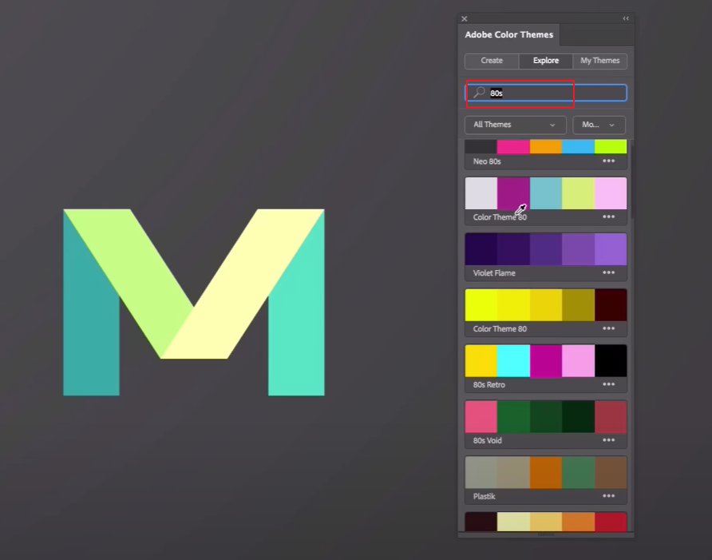

​	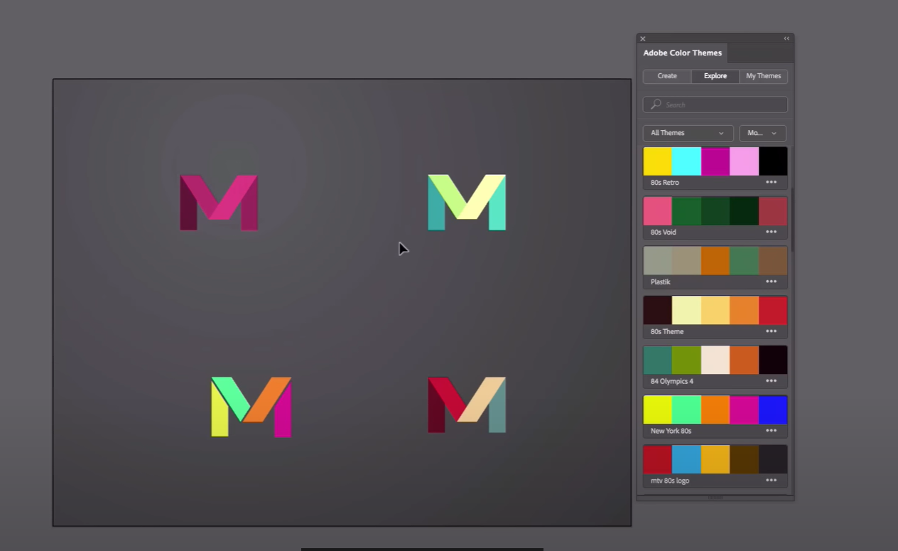

​		如果我们喜欢这些Adobe的颜色主题，也可以直接访问color.adobe.com

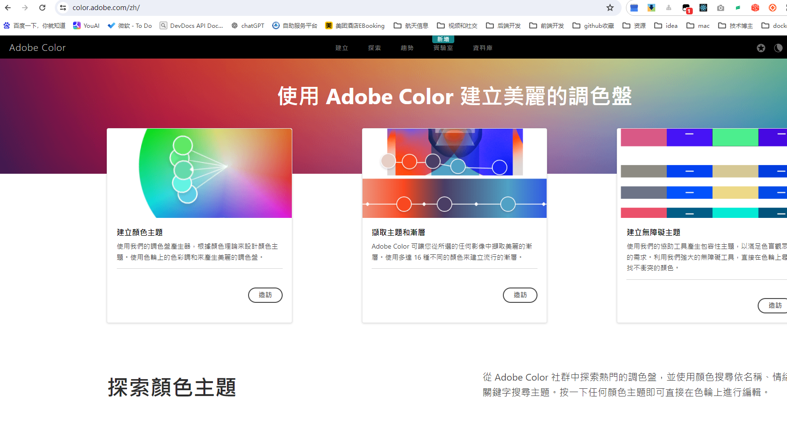

