# 11、渐变&Alt-Tab

#### 1、创建文档

​			打开练习文件，我们可以使用任何形状shap，所以直接打开练习文件即可，无需模版画布

​			接下来我们尝试如何进行自定义的操作，打开Getting Started.ai文件

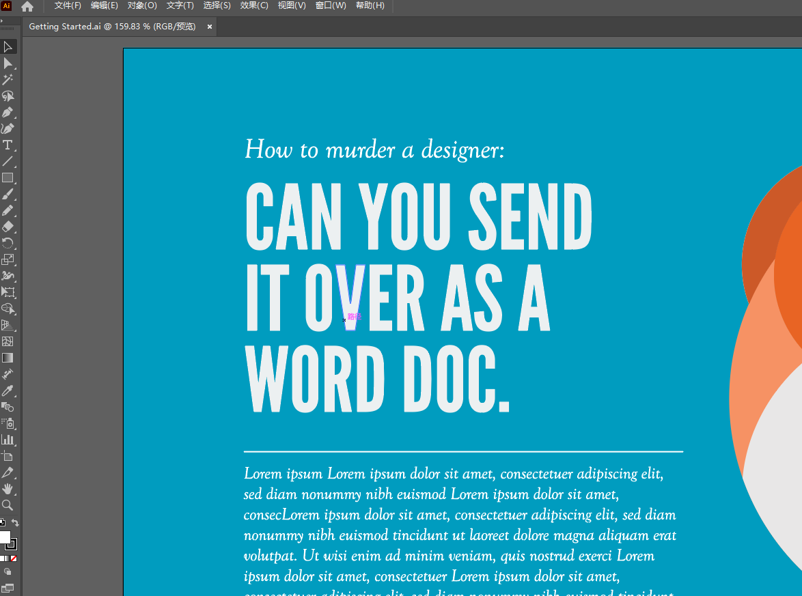

​		这个小狐狸图形，是使用形状生成器工具制作的。

​	对于这里的背景，我希望它是渐变背景

#### 2、颜色渐变

​	

​		选择整个图像，在填充颜色中 --- 色卡中有通用的渐变颜色，如黑白渐变

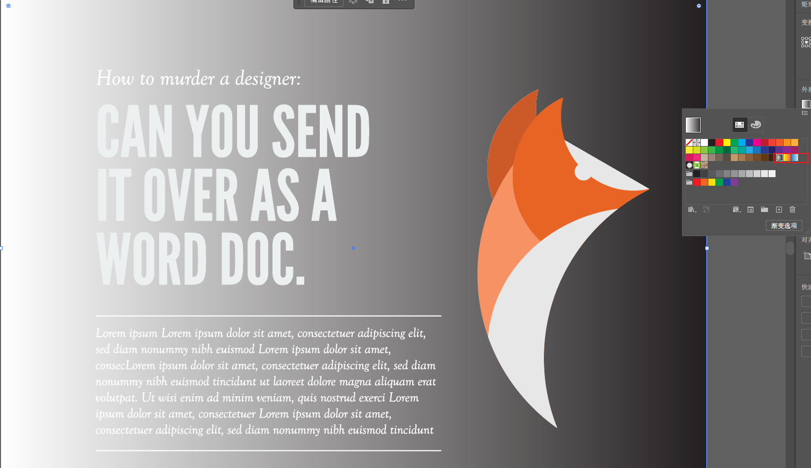

​	我们也可以使用 windows -- Gradient渐变，通过这里打开渐变按钮

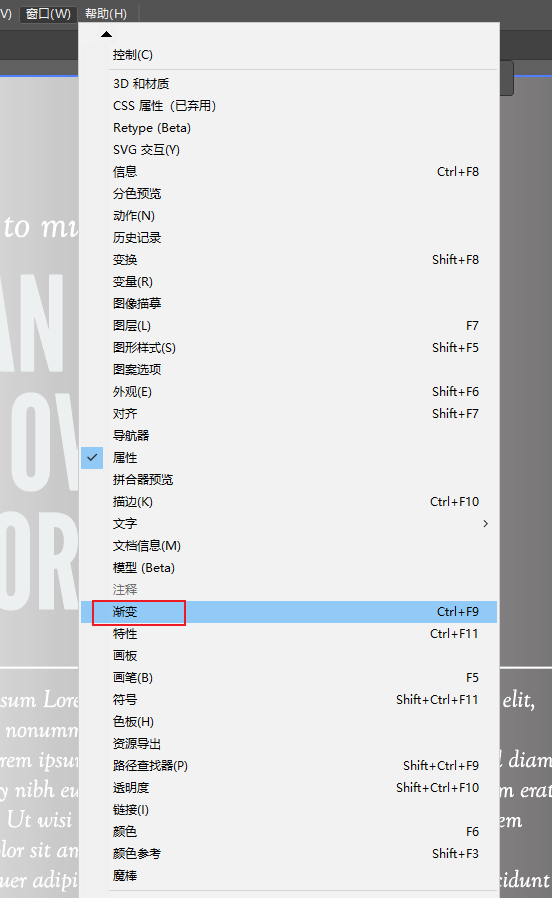

​	俩种打开方式--效果是一样的

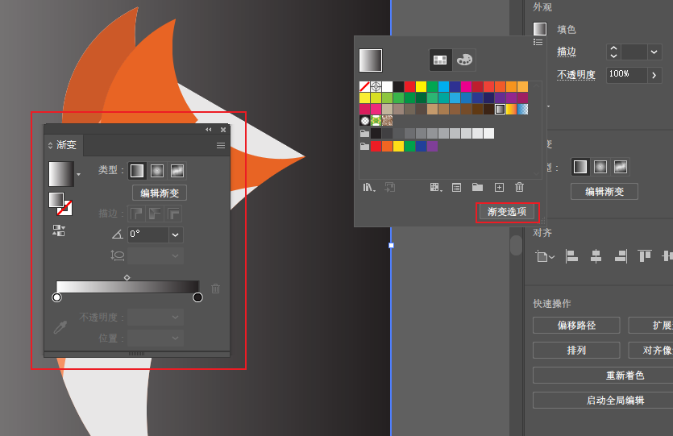

​	可以更改颜色、方向和类型，这里类型type是线性的，从左到右渐变，也可以使用径向类型，从中心渐变

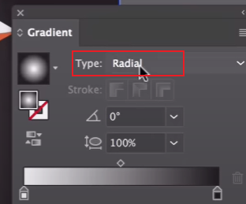

​	双击底部的条形颜色，我们可以选择样本或颜色

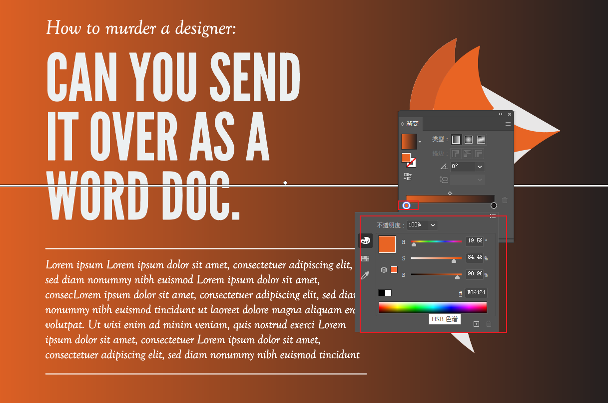

​	同样也可以点击右侧的颜色选择，区别是点击哪侧就以那边为主色进行渐变

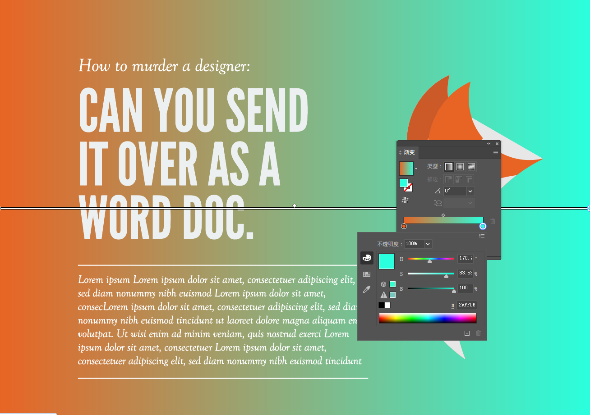

​	 我们现在是使用俩种颜色进行的 线性渐变

#### 3、切换角度进行渐变

​	我们假如希望 通过顶部和底部进行 颜色的渐变

​	其实本质是将颜色进行角度的转换即可

​	点击左侧的渐变---然后鼠标拖线，进行渐变色的角度调整，线上的圆点可以调整 渐变的左右颜色权重

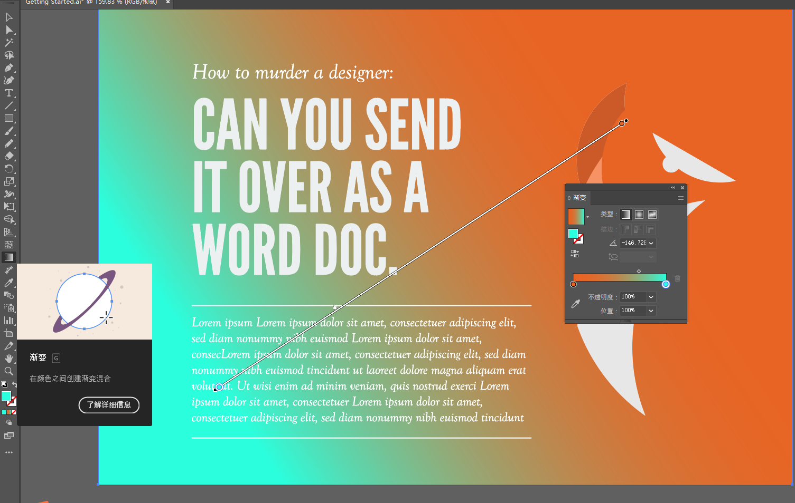

​	如果我们画一个非常短的线，那么渐变的效果会更加的明显

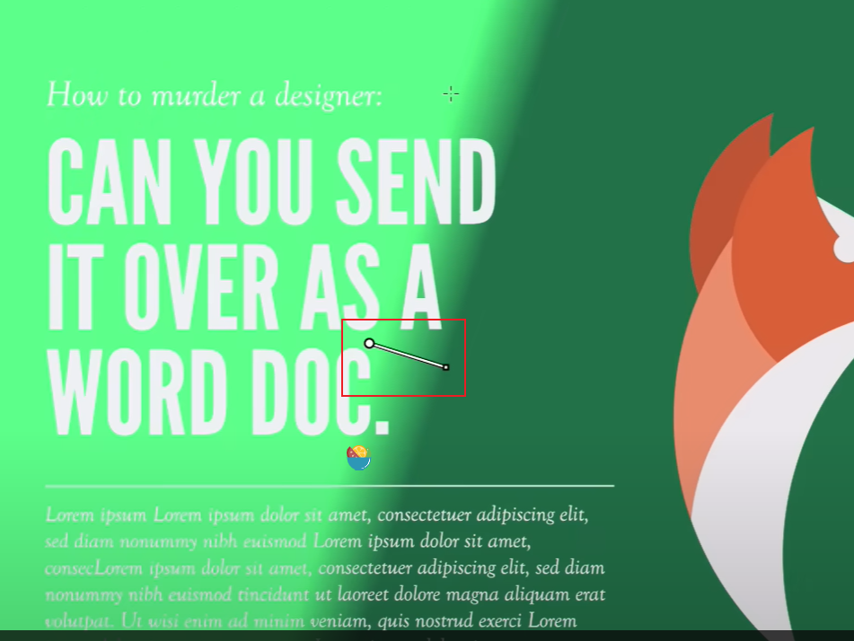

  如果是按中心类型进行渐变是这样的

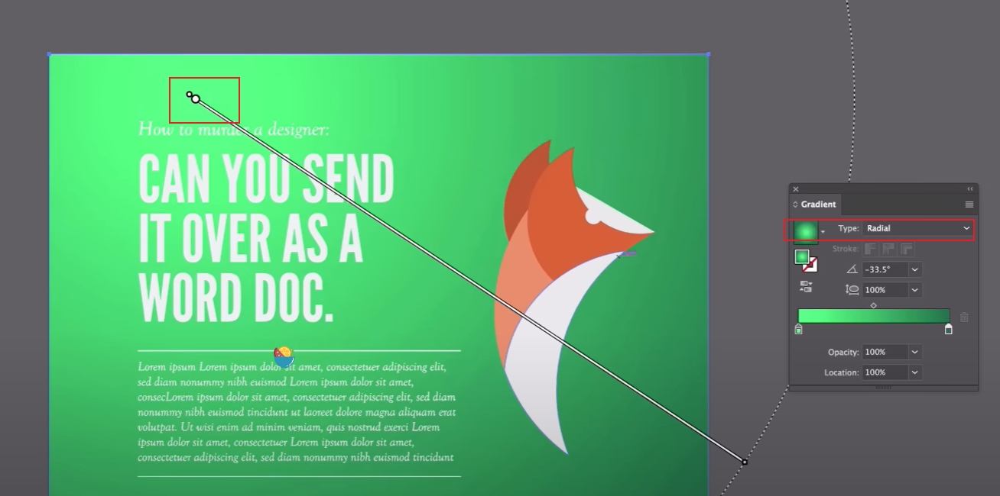

​		渐变色的查阅 也可以到 grabient.com 这个里面有很多优质的渐变色

​		这个颜色使用的是16进制的hash值，我们copy这个hash值

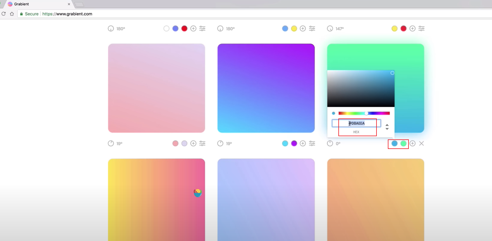

​			然后我们回到AI中，在渐变色卡中填入hash值

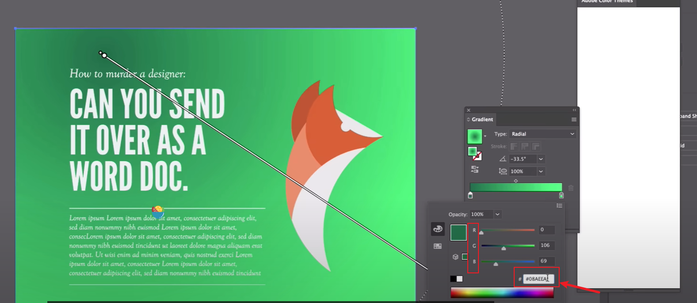

​	按回车键，那么左侧的第一个颜色就应用了

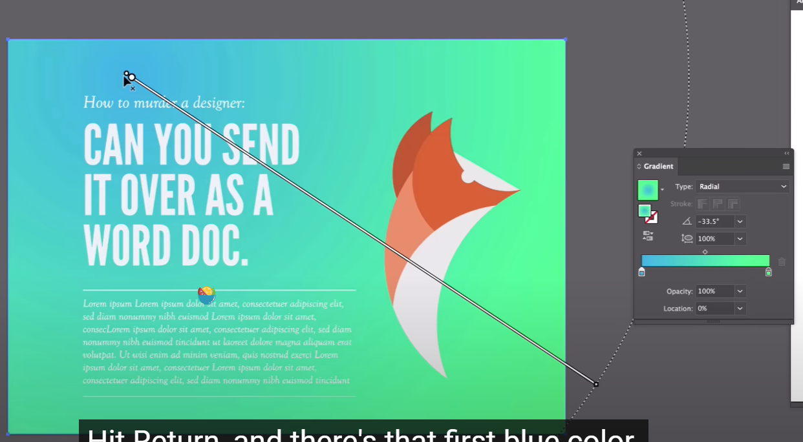

​		然后copy另外一个颜色，注意#号不需要copy

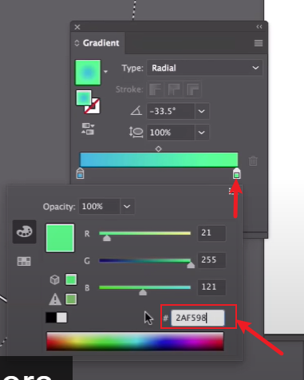

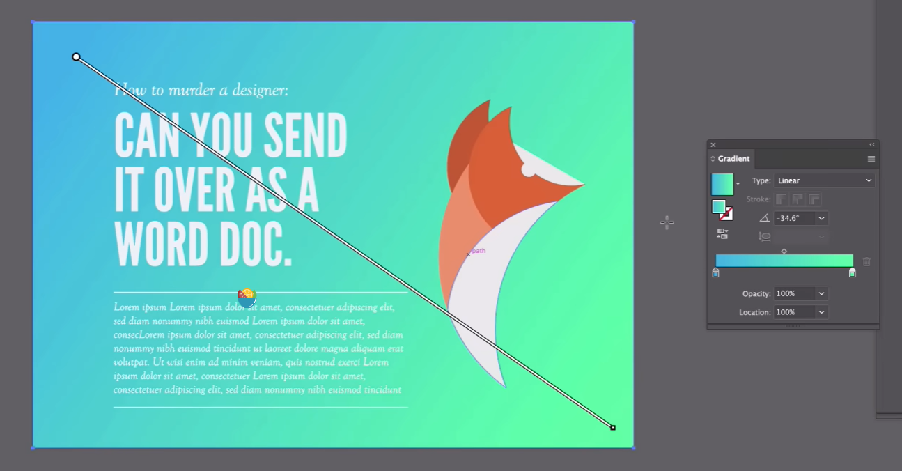

​	我们可以使用 alt + tab 进行切换 chrome浏览器和AI工具，达到高效的使用

#### 	4、三色渐变

​		假设我们现在在网页中找到一个3个颜色的渐变，那么我们该如何实现这个渐变色呢

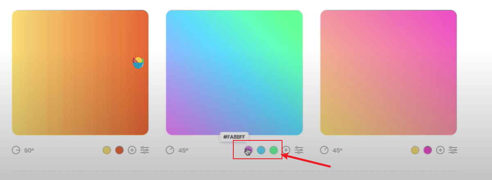

​		回到Ai中，我们将左右的颜色都copy应用后，在中间双击可以多添加一个色域，如果是多个也可以添加更多

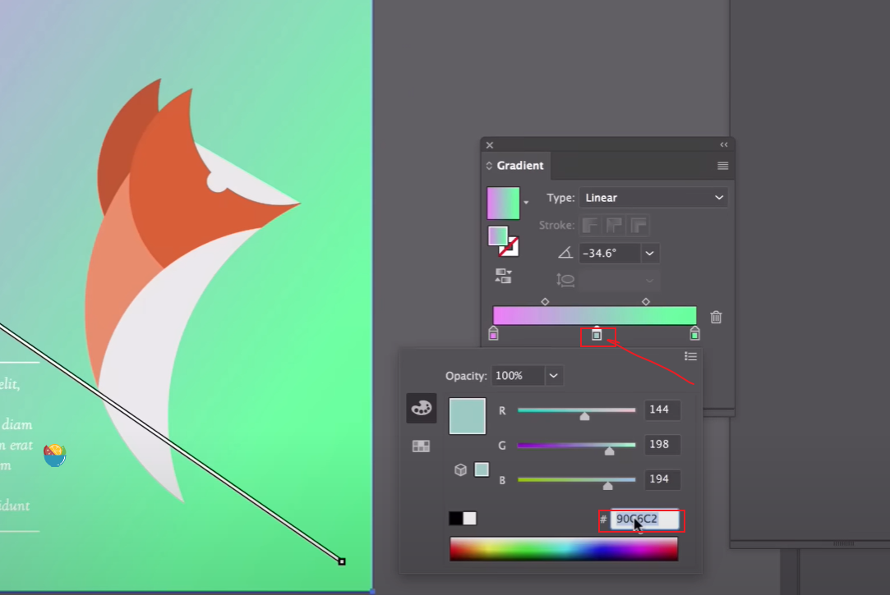

​	如果想去掉这个色域，可以拖拽到空的地方就删除了

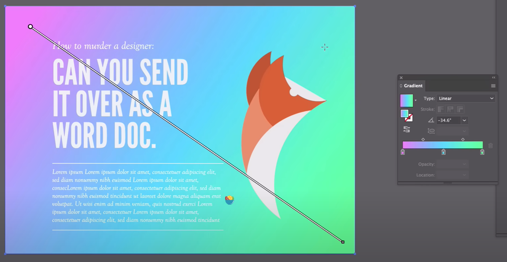

#### 5、局部渐变效果

​		选择局部颜色，然后填充渐变颜色即可

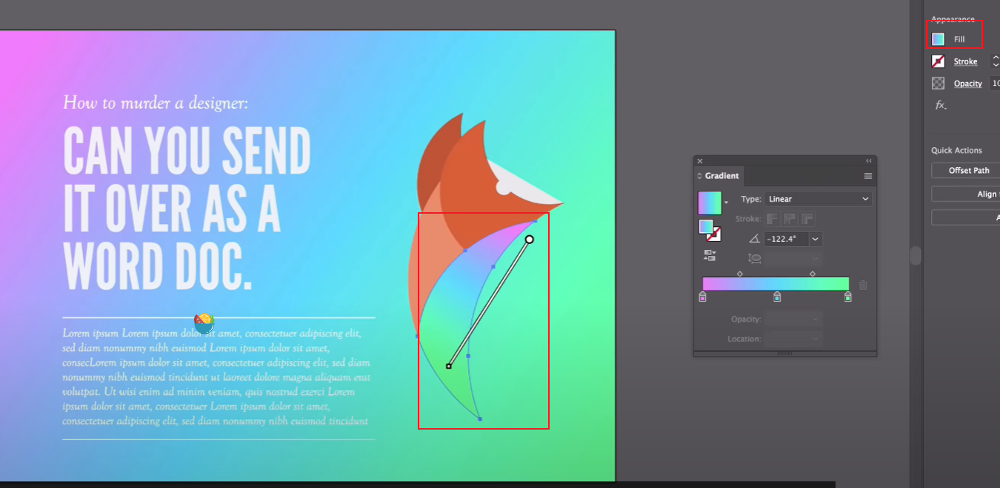

​	

