# 12、type&font

​		我们将了解如何创建类型框，如何使用字体，以及如何从Typekit中下载好看的字体。

#### 1、创建文档

​		文件 -- 打开 -- Postcard.ai练习文件

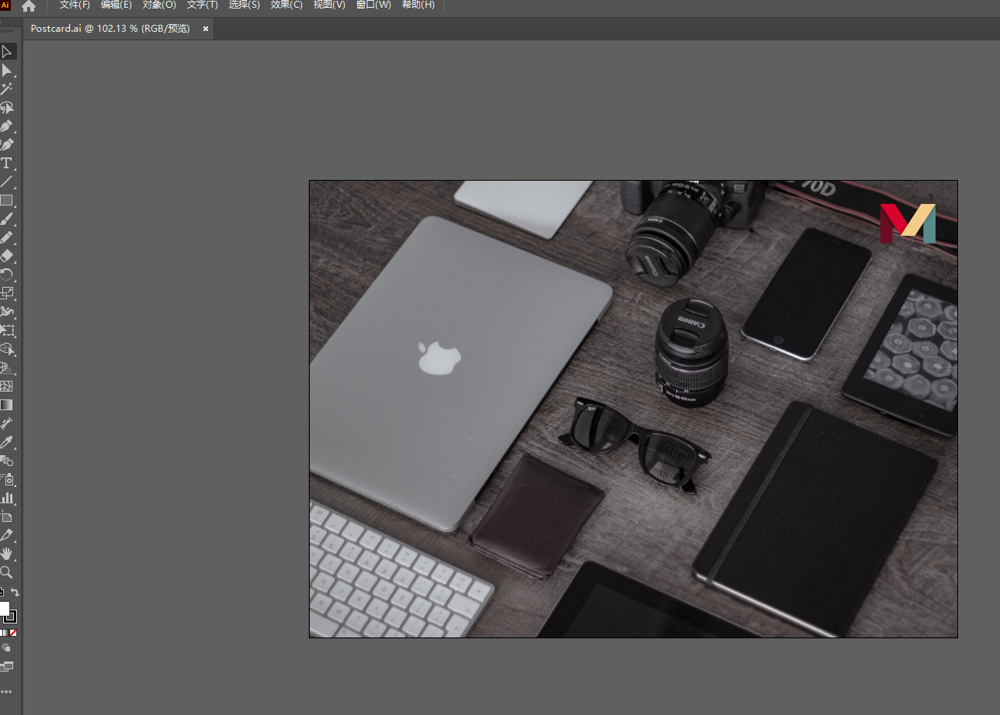

​	我们现在是将一张图片 作为明信片的背景，现在我们需要了解文字和字体，大写的T在AI中代表文字工具。

#### 2、type

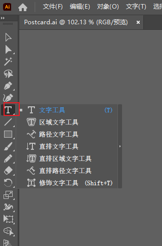

​	我们可以创建2种文本框，如果是单击一次，则为点型框，这意味着它像一个输入框一样，一直的往右输入内容

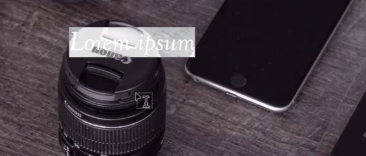

​	另一种文本框是，我们使用黑色箭头，然后使用 文本工具T，拖动一个框，这意味着这个文字输入有边界

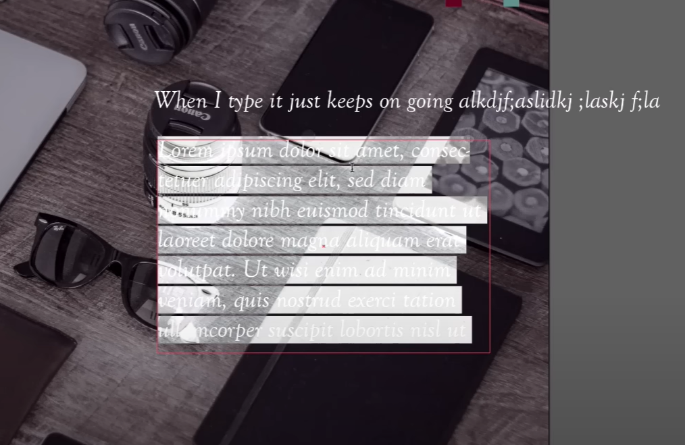

​	右侧的颜色填充，可以给字体添加颜色

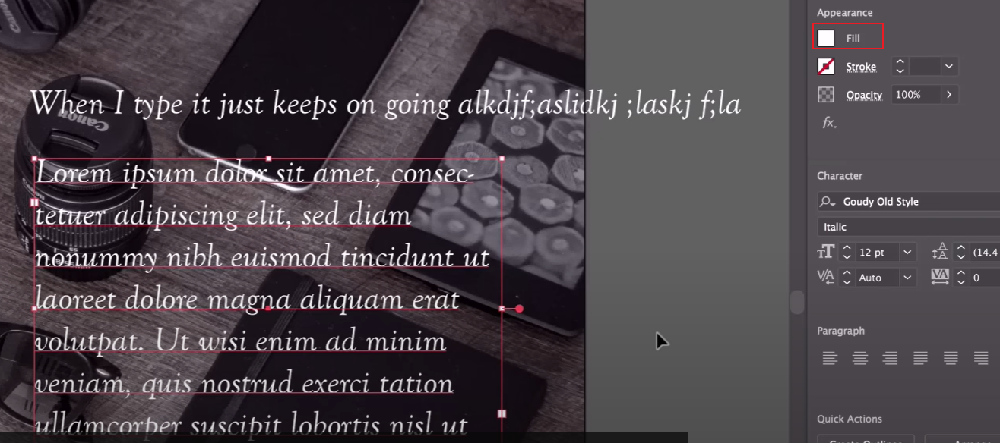

​	选择文字的字体

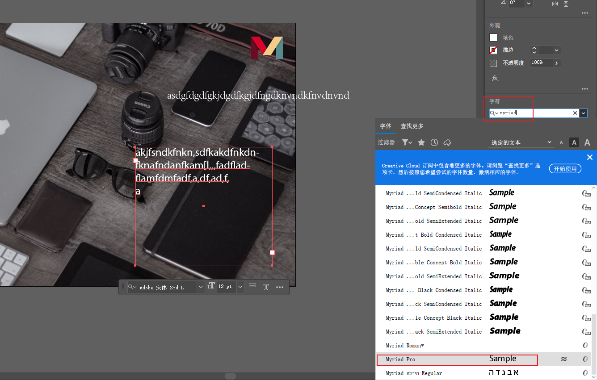

​	我们看看计算机中内置的字体与我们可以从Typekit中下载的字体

​	属性中还可以设置，字体大小，行间距 pt单位，字间距，段落间距，以及左对齐，右对齐等

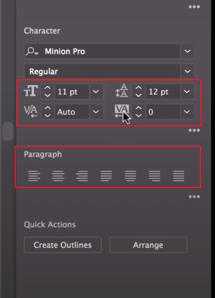

​		右侧是小三个点是，详细信息，可以设置的内容更多，如全部大小写

#### 3、字体搜索过滤

​		可以在属性的字符中进行对本机的字体搜索和过滤

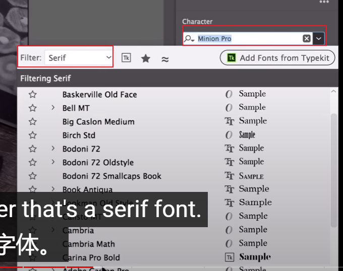

​	如果我们需要计算机之外的字体，那么可以使用Adobe的Typekit它是免费提供的字体下载工具，需要登录Creative Cloud。

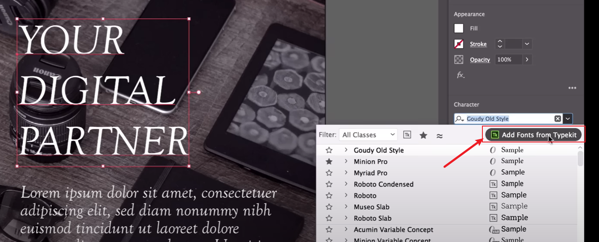

​	然后会进入到字体的网站，里面有很多字体的案例可以选择，也可以在线输入我们的文字，在线预览效果

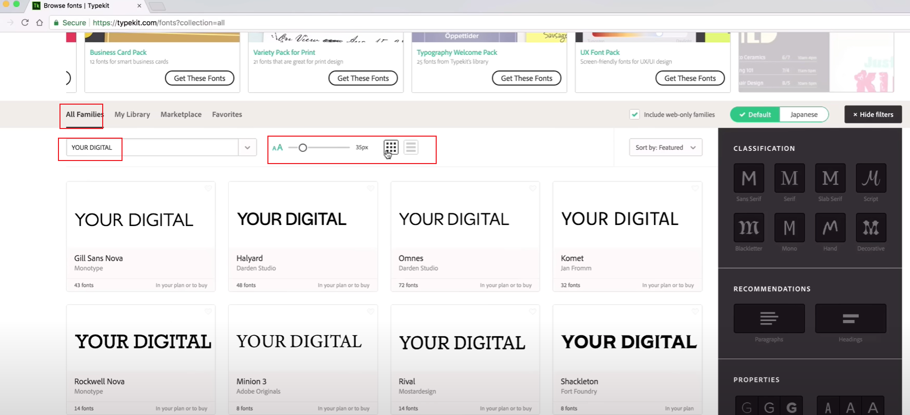

​	还可以通过主要的一些主题类型来搜索字体，如serif -- 平板衬线，Hand是手绘线

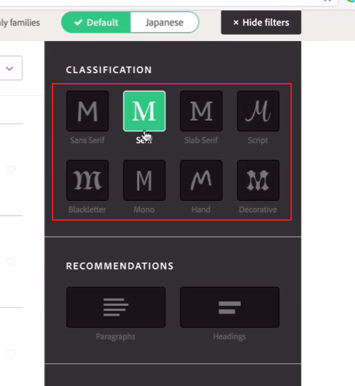

​		Recommendations -- 是选择一个段落的标题字符

​	也可以直接搜索需要的字体

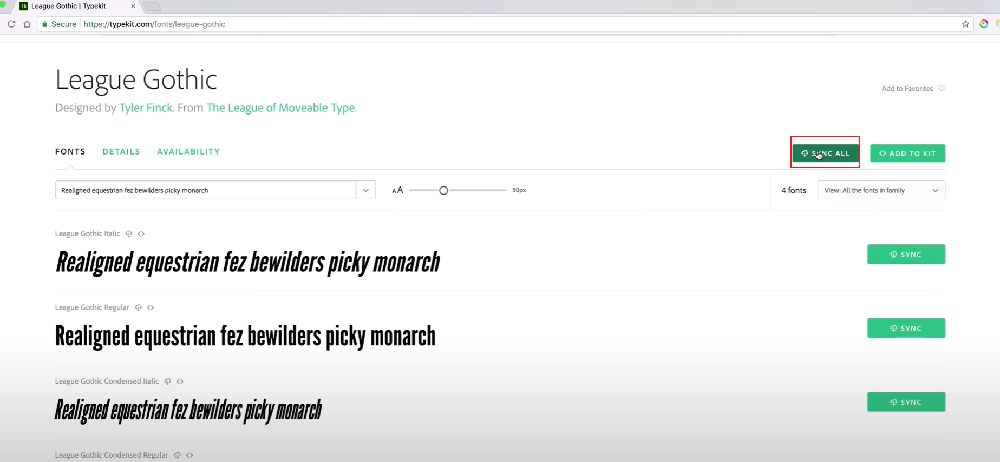

​	可以点击进行同步，然后就可以将字体同步到本机电脑了

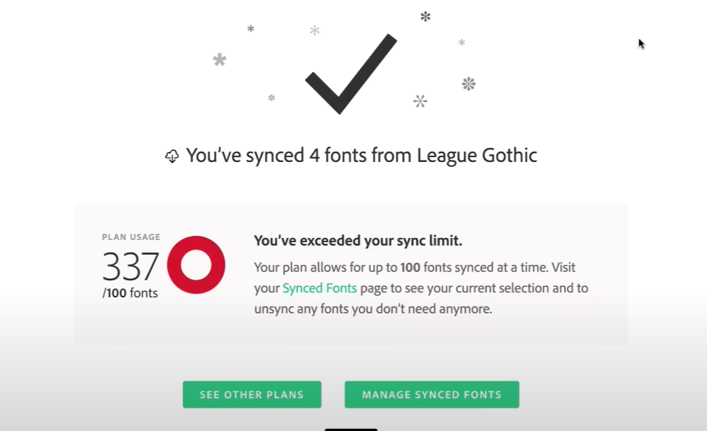

​		这样我们就得到了这些字体，可以在ai中使用它们了

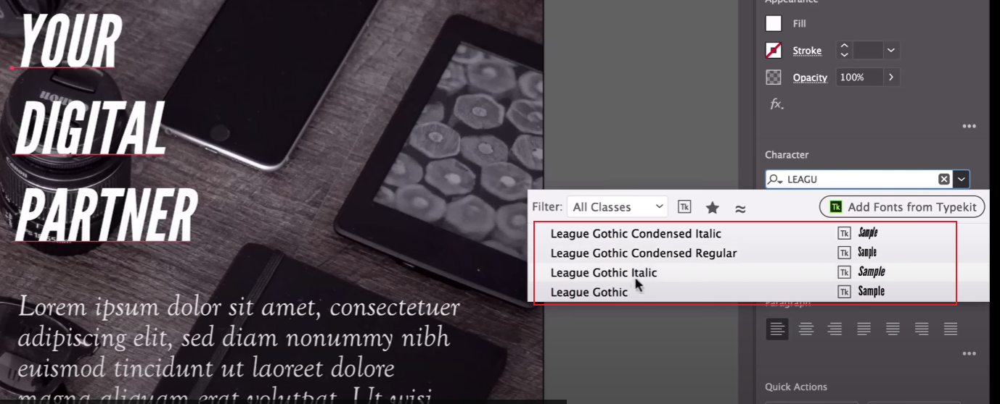

#### 4、后期整理

​	调整文本框大小及文本

​	假如想做鱼背景交互，使用矩形工具，画一个覆盖一半的矩形

​	然后去填充黑色，以及透明度

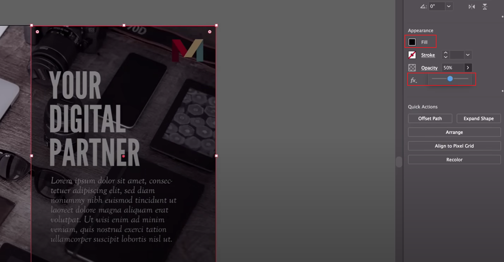

​	然后再选择 排列 置于底层

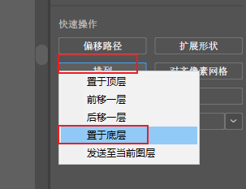

​		这里主要是为了使背景变暗，以便我们更好地看到我们的字体，凸显字体。

​	 

​	

