# 13、液化&扭曲

​		学习液化工具Liquify tools 对字体进行炫酷操作

​		如下效果

#### 1、创建文档

​		打开文件 -- Liquify.ai 练习文件

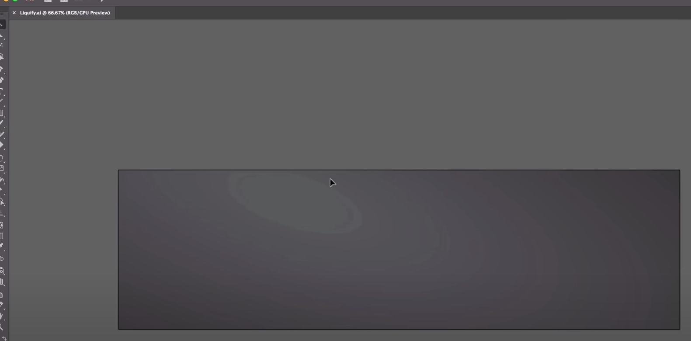

​		我们输入字符 Dan Scott 然后选择字体 Lust Script，字体大小48

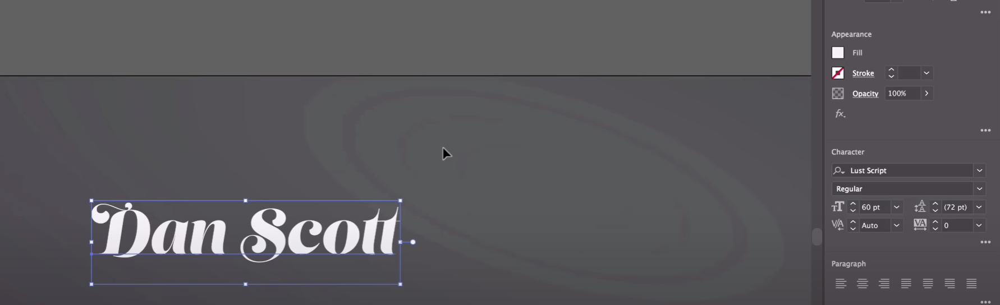

#### 2、使用液化工具

​			我们先copy一份，用于二次使用

​		选中需要修改的元素，然后 文字 --- 创建轮廓

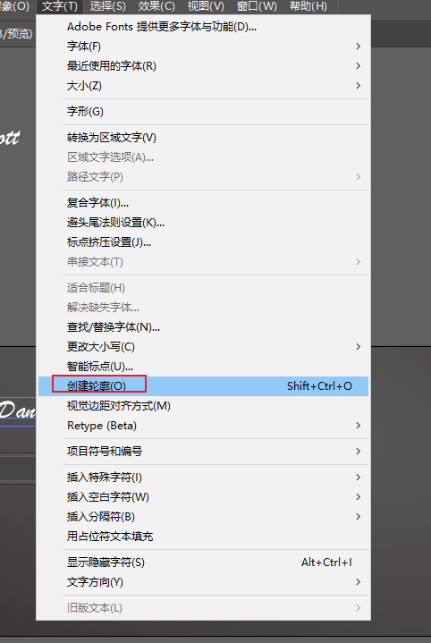

​	我们看到有点细微的改动，没有什么大的区别

​	我们先多做几个副本，然后调整水平放置和居中

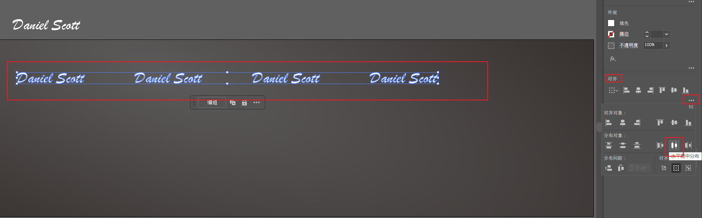

​	我们选择文字元素，然后放大，

​		使用液化工具，中文角宽度工具，里面的扭曲工具--中文是变形工具

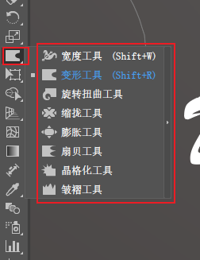

​		双击液化工具，可以设置 画笔的大小 -- 那个圆的大小

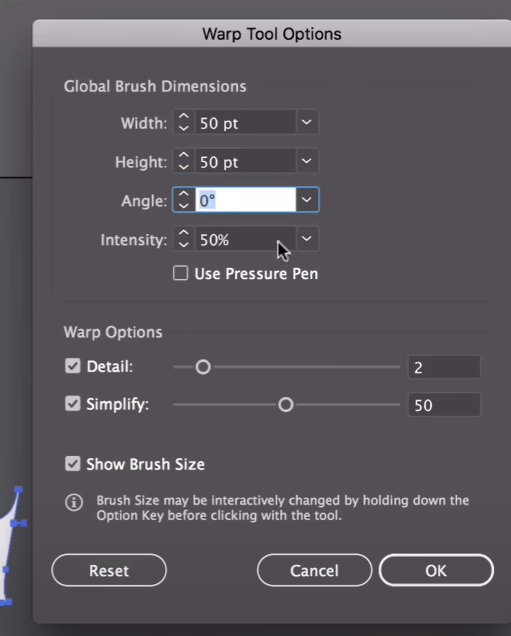

​	然后拖动字体即可使其变形

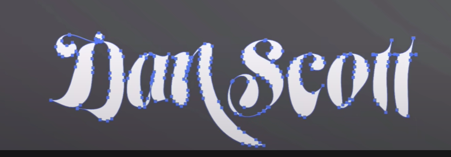

​		

​		然后将画笔的大小再往小调一些，进行细微的变形 如调整为20

​		这就是所谓的液化工具，我们可以理解为 它可以使元素 达到融化的特别效果，如滴水，所以叫液化工具

 

#### 	3、使用旋转工具 Twirl tool

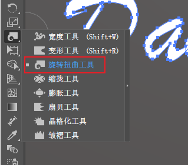

​		长按及拖动鼠标进行字体的旋转扭曲

​	如最终可以制作出这样的效果

#### 	4、使用pucker-变小工具和-膨胀工具

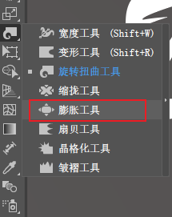

​		缩小工具的效果

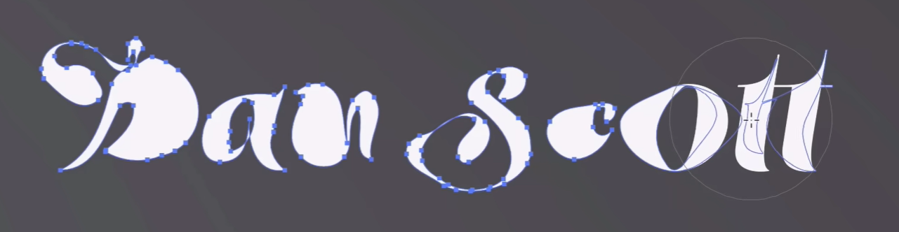

​		膨胀工具的效果

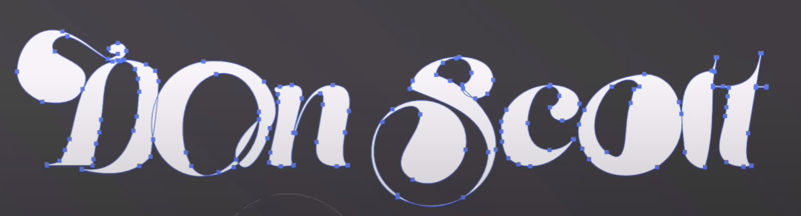

#### 5、其他尝试

​		扇贝型---晶格化--褶皱

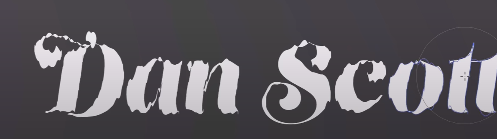

​	

​	