# 14、弯曲和翘曲类型

​		下面我们将采用 超直线为样本，然后以各种不同方式弯曲它们。

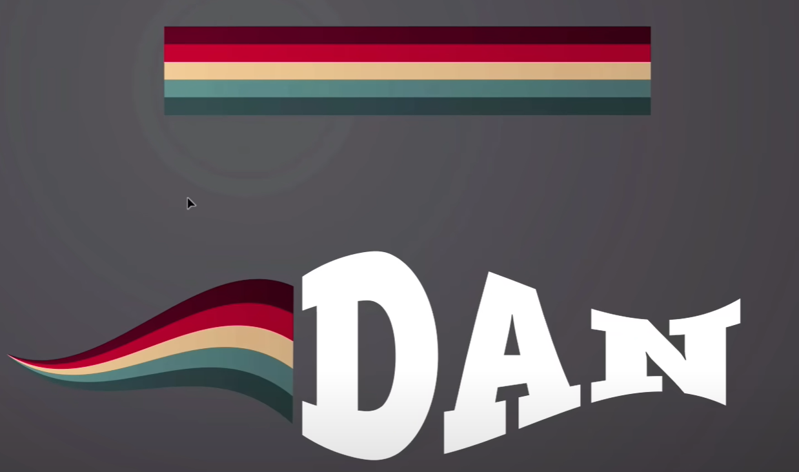

​	我们将使用线条和文字来操作

#### 	1、创建文件

​		打开-文件 -- 打开 Envelope这个练习文件

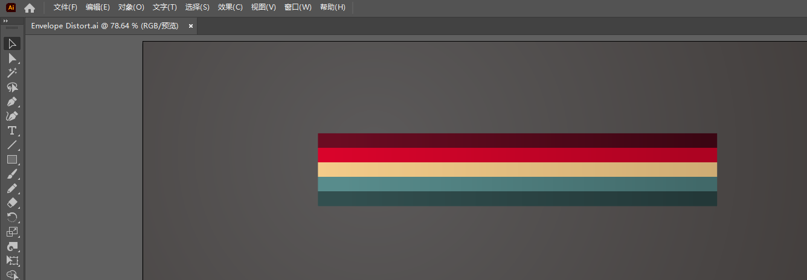

​		我们看到有五条不同颜色的线条，我们选中全部线条，然后对象 -- 分组，查看一下确保它们已经分组

#### 2、Effect效果 -- 变形Warp

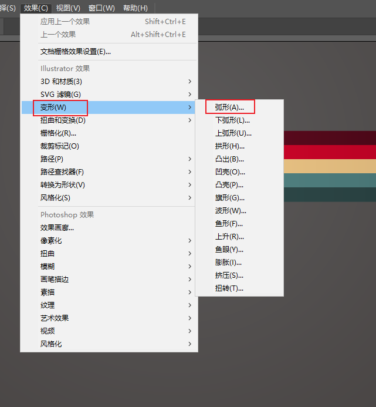

​		我们选择第一个看看效果

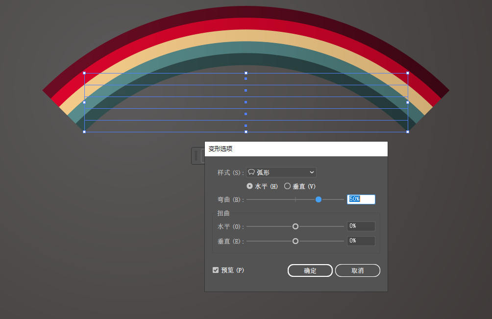

​	打开预览的功能---然后切换各种效果查看

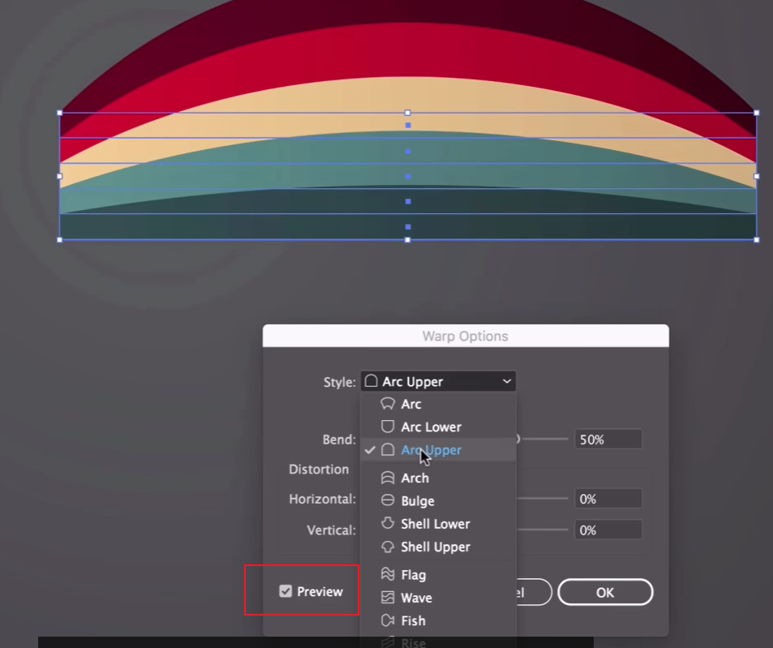

​	这个意味着使用钢笔工具和曲率工具来做这些事情还是有点困难的，所以有了变形工具，有了这个我们更容易弯曲和扭曲 变形这些元素。

​	可以拖动Bend来设置弯曲的程度

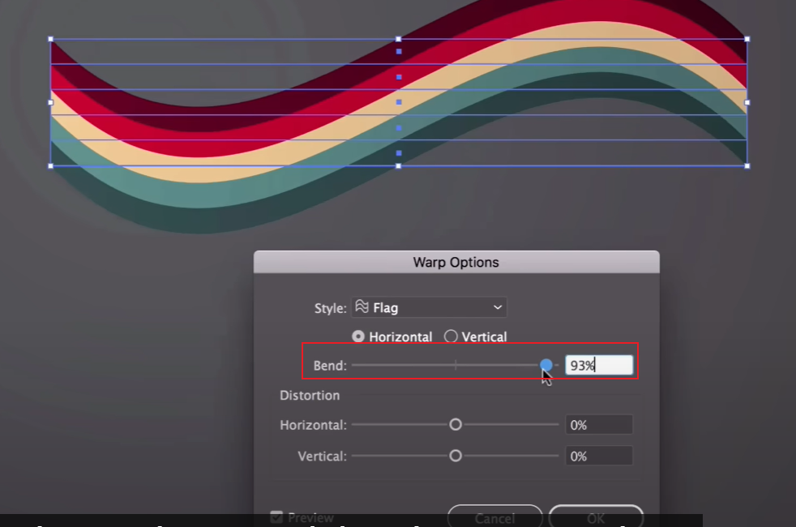

​	还可以通过水平 和垂直 调整弯曲程度

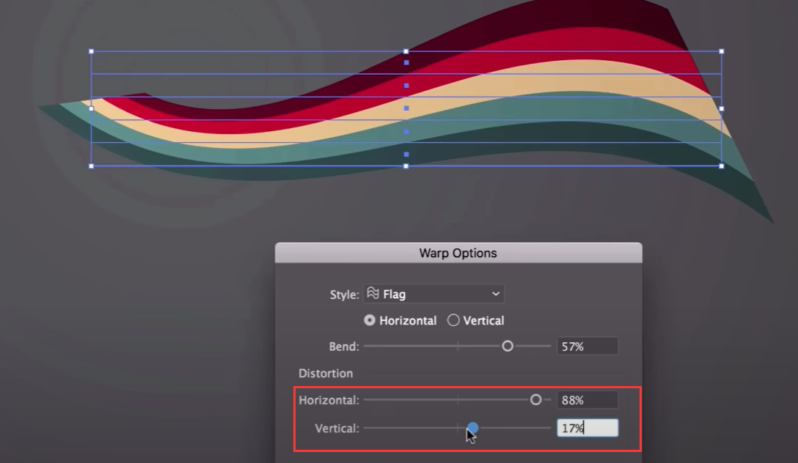

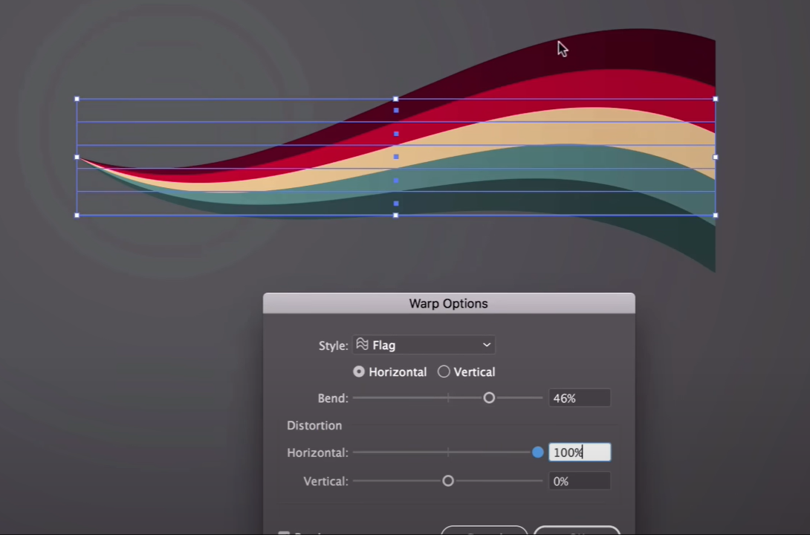

​	如果想修改也可以通过 属性中的Warp：flag

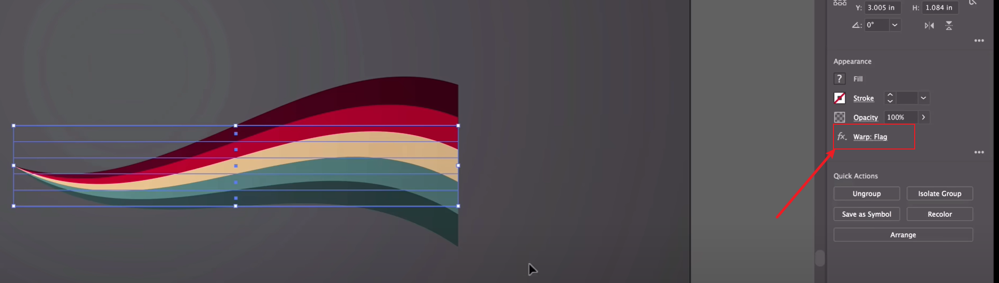

#### 3、添加字符操作

​	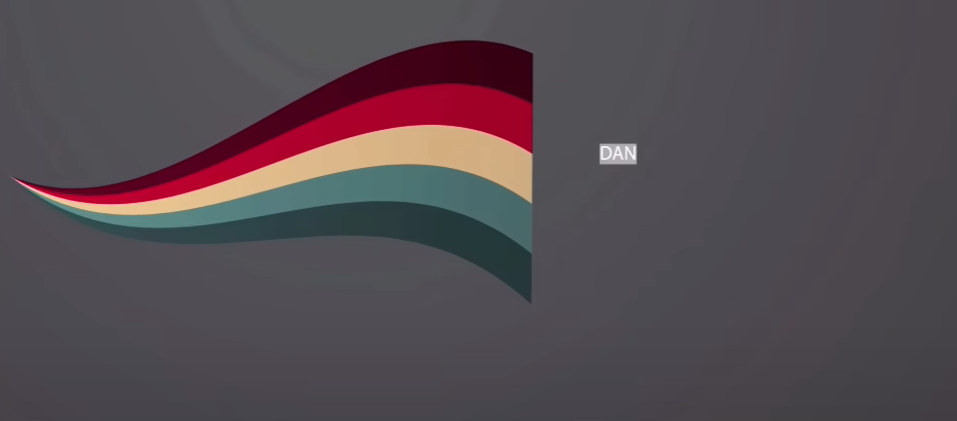

​	拖动选择框大小也可以将字符大小调整

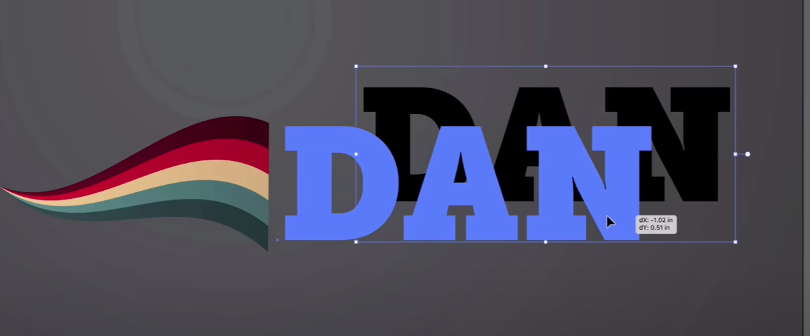

​	然后对字体进行变形处理

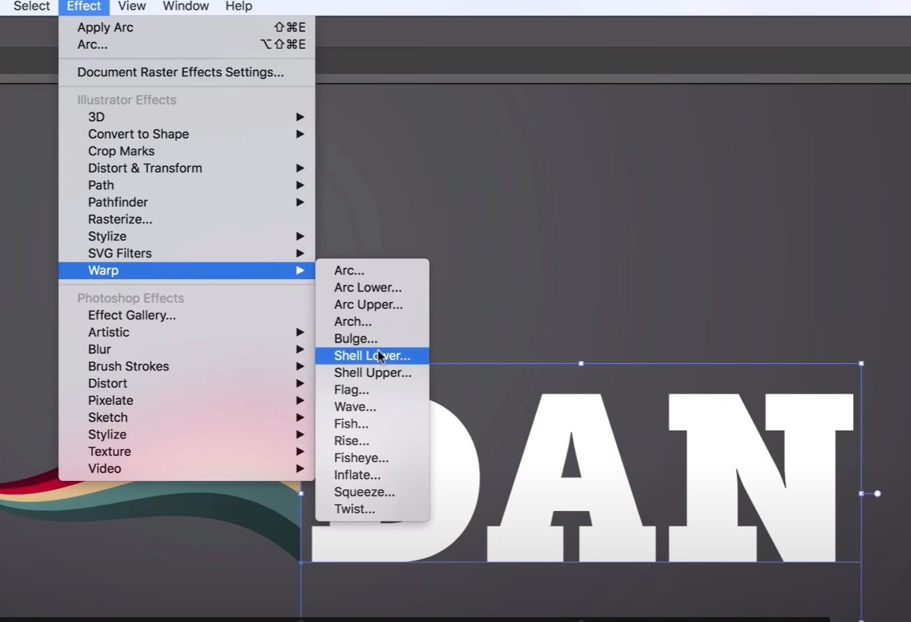

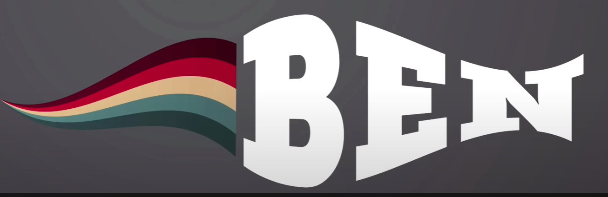

​	

