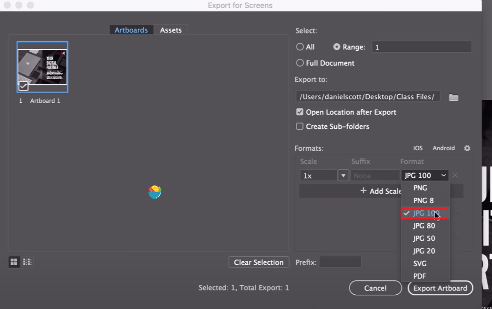

# 17、导出打印&web

​		我们导出一些制作好的内容，比如导出为JPEG、PDF，我们将实现如何为你的打印机制作真正的高质量产品，以及你可以通过电子邮件下载高质量产品。保留图像中的一些矢量有点。

#### 1、导出PDF

​		我们选择的是   文件 -- 另存为 （而不是导出）

​	然后设置另存的文件类型为PDF

然后设置为--高质量打印

​		然后把 第一个勾选框的勾选去掉 Preserve illustrator editing -- 这个不勾选

​		因为如果勾选这个其实和ai文件没有什么区别，使用者是不需要这个的，不勾选的话文件会比ai小很多。

​		我们可以看到只要0.6M,所以这样的导出是 高质量 而且占用内存小

​	我们做一个勾选的看看效果--差别会有几十M的区别，这个勾选保存的是31M

#### 2、最小导出模式

​		用于网络传输，最小的方式

​	显示只有 99kb

#### 	3、JPEG导出

​	

​		导出的格式 数值的大小代表质量的高低

​	高质量和低质量的差别内存占用差不多一倍的差距

#### 4、png 图标导出

​		先将图标 拖入到 Asset Export 命名

​	导出

​		可以看出导出如果是svg矢量图的话会更小，位图的话内存高一些

