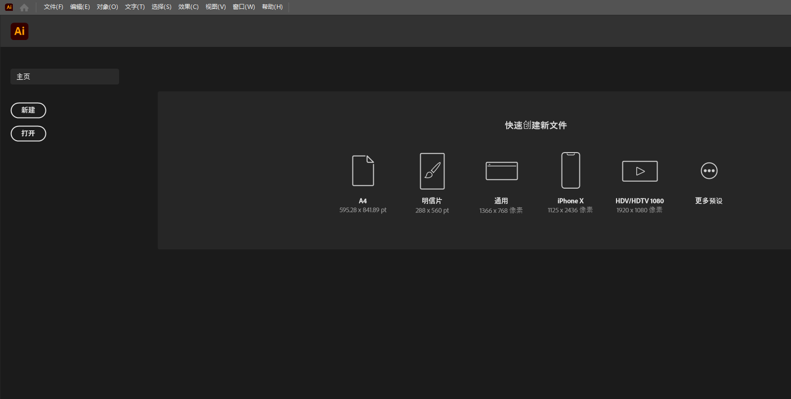

# 1、Ai介绍

Adobe 的 AI 和 AE 工具主要用于图形设计、视频制作和动画制作方面。

1. **Adobe AI 工具**：
   - Adobe Sensei 是 Adobe 公司开发的人工智能平台，它集成在多个 Adobe Creative Cloud 应用程序中，如 Photoshop、Illustrator 和 Premiere Pro 等。这些 AI 工具主要用于图像处理、图像分析、内容智能推荐等功能。例如，Sensei 在 Photoshop 中可以帮助自动选择对象、改进图像内容等，大大提高了工作效率和精确度。
2. **Adobe AE (After Effects)**：
   - After Effects 是 Adobe 的一款专业视频特效和动态图形制作软件。它主要用于创建动态图形、视觉效果、合成特效和动画等。After Effects 的优势包括强大的合成能力、丰富的效果插件支持以及与其他 Adobe 应用程序的无缝集成，使其成为电影制作、电视广告和网络视频制作中不可或缺的工具之一。

**他们的优势是什么？**

- **整合性和兼容性**：Adobe Creative Cloud 中的工具能够无缝协作，使创作者可以在不同应用程序之间轻松转换和共享项目。
- **创意自由度**：这些工具提供了广泛的创意自由度，允许用户实现各种设计和动画效果。
- **专业性和功能丰富**：Adobe 的 AI 和 AE 工具针对专业用户设计，提供了丰富的功能和插件支持，可以满足复杂项目的需求。
- **效率和精确度**：通过AI技术的应用，这些工具提高了工作效率和处理精度，例如自动化任务和智能图像处理等功能。

总之，Adobe 的 AI 和 AE 工具通过其全面的功能和先进的技术支持，成为了许多创意和制作团队的首选，用于从静态设计到复杂的视频特效制作的各种创作需求。

## 	1、软件的安装

​		下载Adobe AI 到本地

​		直接安装到非C盘下，路径不要带中文路径

​		https://pan.baidu.com/s/1HNW85eDj9jvMT5a_rsy_Qg#list/path=%2FIllustrator%202022

## 	2、前期准备

​		下载基础练习的图片https://github.com/tutsplus/adobe-illustrator-for-beginners

