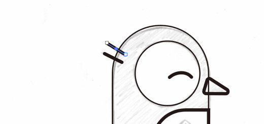

# 2、Ai使用基础操作

​		打开练习中的Get Start开始

#### 	1、选择

​			选择按钮--

#### 	2、放大镜--缩放

​				alt 是切换放大缩小

​		在不选择放大镜缩放的情况下，使用ctrl +/-也是正常缩放 

#### 	3、拖放

​			空格键 -- 会有个小手，可以进行鼠标的拖放

#### 4、新建信纸-横版

​			右侧的颜色我们选择RGB，RGB可以给我们提供更大的色域，CMYK有点褪色

​		文件--存储--保存到指定位置

​	保存后弹出一个会话，默认确认即可

​		接下来我们要做的是，我们画了一只手绘的企鹅，我们要在这个基础上重新绘画，这是很多插画人员非常常见的方式，我们也可以直接进入illustrator，它至少会给我们提供一个可以在上面绘制的模板，为了让我们实现更容易一些。因此，为了实现这点，我们 转到 文件File -- 然后 Place 置入

​	然后放置我们的练习文件  penguin.jpg 

​	

​		放置前，我们选择一个模版

​	这样图像就放置进来了

​			现在我们使用选择的箭头无法 移动该图像，所以我们现在需要做的是，将其图层放入到上方

​	图层1在上方为的是我们在此图层上进行操作，模板图层如果点击解锁，那么我们就可以随意的拖动位置了

#### 5、使用形状和线条

​		点击使用 矩形 工具

​	然后我们可以看到右侧的属性----外观，要确保我们要进行 填充和描边

​	填充是矩形中心的颜色，描边是围绕外部的线，我们随便选择一个填充的颜色，然后选择一个描边笔的颜色及设置 描边的像素点 1pt

​	现在我们随便绘制一个矩形

​	我们将使用它作为企鹅的身体，我们可以看到填充的颜色是中心部位的颜色，描边是外部周围的线，我们可能会看到好像有点微弱的蓝线或红线，这取决于个人的计算机 

现在我们返回到 黑色的箭头，我们在暂时没有操作的时候都返回到箭头这个操作

​	现在我们想保留黑线，取消填充，选择到这个矩形，然后填色设置为空

​		然后我们在点击其他的位置，该选中的框显示为黑线

​			如果我们想再次选中这个框，点击框的边缘，它就再次被选中了，我们就可以再次的操作它

​		现在我们想操作这个框的大小，与企鹅的边缘大小一致，选中边缘进行对框的操作

​		我们可以看到角落有一些点，这些点称为 角选项，我们使用鼠标 拖这个角选项往中间拉

​	

​		现在我们使用 编辑，撤销，可以撤销我们刚刚的操作，ctrl +z快捷键

​		目前又还原了

​			我们现在点击这个  角选项   ，当其它的角选项都是+号，我们点击的这个是○的时候，那么这个单角就被选中了，我们可以操作这个单角

​			点击这个单角--进行拖放中心--达到覆盖边缘线的效果

​		同样修复另一侧，达到同样效果---但是我们修改之后，发现俩个半径有差别，所以我们需要将这俩个 角选项 统一调整，我们可以按 shift 鼠标选择另外 一个角选项，这个是可以选择多个的

​		这样就达到了操作2个角选项的功能了

​		现在我们画个圆圈来代表它的眼睛

​	我们现在使用矩形中的圆圈---椭圆工具

​	我们可以在图层上随意的画，如果在操作椭圆的时候按住 shift ，它就锁定了高度和宽度，对于矩形或多边形也是如此，现在我们调整到刚好的尺寸

​	现在我们选择圆圈的中心点，然后拖到企鹅眼睛的部位

​		我们进行眼睛大小的微调，就像之前的角选项一样，某个点不合适，就单独的操作某个角选项进行操作

​		我们也可以使用方向键--进行最后的微调

#### 	6、曲线

​	现在我们需要做一个企鹅的 笑容，做个曲线

​	我们点击线条，单机 按住 有多个选项，我们选择其中的 线段工具 arc

​		然后我们使用各个点调整图形

​		然后我们想加粗一下这个眉毛，调整这个描边 pt的大小值

​		我们发现这个眉毛的俩头端点是 直线平的，我们需要给它加个圆冒处理

#### 	7、多边形工具

​	接下来我们做一个三角形，用于做它的嘴巴、翅膀

​	三角形的本质其实是多边形，我们使用多边形 工具，默认情况会获得一个五边形

​		我们可以设置边数，Polygon -- Sides 3

然后我们使用选择---进行对三角形的调整，按shift可以固定旋转，然后使用 角选项 进行拖动将角变为弯曲的形状

​	然后我们copy这个三角形，用于做其他的部位

​	复制和粘贴 -- 然后调整位置

​		我们将view中的智能参考线 Smart Guides打开，这意味着图像会尽量的自动对齐

​		然后现在我们开始制作它的身体，使用矩形工具

​		然后调整它的身体

​		现在我们该做它的脚了

​		还是使用矩形工具

#### 	8、直线

​		现在我们使用直线工具 来弄它的头发

​			按shift选择俩条线，然后一起条件线的粗细，然后调整线的边缘

#### 	9、多边形

​		我们现在制作企鹅的多边形 徽章

#### 10、处理地面和水

​		我们在拖放地面这个矩形操作的时候，不小心将矩形拖放的非常大，我们取消后使用view 视图，选择全部适合的窗口，然后就回到基础构建这里了

