# 3、图像填充颜色

​	

​	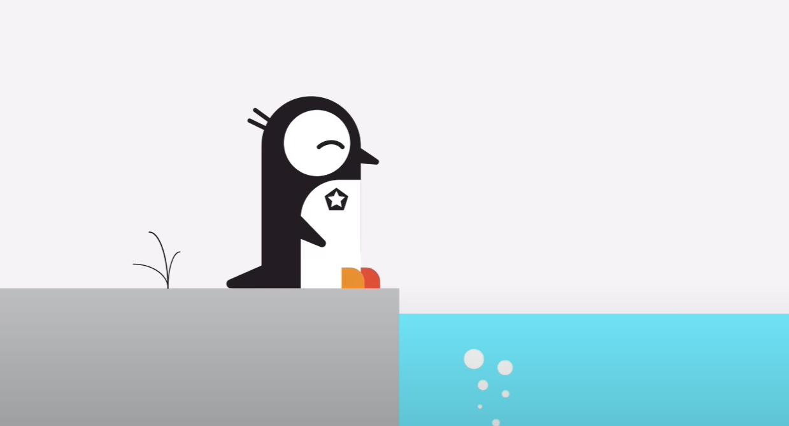

​	我们最终的目的就像以上图案，我们要给他上色，在这个过程中我们将使用分组，排列，还有什么是隔离模式，等各种操作。

​	首先我们关闭追踪层，也就是模版层，因为我们现在图案已经完成了，不需要这个图层了，也可以选中点击删除，我们目前就取消显示就可以了

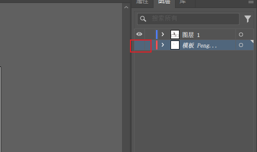

#### 	1、分组

​		现在我想给这个五边形的徽标填充颜色，我们选择填充颜色为黑色

​		我们现在有个问题，因为现在有星星在内部我们看不见了，我们使用箭头 鼠标悬停在上面才可以看到可选星星，点击小蓝线找到星星，因为现在都是黑的所以看不见了

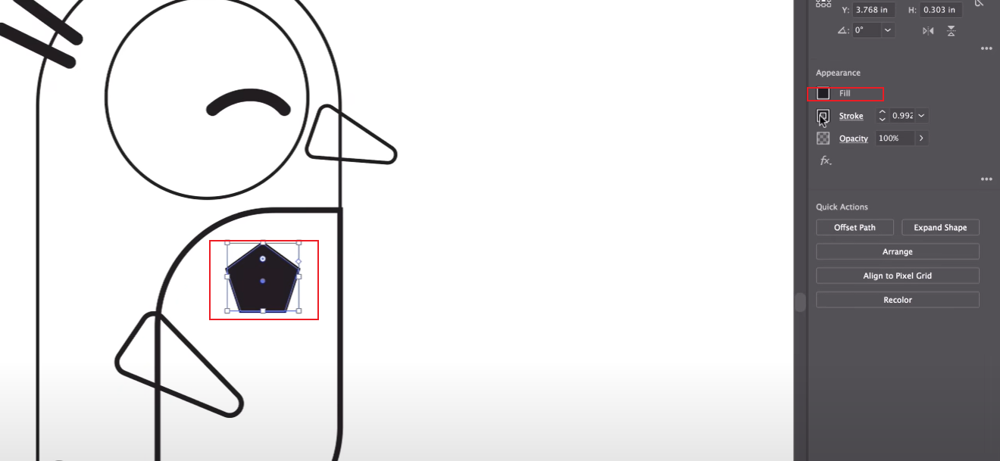

​		现在我们选择星星，然后填充颜色设置为 没有填充

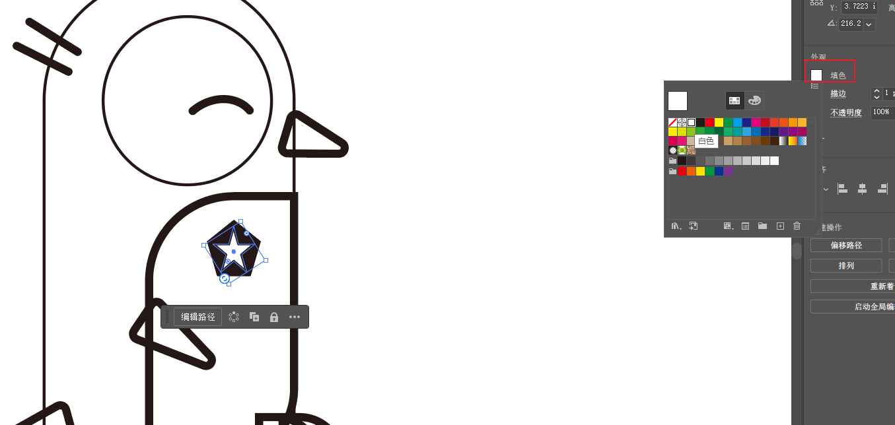

​		所以我想把这俩分组，我需要选择它们（俩个元素都选中），有时不能同时单击，将它们分组以便它们粘在一起

​		对象--编组

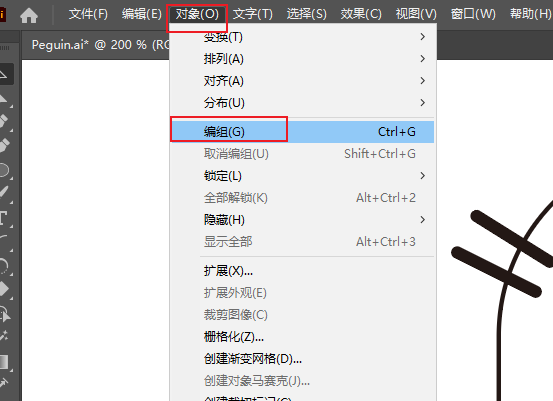

​				这意味着我们可以整体移动这个分组，可操作这个分组，如果我们取消分组，可以把这俩个元素再分开

​				现在如果我们双击一下这个星星，发生的情况是其他的背景变灰，我们选中的元素可以执行操作，但是其他的内容目前就无法操作了，这就是 你进入了一种 称为 隔离模式的状态 

​			空白处 使用箭头双击 ---退出了隔离模式

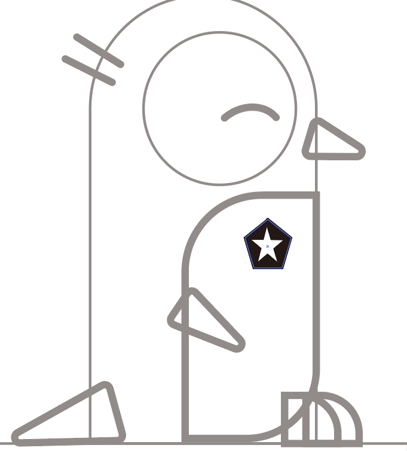

#### 		2、隔离模式

​		我们为什么要这个隔离模式，它实际上有很好的用处，就是我们可以针对某个元素或者组进行独立的操作，我们退出隔离模式的时候说明我们已经对某个组或元素操作完成了

#### 	3、脚添加颜色

​		设置颜色填充，然后设置无描边，俩只脚的颜色存在颜色覆盖问题，使用排列----然后进行颜色层数的调整

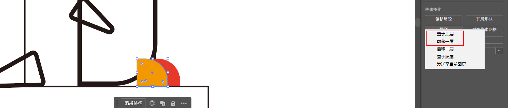

​	我们可以使用箭头将 企鹅 全部 框选  然后就可以调整整体的大小

​			我们可能正在画一些更复杂的东西，需要调整大小，但是之前的细节又想保持不变的情况下，我们会使用到这个操作

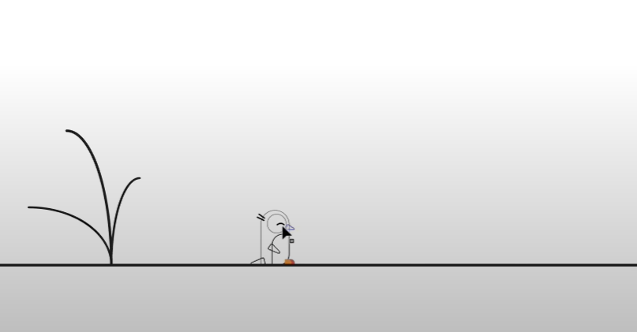

#### 	4、设置其他部位颜色

​		点击身体，设置填充颜色为黑色，描边设置为白色，这样的操作可能会更难操作，所以我们先取消这个操作

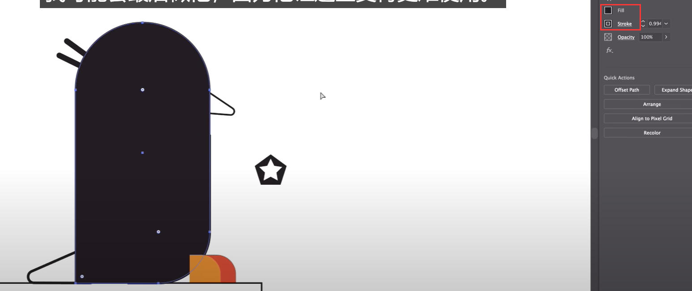

​	然后我们先选择 眼睛 和 肚子的中心点，这俩个都选中后我们希望这俩个都有一个白色的中心，而且不需要描边

按shift 选择这俩个元素

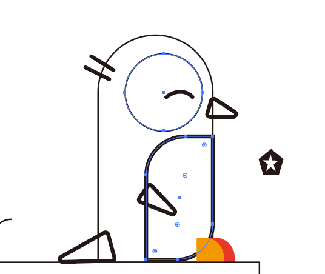

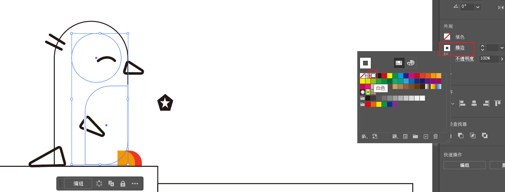

​		 先将眼睛和肚子的颜色填充为白色

​	然后点击身体 进行黑色的填充，且不需要描边

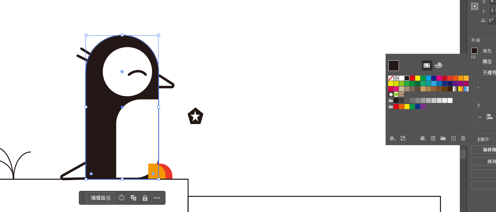

#### 5、骨架视图

​		现在我们想操作一下翅膀的颜色，但貌似寻找这个翅膀稍有困难，因为被颜色覆盖了不容易找到，我们的鼠标在周围转动偶尔才能找到，所以我们可以使用骨架视图，也就是轮廓

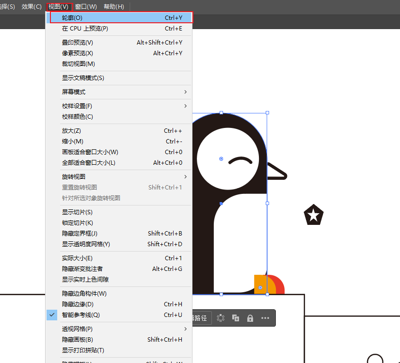

​		使用轮廓 ctrl +Y 来回切换，这样我们的元素更容易被找到

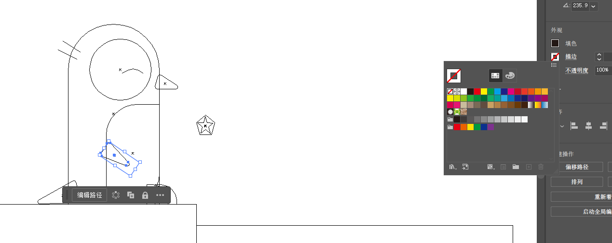

​	嘴巴也是同样的操作

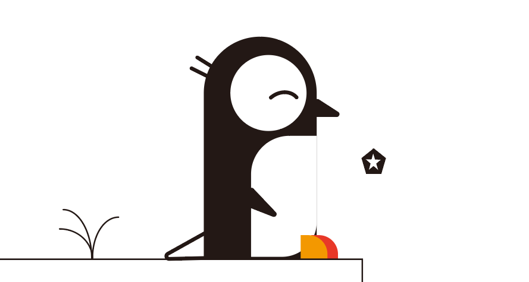

#### 6、滴管工具

​			我们选择好元素后，点击滴管，然后使用滴管选择一个颜色就将它颜色填充为选择的颜色了

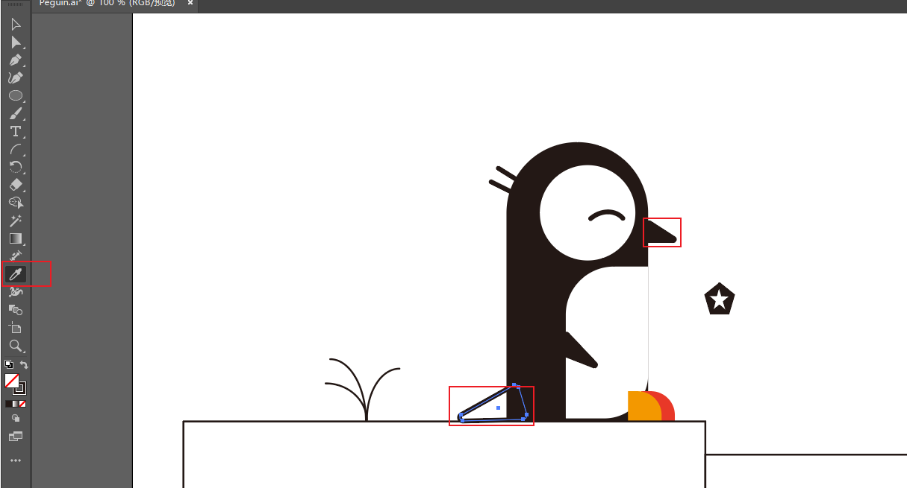

#### 	6、拾色器

​	现在我们操作地面和水，使用拾色器进行颜色的选择

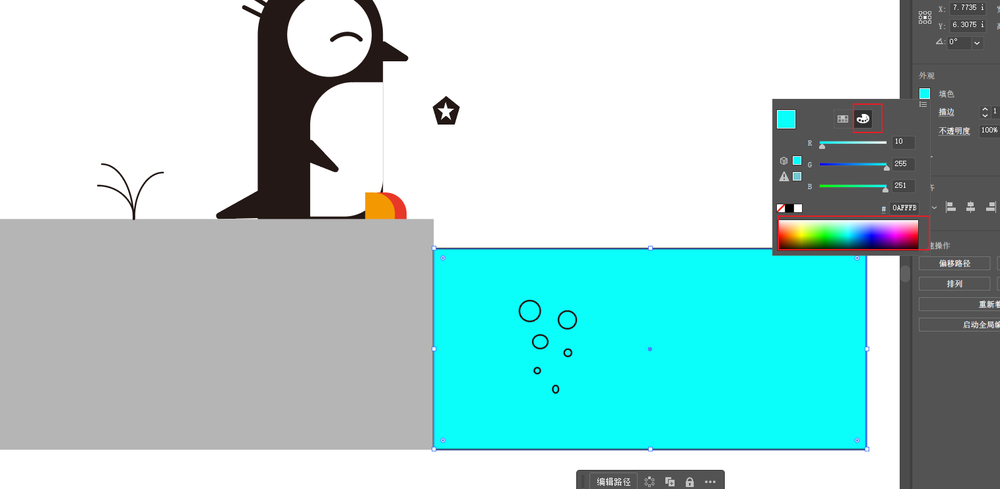

​	然后我们选择多个气泡，设置为白色，按shift点击多个

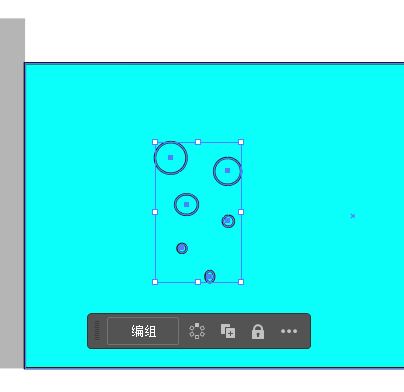

​	效果是这样的

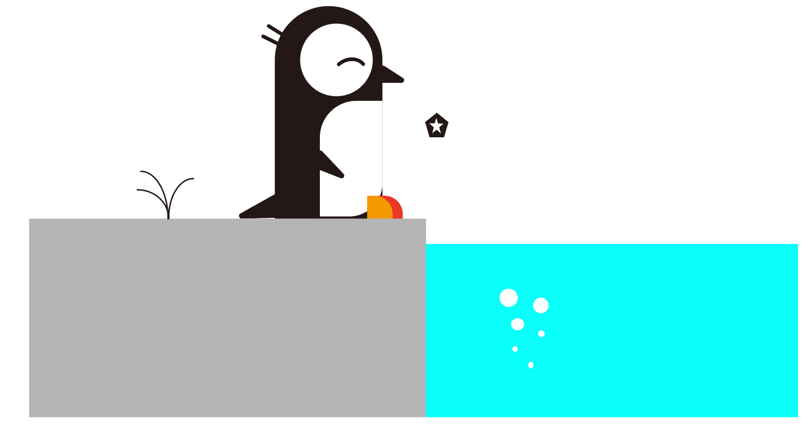

#### 7、背景色设置

​	现在我们使用矩形工具，将图全部扩住，然后选择填充颜色，然后置于底层

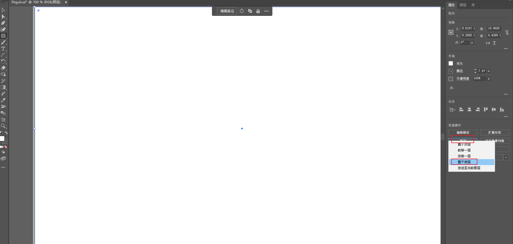

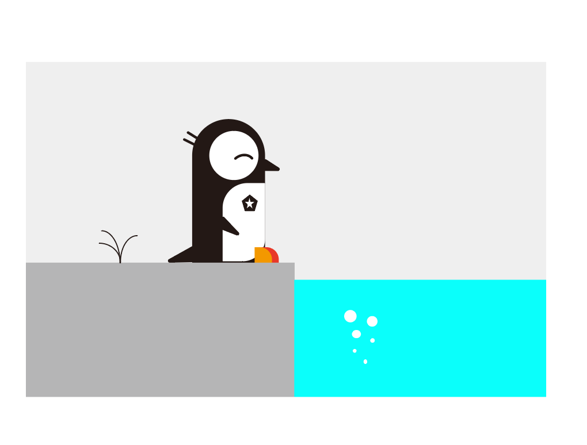

#### 8、最后的调整

​		我们最后在调整一下肚子，设置为方形的，以及脚丫子的位置调整

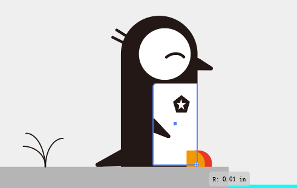

​		完成

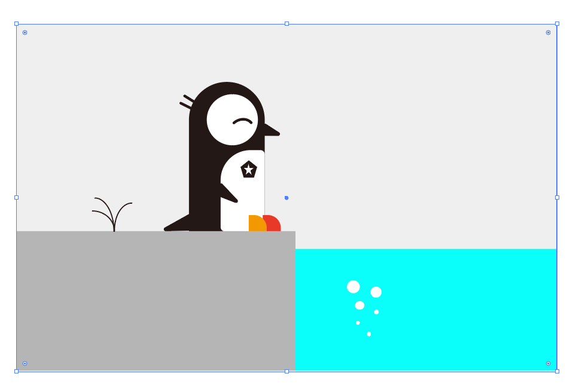

#### 9、总结

​		我们可以通过以上学习的内容，进行自己的插画创作，制作简单的内容

​		以上我们学习了，简单的形状，三角形，五边形，星形等

​			角选项，填充，滴管 等

