# 5、画自定义logo

​	我们想把这堆线，变成一个logo

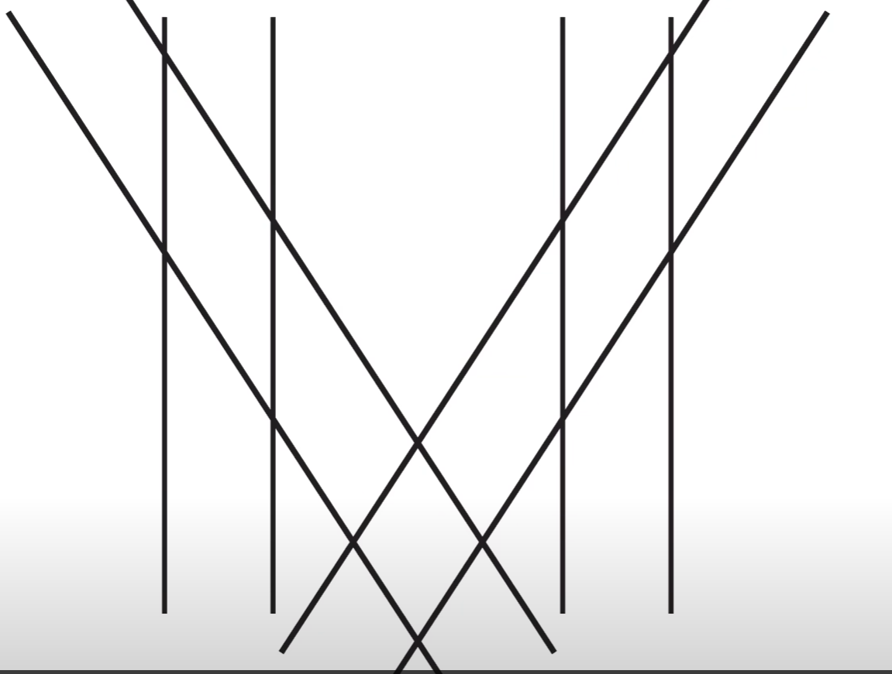

​		我们将再次使用我们的形状生成器工具，以及其他技巧。

#### 1、创建新文档

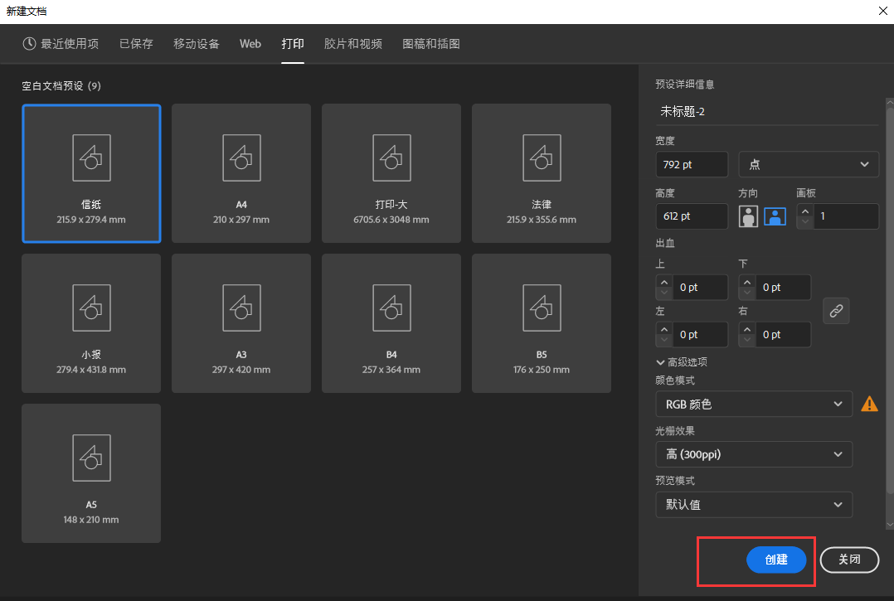

​	我们将使用直线工具先画出M，然后使用形状生成器

​	开始使用直线工具画 -- 然后copy直线，然后编组，再次copy，然后旋转45度

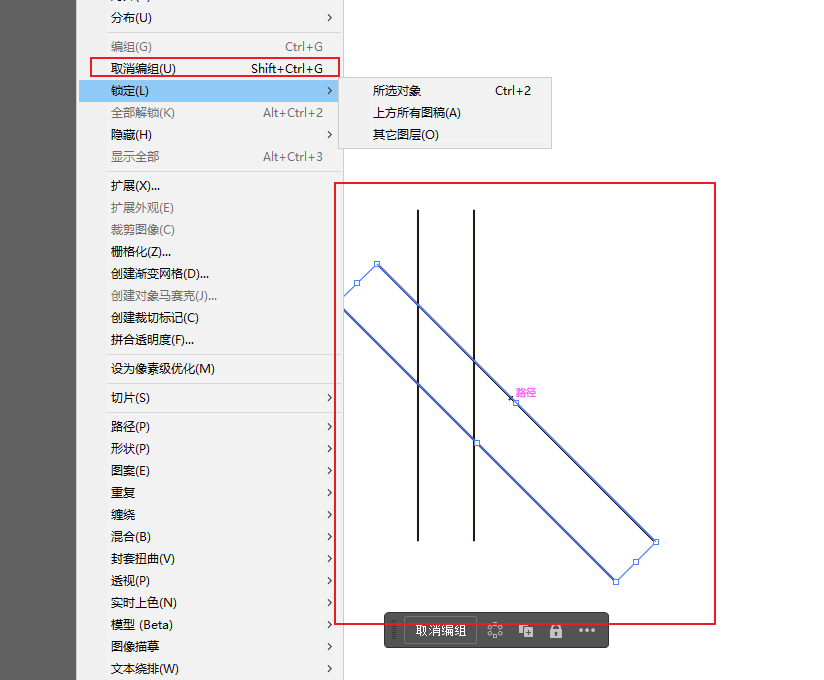

​	现在框选所有线条，然后使用 对象 -- 变换Transform---镜像

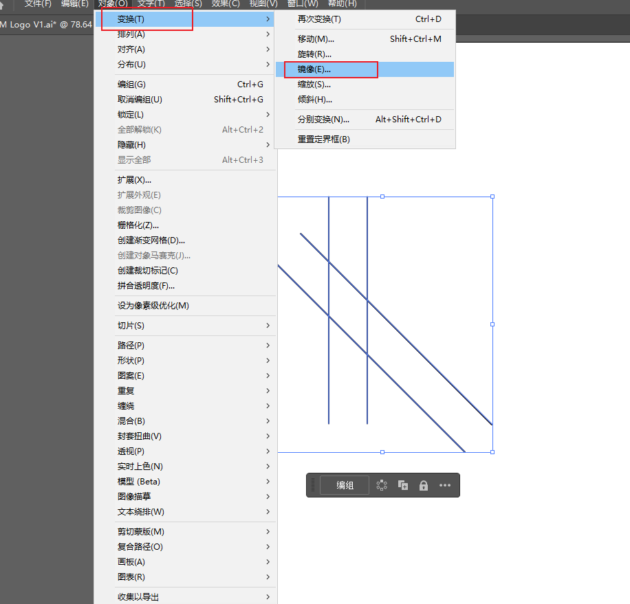

​		然后现在选择 水平/垂直 都没有关系，我们需要做的是打开预览，如果我们预览感觉没有问题后点击ok，如果点击ok的话是覆盖了原图形，如果是copy的话是一个新的图形

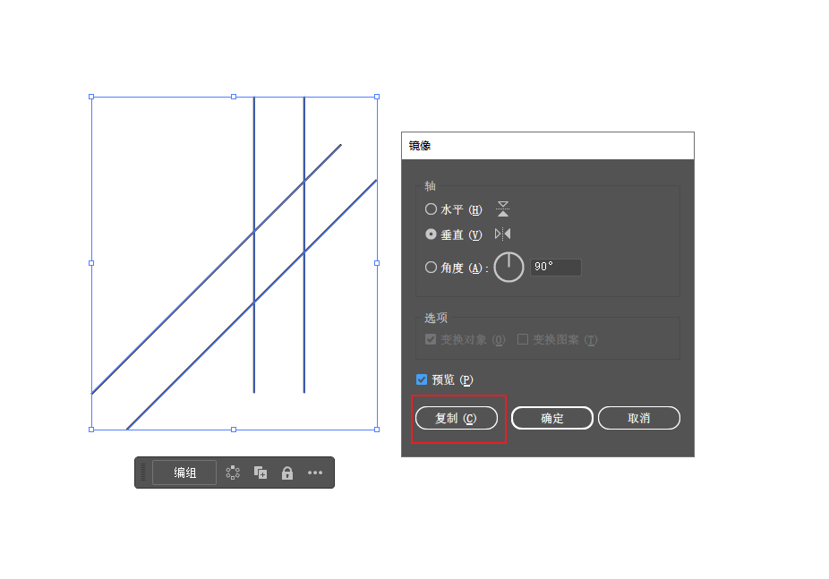

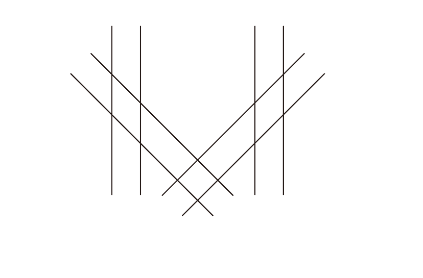

​			这就是 大致M的雏形，然后设置一下对齐方式，垂直底对齐

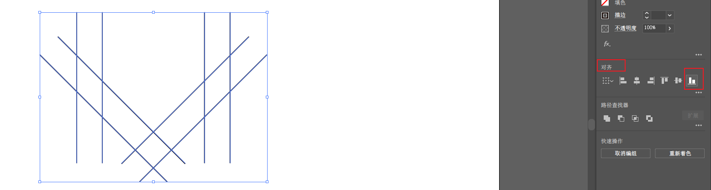

#### 2、补充线

​		现在我们需要做的是将M，我们的鼠标在线上 游走的时候都显示的是path路径，在走到相交的点的时候是intersect

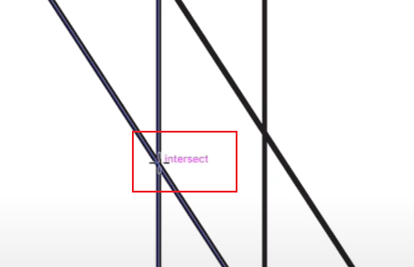

​	然后我们使用直线工具，将需要闭合的部位 进行闭合操作

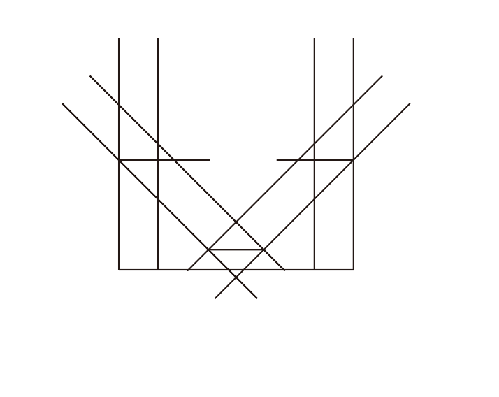

#### 	3、去掉多余部分

​		然后我们现在使用 ，形状生成器来进行去掉多余的部分

​			shift + m 使用alt

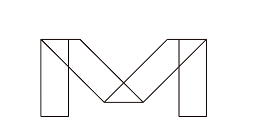

​		再次去掉多余的，合并图形

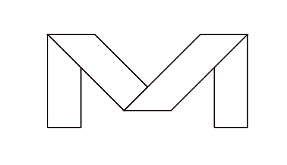

#### 	4、颜色填充

​			还是使用shift + M 形状生成器，然后填充每个部分的颜色

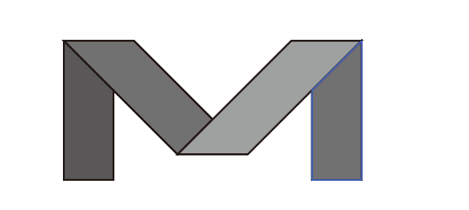

​		最后，去掉边框，这样logo基本就完成了

​		每当展示一个logo时，你在背景中画一个大的矩形，然后设置一个深灰色的作为背景，logo很漂亮，也许我们可以在深灰色中使用它们

​		设置完底色，然后--排列----置于底层

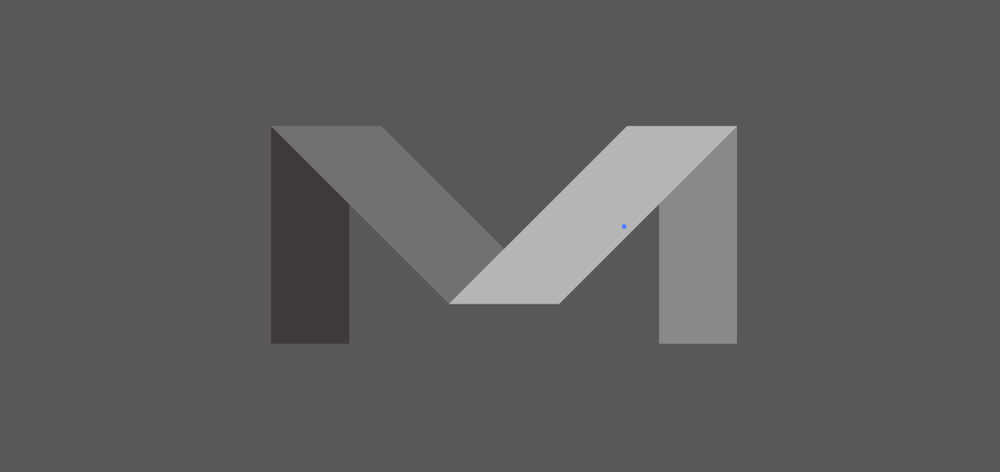

