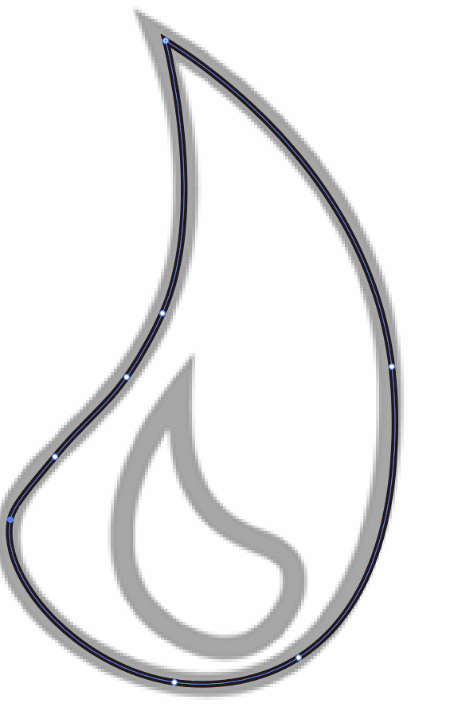

# 6、使用曲率工具

​		使用曲率工具，它就像钢笔，只是更简单一些，我们将使用曲率工具完成以下图形制作

#### 1、新建

​	如果画板有偏移，可以选择 设置 画板适合窗口大小

#### 2、导入练习文件

​				Redraw Icon这个图片

​		置入的时候记得选择模版

#### 	3、重绘图案

​			我们将使用这个曲率工具，就像钢笔工具的简化版本

​			使用曲率工具，例如这个圆，我们点4个点，然后每个点自动追踪，然后就实现这个圆的制作了

​	然后下面我们继续使用这个曲率工具来描绘 图，我们使用的过程会感受到它的运行规则

​		我们还可以拖动这些点进行微调

​		如果不够光滑，那么我们可以添加 曲率的点位，然后使用鼠标进行继续的微调

​		但是我们尽量使用较少的 锚点，因为使用的锚点越少 曲线越光滑

#### 	4、直接选择

​			直接选择中，辅助线的作用

​				拖动这个线，会影响这个线条的 旋转和弯曲程度，线越长，曲度越平缓，线越短，弯曲度越高

​	这样我们就将第一个图形制作好了

#### 	5、第二个图形制作

​		我们还是使用 曲率 工具

​		连接起来后是这样

​		这样画明显是有问题的，我们可以使用 曲率工具 画直线，我们在每个角的点都使用双击，然后就可以达到直线的效果----以下制作成功

#### 	6、曲线和拐角的结合图形

​		角落是双击，因为有锋利的边缘，曲线的话我们就单击，需要锋利或直线的角就双击

​			然后可以使用增加锚点来进行调整

​		这样就画好了

#### 	7、使用曲率和锁定

​		我们在画完圆后，想从上往下连接圆画直线，这个时候就需要锁定上面的圆，否则无法直接连线画直线

​	然后我们使用形状生成器工具，进行调整，首先是解锁全部内容

​	

​		

