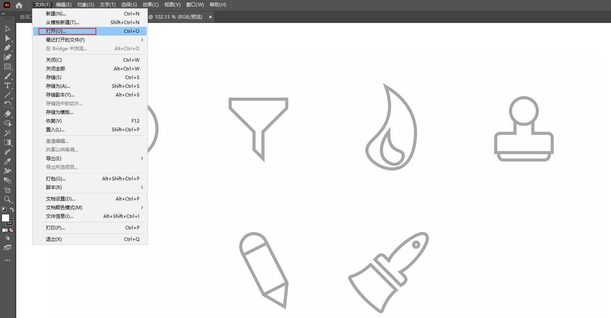
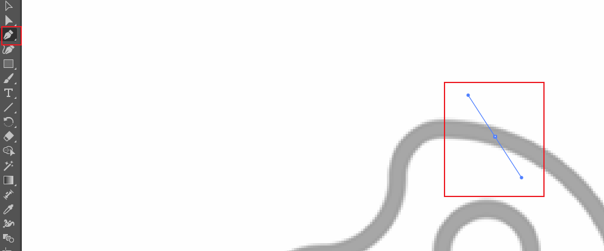
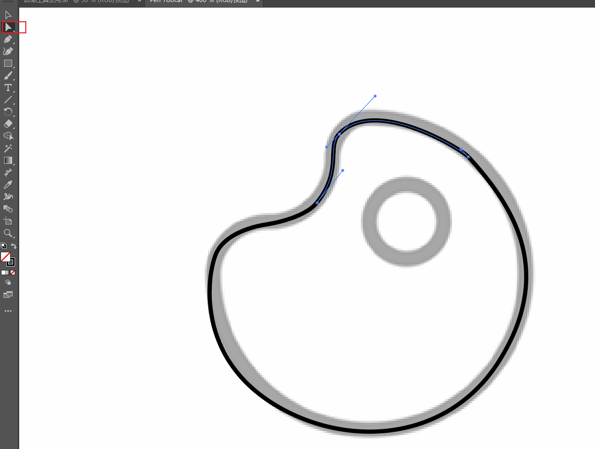
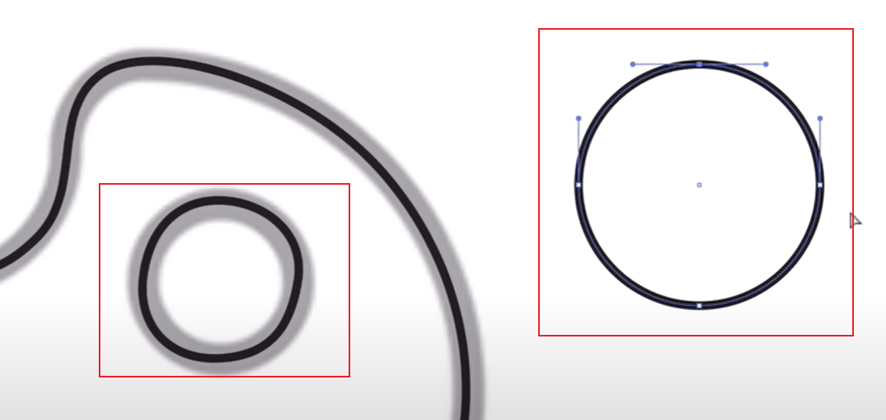
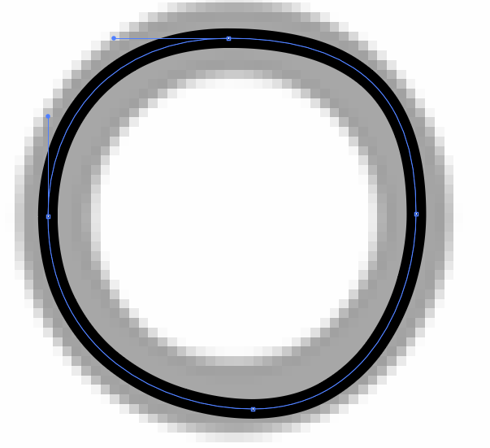

# 7、使用钢笔工具

​		我们将使用钢笔工具来进行以下图标的制作，图标与曲率工具制作的图标一样，这样我们就可以更好的区别出，钢笔工具和曲率工具的区别。及钢笔使用的优缺点。

#### 	1、创建新文档

​		直接使用文件 -- 打卡，选择pen tool 这个测试图片

​		曲率工具和钢笔工具是设计程序和绘图的主要工具，很多东西都使用钢笔工具，因此我们学会了这些，我们就可以在PS、InDesign、Sketch Up、3D Max、AE等工具中使用相同的工具并以相同的方式工作。

​	许多不同的程序都使用钢笔工具，曲率工具是比较新的，而且更简单一些。但我们需要俩者都知道如何使用。钢笔工具默认是使用的直线。

#### 2、钢笔工具的使用

​			钢笔工具确认锚点后，会有直接的微调线，我们可以拖动这条线，拖动到你想要绘制线条的任何方向，这个也叫手柄，是影响线条的手柄

​	然后使用选择工具，对手柄进行调整

​		我们继续画里面的圆，我们发现很难画标准的圆，我们使用椭圆工具画一个圆，然后观察它的基础结构的锚点，发现其实和钢笔是同样的原理，只是它比我们手动的更合理一些，如果我们设置的锚点和手柄与它一致，那么也将是一个完全的圆形

​	使用大小写，可以切换钢笔的笔准心

​		我们在使用钢笔工具，更有控制权

