# 8、使用铅笔工具

​		

​	置入图片Pencil Tool 01

​	不使用模板置入，直接框选大小的置入

​		然后锁定对象

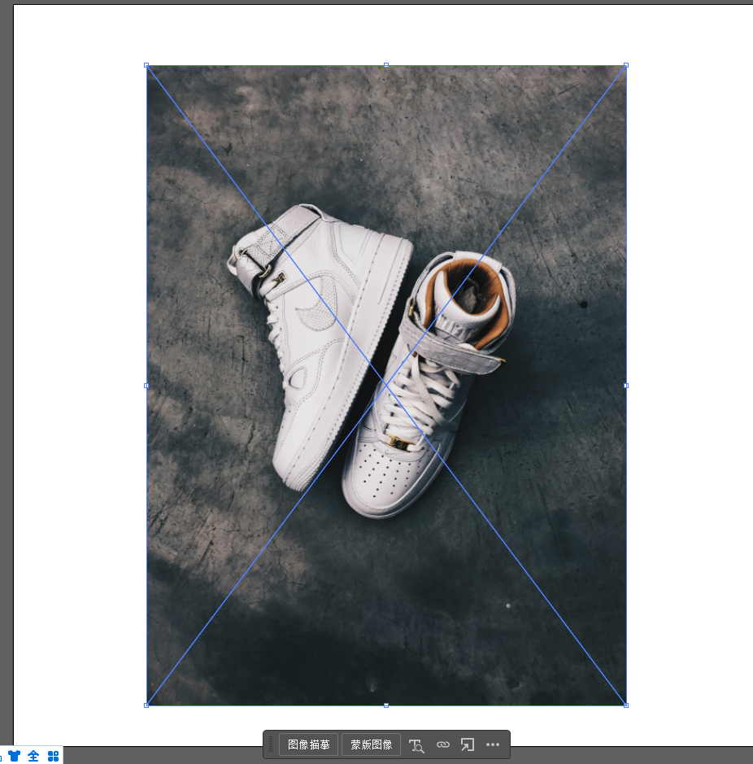

#### 1、铅笔工具

​	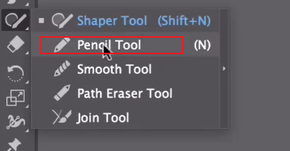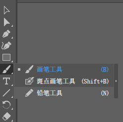

​	现在我们要使用铅笔工具画出修饰鞋的小翅膀

​		我们发现一个问题，如果绘制的线条和之前绘制的很相近，那么它会自动尝试重新绘制，这个不太好，我们可以关闭它这个功能

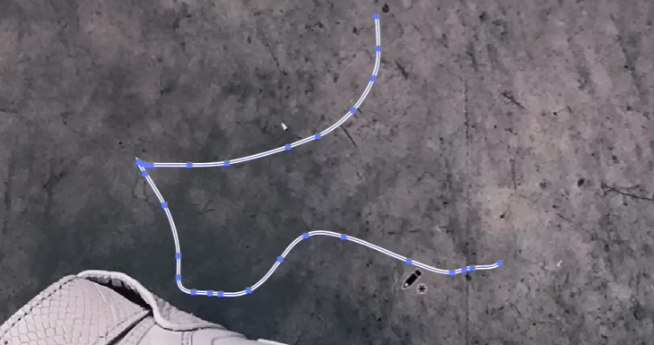

​		双击铅笔工具选项 -- 取消勾选 keep selected --保持选定

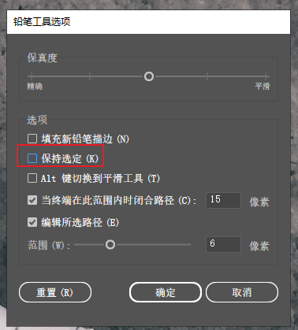

现在另一个问题是 我们画的看起来很糟糕

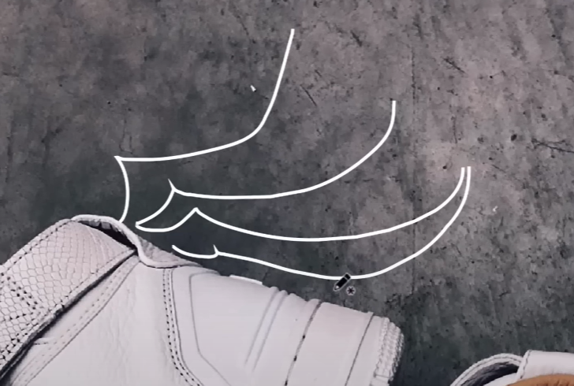

​	我们调整一下保真度，往高调一些这样看起来线条会更平滑一些

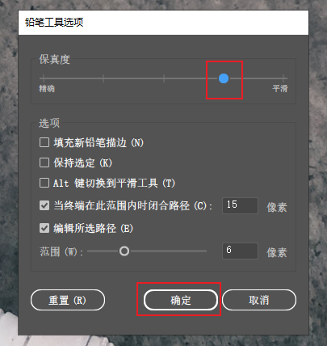

​		使用鼠标画的这些曲线，只是点击和拖动效果不太好	

​			我们可以把不好的地方使用 选择 然后删除掉重新画

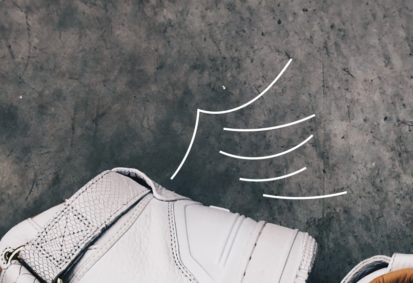

​		我们配置线条的粗为3pt，设置端点圆角，然后设置 宽度配置选项，这样就变成羽毛的形状了

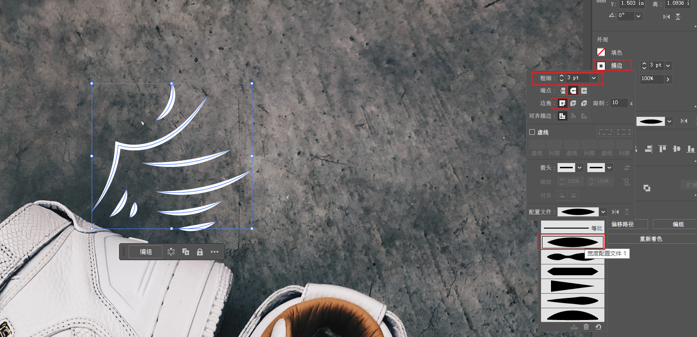

​		这样就调整完成了

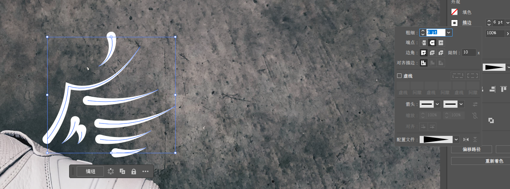

#### 2、第二部分-画箭头

​	现在我们画向前疾驰的线条

​		然后设置箭头的形状，以及箭头的百分比大小

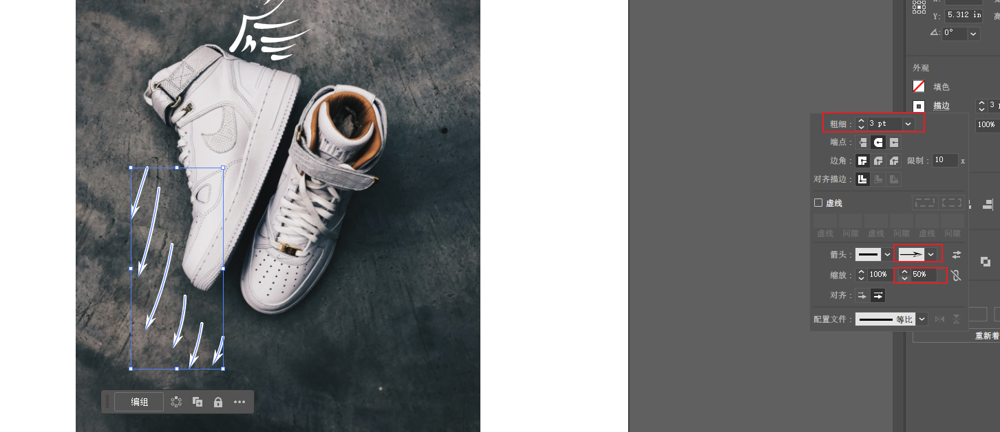

#### 3、第三部分-画虚线

​		先画出实线

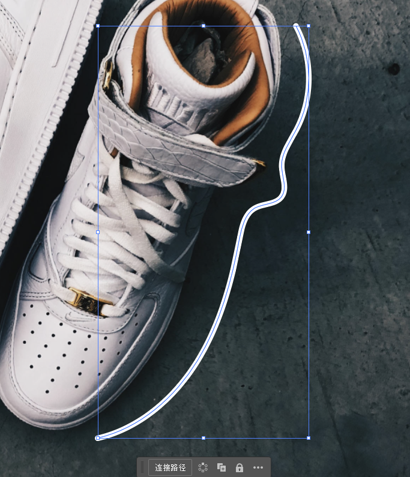

​	然后选择，在描边里面设置，虚线的12pt，就是指的虚线的长度是12个pt

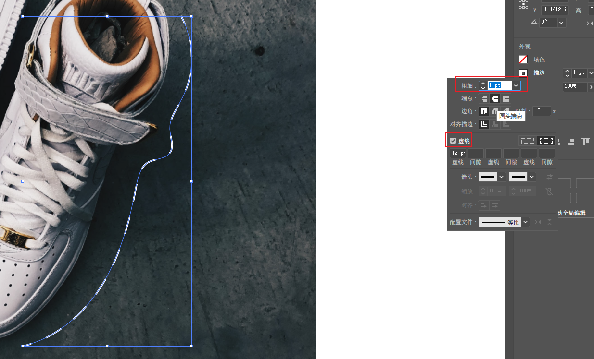

​	可以更细微的调节虚线，如果需要的话可以深入研究

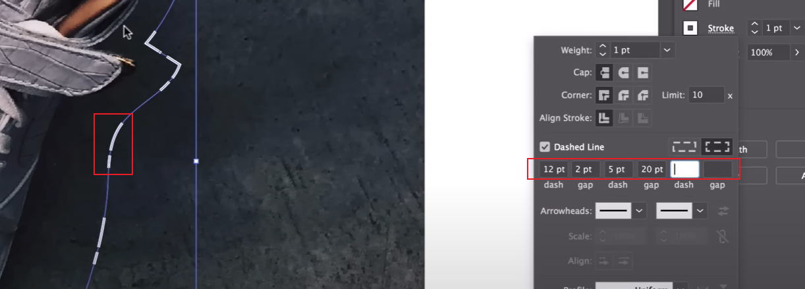

#### 4、虚线设置为点

​		

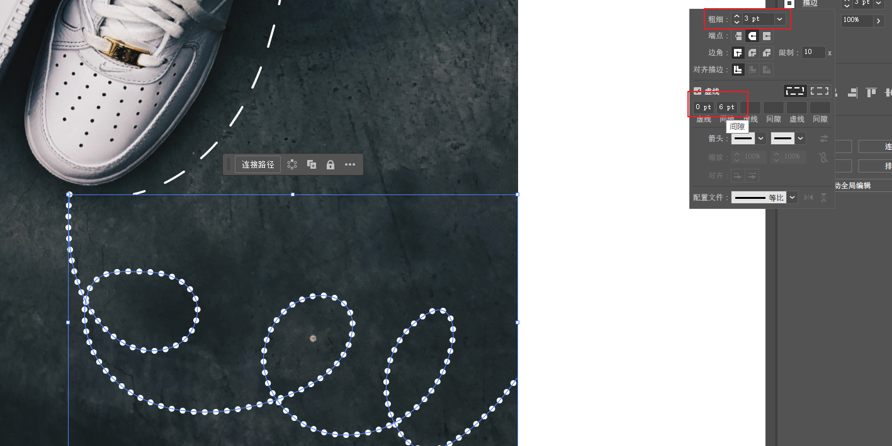

​		这是铅笔工具和描边的混合操作

​	我们可以在pencil 2中继续练习，导入图像，然后锁定开始绘画

​		比如现在的主题是旅行，所以我们可以想 翅膀、飞机、地图等诸如此类的东西可以放入图形中完成设计。

主要练习我们 使用虚线、点线、轮廓线等。记得调整我们的铅笔，让画看起来更棒。

