# 9、铅笔-画笔库

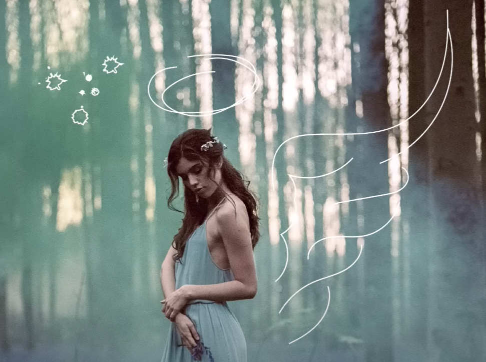

​		人们像把这种无聊的笔画，在使用illustrator中完成更具艺术

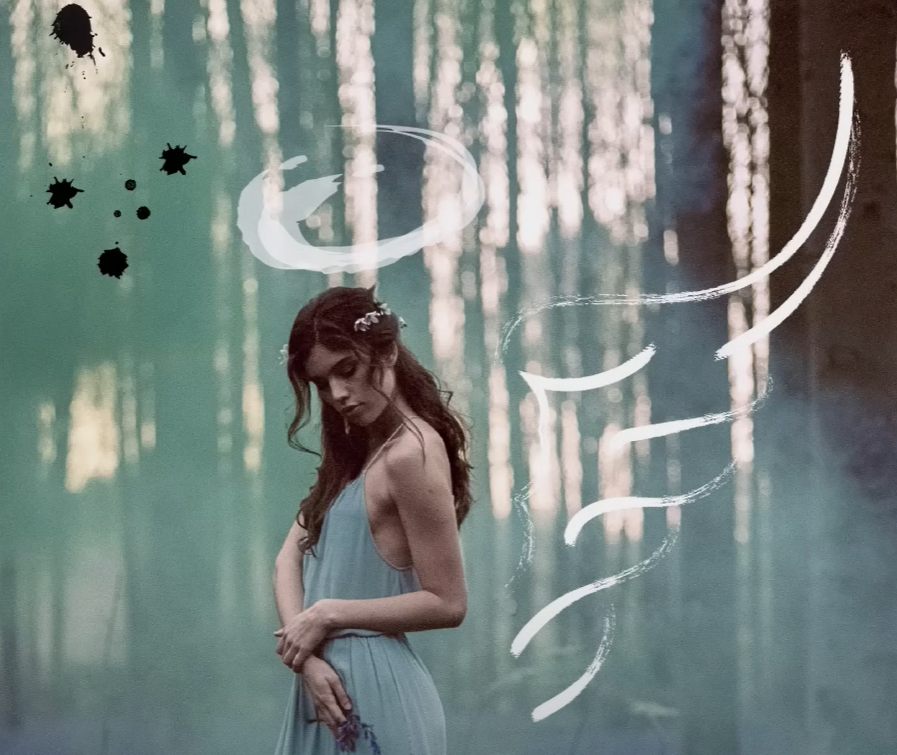

#### 	1、创建新文档

​		创建新文档，导入 Brushes 01练习文件

​		然后我们可以使用曲率工具或铅笔工具来使用画笔

#### 	2、初始线条描绘

​		我们现在使用铅笔工具--去掉填色，描边设置为白色

​			描绘一些线条

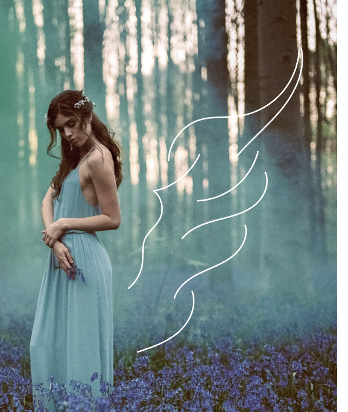

​	

#### 3、使用 画笔库工具

​		然后全部选中线条----然后使用 窗口 -- brush libraries画笔库--然后是 矢量包--颓废画笔矢量包（Grunge brushes vector pack）

​		画笔库中这些工具我们慢慢尝试，先使用这个--颓废画笔矢量包

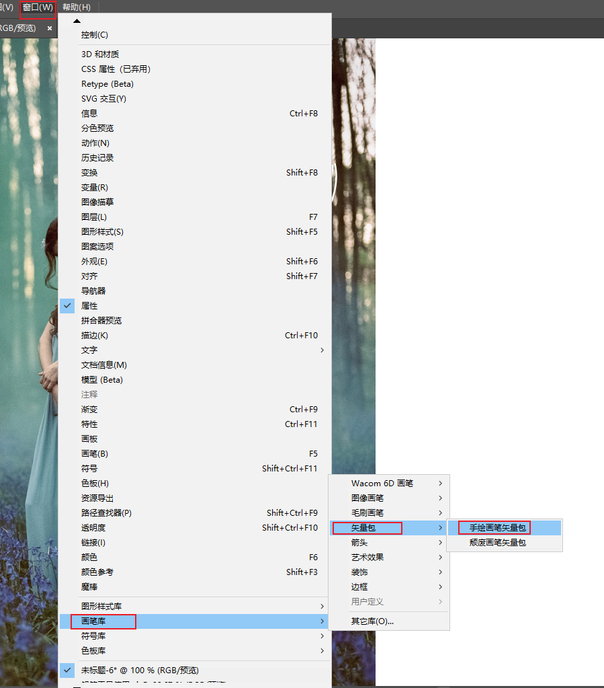

​	然后我们选择其中的一个尝试看看效果

​	效果还不错

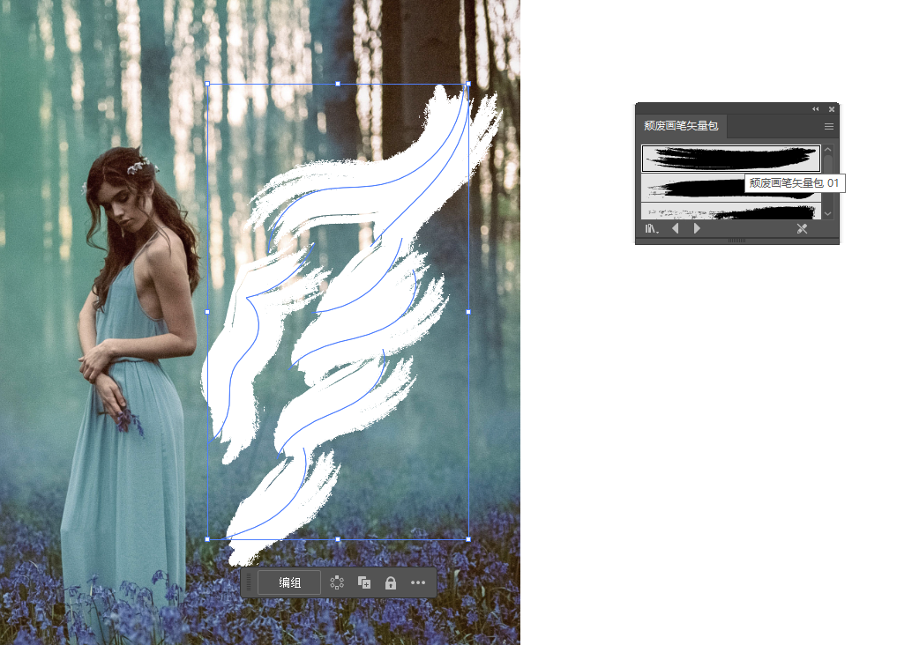

​		 	目前感觉默认还是有点大，我们调整一下大小，设置描边为0.15

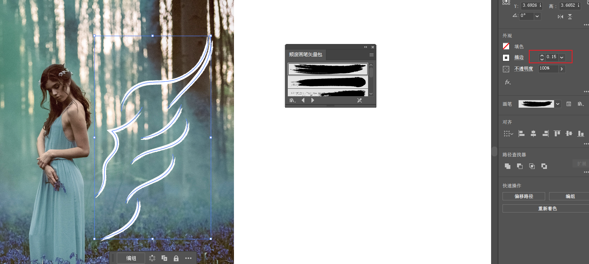

​	左侧也手绘画一个类似的翅膀--然后调整描边为 0.05

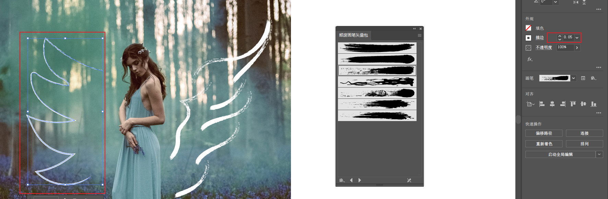

​		这个效果不太好，我们删除掉吧还是

#### 4、使用画笔库--Artistic艺术
			油墨效果

​		使用油墨效果

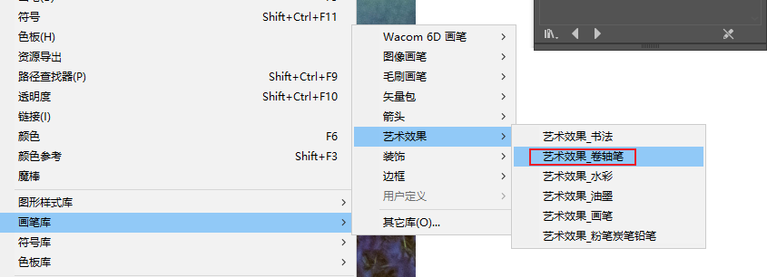

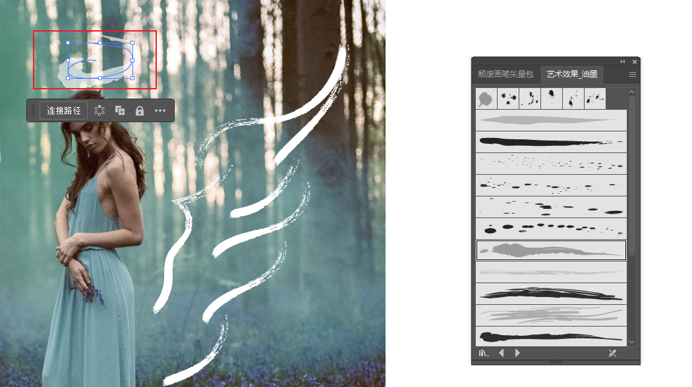

​	再画一个半圆形，达到双重效果

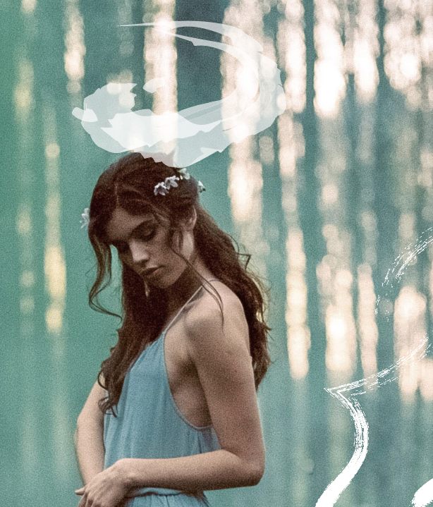

#### 	5、油墨喷溅

​		现在我们画一顶王冠

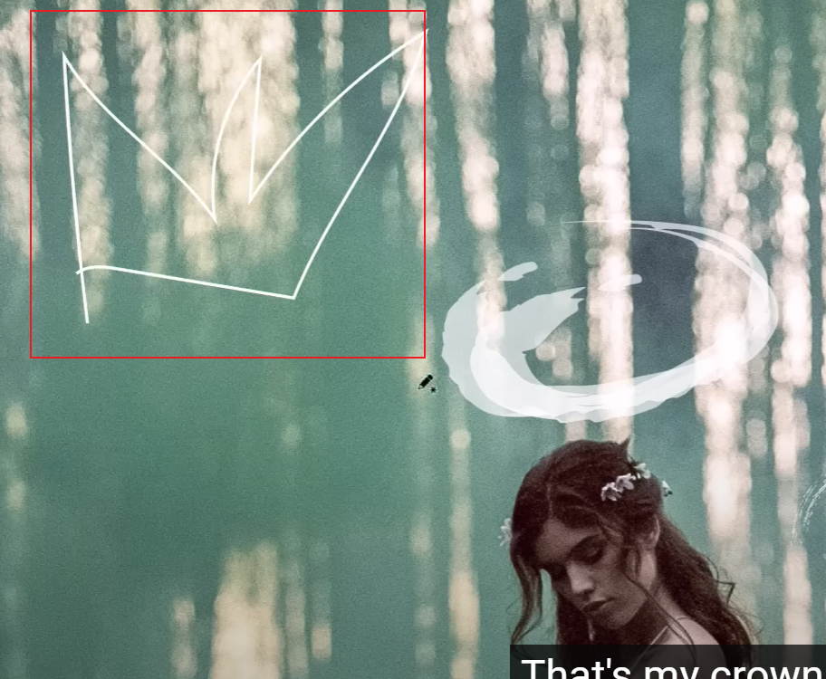

​		可以使用油墨喷溅达到这样的效果

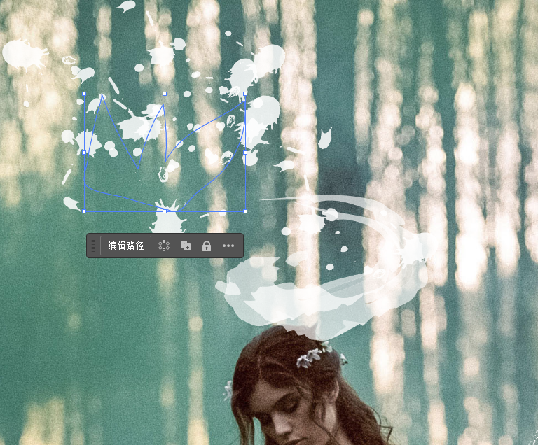

​		我们可以单独拉取这个油墨喷溅，拖动到需要的位置达到独立的效果

​		像这样自带编组的，我们也可以在 对象----取消编组，然后进行元素的独立移动，达到自己想要的效果

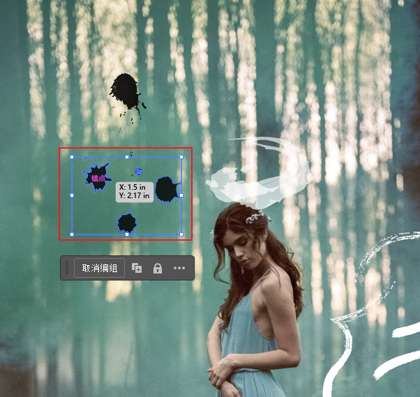

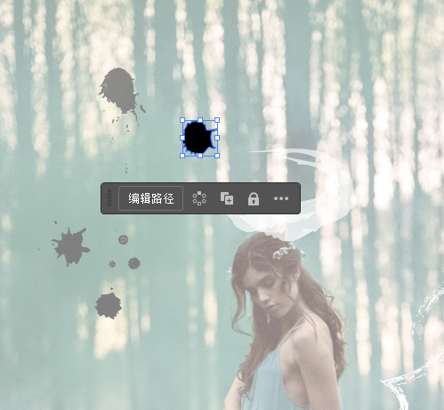

