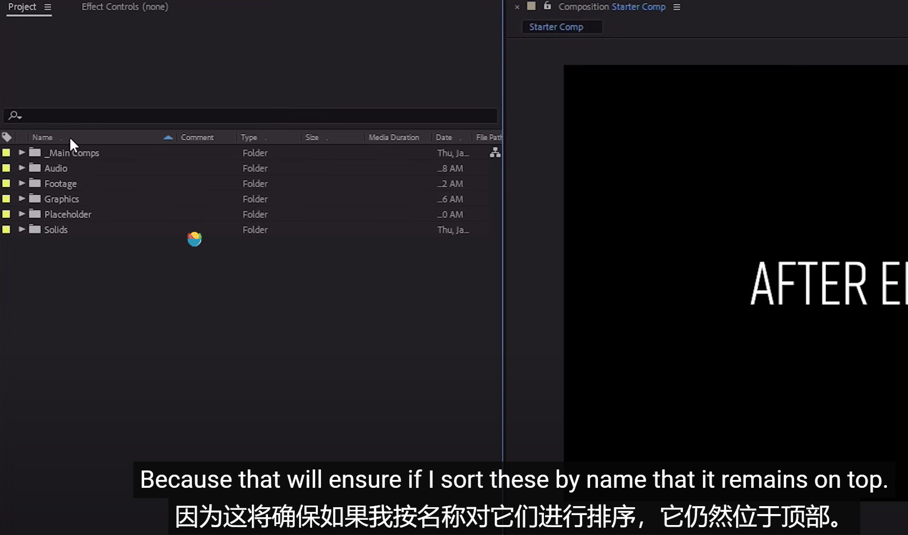

# 1、After-Effects基础知识

​		https://www.youtube.com/watch?v=PWvPbGWVRrU

​	Dave Bode的课程

​	在本课程中，我们将学习After Effects界面，工具，工作流程，关键帧，合成，预合成，形状，蒙版，效果等。

​	这将使我们能够修改和自定义 After Effects模版，并从头开始创建美观的元素。

​	在课程要结束时要完成的是，将从头开始创建一个自定义模板。

## 1、什么是After Effects？

​	After Effects界面，首先打开Lesson_Start.aep练习文件

​	然后进入点击 starter Comp文件

​		乍一看你会看到很多东西，很多菜单，让人不知所措，所有这些按钮和开关都是做什么用的？

​		这么多按钮会让人很分心，我们正在学习不必知道每个按钮和开关的作用。

​		所以我们现在需要自定义一下菜单，因为一些没有必要在首页展示的菜单我们可以移动一些面板panels，使我们更专注，

​		这些窗口是什么？你将不得不移动其中一些，可能需要扔掉其中一些，然后在后期使用的时候再把他们展示回来。这只是为了适合我们的工作风格和特定屏幕尺寸。

​		因此，我们在屏幕上看到的是一组面板panels。其中一些是单独的面板。

​	例如这个 合成面板 -- composition panel 在中心展示，其中一些被排列在一个组中，右侧的属性一些面板，所有这些面板的整体排列称为 工作区，并且它是可以定制化或者是自定义的。

​	当我们在俩个面板之间移动鼠标时，可以看到一个双箭头，这允许我们调整面板的大小，在垂直的面板直接也是可以移动的。

​	如果将鼠标悬停在多个面板之间的地方，我们会有 一个十字箭头

​	这样的话可以水平和垂直的移动面板。

#### 1、工作区恢复

​		如果我们调整的工作区想恢复到初始状态，使用 windows窗口 -- workspace工作区--然后勾选默认Default

 

​	然后点击 重置默认值以 保存布局---Rest Default to Saved Layout，这将重新排列面板

​	现在我们注意到还有一些其他的一些可用工作区，调整不同的工作区使用，将会以不同的视图展示面板

​	

​		例如我们使用 Minimal 最小工作区，这个只提供了 合成面板和时间轴面板

#### 	2、去掉不需要的面板

​		我们可以只专注自己需要的面板，例如我们要删除这个 Libraries 库 选项卡，在详情中可以 关闭面板 close Panel

​	如果我想将其恢复 -- window -- Libraries

​		我们发现右侧的属性面板中，每次点击都只是打开一个面板，如果打开另一个面板上一个面板就会闭合，这是因为在面板的详情中有设置 面板的堆栈方式，如果去掉勾选那么就会多个展示

​		如果都可以展示的话会很乱，所以这种堆叠的面板方式还是比较好的，展开一个收缩一个

#### 	3、移动面板

​		面板是可以随意拖动位置的，我们可以拖动到自己喜欢的位置使用

​	

#### 4、浮动面板

​		我们可以将某个面板 浮动于窗口 -- 有时候我们这样更容易使用某个专业调整

​		在面板的详情中 点击 取消锁定面板 -- Undock Panel

#### 	5、保存工作区

​		假如我们调整了自己的工作区 调整了面板的展示，想要保存这个工作区

​		使用 window -- workspace -- Save as new workspace

​		这样工作区就多了 一个选项，我们可以在需要的时候切换各个工作区

#### 	6、bar编辑工作区

​	有些顶部的bar可能被缩略了，我们可以编辑进行顺序等编辑操作

可以拖动排列展示顺序

##  2、主面板Main Panels

​		主面板 三个面板

#### 	1、项目面板project

​	 		这里是导入素材的地方，创作作品的地方，也会有文件结构，这里总体的思路就是将内容放入对你有意义的文件夹中

​		

##### 		文件搜索

​	上面有放大镜，对于我们项目文件比较多的情况，可以使用搜索进行对文件的查找

##### 	文件导入

​	项目文件的导入，我们可以通过 文件 -- 导入--导入文件

​	也可以使用快捷键 ctrl + i 进行导入 ，如果是想导入到特定的文件夹下，那么在这个文件夹选中的情况下，Ctrl + i 进行导入即可。

​	双击项目面板中的空白区域 -- 这也会打开导入文件窗口

​	还可以在项目面板的空白处右键 选择Import导入

​	我们打开的文件夹，可以将文件直接拖入到项目中，这样也是直接导入了

##### 文件夹命名及排序

​		我们主要的文件尽量是带符号为首如_，这样的好处是无论如何排序主要的文件夹在项目中的首位展示

​	我们点击项目文件的列 可以按列的展示 进行排序

#### 	2、合成面板

​			合成面板就是所谓的查看器--可以是一个包含多个组合的面板，具有这个项目的多个视图的图层或素材项目，AE中有几种不同类型的查看器，其中包括合成查看器，有图层查看器，素材查看器，流程图查看器，还有效果控制面板也是一个查看器。

​		查看器可以让你查看内容，当我们构建作品时，你可以有多个层， 这种多个图层的综合效果在合成面板中展示。 

​		合成面板和其他每个面板都有特定于面板的菜单选项，右键可以查看菜单选项

​	

​	面板的详情也有这些选项

​	

​		每个面板都有特定于面板的菜单选项。

​	合成面板的最下方还有一些按钮，这些按钮在鼠标悬停与上方的时候会显示名称

​	

#### 	3、时间轴面板

​	当我们在时间轴面板操作处理项目的时候，我们可以观察到发生了什么，可以在项目中查看动画。

​	时间轴面板与序列面板（视频编辑应用）非常相似，这里是组装素材的地方，制作AE项目，都是在将素材放入时间面板中，这里是放置所有东西的地方，在这里修剪里面的内容。

​	你可以在时间轴中对图层的各个方面进行动画处理及创建，我们在时间轴面板中输入的任何内容 都会显示在中间的合成查看器中。

​		时间轴面板内有大量按钮和开关，最下层有一些折叠按钮

​		我们一般不使用下面的选项的时候，把他们都折叠起来，给右侧注意使用的面板留出更多空间

## 3、个人设置Settings

##### 	1、编辑菜单

​			编辑---首选项--常规

​	这里主要需要了解的是 Grids 参考线

​	根据不同的项目我们可能经常会调整 网格和参考线

​		例如网格线间隔 如果我们设置为200，如果我们制作一个1280*720像素的项目，那么1280无法整除200，这样就会导致网格不能完全居中，所以说我们需要调整为可以整除，这样我们的水平方向最终一条网格位于我的构图中心。

​		还有就是注意参考线的颜色，如果我们构图的背景颜色和参考线的颜色一致，那么会导致无法看到参考线。

##### 	2、媒体和磁盘缓存

​			确保开启了磁盘缓存--这样速度更快

​			磁盘缓存--如果C盘默认有压力可以切入其它盘符，这个缓存不切换的时候就不要清理，因为它可以帮我们缓存每一帧的图像，这样会消耗很大的内存渲染，如果已经缓存可以大大提高速度。

##### 	3、自动保存

​		偶尔AE可能面临闪退及其它风险，导致我们做的内容可能没有保存，所以这个自动保存需要我们留意设置。

​	这个一般设置20分钟即可，根据个人的需要进行配置。

## 4、After Effects工具 

​			After Effects Tools

​		这里是我们的工具版块，选择工具，手型工具，缩放工具，旋转工具，统一相机工具，

​			平移工具，矩形工具，T钢笔工具等

​	

​	

​	这些工具很多，但有些是我们很少使用的，我们常用的一些工具下面了解一下

​		选择工具 -- 选择内容，移动内容，调整图层比例，也相当于默认工具，我们在任何其他工具操作完成后都会切换回选择工具。

​		手型工具 -- 用于 按键拖放，水平移动

​		缩放工具 -- 可以使用滚轮直接操作，也可以在时间轴中使用 按Alt + 滚轮

​		旋转工具 -- 快捷键W ，这个非常有用，按shift可以固定角度旋转

​		相机工具 -- 后续再说

​		平移工具 -- 这个也称为锚点工具，我们可以通过移动锚点来进行操作，例如设置锚点旋转

## 5、更多AE工具

​			More AE Tools

#### 	1、形状工具

​			

​	可以使用此工具在图层上创建蒙版等操作

#### 	2、钢笔工具

​			快捷键是G， 可以画图及使用手柄来操作形状

​			与ai和ps的工作原理基本一致

#### 3、文本工具

​	选择一个图层 使用Ctrl + T是文字操作的快捷键

​	可以选择修改和写入文本内容 -- 使用与ai和ps基本一致

#### 4、puppet pen tool 木偶笔工具

​		这个工具也非常酷，详细使用我们具体再说或参考google

