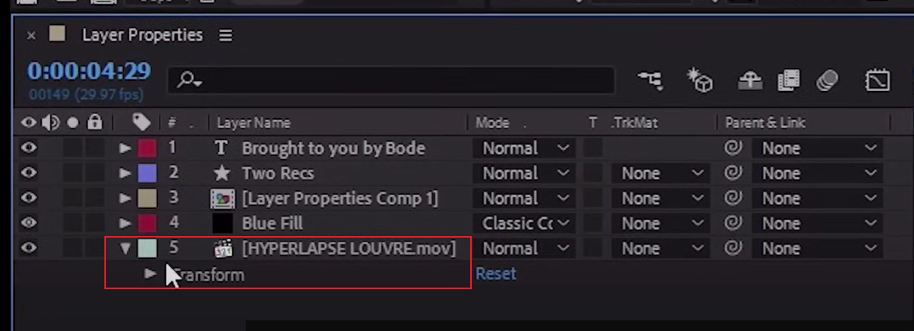

# 2、构图和图层

​	Compositions and Layers https://www.youtube.com/watch?v=PWvPbGWVRrU

​		构图--合成面板是电影或视频的框架，每个作品都有自己的时间表，典型的组合包括多个代表组件的层，例如，视频和音频片段，动画文本和图形效果，静态图像，你可以在空间和时间上安排构图中的图层，并使用透明度特征进行合成以确定哪些部分。

​		底层层的数量通过堆叠在其顶部的层显示。

​		例如：添加图层进行操作

## 1、 After Effects 合成

​	新建合成---按钮在左侧的中间

​	弹出一个对话框--设置合成名字，设置分辨率等很多不同的预设内容，如设置每秒24帧

​		持续时间就是这个视频的时间30代表的是30秒

​		这就创建好了一个空的合成文件

​	例如设置一些字及调整大小和字体颜色

​	添加一些图形，将ai文件拖入到时间线视图中

​			可以将各种组合放入

​	如果需要一个白色背景--那么就需要一个白色的图层，否则默认是黑色的背景，即使在编辑的时候显示是白色的背景，实际上是一个无色的空背景，在播放的时候默认无色的空背景为黑色

​	然后将这个图层放入最底层，目前是顶层，达到背景的效果

​	这就是它的工作原理。

​	合成设置 -- 如果在编辑的过程中需要修改使用合成设置按钮

​		可以修改分辨率等，和创建时相同

​	每个图层都有自己的缩略属性展示在项目的下方，点击具体的图层会显示，如大小，时长，帧数

​	可以打开 网格及参考线 -- 用于定位参考

## 2、预处理

​	我们将要处理某些效果，并且需要预先合成图层

​	举例来说，假如我们有一个文本图层，进入菜单 -- 图层 -- 预合成Pre compose

​	点击预合成后

​	我们合成完可以看到一个小图标，这就是一个合成物---合成文件

​	然后我们可以使用这个合成文件/图层，copy进行复用

​		如果我想修改文本内容

​		双击合成图层进行修改

​	这样所有使用这个合成图层的内容就都被修改了

​		如果边界框有问题，可以进行裁剪

## 3、图层属性

​		我们打开图层layer properties.aep文件

​		在这个构图中，我们有五个不同的图层

​	接下来，我们对不同的图层，我们展示有些图层具有相关的独特图层属性

​	我们可以通过向下旋转箭头来查看任何图层上的属性

​	锚点如果拖动的话，位置也会发生变化，锚点的初始地点坐标是 左上角 0,0

