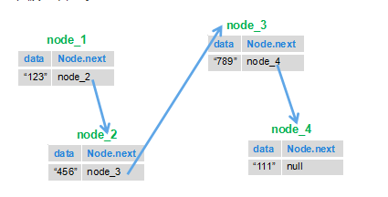

# 4链表相关编程题

### 一 链表中倒数第k个节点
#### **题目描述：**
输入一个链表，输出该链表中倒数第k个结点
#### **问题分析：**
**一句话概括：**
两个指针一个指针p1先开始跑，指针p1跑到k-1个节点后，另一个节点p2开始跑，当p1跑到最后时，p2所指的指针就是倒数第k个节点。

**思想的简单理解：**
前提假设：链表的结点个数(长度)为n。
规律一：要找到倒数第k个结点，需要向前走多少步呢？比如倒数第一个结点，需要走n步，那倒数第二个结点呢？很明显是向前走了n-1步，所以可以找到规律是找到倒数第k个结点，需要向前走n-k+1步。
**算法开始：**
1. 设两个都指向head的指针p1和p2，当p1走了k-1步的时候，停下来。p2之前一直不动。
2. p1的下一步是走第k步，这个时候，p2开始一起动了。至于为什么p2这个时候动呢？看下面的分析。
3. 当p1走到链表的尾部时，即p1走了n步。由于我们知道p2是在p1走了k-1步才开始动的，也就是说p1和p2永远差k-1步。所以当p1走了n步时，p2走的应该是在n-(k-1)步。即p2走了n-k+1步，此时巧妙的是p2正好指向的是规律一的倒数第k个结点处。
这样是不是很好理解了呢？
#### **考察内容：**
链表+代码的鲁棒性
#### **示例代码：**

```
/*
//链表类
public class ListNode {
    int val;
    ListNode next = null;

    ListNode(int val) {
        this.val = val;
    }
}*/

//时间复杂度O(n),一次遍历即可
public class Solution {
    public ListNode FindKthToTail(ListNode head,int k) {
        ListNode pre=null,p=null;
        //两个指针都指向头结点
        p=head;
        pre=head;
        //记录k值
        int a=k;
        //记录节点的个数
        int count=0;
        //p指针先跑，并且记录节点数，当p指针跑了k-1个节点后，pre指针开始跑，
        //当p指针跑到最后时，pre所指指针就是倒数第k个节点
        while(p!=null){
            p=p.next;
            count++;
            if(k<1){
                pre=pre.next;
            }
            k--;
        }
        //如果节点个数小于所求的倒数第k个节点，则返回空
        if(count<a) return null;
        return pre;
            
    }
}
```

### 二 反转链表
#### **题目描述：**
输入一个链表，反转链表后，输出链表的所有元素。
#### **问题分析：**
链表的很常规的一道题，这一道题思路不算难，但自己实现起来真的可能会感觉无从下手，我是参考了别人的代码。
思路就是我们根据链表的特点，前一个节点指向下一个节点的特点，把后面的节点移到前面来。
就比如下图：我们把1节点和2节点互换位置，然后再将3节点指向2节点，4节点指向3节点，这样以来下面的链表就被反转了。

#### **考察内容：**
链表+代码的鲁棒性
#### **示例代码：**
```
/*
public class ListNode {
    int val;
    ListNode next = null;

    ListNode(int val) {
        this.val = val;
    }
}*/
public class Solution {
public ListNode ReverseList(ListNode head) {
   ListNode next = null;
   ListNode pre = null;
    while (head != null) {
          //保存要反转到头来的那个节点
           next = head.next;
           //要反转的那个节点指向已经反转的上一个节点
           head.next = pre;
           //上一个已经反转到头部的节点
           pre = head;
           //一直向链表尾走
           head = next;
    }
    return pre;
}

}
```

### 三  合并两个排序的链表
#### **题目描述：**
输入两个单调递增的链表，输出两个链表合成后的链表，当然我们需要合成后的链表满足单调不减规则。
#### **问题分析：**
我们可以这样分析:
1. 假设我们有两个链表 A,B；
2. A的头节点A1的值与B的头结点B1的值比较，假设A1小，则A1为头节点；
3. A2再和B1比较，假设B1小,则，A1指向B1；
4. A2再和B2比较。。。。。。。
就这样循环往复就行了，应该还算好理解。
#### **考察内容：**
链表+代码的鲁棒性
#### **示例代码：**

**非递归版本：**
```
/*
public class ListNode {
    int val;
    ListNode next = null;

    ListNode(int val) {
        this.val = val;
    }
}*/
public class Solution {
    public ListNode Merge(ListNode list1,ListNode list2) {
       //list1为空，直接返回list2
       if(list1 == null){
            return list2;
        }
        //list2为空，直接返回list1
        if(list2 == null){
            return list1;
        }
        ListNode mergeHead = null;
        ListNode current = null;   
        //当list1和list2不为空时
        while(list1!=null && list2!=null){
            //取较小值作头结点 
            if(list1.val <= list2.val){
                if(mergeHead == null){
                   mergeHead = current = list1;
                }else{
                   current.next = list1;
                    //current节点保存list1节点的值因为下一次还要用
                   current = list1;
                }
                //list1指向下一个节点
                list1 = list1.next;
            }else{
                if(mergeHead == null){
                   mergeHead = current = list2;
                }else{
                   current.next = list2;
                     //current节点保存list2节点的值因为下一次还要用
                   current = list2;
                }
                //list2指向下一个节点
                list2 = list2.next;
            }
        }
        if(list1 == null){
            current.next = list2;
        }else{
            current.next = list1;
        }
        return mergeHead;
    }
}
```
**递归版本：**
```
public ListNode Merge(ListNode list1,ListNode list2) {
       if(list1 == null){
           return list2;
       }
       if(list2 == null){
           return list1;
       }
       if(list1.val <= list2.val){
           list1.next = Merge(list1.next, list2);
           return list1;
       }else{
           list2.next = Merge(list1, list2.next);
           return list2;
       }       
   }
```