# 1.数据库文档一键生成

​		

​		我们有一个数据库---数据库里面有很多数据表，然后我们想把这个数据库里面的几十张表，生成一个表结构的说明文档，那么这个时候如果我们手动去写这个说明文档的话，那就非常的慢效率非常的低

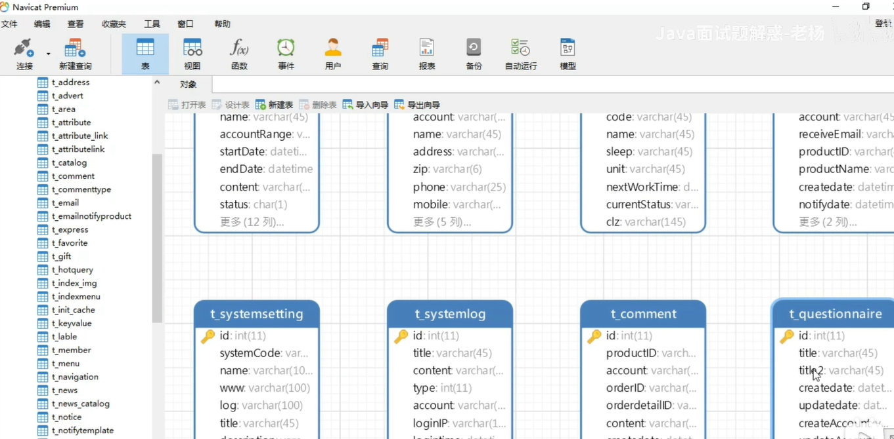

​	现在我们可以使用screw（si ke ru）这个工具可以帮助我们生成数据库的说明文档

​			screw翻译成中文的意思就是**螺丝钉**的意思

​	首先我们需要找一个项目，在项目的pom文件中，我们需要配置一个plugin插件

​		他依赖一个HikariCP的数据库连接池，还有依赖一个jdbc的驱动

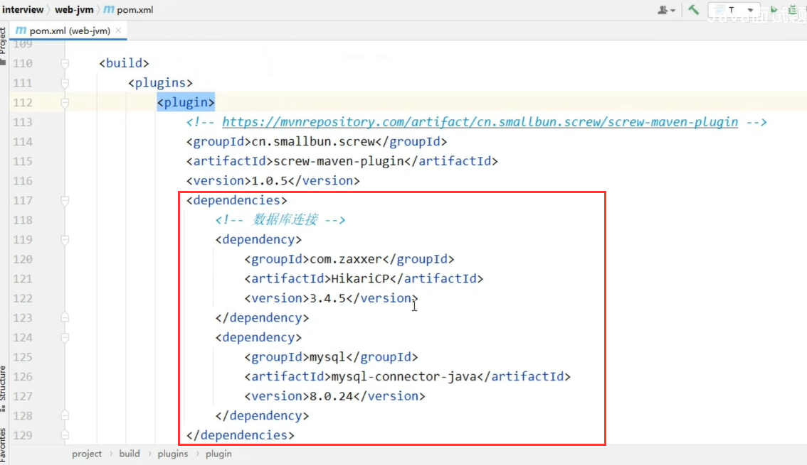

​	然后下面配置好一些数据库连接的信息，包括密码

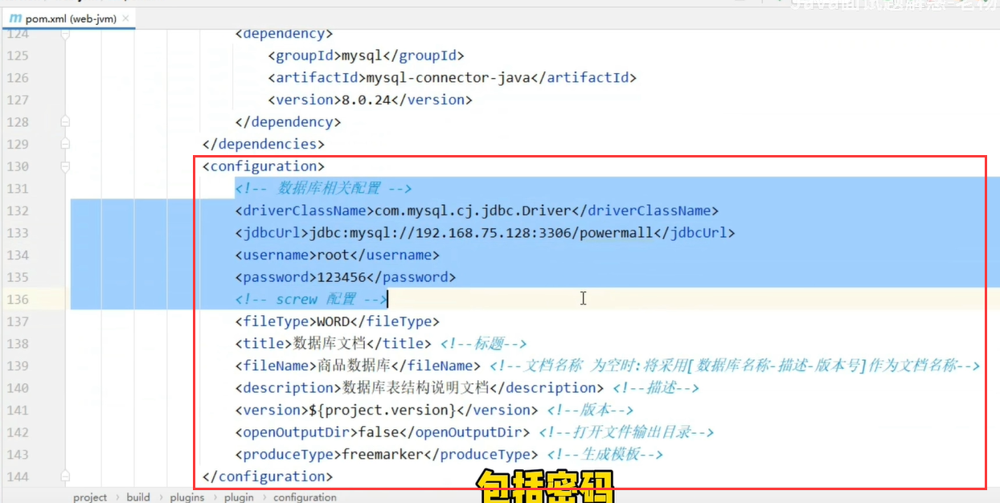

​	最后是配置执行目标

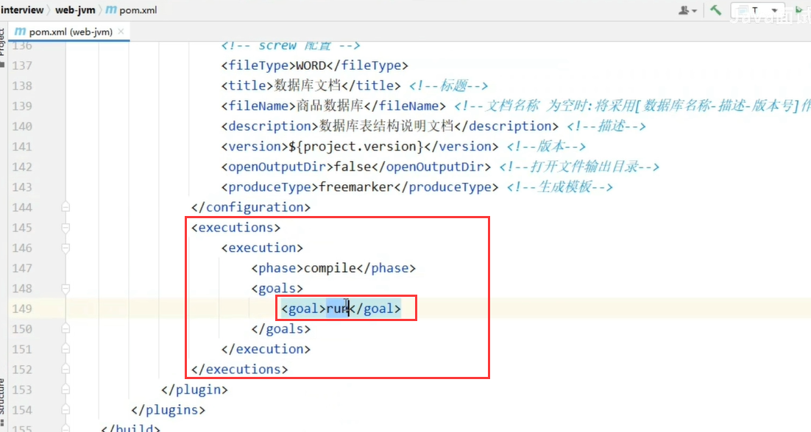

​	这些都配置好之后，在我们的maven中就会有一个screw，然后双击screw：run，这个时候就会帮我们自动生成文档

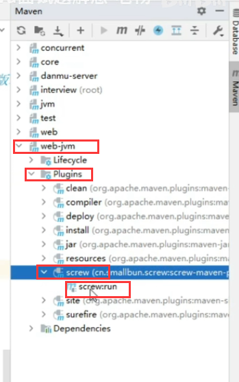

生成完成后，会在我们的项目路径下生成一个doc的文件夹，在这个里面就是我们生成的数据库文档了

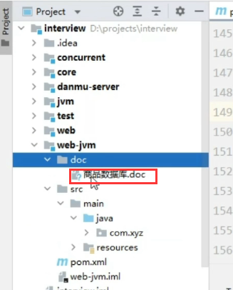

我们打开看一下---这个文档结构还是比较好的，这就不需要我们手动来敲了

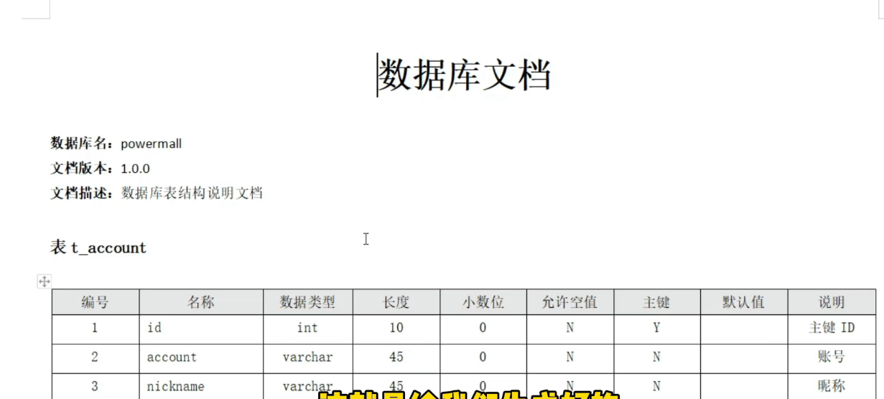

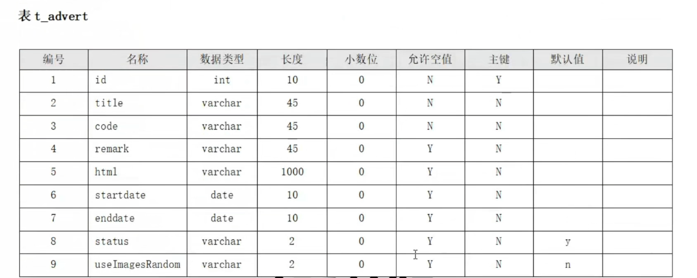

​	这是生成word的文档，他也可以生成html文档，我们如果需要生成html的文档的话，我们就需要在maven的plugin插件中把配置中的WORD改为HTML

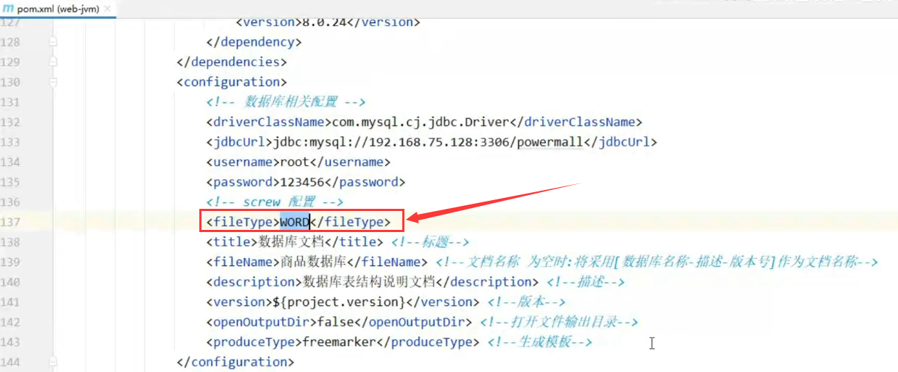

改为HTML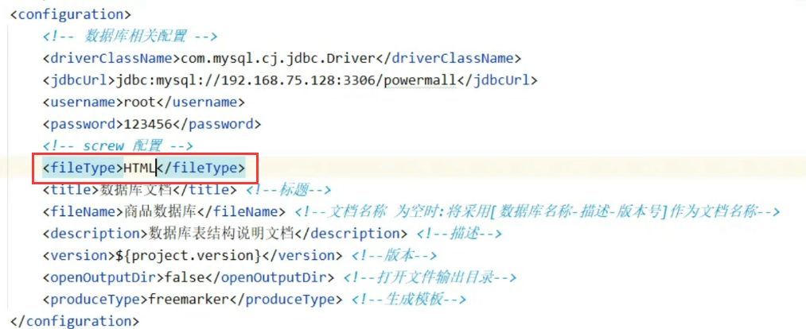

​	然后我们在执行一次screw:run之后，就帮我们生成了html的文档了

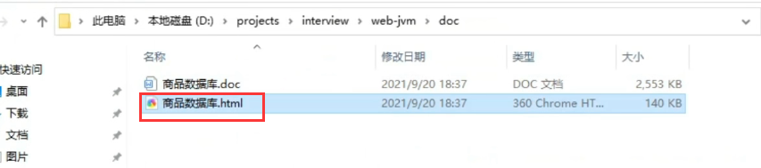

​	这就是生成的html数据库文档了

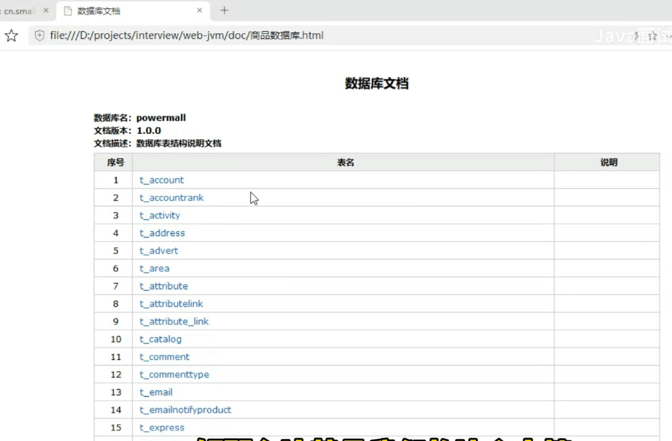

这就是我们这一款高效的数据库文档生成神器SCREW了--螺丝钉

https://www.bilibili.com/video/BV19r4y1y7y6/?spm_id_from=autoNext%E3%80%8B&vd_source=243ad3a9b323313aa1441e5dd414a4ef

