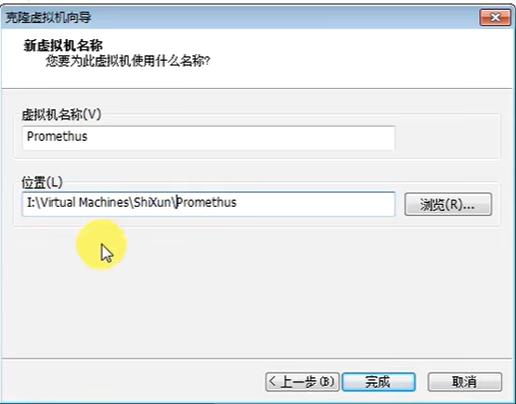

# promethus介绍及前期准备工作

## 1、学习目标


#### promethus是什么？

​		Promethus是由go语言（golang）开发的一套，监控+报警+时间序列数据库的组合，适合监控docker容器。

​		因为kubernetes的流行带动了promethus的发展。

​		他主要是负责收集服务器端数据

​		

​	普罗米修斯---背景，其实是美国的一个城市名称，西方神话中给人类带来火种的神，所以官网的logo是一个火种的样子。


​	官网：https://prometheus.io/


​	


​		1、先搞定promethus的服务器安装


​		那么怎么样才可以看到这个服务器运行的好不好呢，这个时候就需要grafana--他是图形化的可视化的界面的工具。他可以把promethus的服务器收集的数据，以图形的形式进行展现


​	2、那么就需要在grafana中添加promethus的数据源

​				监控我们的cpu、mysql，如果有时间我们还可以扩展其他监控内容


​	3、grafana+onealert可以实现报警


## 2、任务要求-背景

​	

​	

​			K8s内部使用的监控系统就是promethus


## 3、任务分析


项目选型：


## 4、时间序列数据

### 	1、什么是时间序列

​		这种其实叫做时序性数据


### 2、基于时间序列数据特点


​		他的这个优点是其他系统不敢想象的--人家这个promethus算法做的非常好，对于这种海量数据抽取监控非常有效，储存成本非常低。


### 3、promethus的基本特征

- 多维度数据模型 -- 可以监控各种类型，多方面，多角度记录服务器信息，像CPU、内存、存储、网络等等，只要我们想到的他都可以进行监控。


- 查询语言比较灵活 -- 可以通过简单的数学公式来实现对数据的监控。


- 不依赖分布式存储，单个服务器节点是自主的 -- 单个服务器就可以实现监控了


- 以HTTP方式，通过pull模型拉取时间序列数据
- 也可以通过中间网关支持push模型
- 通过服务发现或者静态配置，来发现目标服务对象 -- 假设这个服务器我们可以动态的去发现，也可以静态配置比如 ip地址 用户名 密码 就可以实现监控的目的
- 支持多种多样的图标和界面展示


### 4、promethus原理架构图

​			

​				这个其实就是官方的doc下面的一个架构图

​			这个架构图的意思就是 

- 我们可以安装一个Promethus server 的服务
- 通过这个服务器延伸--可以结合Granfana进行图形化的展示
- 可以pull 拉取和推送监控目标系统 
- 发现目标系统后--通过他的时间--序列进行数据的收集和整合
- 收集之后--一般有2个走向 1是结合granfana图像化展示 2走向Alertmanager告警管理--实现告警


​			看着挺复杂--其实实现原理相对简单


## 5、环境准备


​	需要实现这个功能我们需要最少三台服务器，那么这三台服务器都是干什么呢？


​	主服务器 -- promethus服务器 -- 收集数据 最终都集中在这台服务器上

​	被监控服务器 -- 我们想监控的内容，来自于这台服务器

​	granfana服务器 -- 就是把promethus中的数据以图像的形式展现


## 6、克隆机器与环境规划

​	

从我们的虚拟机上 先进行克隆


​	创建完整的克隆


​	起名和设置存放路径




​	再继续克隆后续的2台服务器


​	这个做监控管理


​	

第三台服务器克隆


​		现在我们这三台服务器就准备好了。


​	先不要着急其他的，我们需要对整个系统先做一个规划

​		因为我们的机器Mycat的 ip尾号是16 ，所以现在这三台服务器的ip先设置为 17   18   19


## 7、初始化服务器

​		先把这些服务器都启动起来


​	现在这些服务器肯定都有问题，因为他们的uuid都是一样的，他们的主机名称也都一样，那么我们就需要做一些基本的操作

​		

​		**IP设置、hostname设置 -- 主机名称、绑定/etc/host文件、时间同步（为什么需要时间同步-特别重要，因为我们的promethus系统就是基于时间序列的，如果一旦这台服务器的时间不符，可能造成通讯故障，数据异常）**


### 	1、修改网卡 -- IP地址

```
vim /etc/sysconf/network-scripts/ifcfg-ens33
```


```
# 修改UUID编号的后三位

#修改dhcp -- key是 BOOTPROTO
dhcp=>none/static

#修改IP
IPADDR 自己需要的IP


```


​	修改之后restart一下--重启网络

```
systemctl restart network
```


​	同样的方式我们设置第二台和第三台服务器


### 2、工具连接

​	接下来我们就可以使用Mobaxterm 或者是 XShell工具进行连接

​	点击session创建会话


​	SSH		10.1.1.17 promethus服务器

​					书签设置 -- 自己起名


​		后续服务器也是这样操作


### 3、设置hostname 主机名称

```
# 第一台服务器
# hostnamectl set-hostname prometheus.itcast.cn

# 第二台服务器
# hostnamectl set-hostname agent.itcast.cn


第三台服务器
# hostnamectl set-hostname granfana.itcast.cn

```


### 4、设置host文件

```pascal
	/etc/hosts

# 先把ip记录一下  然后主机名称  域名  --最终要实现域名通信
10.1.1.17   prometheus	prometheus.itcast.cn
10.1.1.18   agent		agent.itcast.cn
10.1.1.19	grafana		grafana.itcast.cn

```


​	我们现在点击多窗口执行命令


编辑hosts文件


​	设置hosts，都粘贴过去就可以了


### 5、时间同步

​			这个非常重要--因为promethus就是基于时间序列的

```

# 先挂载文件
mount /dev/sr0 /mnt

# 安装npt时间
yum install nptdate -y

# 通过这个连接池 我们可以进行网络的连接
nptdate cn.npt.org.cn


```


​	执行一下date时间一致没有问题


​	这样的话 -- 我们前期的准备工作就完成了


​	


​		

​	


