# 2、promethus的安装与使用


## 安装promethus系统


### 1、下载软件

​		官网https://prometheus.io/download/ 进行对应版本的下载

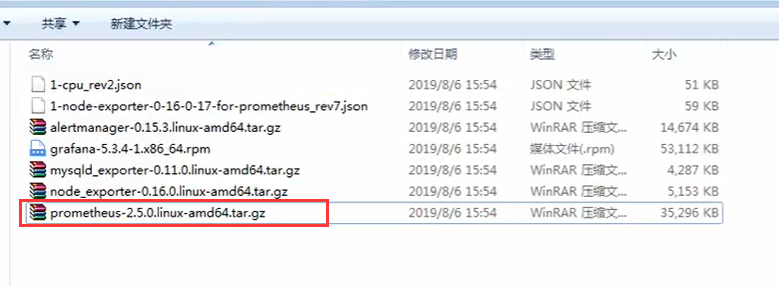


### 2、安装promethus软件

#### 		第一步：上传安装包到linux

​				先上传到linux服务器

```


```

​	点击上传文件按钮 -- 选择文件进行上传

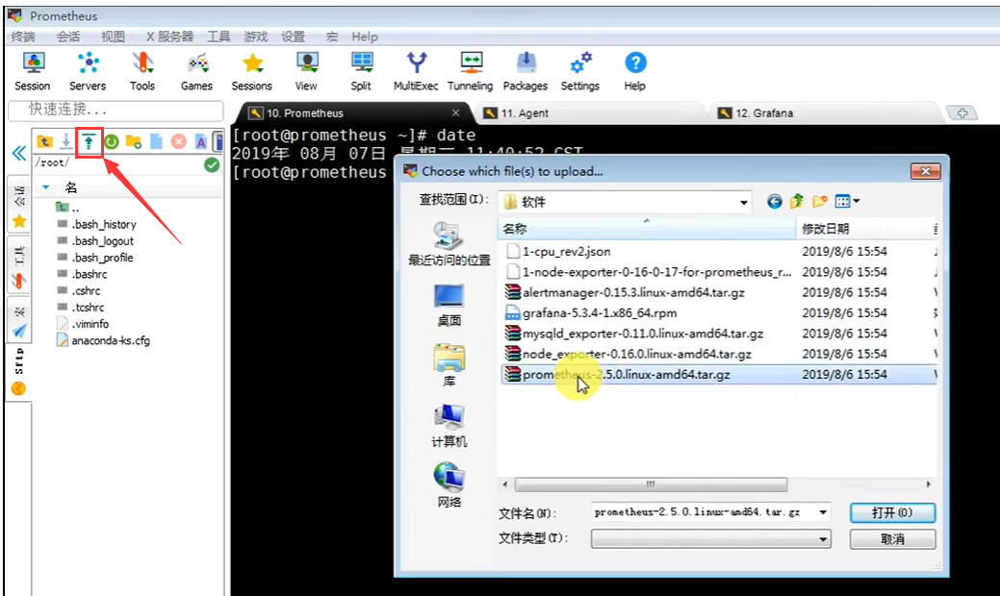


#### 	第二步： 解压并安装软件

​				这个是绿色软件 -- 其实它并不需要去安装，需要把它解压到指定路径下就可以了

```
# 解压
tar -xf prometheus-2.5.0.linux-amd64.tar.gz  -C /usr/local/

# 移动 -- 因为这个文件名称比较长，我们换一个简单的文件夹下
mv /usr/local/prometheus-2.5.0.linux-amd64  /usr/local/prometheus

```


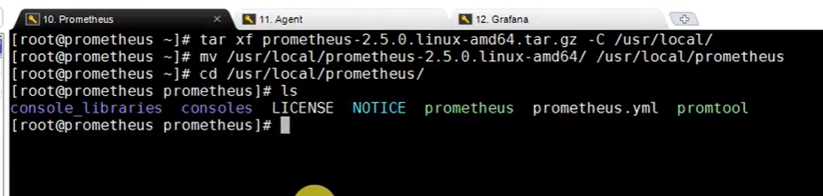	

​	

#### 	第三步：启动promethus软件

如何启动这个软件呢？在解压后的文件夹中 有个promethus.yml文件--这个是它的配置文件

​		这个绿色的promethus文件其实就是 启动文件


```
# 启动命令

# 在此路径下 /usr/local/prometheus/prometheus 
cd /usr/local/prometheus/prometheus 

# 启动
./prometheus -- config.file="/usr/local/prometheus/prometheus.yml" &

# &这个连接符-代表后台运行，不占用终端窗口
```

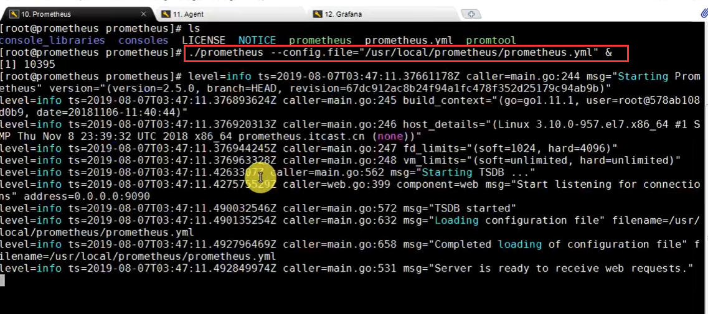

​			我们看到Server is ready to receive web requests -- 服务已就绪 可以接受来自web的请求了


#### 	第四步：测试端口占用情况

​	但是这样的看启动完成 不是特别可靠

​	测试端口占用情况（判断是否真正的启动了）

```
# 确认端口 -- 这个命令可以判断 端口的使用情况
# -i 代表指定端口
lsof -i：9090

```


​	我们一般新安装的系统 -- 没有这个命令

​			需要我们手动安装一下

​			如果不想安装也可以使用之前的命令 ss -naltp | grep 9090

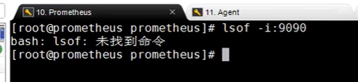

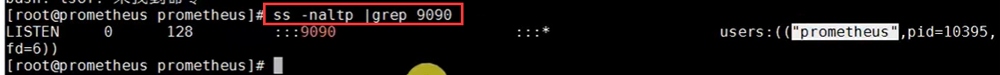

​			此端口正在被promethus使用


### 	3、promethus界面

​	他是一个web软件

​		我们可以通过 浏览器访问  服务器IP ：9090就可以访问到promethus的主界面

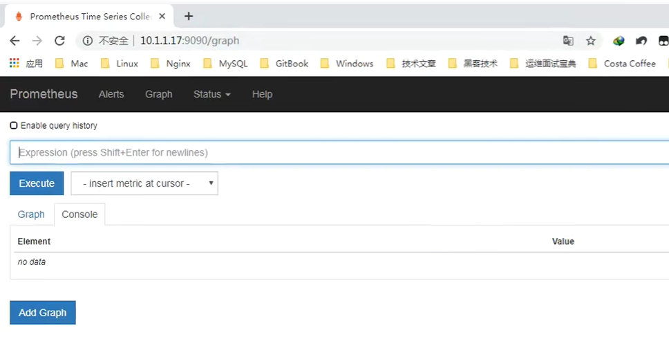

​	界面中Alert是告警相关的内容

​	Graph 是图形化相关内容

​	status -- 以下状态查看，可以定义规则配置

​	help -- 帮助信息


#### 那么我们打开这个promethus看什么呢？监控谁呢

​		那么就需要我们设置一下监控目标

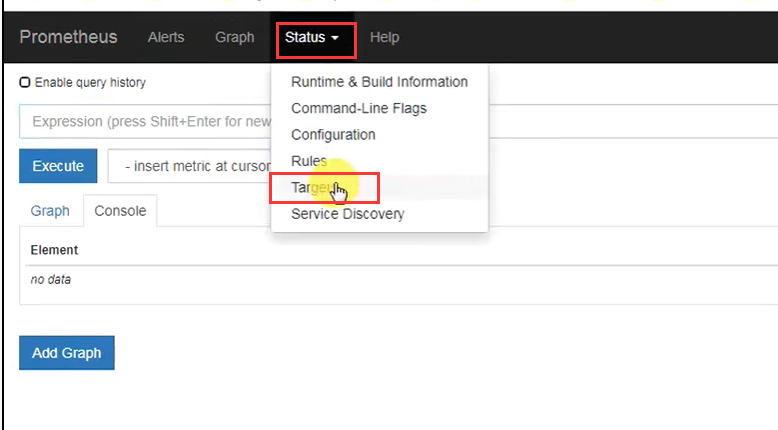

 

​	默认情况 -它只监控它自己

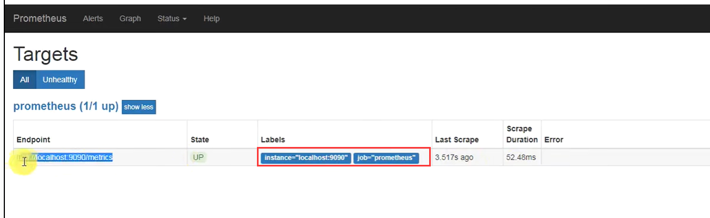


​		一般都是通过配置数据的接口来获取数据 例如 http://localhost：9090/metrics


​	如果我们访问这个地址就可以看到---promethus返回的一些他自己的监控数据

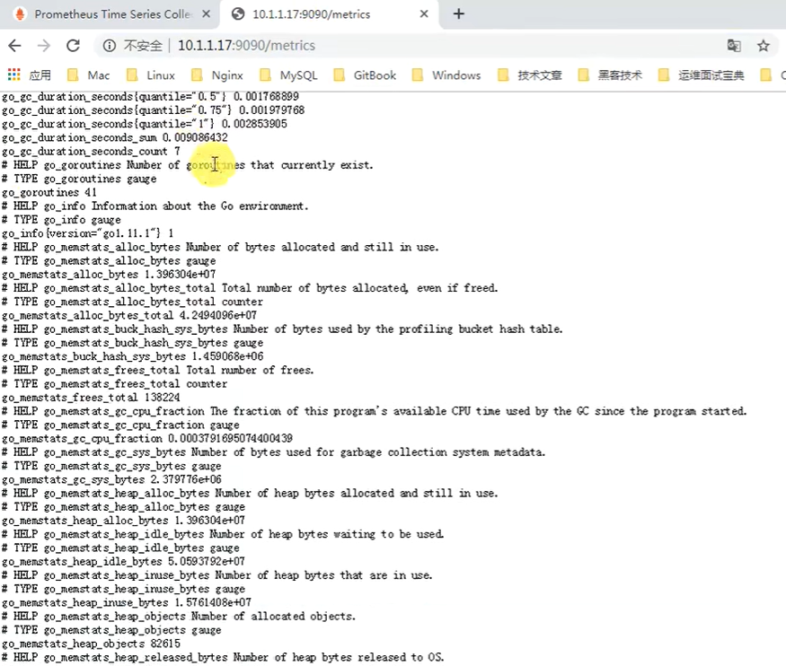

​	收集到这些就交给web系统，由这个web系统开始进行收集

​	

​	UP代表启动运行

​	DOWN 就代表服务器关闭了

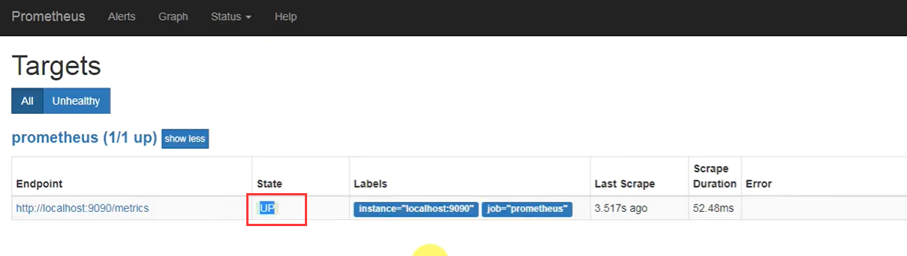


### 4、promethus默认监控图像

​	

​	比如我们想监控一下cpu的运行情况

​			选择cpu_seconds_total

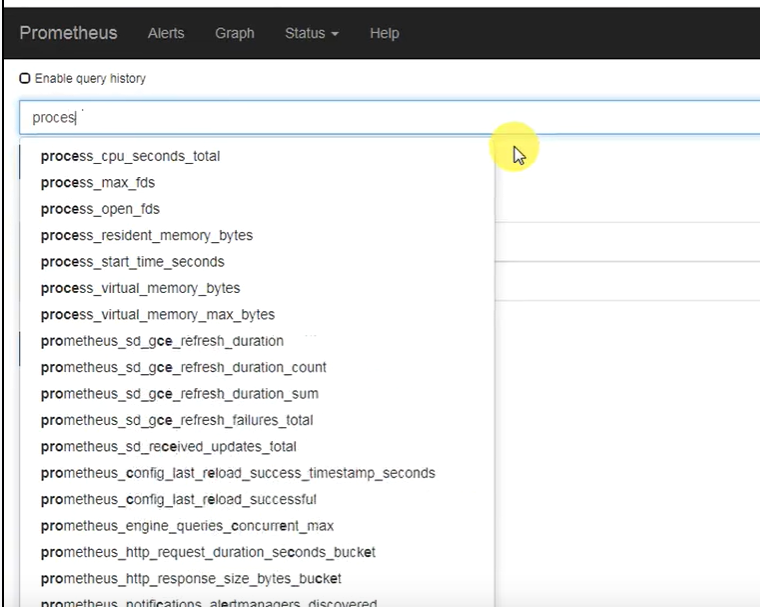


​	然后点击 执行Excute


​	然后我们看一下graph--图表 会显示出cpu的监控信息

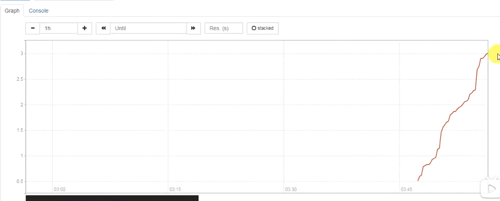


​	他这个显示的图像和我们之前看的图像有些不一样，原因是--他自带的这个是比较简单的图表


​	

 


