# 3、安装node-exporter组件监控Linux主机

​	

​		我们如何使用这个promethus系统--来收集 其他主机的相关信息


​	1、需要在所有被监控对象主机上，安装node_exporter组件


​	组件下载地址：https:promethus.io/download

​	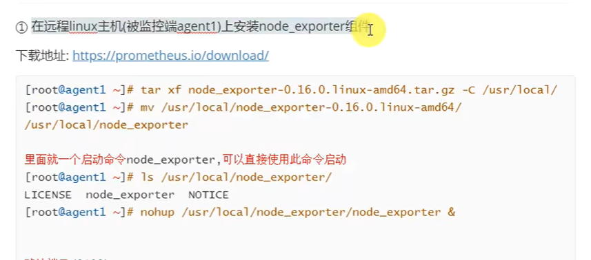


​		被监控放安装好这个 组件 后，promethus就可以监控到他的数据

​	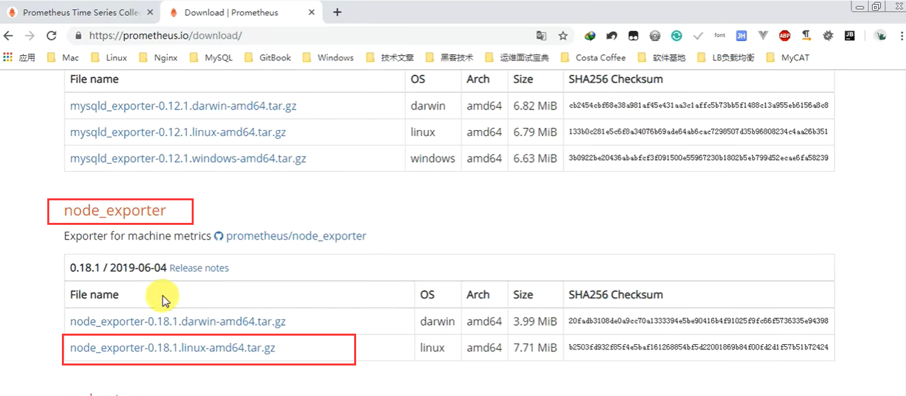

​				


如果是需要监控MySQL的数据 -- 那么就可以安装一个promethus支持的mysql组件

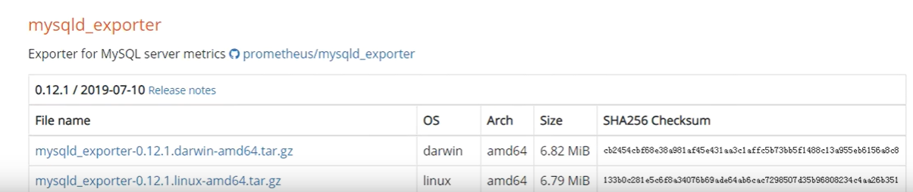


## 1、安装组件node-exporter


### 	第一步：上传软件包到服务器中 -- 注意要上传到被监控对象的机器中

​					这个node-exporter组件主要是收集系统信息的-他并不能收集mysql的信息

​					如果我们需要不同的监控信息，那么就需要安装不同的 组件 -- 这些组件都可以在promethus官网下载

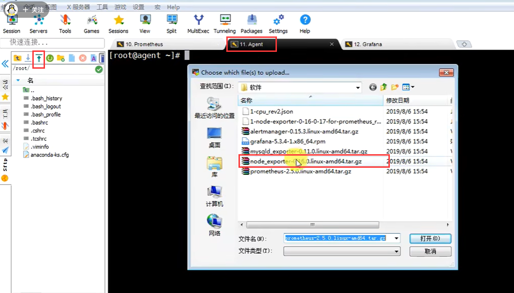


### 	第二步：解压 安装

​		解压后，

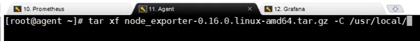


移动修改个名称--默认解压出来的名称太长

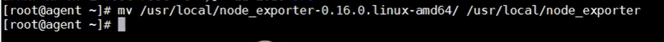


### 	第三步：启动node_exporter手机主机信息

​	进入到node_exporter路径下，有个绿色可执行文件 node_exporter

```
nohub ./node_exporter &
```

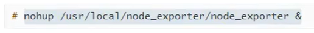

​		nohub 是增加的一个选项 -- 代表 会永久的运行下去

​		& 代表后台运行

​		默认启动后端口是9100


### 	第四步：查看9100端口使用情况

​			启动后--如果有异常会输出到nohup.out

​				查看端口9100

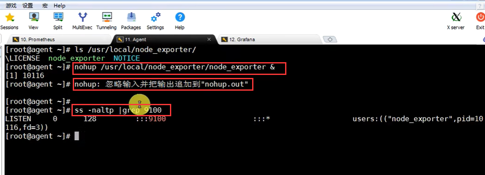

​	

​	运行成功之后---我们就可以捕获这个数据了

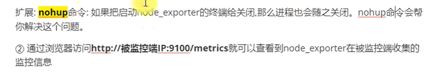


### 	第五步：使用http+9100端口查看Linux主机收集的信息

​		可以看到一些监控的数据了

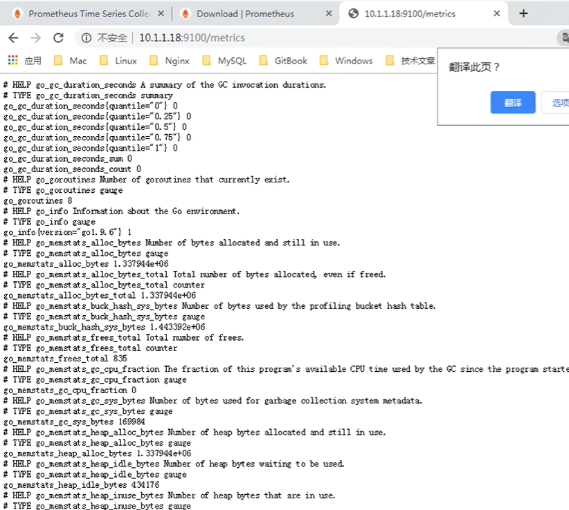


​		他现在和我们的promethus还没有任何关系--现在只是安装了个小组件运行起来了


## 2、让promethus监控node节点信息	

​	需要回到我们的promethus监控系统中，把刚刚这台组机的信息，写入到promethus的配置文件中，这样的话我们再去运行我们的promethus他就可以收集到这台机器的监控数据了

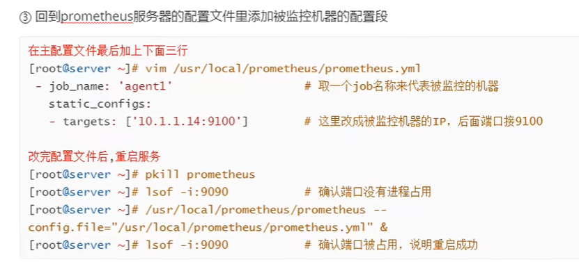

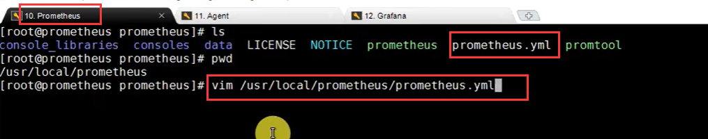


​	在配置文件的末尾添加 -- 注意 yml的格式

​	添加的这三行内容--就相当于添加了一种监控机制，或者是添加了一个监控对象

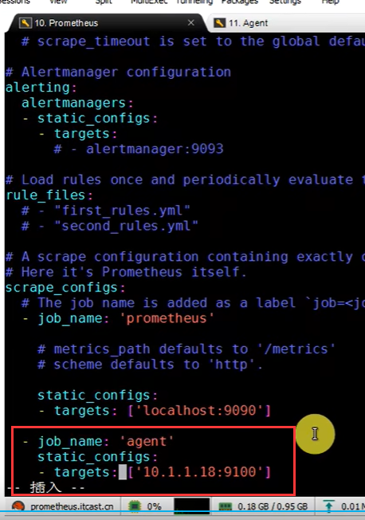


​		修改完配置文件后--需要重新启动promethus

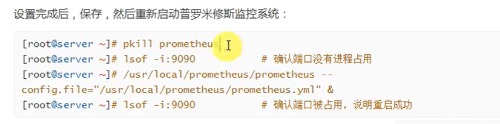

​	See you next time -- 代表停止成功

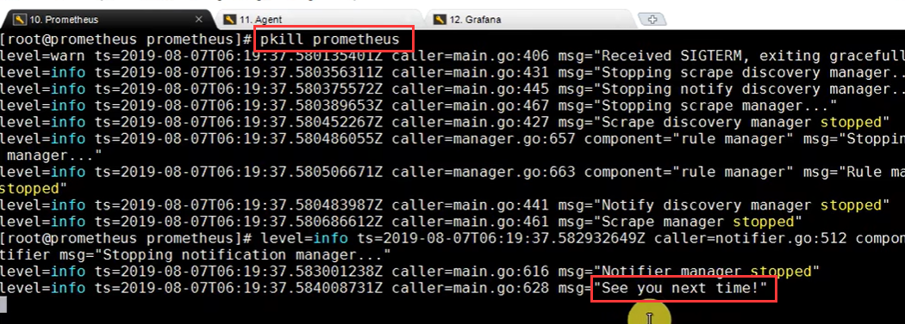


​	查看端口--重新启动

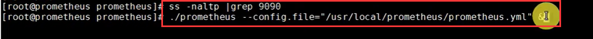


​	Server is ready 代表启动成功

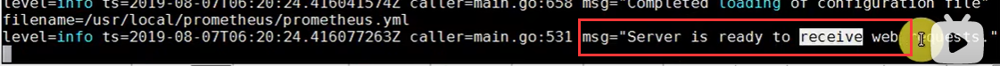


​	回到promethus的web界面，我们查看一下 target 下面有没有增加监控对象

​	我们可以看到多了一个监控对象，还要看state--UP是可以正常接收到数据

​	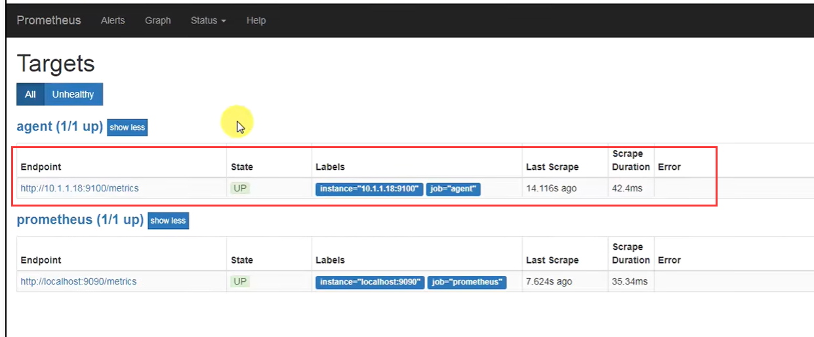


​	有趣的使用案例--模拟数据请求/metrics--给到Promethus，将监控数据给到他

https://blog.csdn.net/weixin_44798288/article/details/124537629

​	这个也比较有趣

https://zhuanlan.zhihu.com/p/474476816?utm_id=0


​		如果我们还需要监控MySQL或者其他组件的信息，那么就安装对应的监控组件


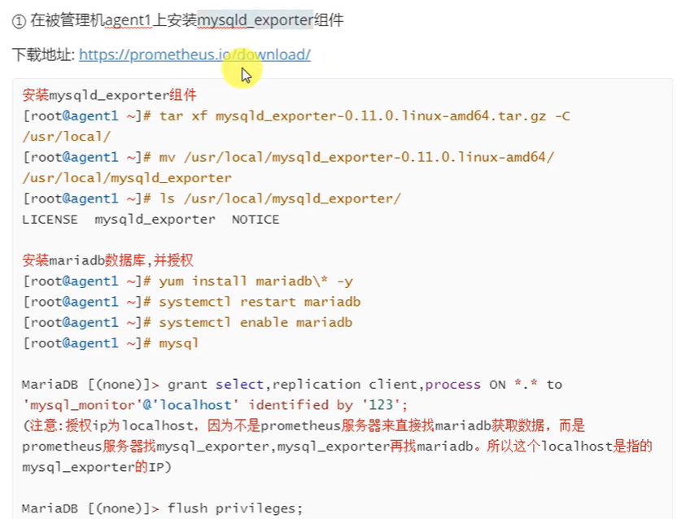


​	


