# 4、安装mysqld-exporter组件监控mysqld服务

​			

## 1、远程监控MySqld服务

​		我们想使用promethus监控mysql，那么就需要在被监控的设备上 安装mysqld-exporter这个组件

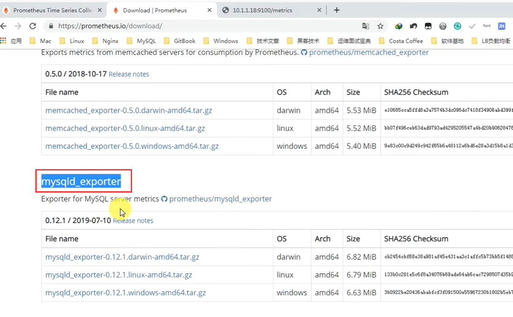

## 2、上传组件到服务器

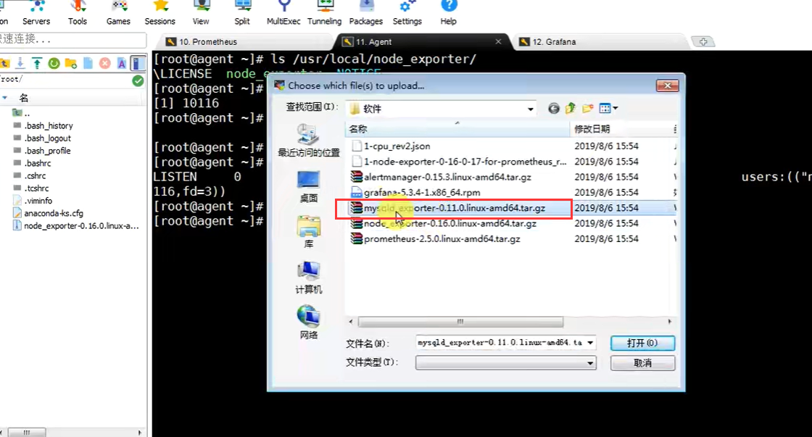

## 3、解压与安装mysqld组件

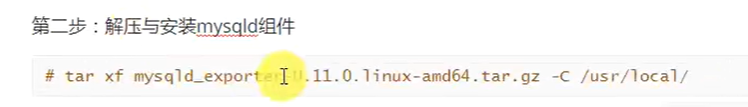

​	然后重命名---因为解压后的名字比较长

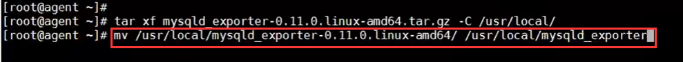

## 4、安装mysql

​		mariadb -- 是mysql的一个分支

​		

​			\*代表安装mariadb全部组件

​			yum安装--或者其他方式安装

​			启动---systemctl start mariadb

​			systemctl restart 重新启动

​			设置开机启动

​	启动后占用3306端口：

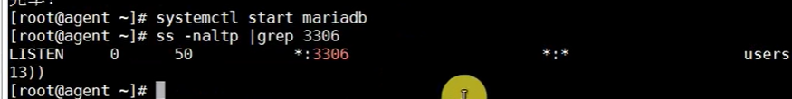

### 4.1、实际工作中不推荐yum安装mariadb

​			其实相当于mysql的分支或者说阉割版本，正规还是安装mysql

​		

### 4.2、创建mysql的账号--用于收集数据

​		因为这个监控promethus是需要根据这个账号去收集数据的。

​		这个账号随便就可以，也不需要远程访问，本机访问就可以

​	

​		现在我们创建一个用户名为mysql_monitor密码是123的账号

​			主机名只有本机localhost，也可以开启远程

​			replication client代表主从  process收集

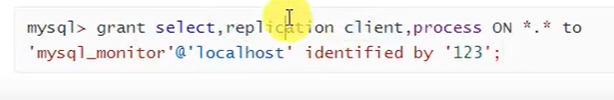

​		

设置完成后--刷新一下权限

​	flush privileges;

退出exit；

## 5、在mysqld-exporter组件中配置mysql信息

### 5.1、创建一个miriadb配置文件

​	 需要在这个配置文件中填写 我们刚刚创建的用户信息

​	它启动之后就会自动使用这个账号--去mysql中拉取数据

​	vim--去编辑这个文件----这个文件是**手动创建的默认是没有的**

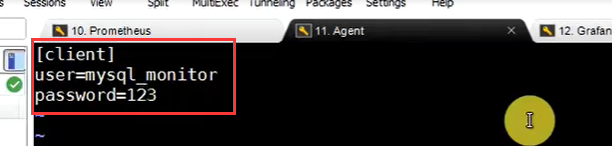

## 6、启动mysqld-exporter组件

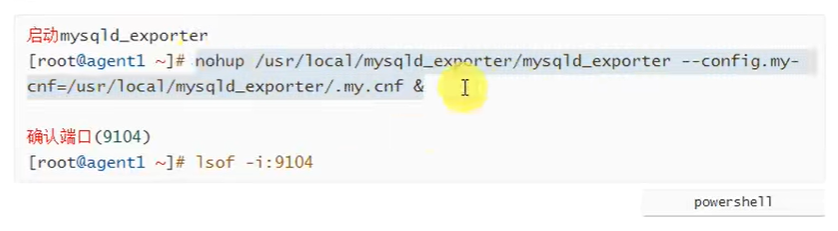

​	并且查看端口---端口存在 组件已运行

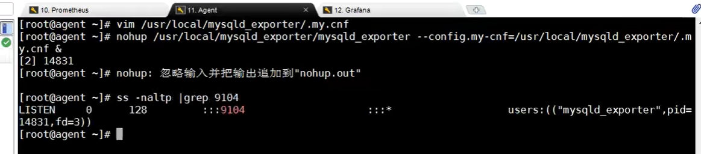

​	我们去请求一个 IP+9104/metrics 可以看到我们组件获取到的数据

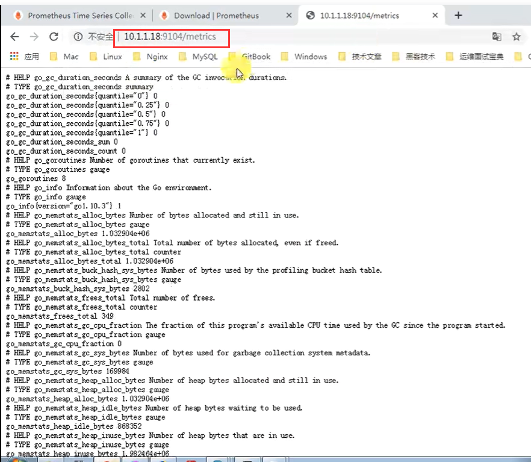

​	现在promethus还不知道有这样的节点--需要在promethus中配置一下

## 7、promethus配置监控mysqld节点信息

​		修改promethus的配置文件---添加一段配置

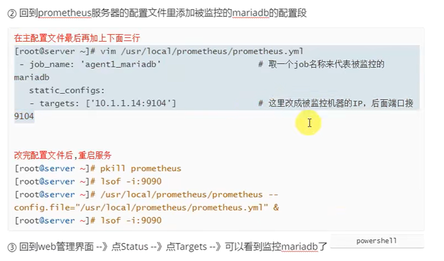

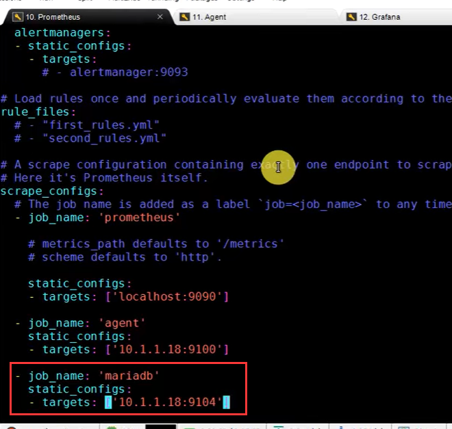

​		pkill promethus 强制杀死进程

​		重新启动：

​			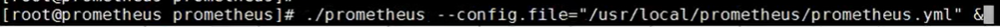

​	

查看端口占用情况：

​	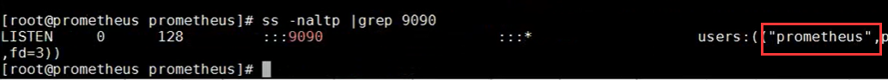

​	

​	我们进入promethus的web界面发现--多了一个mariadb

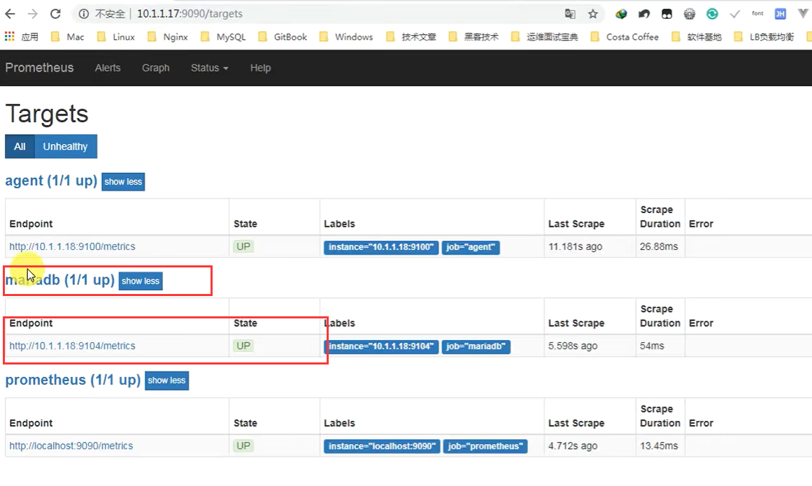

​	比如我们现在看一下mariadb的相关监控内容

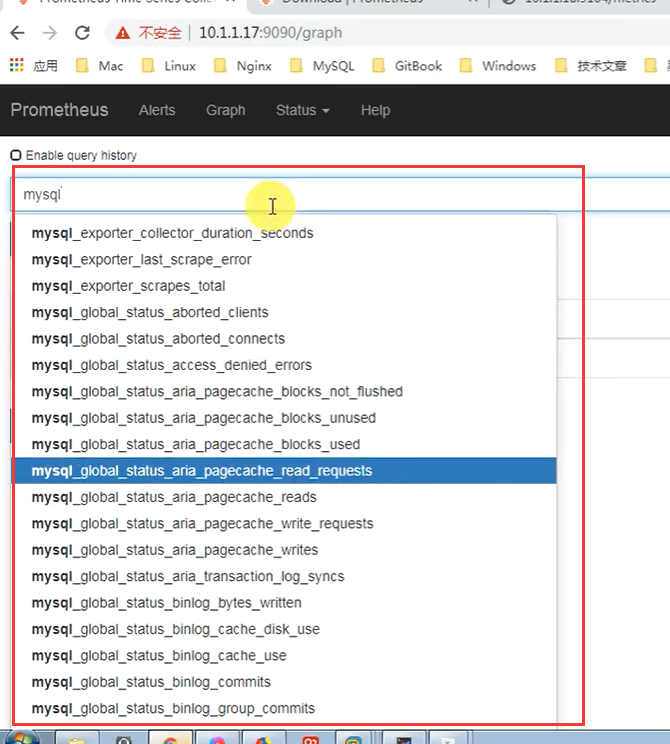

​	比如 mysql的线程连接点

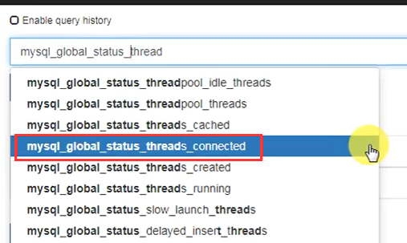

​	我们看到在一个小时内---只有一个节点连接

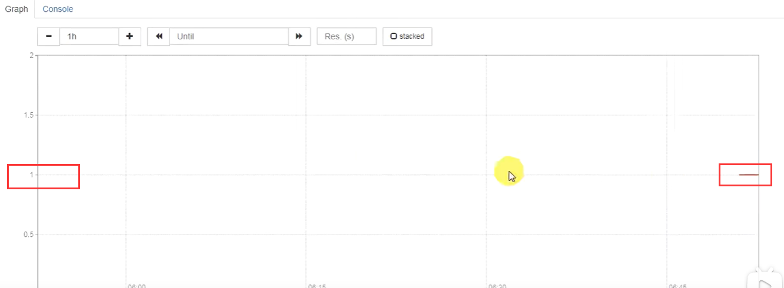

https://www.bilibili.com/video/BV16J411z7SQ?p=8&spm_id_from=pageDriver&vd_source=243ad3a9b323313aa1441e5dd414a4ef

