# 5、promethus添加图形图像

​	

​		因为promethus本身自带的web界面展示的内容相比比较少

​	

​		原因是我们还少安装一个工具Grafana可视化图形工具

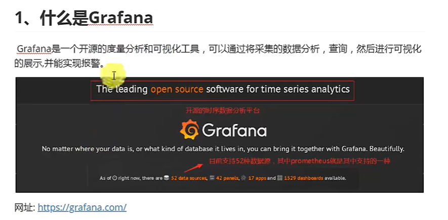


## 1、安装grafana

​	https://grafana.com/

​		官网中--进入down下载rpm的文件包

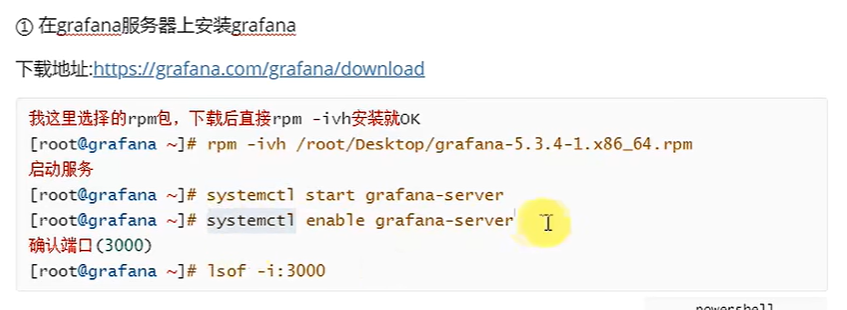

​		- i 是install  --- v是进入      h是


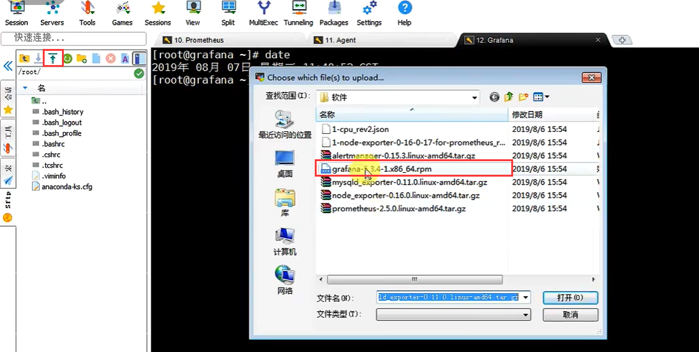


安装失败：需要另外俩个依赖包

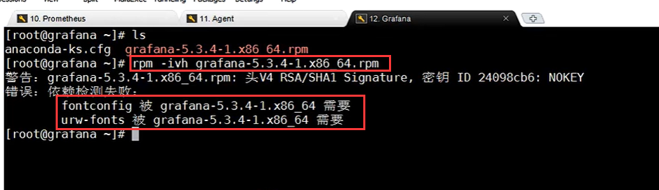


​	安装另外依赖的软件包

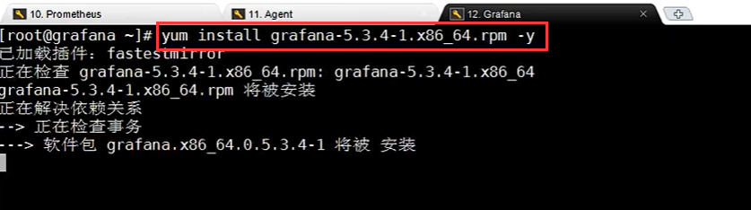

​	这样rpm包也可以通过 yum来安装，因为yum最终也是通过rpm实现的

```
# 如果我们使用yum *** -y的方式安装可以帮助我们解决 依赖问题，自动加载依赖

yum install /root/Desktop/grafana-5.3.4-1.x86_64.rpm -y

```


​	然后启动和设置开机启动

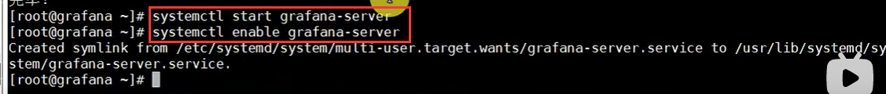


检查端口

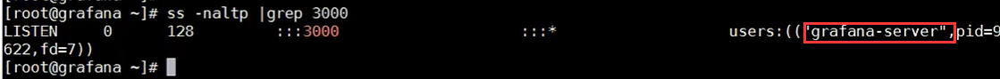


## 2、登录grafana

​	ip+3000端口---可以访问到我们刚刚启动的grafana

​	默认 用户名 密码都是admin

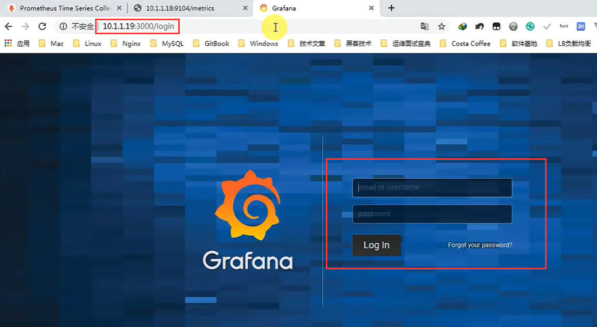


​	第一次登录--让先设置密码


这样就进入系统了

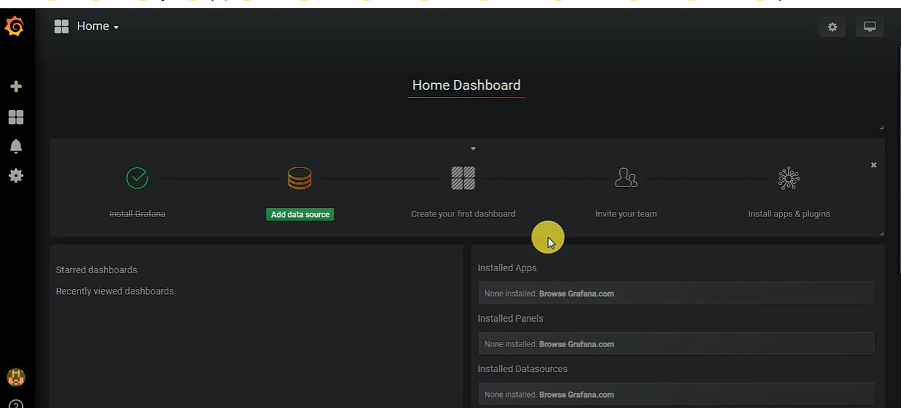


## 3、添加promethus的数据源

​	比较主流的监控系统像 nacos 它支持的都可以收集进来----它支持的版本还是很多的


### 3.1、添加数据源

​	点击 add data source

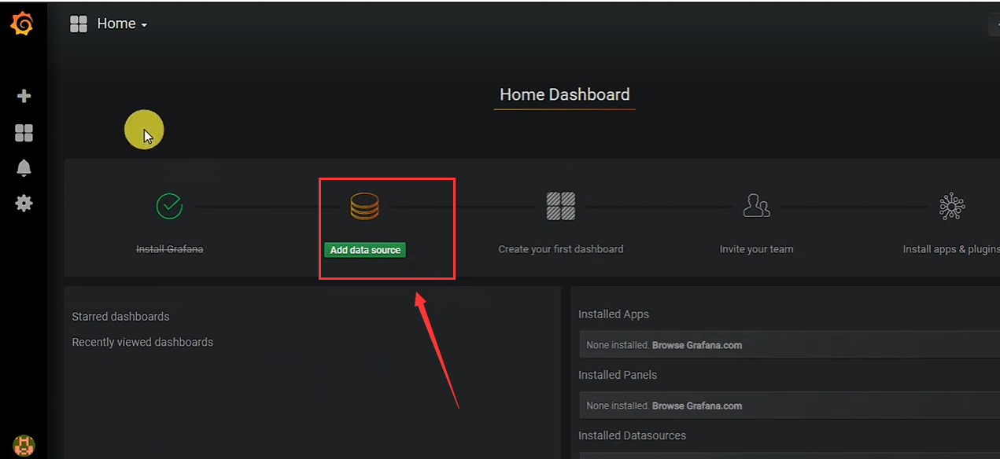.


### 3.2、设置数据源 -名称，类型，ip等


​		它支持的数据源类型有很多种--我们选择promethus

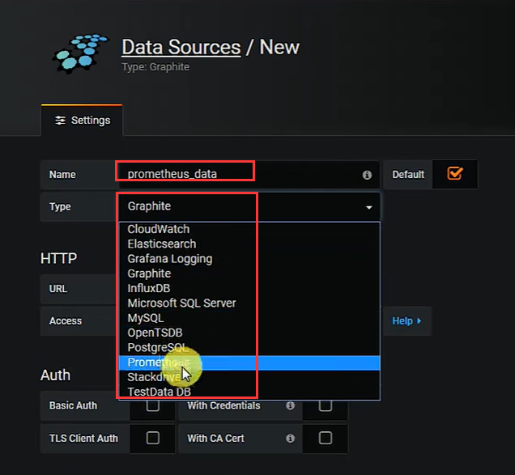


​	url填写数据源的地址，Access默认

​	Auth -- 授权 公网需要授权，内网无需授权

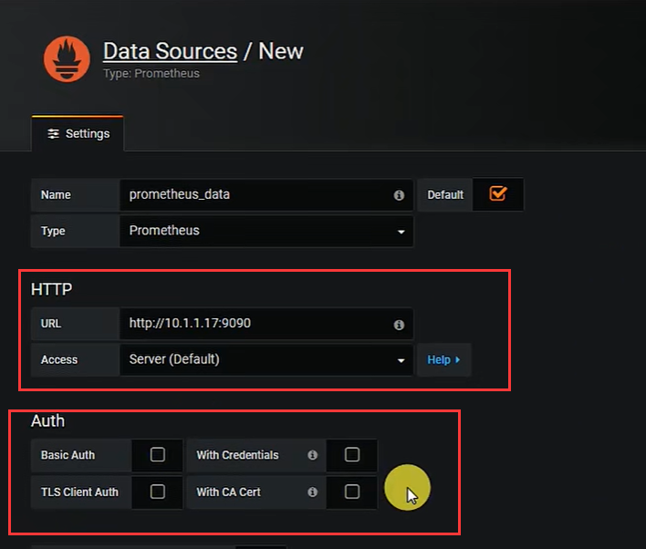


​	

下面的设置，根据需要配置

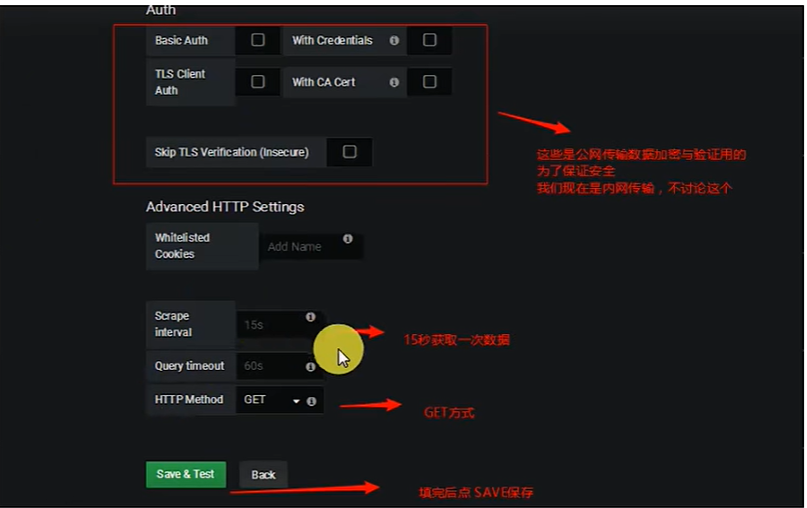


### 3.3、查看是否添加成功

​	点击 设置 -- DataSource

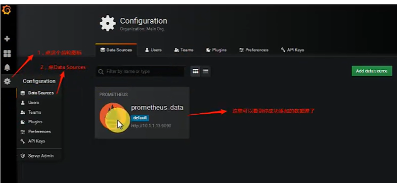


## 4、查看数据--图形展示

​	点击+号，然后点击 DataSource

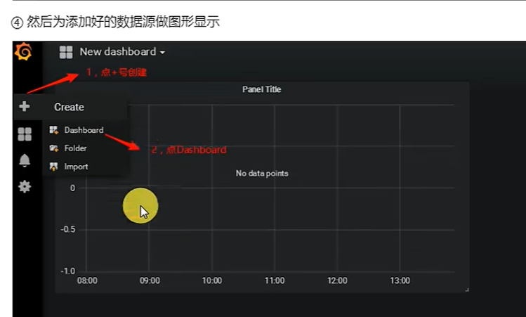


​	然后我们一般点击graph就是图像的意思

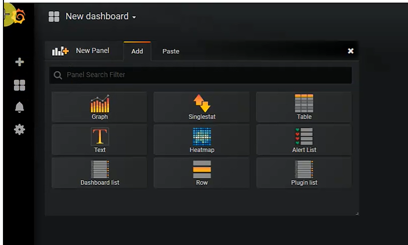


​	但是现在还没有数据---现在只是增加了一个图形

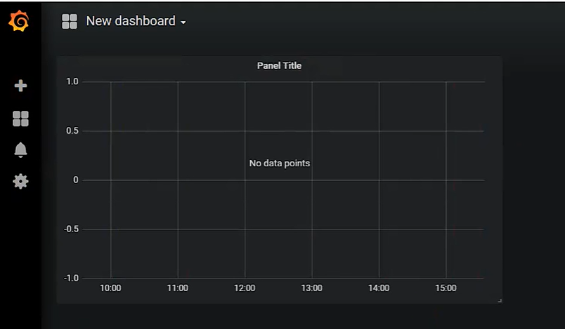

、

​	选择需要呈现的数据

​	点击 标题的 倒三角符号，编辑---增加我们的数据点

​	在这个过程中其实它就会收集一下数据

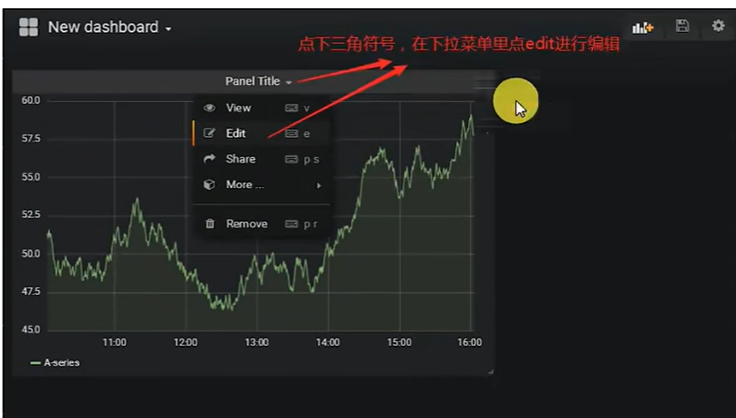


​	选择数据源--然后设置采集时间间隔点 3个点 比如5分钟维度，10分钟维度，30分钟维度

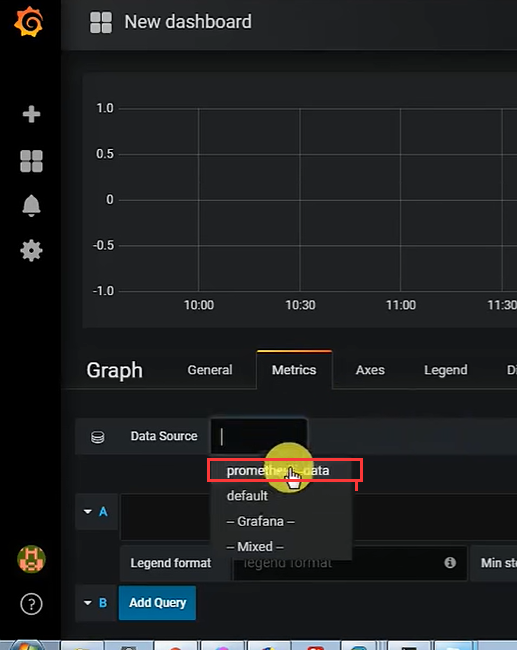

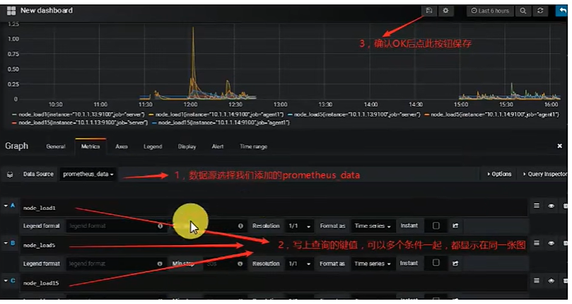


​	注意监测点：

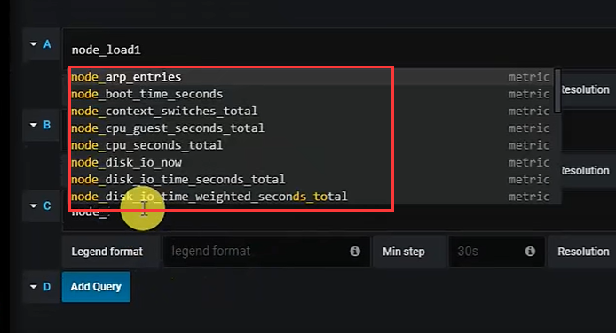


​	这样就可以看到3条线的维度图表了

​		因为我们配置了3个监测点，如果多的话那么就是多条线

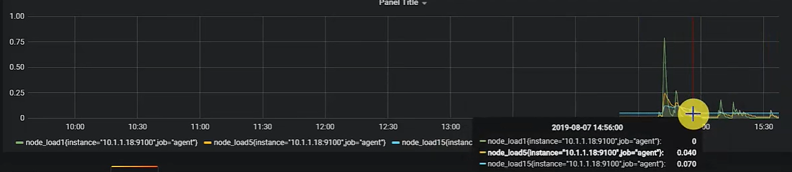

​		它查的其实是agent 被监控的服务器信息


​	这些图表我们也可以根据条件进行过滤和赛选查看

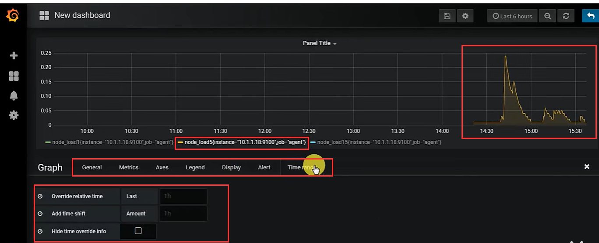


​	保存：

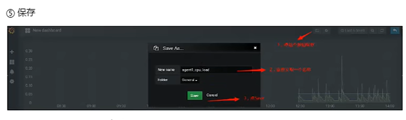

​	可以把我们设计好的图形--下次登录后还是可以看到

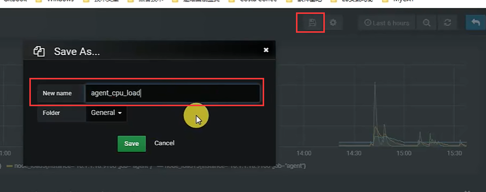


​	这样就一直可以看到cpu这个负载了

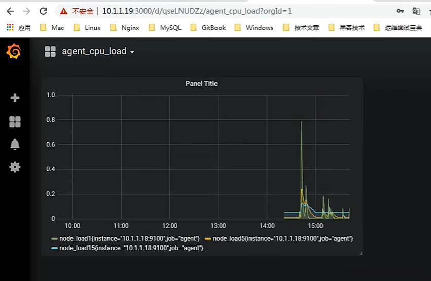


​	也可以设置变量--来过滤

​		比如--具体查看某一台 实例 的CPU -- 使用变量 花括号的表达方式进行过滤

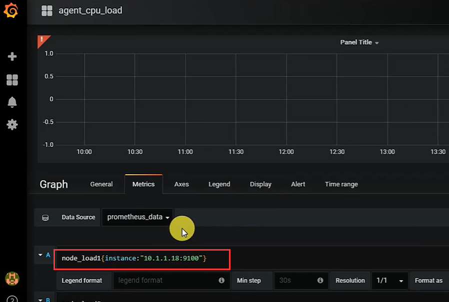


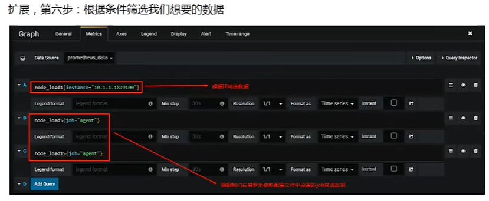


https://www.bilibili.com/video/BV16J411z7SQ?p=9&spm_id_from=pageDriver&vd_source=243ad3a9b323313aa1441e5dd414a4ef


