# 6、promethus添加MySql监控

## 1、Grafana图形显示MySql监控数据

​		

​		在grafana上修改配置文件，并且安装mysql监控的dashboard（这个其实就是一个定义好的图形图像模板，他主要是json文件）

​	文件比如-mysql的cpu相关和节点信息的json模板文件

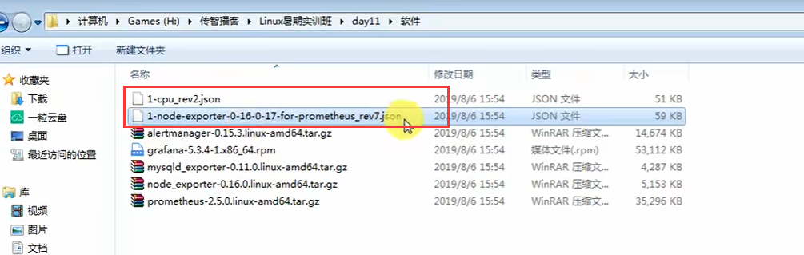

​	模板地址：https://github.com/percona/grafana-dashboards

​	比如：mysql

https://github.com/percona/grafana-dashboards/tree/main/dashboards/MySQL

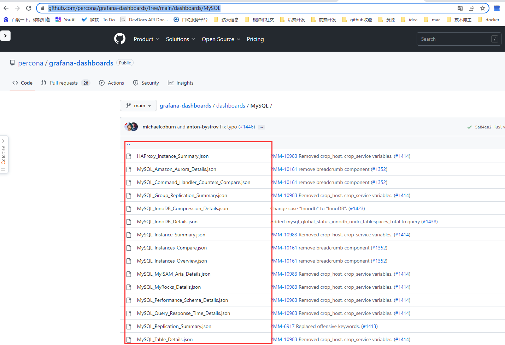

## 2、修改grafana的配置文件

​	dashboard.json是读取json文件

​	enable 是开启 这个模板json

​	path 是这个json模板的位置 

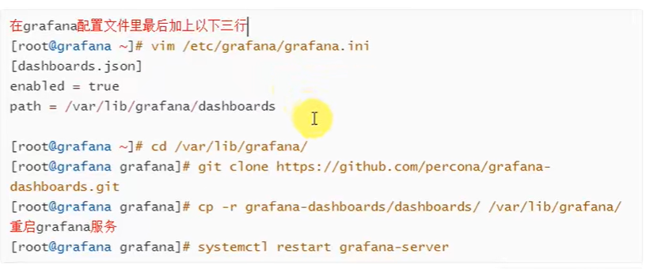

编辑配置文件

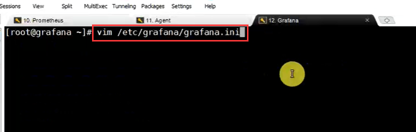

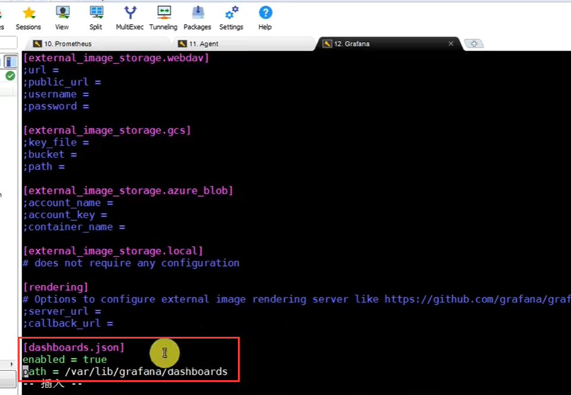

#### 下载配置文件：

​	进入到指定目录下

然后下载

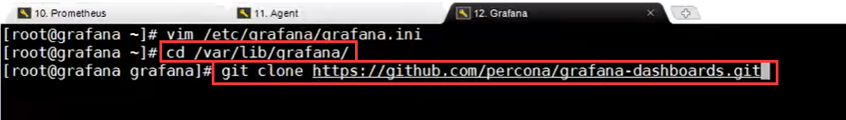

​	下载可能比较慢 -- 这个其实是下载整个项目的master分支 东西比较多

​	解压后copy到我们的目录下

​	我们直接把下载好的json文件传入进去也可以

​	进入存放json模板的路径下：

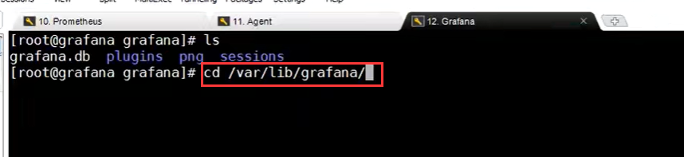

​	创建 dashboard文件夹

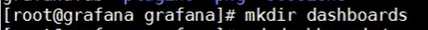

​	

上传json文件

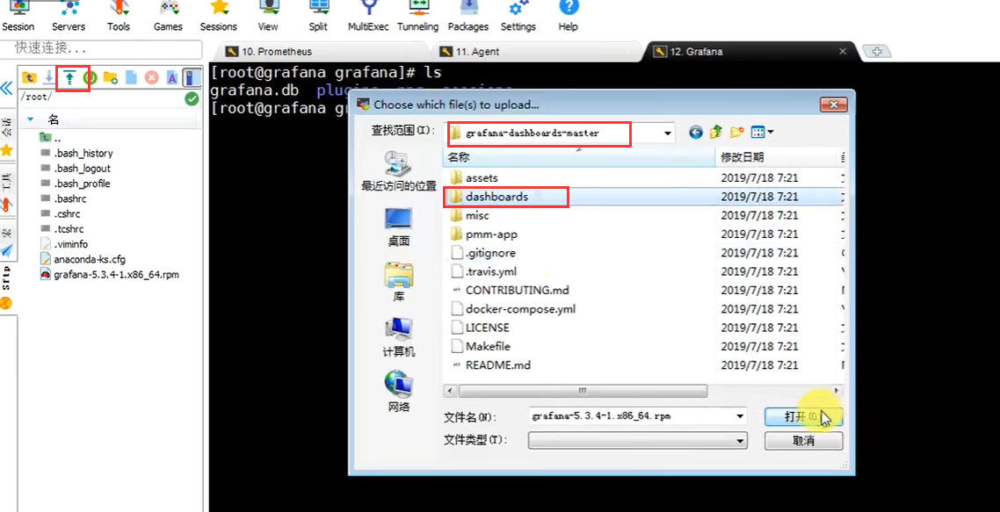

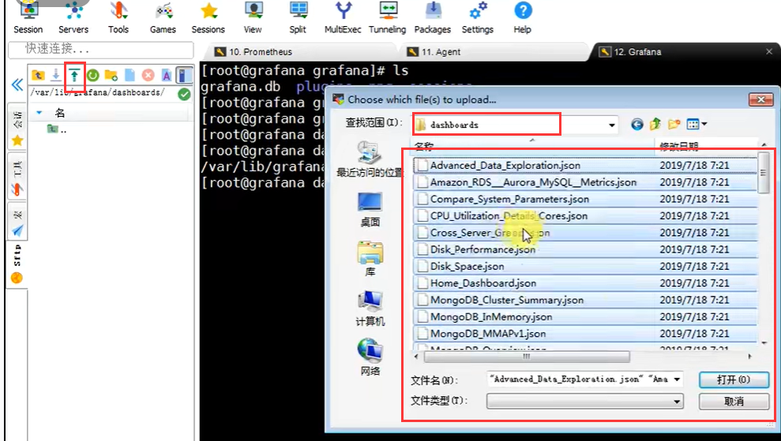

重启grafana服务

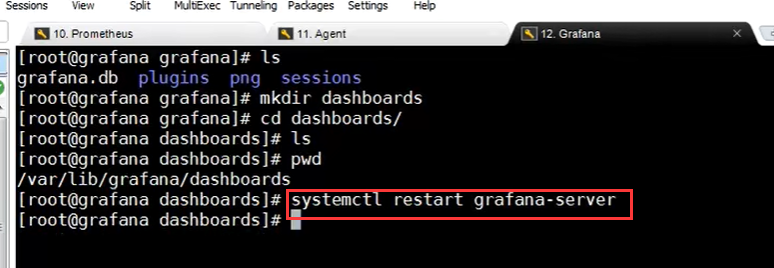

## 3、在granfana中导入json文件

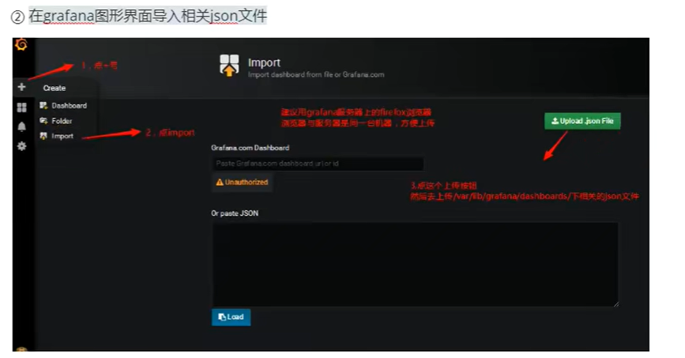

​	点击+号，然后import，这个的意思就是在别人做好的模板，我们可以直接导入导出的进行复用

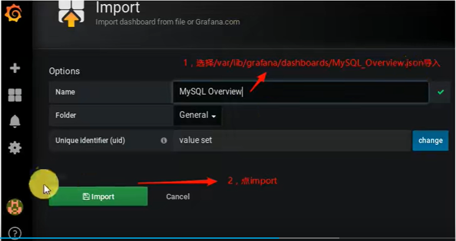

可以看到这个图标非常多，但是没有数据--原因是我们没有设置数据源

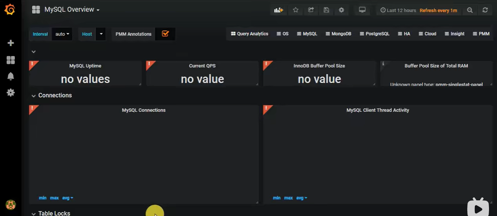

## 4、设置数据源

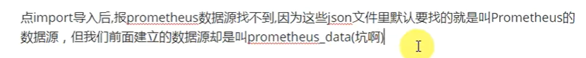

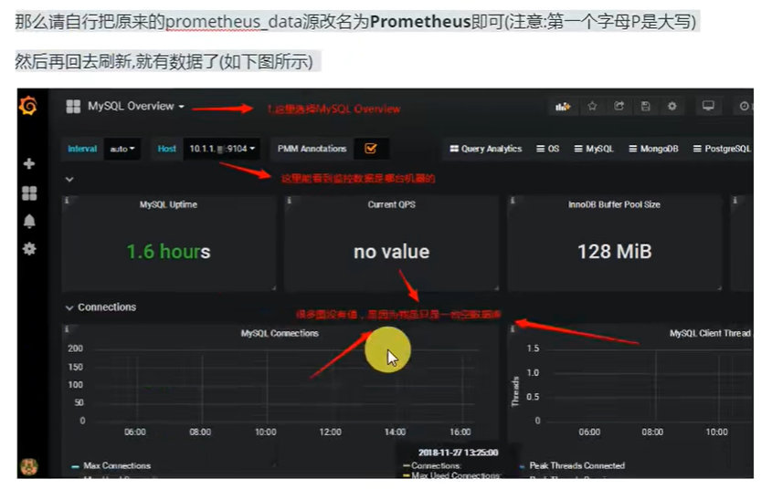

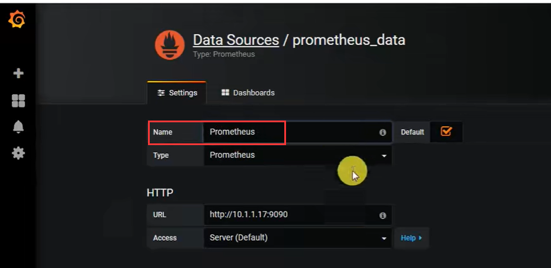

我们可以监控到mysql了

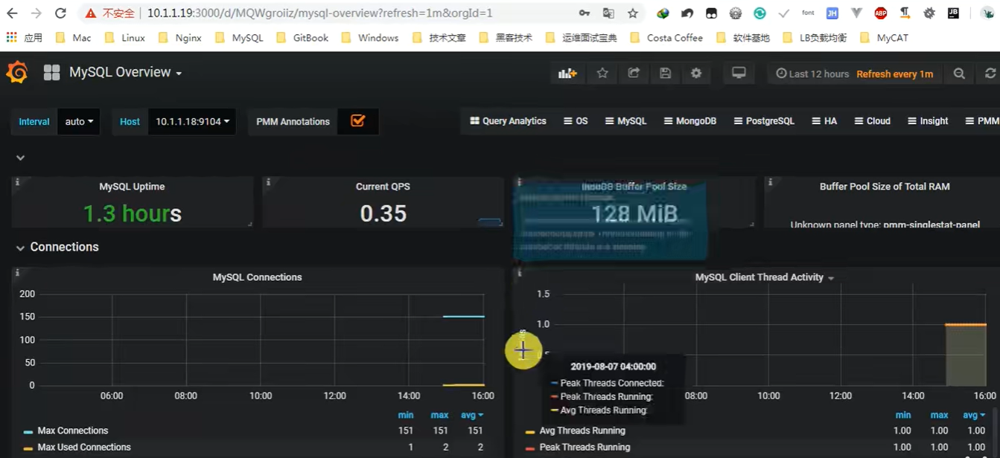

https://www.bilibili.com/video/BV16J411z7SQ?p=10&vd_source=243ad3a9b323313aa1441e5dd414a4ef

​	可以寻找中文版的模板---然后显示的图表就是中文的样子了

https://new.qq.com/rain/a/20220424A025DI00

