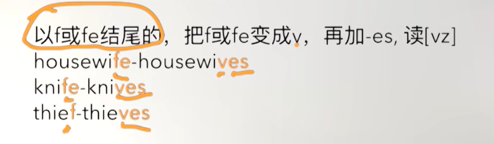
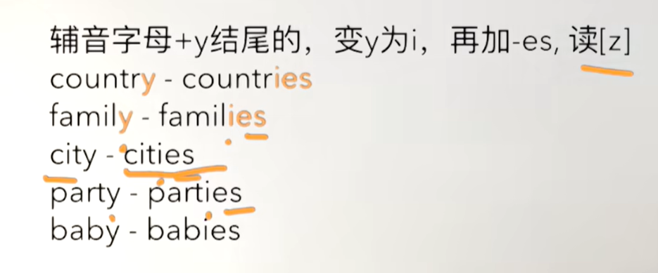
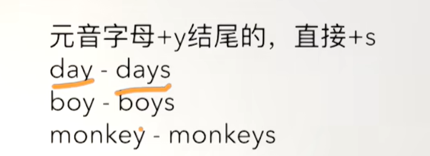
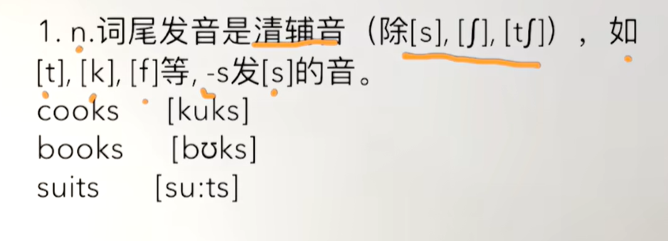
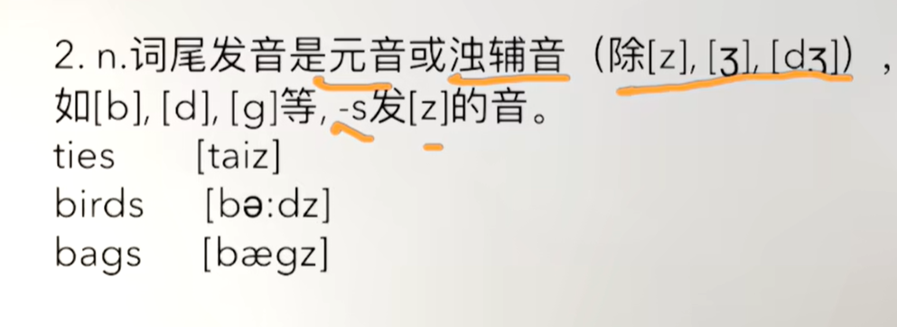
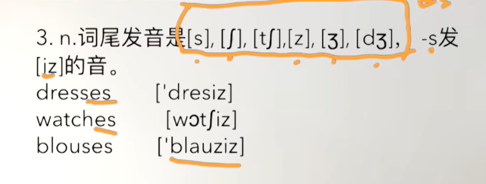
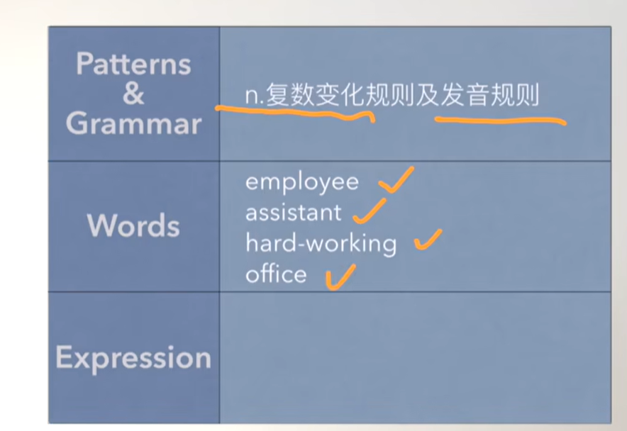
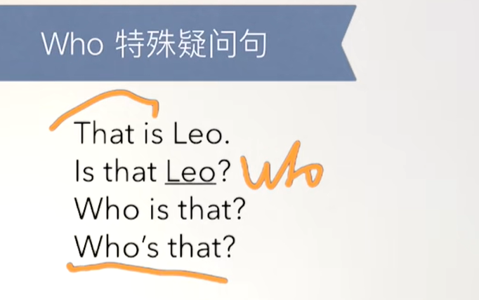
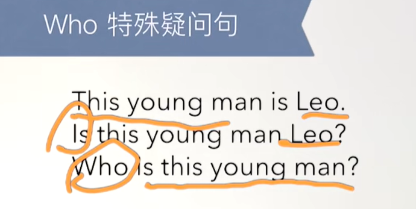
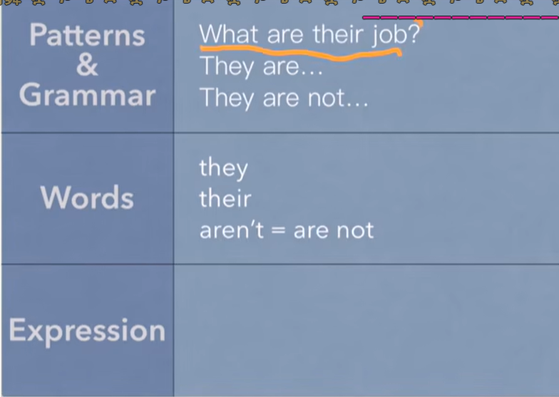

# 10、lesson17-18-名词复数的变化规则


## lesson17：

### 	1、word：

#### 		employee -- 雇员

#### 		hardworking -- 努力工作

#### 		sales rep -- 女销售员

​				salesman / saleswoman

#### 		man/woman -- 男人/女人

#### 		office officer -- 办公室，加r 长官

#### 		assistant -- 助理  

 


### 	2、n.复数的变化规则

​				以f或fe结尾的，把f或fe变成v，再加-es



​			

​				辅音字母 +y 结尾的，变y为i，再加 -es

​	

​			

​				元音字母 + y结尾的，直接 +s

​		


​		

​		

### 	3、n.复数的发音规则

​		




​		





### 4、作业

```
1、试着用本课单词造句


2、讲解一遍核心知识点
	这节课主要讲解了，名词复数的变化规则，及发音规则。
	

```


### 5、Who引导的特殊疑问句






 	


### 6、如何表达过来见见某人？

​			Come and meet + 某人 -------过来见见某人


### 7、作业

```
1、绿皮书第17课

2、文章跟读至熟读成诵

3、这节课的核心知识点讲解
	本节内容主要讲了 特殊疑问词 who的用法，用于问人，who is this，这是谁
	过来见某个人，come and meat 某人


```


## lesson18


### 	1、they VS their

​		他们      他们的


### 	2、word

#### 			sales reps -- 销售

#### 			nurses -- 护士

#### 			air hostesses -- 空中小姐

#### 		    taxi drivers -- 出租车司机

#### 			teachers -- 老师们

#### 			housewives -- 家庭妇女们

#### 			hairdressers -- 理发师们

#### 			keyboard operators -- 键盘操作员 

 


### 3、作业

```
	1、绿皮书 18课
	
	2、讲解核心知识点
		这节主要就是练习询问职业，他们的工作是什么？ 他们是。。
		What are their jobs？
		They are teachers

```


