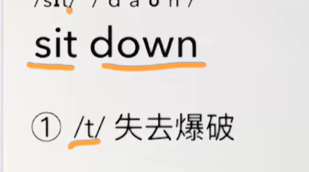

# 11、lesson19-20-交谈询问


## lesson19

### 	1、word

#### 		matter --  问题

#### 		children child -- 孩子

#### 		tired -- 累

#### 		thirsty -- 渴

#### 		mum -- 妈妈

​					孩子化的口语表达方式使用mum

#### 		sit down -- 坐下

​			

####  	right -- 正确，还好

#### 	ice cream -- 冰激凌


### 	2、如何表达 怎么啦？

​			What's the matter ？

​			What's wrong？


### 	3、失去爆破是什么？

​			失去爆破示例如 sit down ，sit 的t 有口型无发音t

 

### 	4、作业

```
	1、绿皮书 19课
	
	2、讲解一遍今天的核心知识点
		这节主要讲了 询问某人怎么了？What's the matter?/ What's wrong?
		然后是有些单词在读的时候是失去爆破的声音 如，sit down
		
		
```


## lesson20

### 	1、word


#### 		big small -- 大  小

#### 		open -- 打开

#### 		shut -- 关门

​			That shop is closed -- 平时使用closed 平时使用closed多一些，含义一样

####  		light  heavy -- 轻 重

#### 		long - short -- 长  短

#### 		shoes -- 鞋

 

### 2、作业

```
	1、绿皮书20课
	
	2、讲解核心知识点
		这节主要是去商店前与别人交谈询问，是否开门？
		Is that shop shut？
		
```


