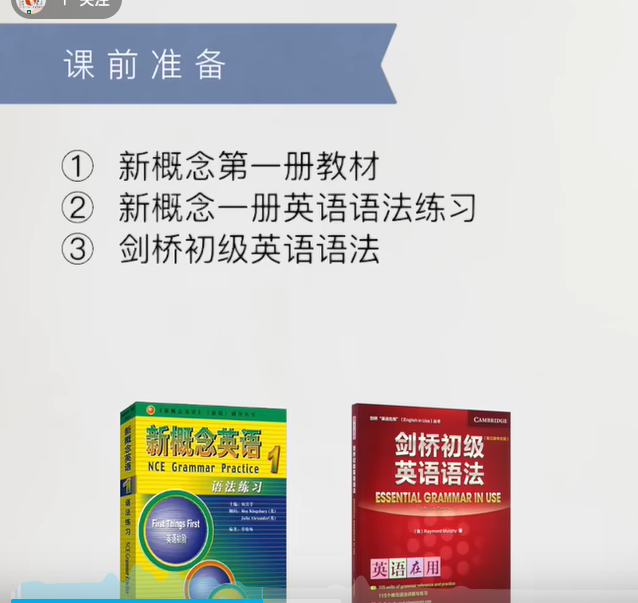
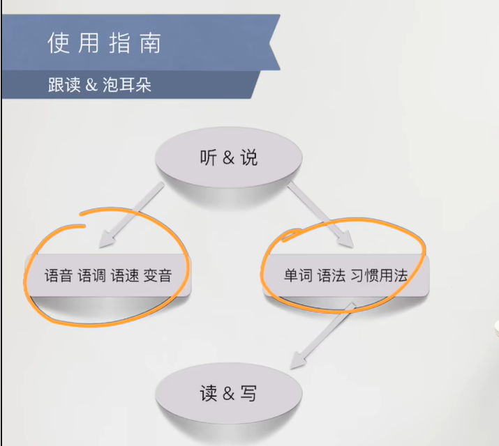
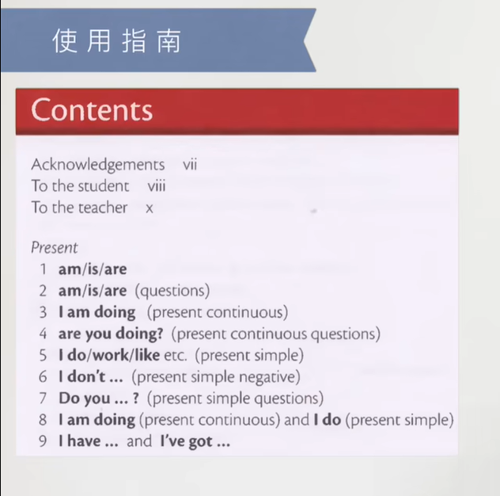
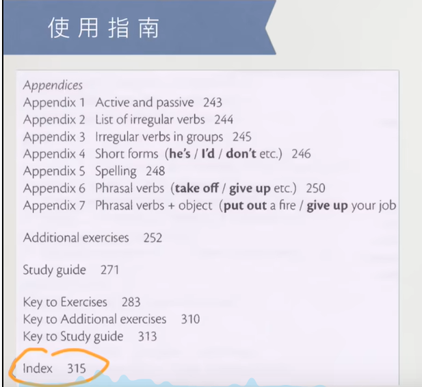
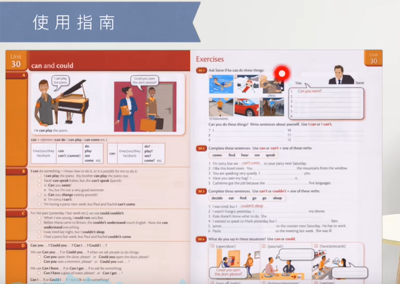
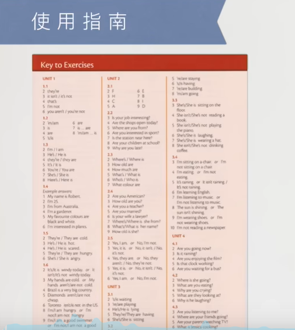

# 1、开篇

#### 1、课前准备

​		1、新概念英语教材

​		2、新概念英语语法练习

​		3、剑桥初级英语语法

​		

​		4、手机词典

​		5、手机App ：新概念文章音频

​		6、纸笔

​		

#### 2、使用指南

​			1、跟读&泡耳朵

​	

​	如何做呢？  它读 我们 进行跟读

​		绿皮书-- 每课对应的写和练习 -- 最后有答案可以对照

​		红皮书 -- 对应每个单元处理的语法

​		在红皮书的目录最下面有index索引，相当于词典一样，利用索引找到对应的页码或者是单元

​	左侧是讲解 -- 右侧是练习

​	重点是右侧的练习

​	书的最后面是答案

#### 	3、书的价值

​		如何去发问问题？

​		如何去听懂问题

https://www.bilibili.com/video/BV1xa411J7jJ/?spm_id_from=333.337.search-card.all.click&vd_source=243ad3a9b323313aa1441e5dd414a4ef

# 2、课堂笔记

​		个人记录 或者是公众号购买

