# 2、lesson1-2

​		

## 1、单词

​	Excuse me -- 打扰了 ，让一下

​	handbag -- hand 手 + bag  -- 手提包

​	造句非常重要，通过我们不断的造句来强化单词记忆

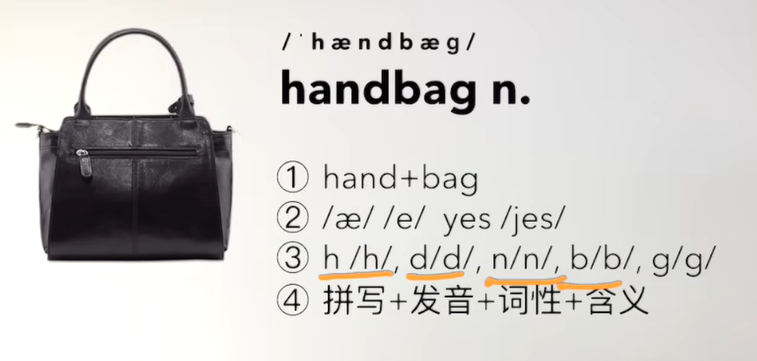

​	pardon -- 表示惊讶，什么？ -- 用于请求某人重复一下

​	thank you very much  /so much 

​	其实如果是口语基本不会这样说

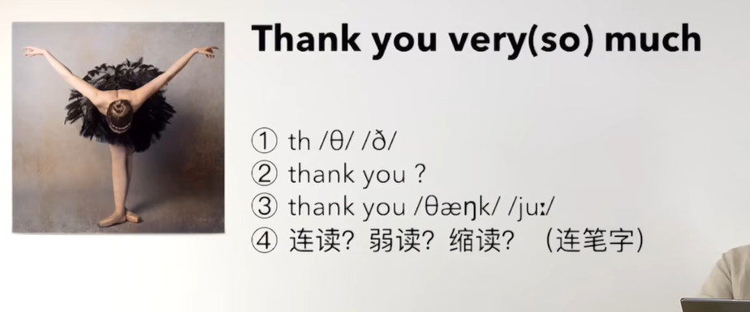

## 2、语法文章

​	肯定句： this is my handbag 这是我的手提包

​	

#### 	一般疑问句

​		我们一定要把一个单词提取到句首，这很重要以后我们会发现，英文当中有非常多的结构，在一般疑问句 的时候都是把 某个单词提取到了句首

​	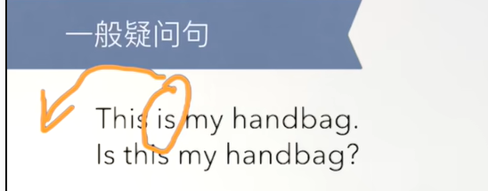

​			Is this my handbag？ 这是我的手提包吗？

​		一般这句话用的比较少，因为一般个人的东西是知道是不是自己的，但偶尔也会使用

​		我们可以换为 Is this your handbag？ 这是你的手提包吗？ 这句话就比较常用了

​	我们如何判断是否是一般疑问句呢？ 只要回答的是yes 或 no的 都是一般疑问句

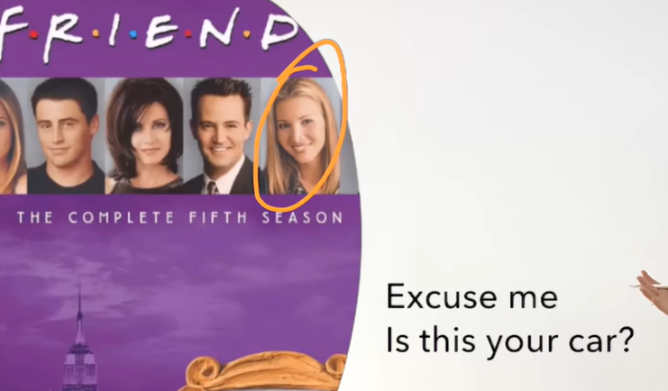

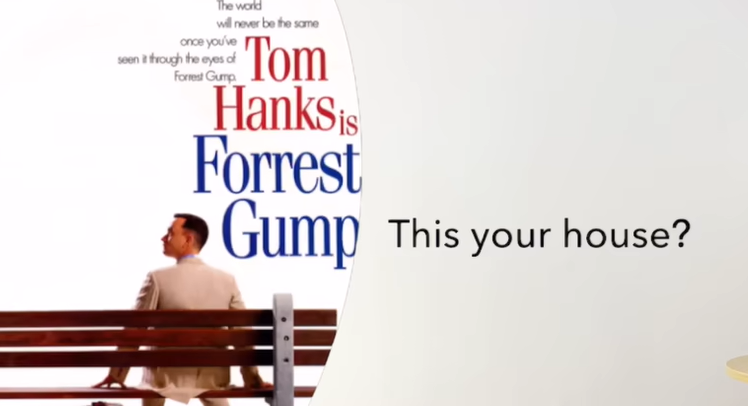

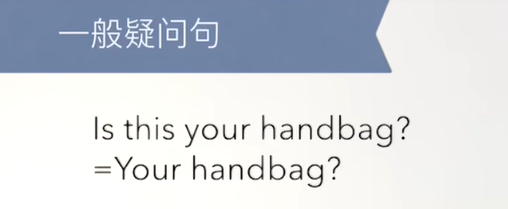

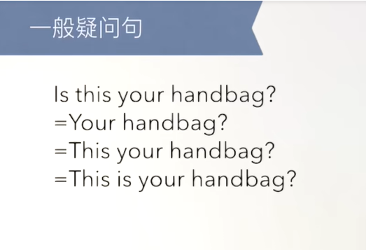

​			 如果是把 This Is your handbag？声调上扬 也可以做疑问表达

​				那么这样大家就有疑问了，这样我们还学习语法有什么用，原因是随着语法越来越难，我们想表达的越来越复杂，标准语法有一个好处就是减少歧义，

​		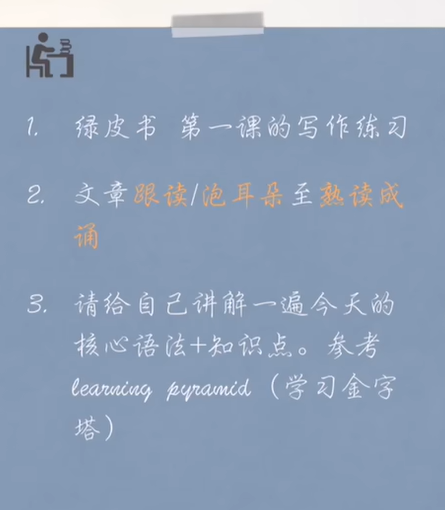

https://www.bilibili.com/video/BV1xa411J7jJ/?p=4&spm_id_from=pageDriver&vd_source=243ad3a9b323313aa1441e5dd414a4ef

## 3、练习

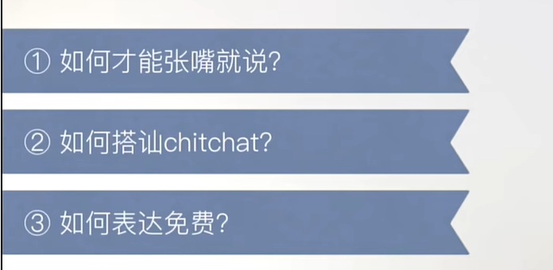

​	我们在学习英语的时候，有个疑惑 如何使用英语进行够通？

​		在大脑进行沟通的时候，本质上是拒绝思考的，一般就需要张嘴就来，容易拒绝思考

#### 	如何可以做到张嘴就来

​			将我们学到的各种各样的单词，往我们学习的语法中带入

​		然后张开嘴就说

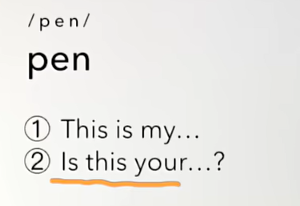

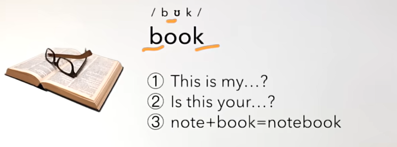

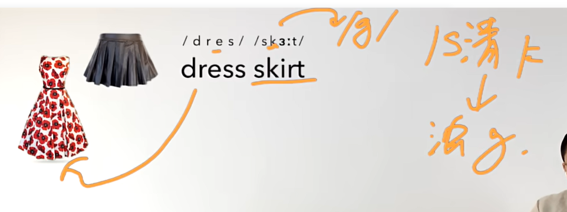

​	

​			on the house 可以表达为免费

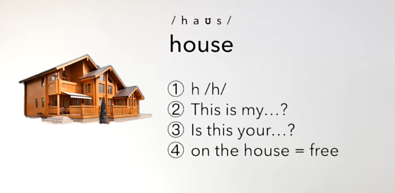

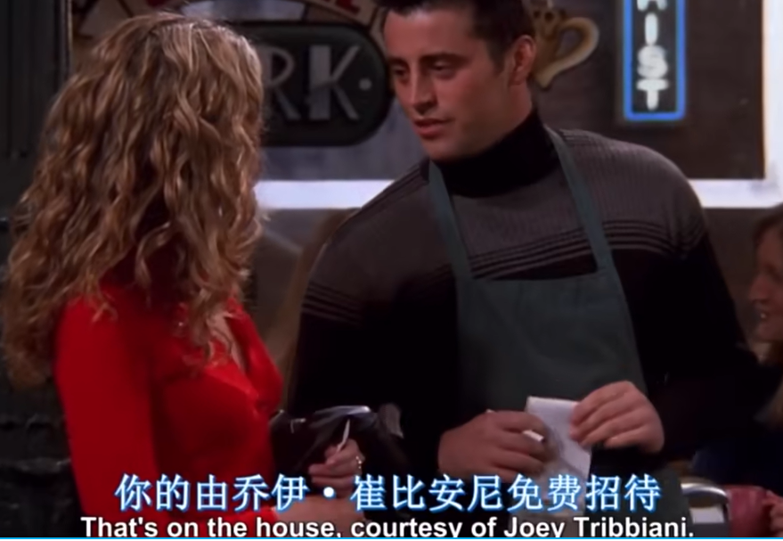

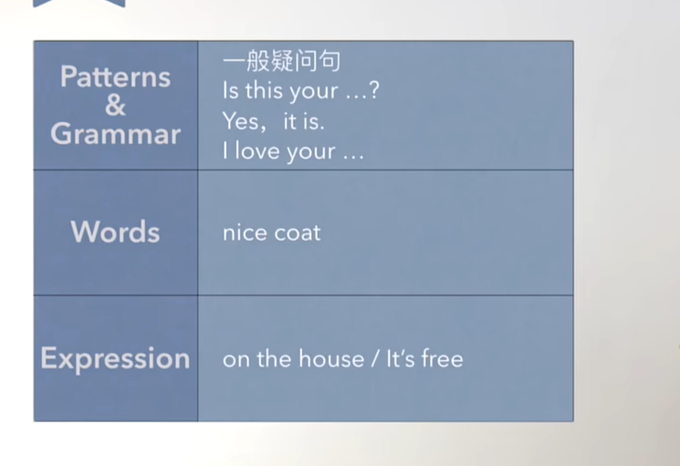

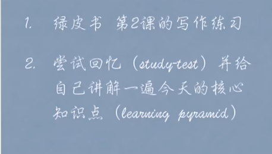

​	