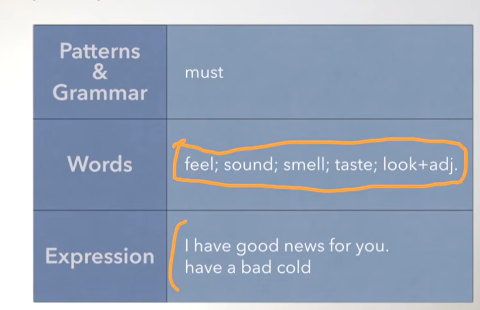
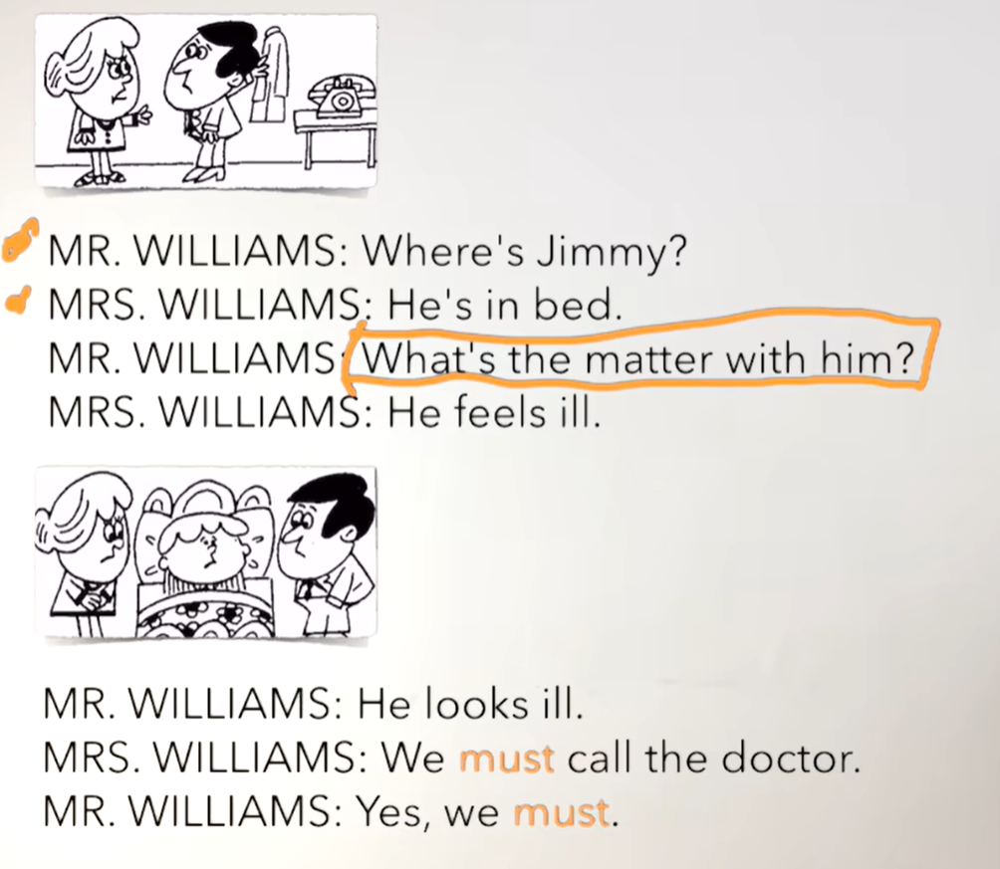
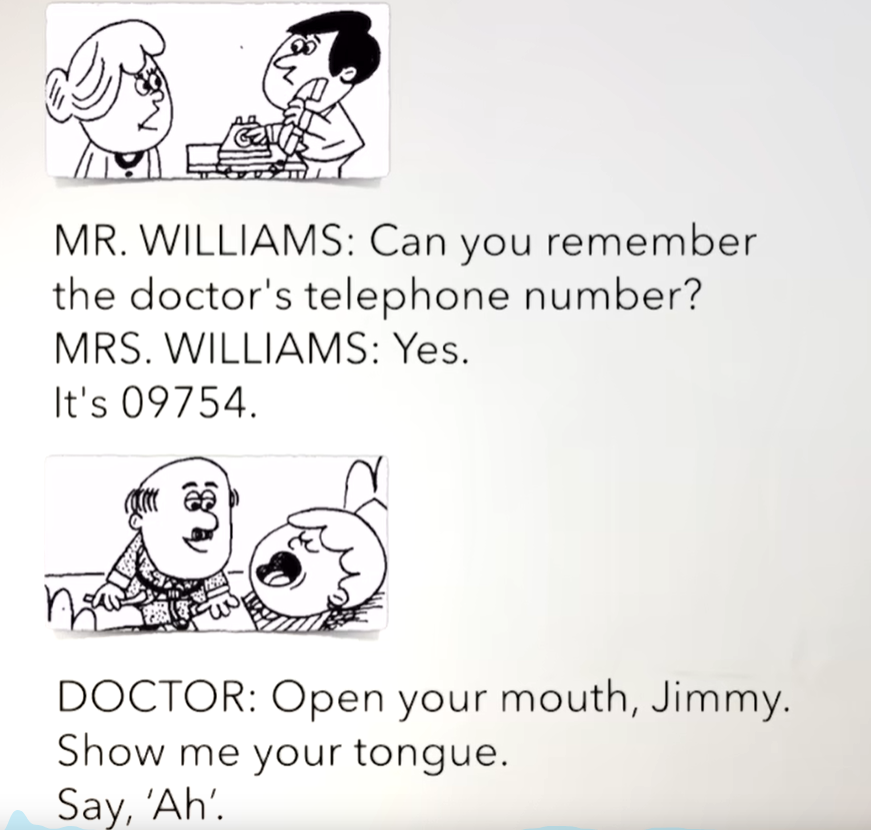
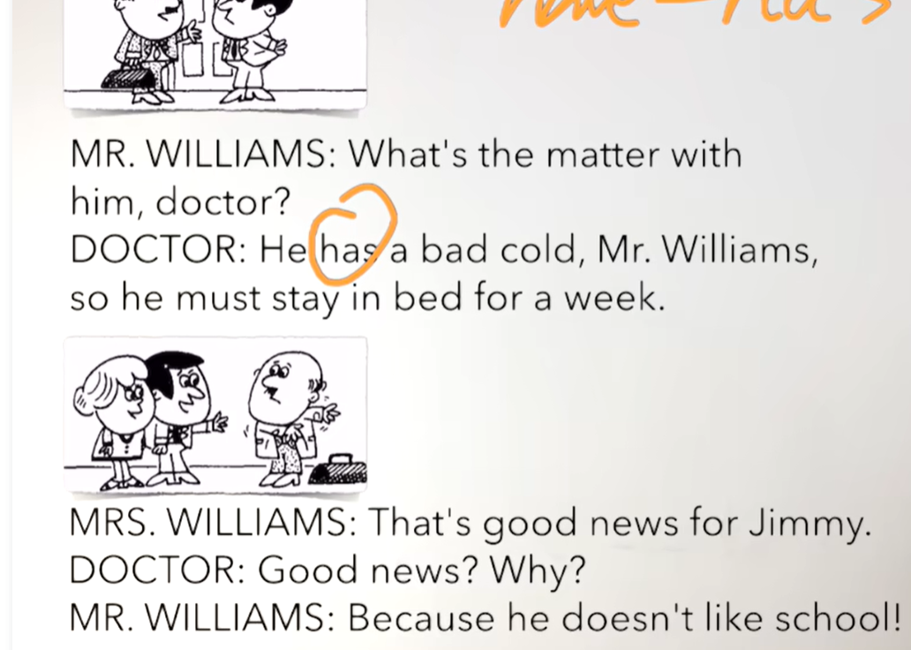
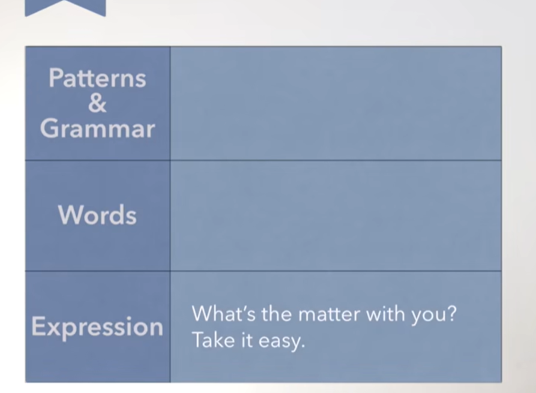
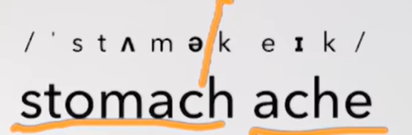
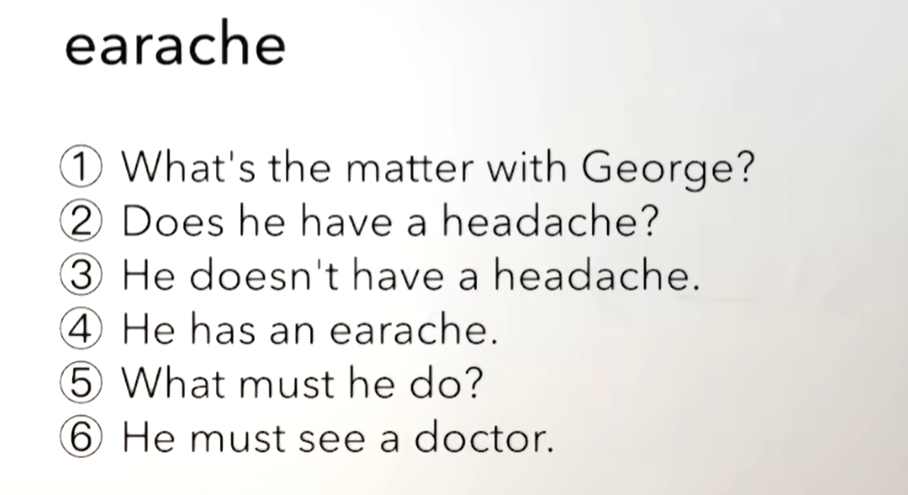
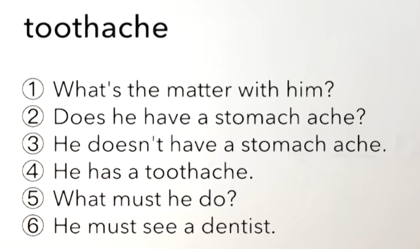
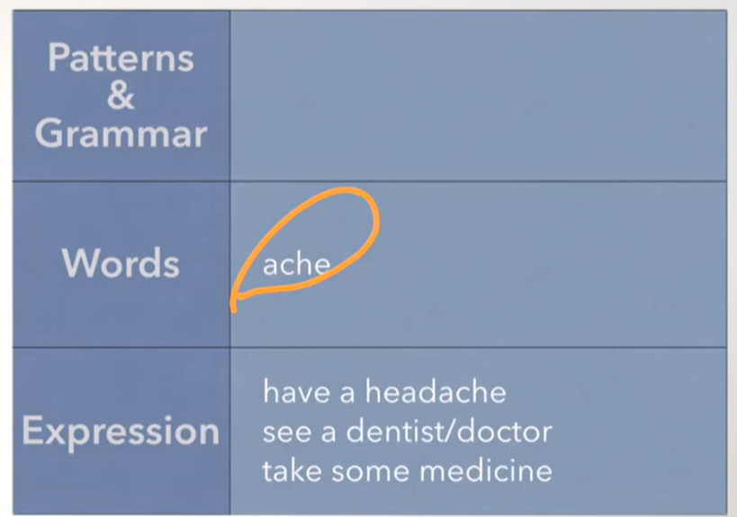

# 33、lesson61-62-生病吃药

## lesson61

### 1、Question

#### 		1、如何使用feel/smell...?

​	She feels great. -- 她感觉很好
​	She doesn’t feel bad.  -- 她感觉不是很差
​	Does she feel great?  -- 她感觉好吗？

​	How does she feel?   -- 她感觉怎么样


​	I smell bad -- 我闻起来不好
​	Do I smell bad -- 我闻起来是不是很差
​	How do i smell -- 我闻起来怎么样？


#### 		2、如何表达 重感冒？

​	They have a bad cold -- 他们得重感冒了
​	得病了 可以使用have -- have a bad cold 得重感冒了

#### 		3、如何表达我有好消息？

​	I have good news for you -- 我有好消息给你
​	Do you have any good news for me？ -- 你有一些好消息给我吗？


### 2、Word

#### 	1、feel /fi ː l /-- v 感觉、 bad -- adj 坏的

```
She feels great. -- 她感觉很好
She doesn’t feel bad.  -- 她感觉不是很差
Does she feel great?  -- 她感觉好吗？


How does she feel?   -- 她感觉怎么样


```


#### 	2、look -- v 看起来

```

He looks ill. -- 他看起来生病了
Does he look ill?  -- 他看起来生病了吗？
How does he look?	-- 他看起来怎么样？

```


#### 	3、sound -- v 听起来

```
It sound terrible -- 他听起来 太糟糕了

It doesn't sound good -- 他听起来不是很好
```


#### 	4、smell -- v 闻起来

```
	I smell bad -- 我闻起来不好
	Do I smell bad -- 我闻起来是不是很差
	
	How do i smell -- 我闻起来怎么样？
	
```


#### 	5、taste -- v 尝起来

```
It taste terrible -- 它尝起来很糟糕
It doesn't taste good -- 它尝起来不好

```


#### 	6、call -- v 打电话  must -- n 必须 doctor -- n 医生

```
1、call me -- 给我打电话
2、give me a call -- 给我打个电话
3、You look ill，I must call the doctor -- 你看起来病了，我必须打电话给医生
4、Do you know that doctor？ -- 你认识那个医生吗？
5、I don't have the doctor's number -- 我没有那个医生的电话号码
```


#### 	7、telephone -- n phone -- 电话

```
1、Where is the phone -- 电话在哪里？
2、There is a phone in the living room -- 客厅里有一部电话
3、Can you clean this phone，please？ -- 你能打扫一下这个电话吗？
4、I am cleaning the phone now -- 我现在正在打扫这个电话
```


#### 	8、remember -- v 想起来 记起来

```
1、Can you remember the doctor‘s phone number？ -- 你能想起来这个医生的电话号码吗？
	Can you remember sth -- 你能记起来。。。事情吗
2、Sorry I can't remember that -- 对不起，我没有办法想起来

```


#### 	9、mouth -- n 嘴， tongue -- n 舌头

```
1、Open your mouth -- 张开你的嘴
2、Show me your tongue -- 让我看一下你的舌头
	Show sb sth -- 展示给某人某物
3、There is something in my mouth on the tongue -- 嘴里有个东西在舌头上
```


#### 	10、cold -- n 感冒了  -- adj 冷

```
1、They look ill -- 他们看起来生病了
2、They have a bad cold -- 他们得重感冒了
	得病了 可以使用have -- have a bad cold 得重感冒了
	
3、Do they have a cold ？ -- 他们得了感冒了吗？
```


#### 	11、news -- un 新闻 -- un代表不可数名词

```
1、bad news -- 不好的新闻
2、good news -- 好的新闻/好消息
3、I have good news for you -- 我有好消息给你
4、Do you have any good news for me？ -- 你有一些好消息给我吗？
```





### 3、homework

```
1、单词造句 -- 每个单词造句3个

2、讲解核心知识点
	这节主要讲了一些感官动词的使用，She doesn’t feel bad.  -- 她感觉不是很差
								Does she feel great?  -- 她感觉好吗？
	还有得病该如何表达使用have -- have a bad cold得了重感冒。
	还有如何表达我有好消息 I have good news for you -- 我有好消息给你

```


### 4、Story

#### 	1、如何表达 你有毛病吗？

​		What's the matter with you？ -- 你有毛病吗？

#### 	2、文章

​	威廉夫人和威廉先生的对话



​	What's the matter with him？ -- 他有什么问题吗？--根据上下文是这样的意思，但是一般直接表达这句话的意思为 -- 他有病吗？











### 5、homework

```
1、绿皮书61课


2、文章熟读成诵

3、核心知识点
	这节主要就是询问某人怎么了，然后是表达得病 have a bad cold -- 得重感冒
	还有 有消息给你 That is good news for me -- 这对于我来说是个好消息
	
```


## lesson62


### 1、Question

#### 	1、如何表达头疼 牙疼？

​		I have a toothache -- 我牙疼

​		I have a headache-- 我头疼


#### 	2、如何表达 看医生？

​		I'm gonna see a dentist -- 我要去看牙医


#### 	3、如何表达 吃药？

​		take an aspirin -- 吃一片阿司匹林

​		I'm taking some medicine -- 我正在吃一些药


### 2、Word

#### 	1、aspirin -- 阿司匹林

```
1、take an aspirin -- 吃一片阿司匹林
2、I have a headache，and I'm gonna take an aspirin -- 我头疼我要吃一片阿司匹林

```


#### 	2、earache -- 耳朵疼

```
1、have an earache -- 耳朵疼
2、Does he have an earache？ -- 他耳朵疼吗？
3、No，he has an earache -- 不是，他耳朵疼
```


#### 	3、toothache -- 牙疼  dentist -- 牙医

```
1、Does she have a headache？ -- 她头疼吗？
2、No she has a toothache -- 不 她牙疼

3、I'm gonna see a dentist -- 我要去看牙医
4、I have a toothache -- 我牙疼
```


#### 	4、stomach ache -- 胃疼/肚子疼

​				注意这个单词有空格，但读还是连起来读



```
1、He has a stomach ache -- 他胃疼
2、Does he have a stomach ache -- 他胃疼吗？
```


#### 	5、medicine -- 药

```
1、What are you doing？ -- 你在做什么？
2、I'm taking some medicine -- 我正在吃一些药
```


#### 	6、temperature -- 温度、发烧

``` 
1、She has a temperature -- 她发烧了
2、Does she have a temperature？ -- 她发烧了吗？
```


#### 	7、flu -- 流行性感冒

​			不可数单词

```
1、Does he have flu ？ -- 他得了流行性感冒了吗？  -- 这个have后不加 a是因为flu不可数
```


#### 	8、measles -- 麻疹，mumps -- 腮腺炎

```
1、have measles -- 得麻疹

2、have mumps -- 得腮腺炎
```


#### 	9、headache -- 头疼

```
1、What’s the matter with her？ -- 她怎么了

2、Does she have an earache？ -- 她耳朵疼吗？

3、She doesn't have earache -- 她耳朵不疼

4、She has a headache -- 她头疼

5、What must she do？ -- 她必须做什么

6、She must take an aspirin -- 她必须吃一片阿司匹林
```











### 3、homework

```
1、绿皮书 62课

2、单词造句

3、核心知识点
	这节主要讲解了，如何表达生病不适 have a headache -- 头疼
	表达看医生 使用 see doctor， I'm gonna see a doctor -- 我要去看医生
	表达吃药使用take，take an aspirin -- 吃一片阿司匹林
```


 


