# 34、lesson63-64-must&如何谈话


## lesson 63


### 1、Question

#### 	1、如何使用must？


#### 	2、如何表达 当然了&没问题？


### 2、Grammer

#### 	1、情态动词-must

​			must - 必须

​			can -- 能力，能够

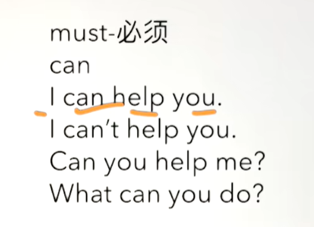

​	在使用must的时候是不存在第三人称单数，不需要加s

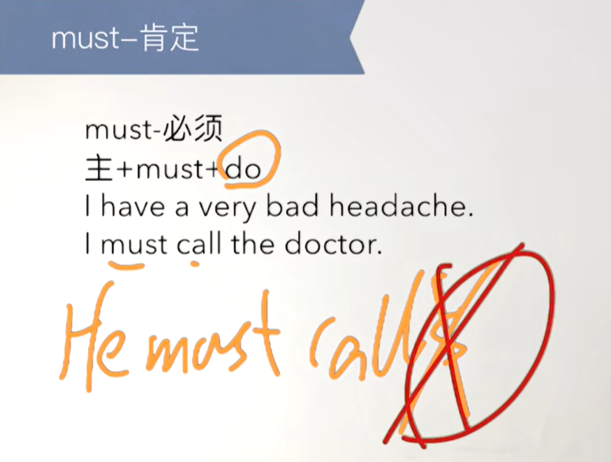

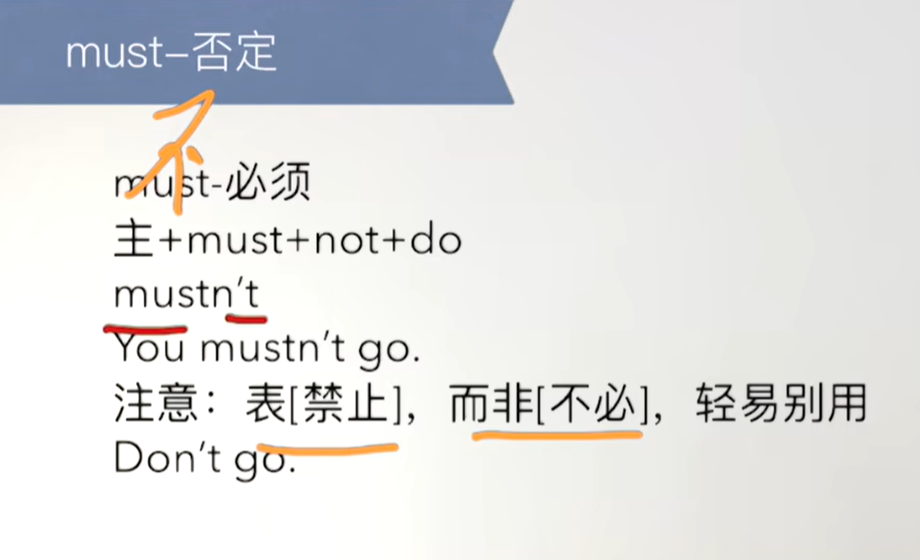

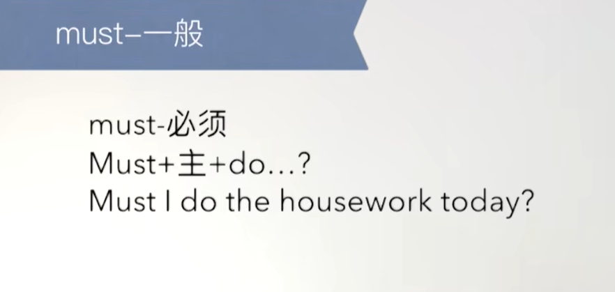

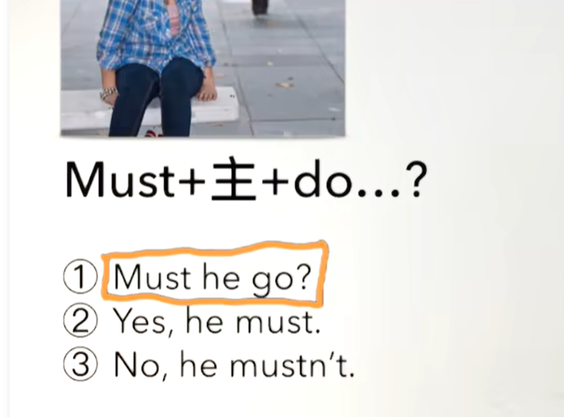


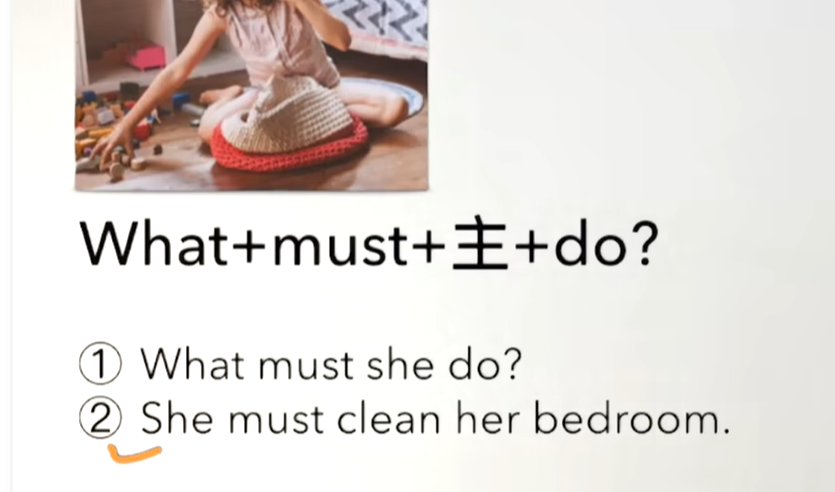


### 3、Word


#### 	1、better -- 更好

```
1、good的比较级 good是好 better是更好

2、I am/feel better -- 我更好
```


#### 	2、certainly 是副词-- 当然了，没问题


#### 	3、get up -- 起床、  yet -- 还，仍然

```
1、wake up -- 醒来
2、I always wake up at 6，but I remain in bed，and get up at 8 -- 我总是在6点醒来但是一直在床上，到8点的时候才起床

```


#### 	4、rich -- adj 油腻的 food -- un 食物

```
rich在名词的时候是 富有的意思

1、rich food -- 油腻的食物
2、I don't like rich food -- 我不喜欢油腻的食物
3、My friend likes rich food -- 我便宜喜欢油腻的食物
	注意这个动词三单
```


#### 	5、remain -- v 停留

```
1、He must remain in bed -- 他必须停留在床上
2、he mustn't get up yet -- 他还不能起来，禁止起来
```


### 4、Homework

```
1、单词造句 每个单词3句
		better 更好
	1、I am better --我变得更好了。
	2、He Looks better -- 他看起来好多了。
	3、I feel better -- 我感觉好多了
	
		certainly 当然，没问题
	1、certainly, I can -- 当然，我可以
	2、This question is certainly difficult -- 这个问题当然很难
		get up
	1、You must get up early today
	2、You should get up early today.（你今天应该早起。）
	3、You need to get up early today.（你今天需要早起。）
	
		rich food -- 油腻食物
	1、I don't like rich food
	2、Don't eat too much rich food
	3、You mustn't eat rich food
	
		remain -- 停留
	1、Don't remain the here
		问题: “remain”后面不需要加“the”，而且“here”前也不需要“the
		Don't remain here. -- 不要留在这里。）
		
		
	2、He remain the bed 
		问题: 主语“he”是单数第三人称，动词需要用第三人称形式，即“remains”。同时，“the bed”不能直接跟在“remain”后面，应该用介词“in”。
		修改: He remains in the bed.（他依然在床上。）
		
		
	3、Does he remain the bed
		修改: Does he remain in the bed?（他还在床上吗？）


2、核心知识点
	这节主要讲解了如何使用must，must的使用与can一致，注意的是否定句的时候mustn't代表的是禁止的意思，一般不怎么使用，只有一些带有身份的人才会使用禁止的语言，平时don't还是使用的多一些
	还学习了短语起床 get up、当然没问题是用certainly
	rich在形容词的时候可以代表为油腻的
	
	
	
	
	
	
```


### 5、Story

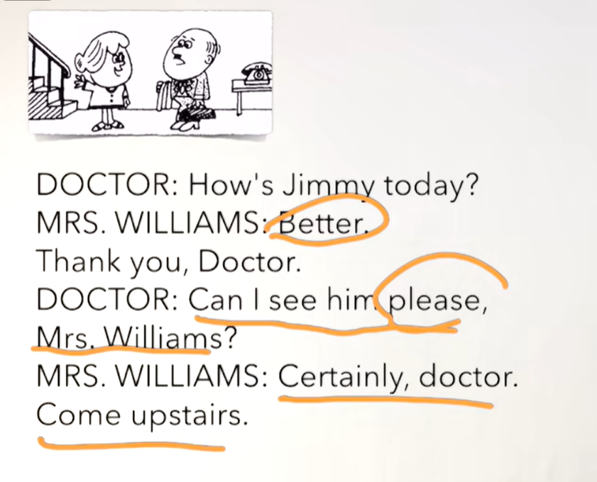

```
	今天吉米怎么样？
	好多了
	我能看一下他吗威廉夫人
	当然，医生请到楼上
	
```


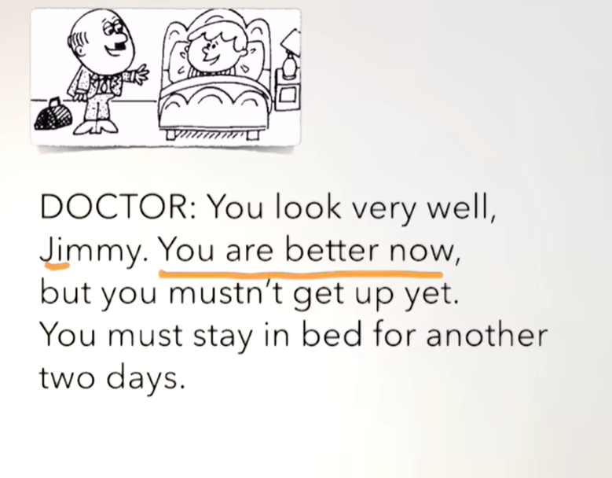

```
	你看起来非常好吉米
	你现在好多了，但是你还不能起来 -- yet是还
	你必须在床上多呆俩天		-- another 另外 再呆
	
```


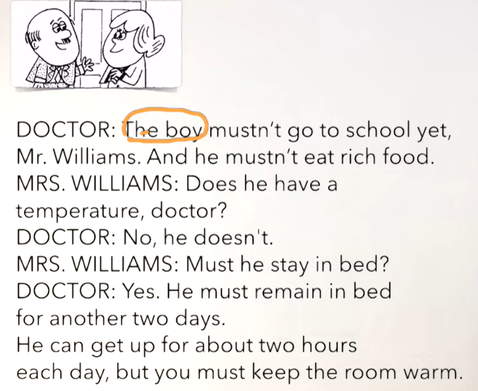

```
	这个男孩还不能去上学威廉夫人
	而且他不能吃油腻的食物
	他是不是发烧了，医生？
	不，他没有发烧
	他必须待在床上吗？
	是的，他必须停留在床上，再停留俩天
	他可以起床大概每天停留2个小时 -- about 大概
	但是 你必须保持房间温暖  -- keep保持  warm温暖
```


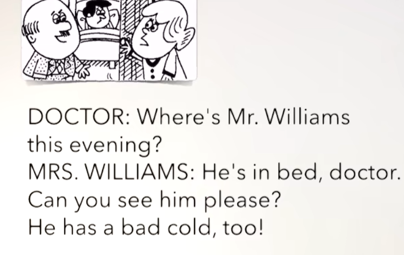

```
	威廉先生今晚在哪呢？
	他在床上，医生 你能看一下他吗？
	他也得了重感冒
```


### 6、Homework

```
1、绿皮书 63课

2、文章熟读成诵

3、核心知识点
	这节主要是如何使用must，与can的使用一样
	表达当然了没问题可以使用 certainly

```


## lesson 64


### 1、Question

#### 	1、如何表达与某人玩？

​		play with sb

#### 	2、如何表达同某人讲话？

​		talk to sb


#### 	3、如何表达探出窗外？

​			lean out of window

### 2、Word

#### 	1、play -- v 玩

```
1、play with sb -- 和谁玩
2、Don't play with him -- 不要和他一起玩
3、Can I play with him？ -- 我能和他一起玩吗？
4、He is gonna play with his parents this weekend -- 这周末他要去和他的家长一起玩

```


#### 	2、match -- n 火柴

```
1、play with matched -- 玩火柴
2、I can't find the matches -- 我找不到火柴了
3、Can you find the matches？ -- 你能找到火柴吗？
```


#### 	3、talk -- v说话 谈话

```
1、talk to sb -- 和。。。说话
2、Don't talk to me now -- 现在不要和我说话
3、I'm gonna talk to him -- 我要和他谈谈
```


#### 	4、library -- n 图书馆

```
1、go to the library -- 去图书馆
2、He goes to the library on sundays -- 他每个周末要去图书馆 -- 根据sundays可以断定是一般现在时
3、Does he go to the library on Sundays -- 他每个周末都去图书馆吗？
	一般疑问句有了，那么特殊疑问句也就有了，可以变Who Where What。。。。
4、When does he go to the library？ -- 他什么时候去图书馆？
5、Where does he go on Sundays？ -- 他周末一般去哪？
```


#### 	5、drive -- v 开车

```
1、drive my car --开我的车
2、Call me later please I'm driving -- 请稍后给我打电话，我现在正在开车
3、You can drive my car to school -- 你能开我的车去学校
```


#### 	6、so -- adv 如此地， quickly -- adv 快地，迅速地

​	so quickly -- 如此的快

```
1、You are driving so quickly -- 你现在开车如此的快
2、please slow down -- 请慢下来
3、Don't drive so quickly -- 不要开车如此的快
```


#### 	7、lean out of -- 探出，靠出

```
1、Look,they are leaning  out of the windows -- 看他们正在探出窗外
2、Don't lean out of the windows -- 不要探出窗外
```


#### 	8、break -- v. + n 打碎，敲碎

```
1、break the window -- 敲碎这个玻璃
2、break my arm -- 我的胳膊折了
3、Are you going to break that window？ -- 你要把那个窗户弄碎吗？
```


#### 	9、noise -- n 声音

```
1、make a noise -- 弄出声响
2、Don't make a noise -- 别弄出声响
```


#### 	10、take any aspirins -- 吃一些阿司匹林


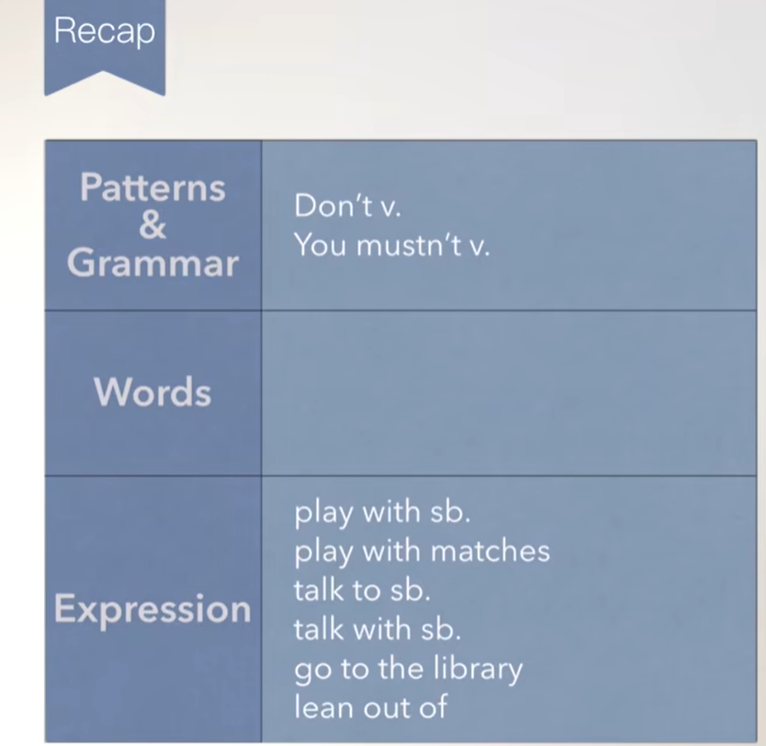


### 3、Homework

```
1、绿皮书64课

2、单词造句 3

3、核心知识点
	这节主要讲了如何表达与某人玩 play with sb
	同某人讲话 talk to sb
	探出窗外 lean out of window
	
```


