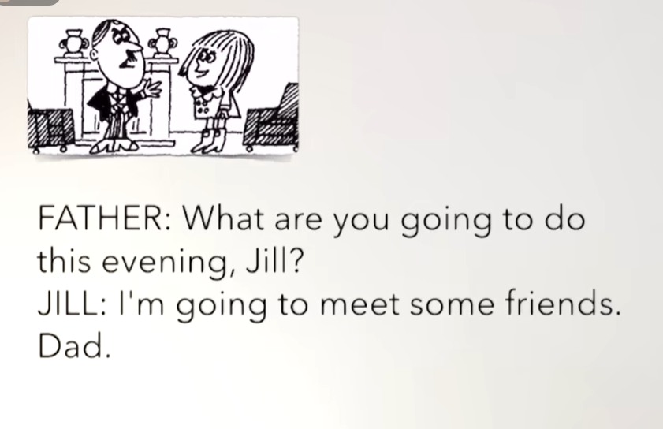
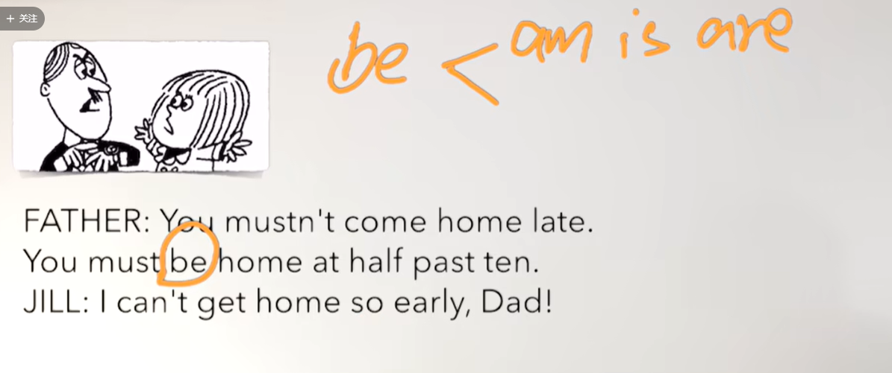
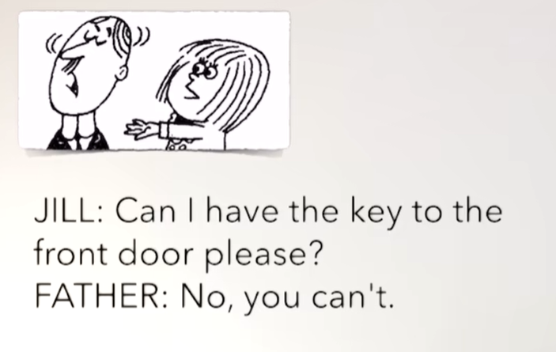
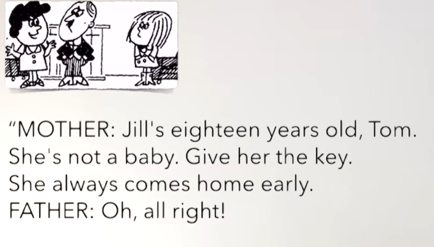
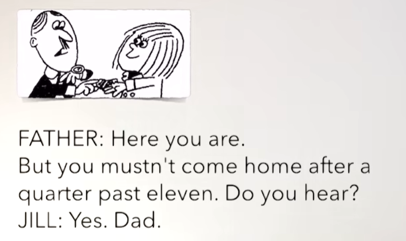
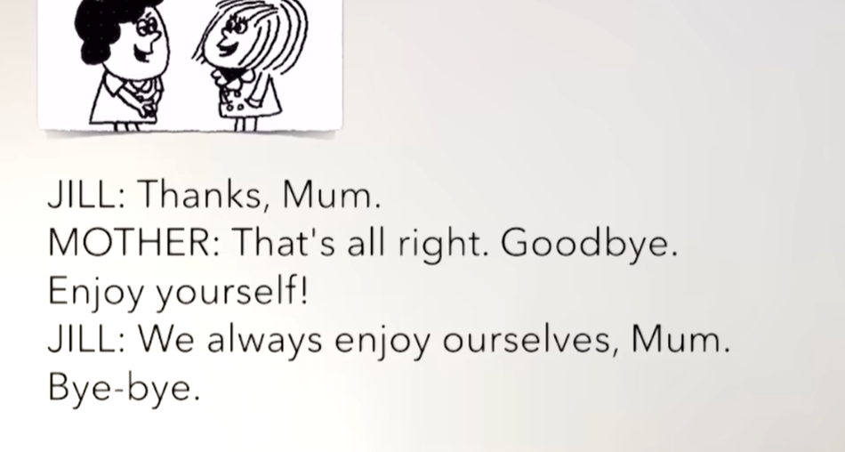
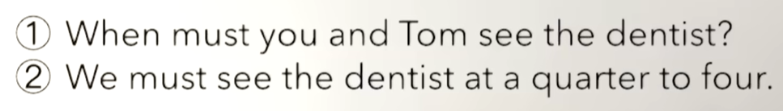
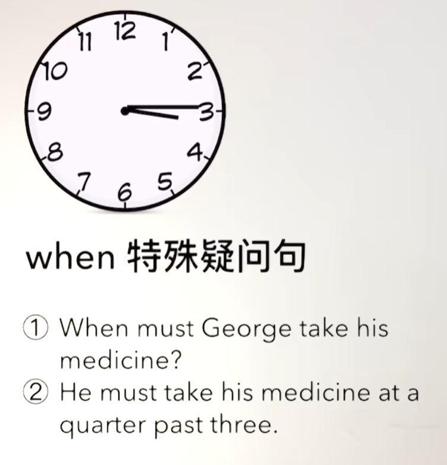
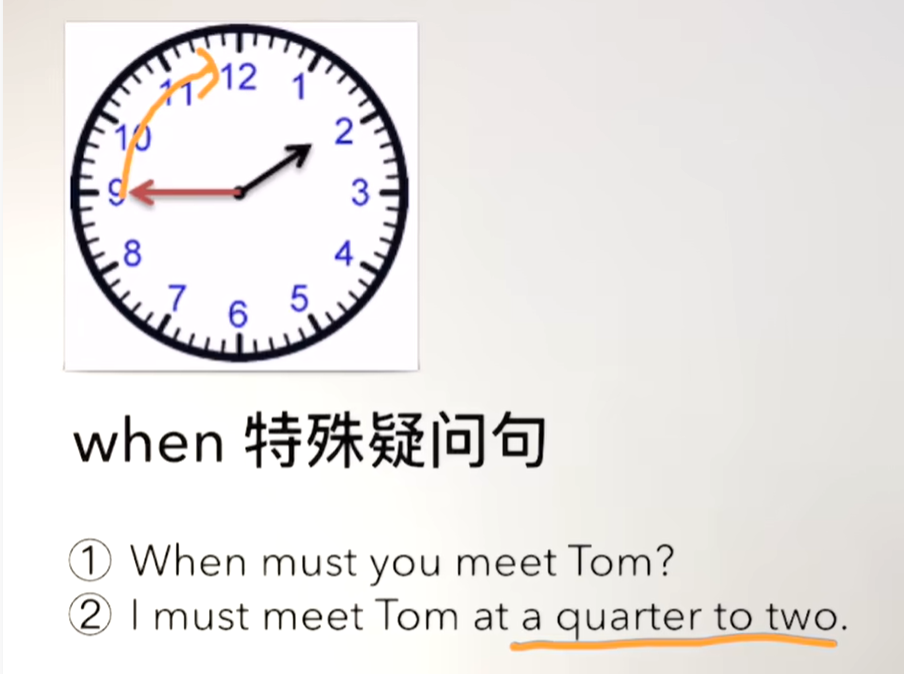

# 35、lesson65-66-时间的表达

## lesson65


## 1、Question

#### 	1、如何表达 你能听见我说话么？

​		1、Can you hear me ？ -- 你能听到我吗？

​		2、Do you hear that ？ -- 你听到了吗


#### 	2、如何表达玩的开心？

​		enjoy yourself -- 享受你自己


## 2、Word

#### 	1、Dad -- 爸爸 mum -- 妈妈

​			这俩个词是比较儿童化的用语

​	例句：

​		1、My dad is driving now -- 我爸爸正在开车

​		2、My mum is going to call my dad -- 我妈妈要给我爸爸打个电话


#### 	2、Key -- n 钥匙

​	例句：

​		1、**Can** you find the key？ -- 你能找到这个钥匙吗？

​		2、I **am cleaning** the key now，It's very dirty -- 我正在清理这个钥匙，它特别脏

​		3、She **is going to** give me the key -- 她打算把这个钥匙给我

​		4、He **takes** the key to school everyday -- 他每天拿着这个钥匙去上学

​		5、You **must take** the key with you -- 你必须要拿着这个钥匙


#### 	3、baby -- n 宝贝

​	例句：

​		1、This is her baby -- 这是她的宝宝

​		2、Is this her baby？

​		3、Whose baby is this？ -- 这是谁的(宝ᴗ宝)

​		4、The baby looks ill，We must call the doctor -- 这个宝宝看起来病了，我们必须要给医生打电话


#### 	4、hear -- v 听到

​	例句：

​		1、Can you hear me ？ -- 你能听到我吗？

​		2、Do you hear that ？ -- 你听到了吗

​		3、I can't hear it -- 我听不到

​		4、Why can't you hear it？ -- 为什么你听不到呢？


#### 	5、enjoy -- 享受， yourself -- 你自己

​	例句：

​		enjoy yourself -- 享受你自己

​		1、We're gonna have a party tonight -- 我们今晚要举办一个聚会

​		2、enjoy yourselves -- 享受你自己（祝你们玩的开心） -- 名词变复数 f变为ves


#### 	6、enjoy ourselves -- 祝我们自己玩的开心

​	例句：

​		1、We're gonna have a party tonight We're gonna enjoy ourselves -- 我们今晚有个聚会，我们会玩的很开心的。


## 3、Story



​		你打算今晚去做什么 Jill？

​		我打算去见一些朋友 爸爸



​	你不能晚回家。你必须在十点半前到家

​	我不能那么早到家 爸爸



​			我能不能有前门的钥匙？

​			不，你不能



​	Jill已经18岁了tom，她不是一个小孩了，把钥匙给她

​	她总是会早早回家

​	噢，好吧




​			给你

​			但是必须在11点15前到家，你听到了吗？

​	



​		谢谢妈妈

​		不客气，再见，玩的愉快

​		我们总是玩的很愉快 ，妈妈 再见


## 4、Homework

```
1、绿皮书 65

2、文章熟读成诵

3、核心知识点
```


## lesson66


## 1、When特殊疑问句

​	例句：

​	1、When must you come home？ -- 你必须什么时候回家？

​	2、I must come home at one o'clock -- 我必须一点到家








## 2、Homework

```
1、绿皮书66课

2、整理与人称相关的词汇
	已整理
	
	
```


