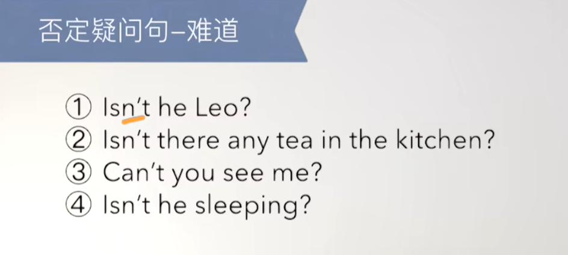
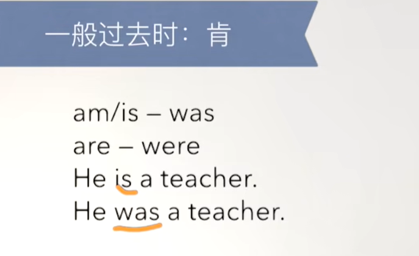
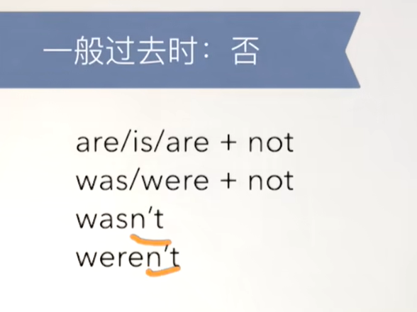
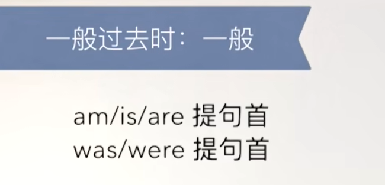
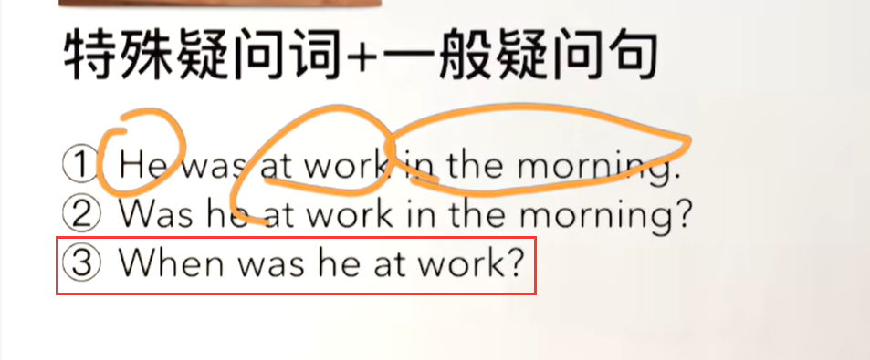
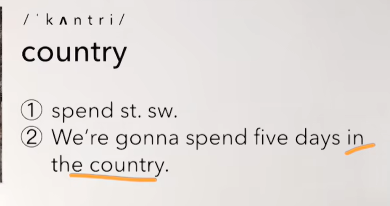
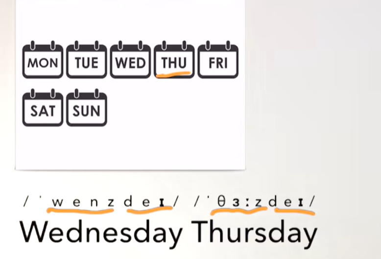
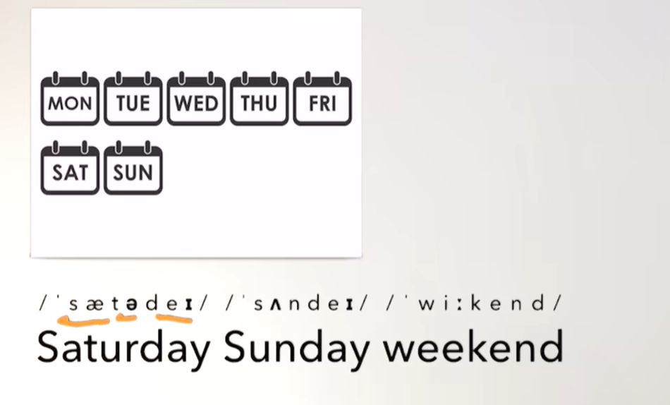

# 36、lesson67-68-一般过去式


## lesson67


### 1、Question

#### 	1、否定疑问句？

​			Aren't you lucky -- 难道你不幸运吗？ -- 代表你肯幸运




###   2、Grammer


#### 	1、一般过去时--was/were?



​	例句：

​			1、We were at home in the morning -- 早晨的时候我们在家

​			2、Now we are at school -- 现在我们在学校



​	例句：

​	1、They were not at school -- 他们之前没在学校

​	2、She was not thirsty -- 她之前并不渴

​	3、This wasn't us -- 这不是我们干的




​	1、She was hungry

​	2、Was she hungry？  -- 她之前饿了吗？





#### 	2、如何表达缺席？

​		1、be absent from -- 某人从某地缺席了

​		2、Tim is absent from school again -- Tim 又缺课了


#### 	3、如何表达乡村音乐？

​		country music -- 乡村音乐


### 3、Word

#### 	1、greengrocer -- 蔬菜水果商


#### 	2、absent -- 缺席

​		1、be absent from -- 某人从某地缺席了

​		2、Tim is absent from school again -- Tim 又缺课了


#### 	3、spend -- v 度过

​	1、spend st. sw. -- st 某些时间，sw 某些地点

​	2、The students spend five days in the school every week -- 学生们每周都会花费/度过 五天的时间在学校


#### 	4、country -- 国家

​		也可以代表乡村的意思



​		我们打算去乡村--花费五天的时间

​		我们要去乡村呆五天


​		country music -- 乡村音乐

​		

#### 	5、lucky -- 幸运的

​		1、lucky number -- 幸运数字

 		2、He was very lucky -- 他之前很幸运


#### 	6、星期

​	

 




​	Friday --周五




### 	4、Homework

```
1、单词造句 3

2、注意was/were的使用和变换规则

3、核心知识点

```


​	

## lesson68


### 1、Word

#### 	1、church -- 教堂

​	例句：

​	1、at church

​	2、He is always at church on Sundays

​	3、He was at church last Sunday


#### 2、dairy -- 乳制品


#### 3、baker -- 糕点师

​	1、at the baker's -- 在蛋糕店


#### 4、grocer -- 杂货商，食品商

​	1、at the grocer's -- 在杂货店

​	2、Were you at the grocer's      --  你之前在杂货店吗？


 