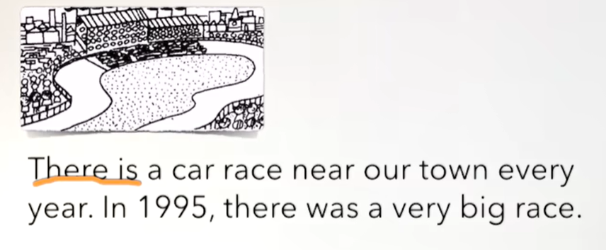
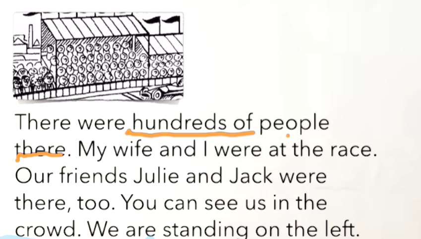
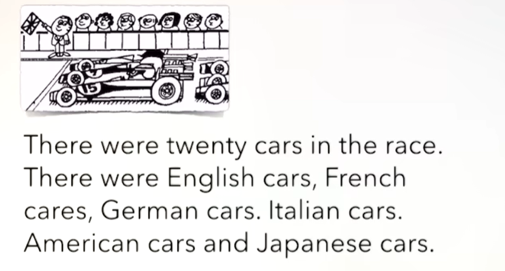
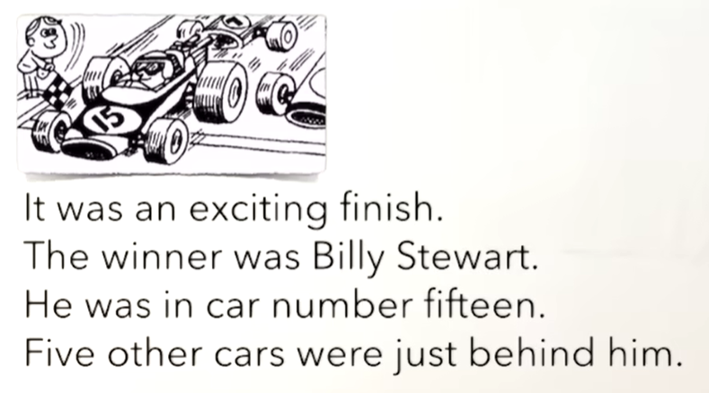
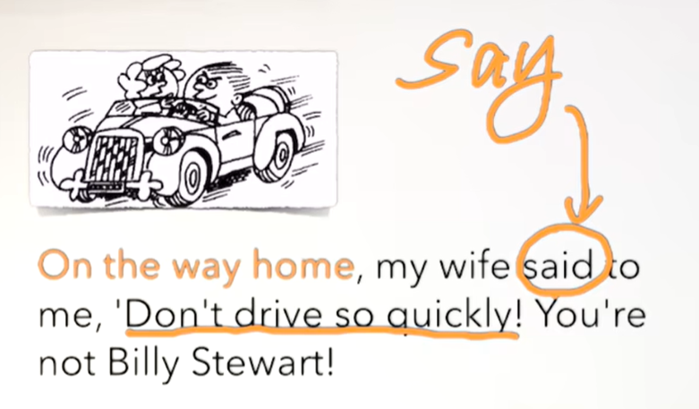

# 38、lesson69-70-There was/were


## lesson69


### 1、Question

#### 	1、如何表达 明年&去年？

​			next year -- 明年

​			last year -- 去年


#### 	2、如何表达 一大群人？

​			a large crowd of people -- 一大群人


#### 	3、如何表达  在回家的路上？

​			on the way home -- on the way home


### 2、Grammer

#### 	1、there be 


#### 	2、There is/are + sth + sw ---- 某地有某物，sw某地


#### 	3、There was/were + sth + sw -------  过去某地有某物，因为使用了was/were 过去式

​			There was a pen on the table -- 之前在桌子上有一支笔


### 3、Word

#### 	1、year -- 年

​	1、next year -- 明年

​	2、I'm gonna buy a new car next year -- 我打算明年买一辆新车

​	3、last year -- 前年，去年

​	4、I was in Auckland last year -- 我去在奥克兰


#### 	2、race -- n 比赛

​	1、car race -- 赛车

​	2、We're gonna watch a car race tonight -- 我们今天晚上打算去看赛车比赛

​	3、We must leave now。The car race is at 8. ---- 我们现在必须要离开了，这个汽车比赛是在八点


#### 	3、twon -- n 小镇

​	1、this is a small town -- 这是一个小镇

​	2、She lives in a small town -- 她住在一个小镇

​	3、Does she live in a small town？ 

​	4、Where does she live？

​	5、Can you find that town on the map？ -- 你能在地图上找到那个小镇吗？

​	6、Can you remember the name of the town？ -- 你记得这个小镇的名字吗？


#### 	4、crowd -- n 人群

​	1、a large crowd of people -- 一大群人

 	2、You can see a large crowd of people on the street -- 你能看到在街上有一大群人


#### 	5、stand -- 站

​	1、She is standing -- 她正在站着


#### 	6、exciting -- adj 令某人兴奋的

​	1、This is exciting -- 这个事情令人激动


#### 	7、behind -- prep 在...后面

​	1、Can you see the boy？

​	2、He is standing behind the tree

​	3、Why is he standing behind the tree -- 为什么他正站在树的后面


#### 	8、finish n -- 完成  winner n -- 获胜者 just -- 仅仅

​	1、They are running -- 他们正在奔跑

​	2、Tim is winner -- tim是获胜者

​	3、This is an exciting finish -- 这是一个令人激动的终点

​	4、Two people are just behind him -- 有俩个人紧随在他的后面


#### 	9、way -- 路

​	1、on the way home


### 4、Homework

```
1、单词造句 3

2、核心知识点
	这节主要讲了 There be 的过去表达，代表过去的某地有某物
	There was a pen on the table


```


### 5、Story



​		在我们小镇的旁边每年都有赛车比赛

​		在1995年，当时有一个非常大的比赛




​	之前那里有数以百计的人。我的妻子和我当时也在比赛的这个地方。

​	我们的朋友们Julie和Jack当时也在那里。你能看到我们在人群中。

​	我们正站在左边。




​	当时有二十辆车在比赛。

​	当时有英系车，法系车，德系车，意大利车，美系车和日系车。




​		这是一个特别令人激动的结尾

​		这个获胜者是Billy Stewart

​		他在15号车中

​		当时有五辆汽车紧随在他的后面




​	在回家的路上，我的妻子对我说，不要开的太快

​	你不是Billy Stewart


### 6、Homework

```
1、绿皮书69
2、熟读成诵
 
```


## lesson70


### 1、Word

#### 	1、stationer -- 文具商

​	1、at the stationer's -- 在文具店

​	2、Were you at the stationer's？ 你之前在文具店吗？

​	3、Where were you？ -- 你之前在哪


#### 	2、Denmark -- 丹麦

​	1、She comes from Denmark -- 她来自丹麦


### 2、Homework

```
1、绿皮书 70

2、核心知识点

```


