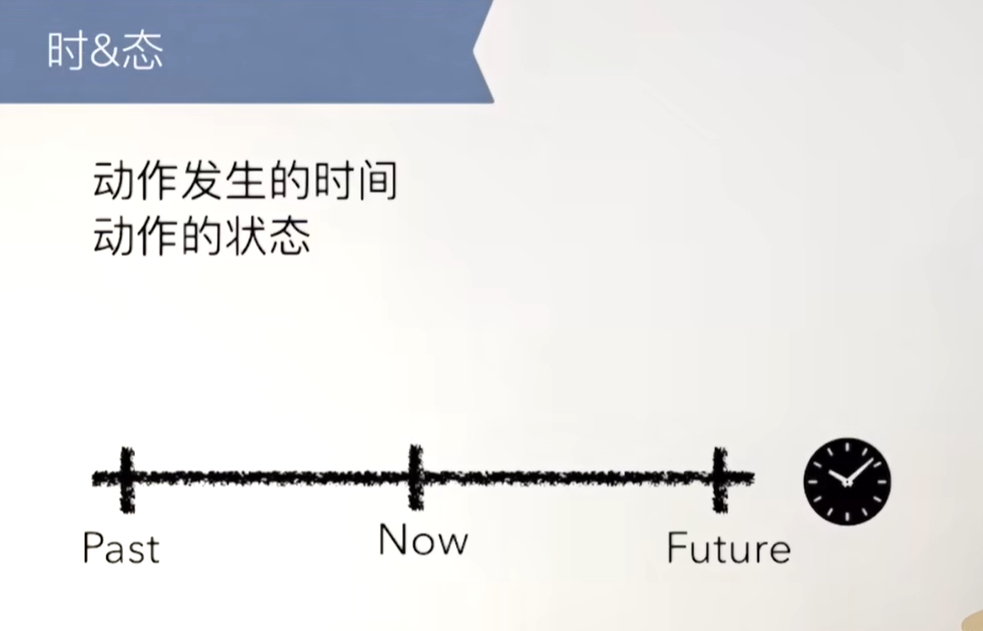
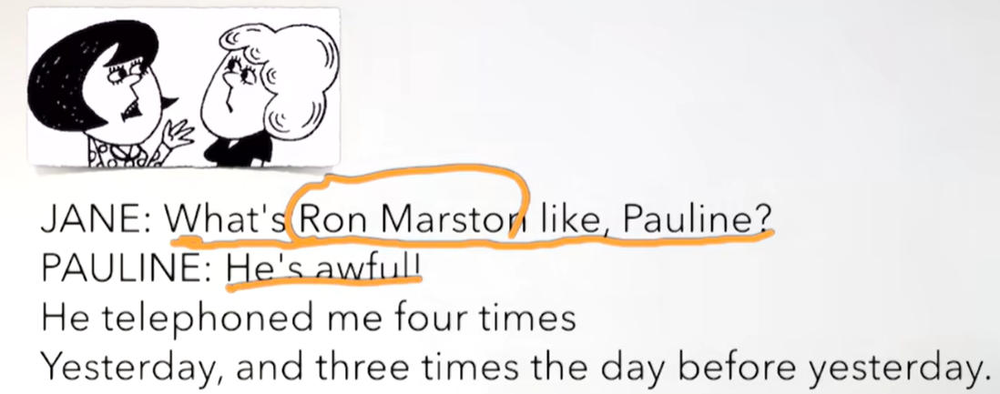
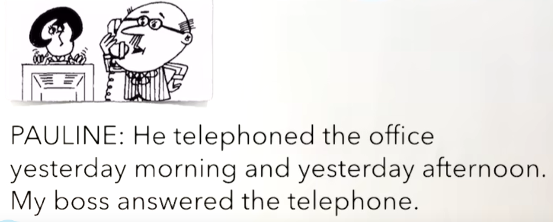
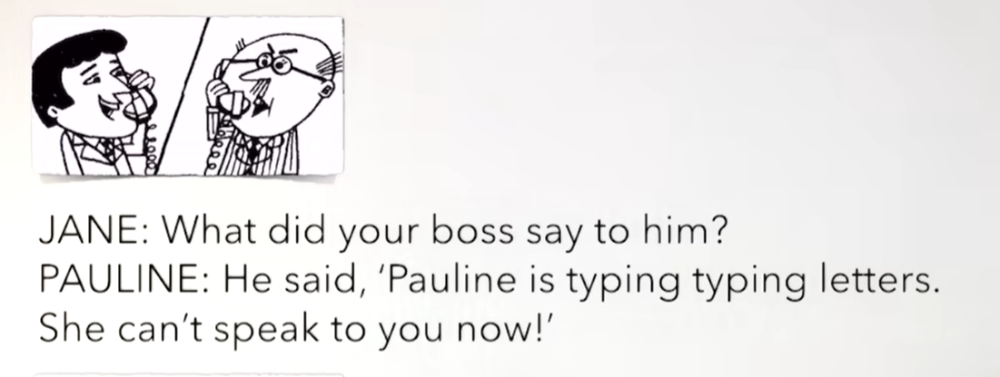
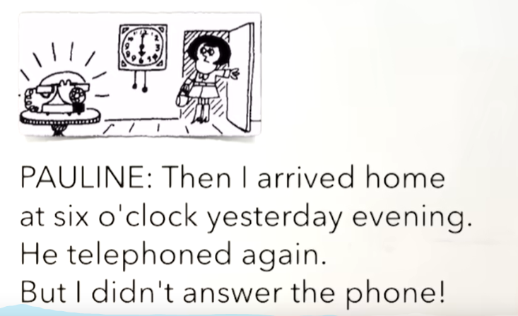
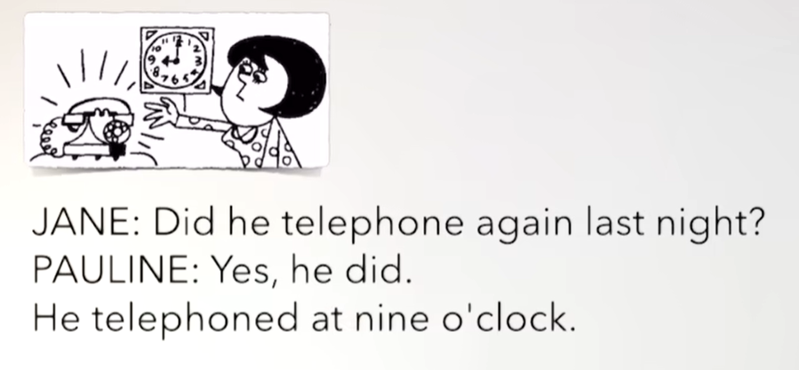
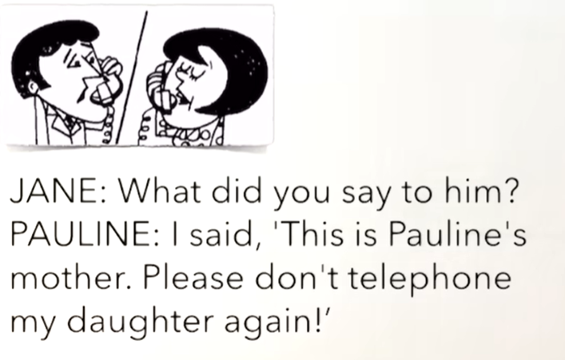
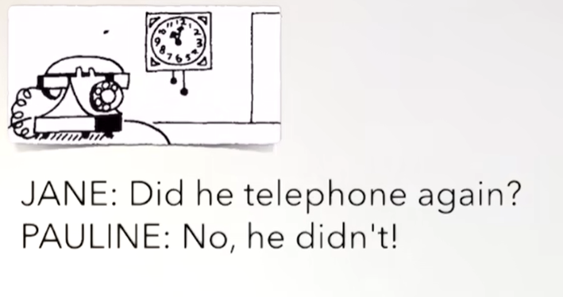
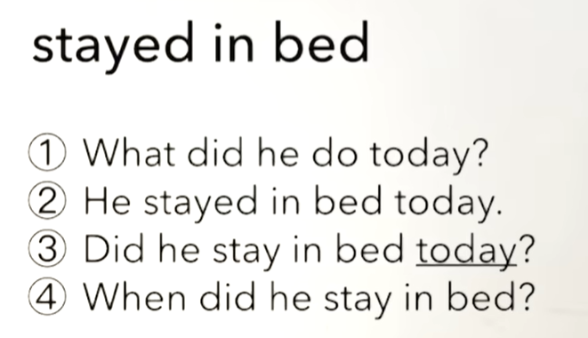

# 39、lesson71-72-一般过去式did


## lesson 71

### 1、Question

#### 	1、一般过去式Did？



​	现在我们了解一下**过去发生的动作** 如何表达

​	例句：

​		1、Do you love me？

​		2、I love you

​		3、I loved you -- 动词从原形love变为了动词过去式 loved ---- 我曾经爱你


##### 		1、v -- v.ed 过去式，动词+ed就变成动词的过去式，规则的都是+ ed，不规则的后续再了解

##### 		2、如果动词的结尾是e，且结尾e不发音 我们可以直接 +d --动词过去式

##### 		3、如果是辅音字母+y结尾，y变为ied，如empty -- emptied

##### 		4、元音字母+y结尾，直接 + ed ，如play -- played

##### 		5、双写+ed，如stop -- stopped


#### 	2、一般过去式-否定句

​			一般现在时我们之前使用的是Do Does，而一般过去式 使用的是Did

​			否定句的时候是 Did + not = didn't

​			如：I **didn't talk** to him yesterday

##### 			注意：否定句的时候动词使用原形

 

#### 	3、一般过去式--一般疑问句

​		我们之前的是一般现在时 使用的do/does 提句首 v动词变原形

##### 		1、did 提句首，v 变原形 -- 这个是一般过去式的一般疑问句

​			Did you love me? -- 你曾经爱我吗？


#### 	4、一般过去式--特殊疑问句

##### 		1、What + did + 主 + do ？

​	例句：1、What did he do yesterday afternoon？ -- 他昨天下午做了什么？


## 2、Word

#### 	1、awful --adj 特别差

​	例句：

​		1、It smell awful -- 它闻起来特别差

​		2、He is awful -- 他特别差


#### 	2、telephone v n  phone -- 电话

​		1、call me -- 打电话给我

​		2、I must telephone the doctor -- 我必须打电话给医生

​		3、They're gonna buy a new phone -- 他们将要去买一个新的电话


#### 	3、time -- 时间、次数

​		1、How many times -- 多少次

​		2、He telephoned me four times yesterday -- 他昨天给我打了四次电话

​		3、How many times did he telephone you ？ -- 他给你打了几次电话


#### 	4、answer -- v 回答，接电话

​		1、Are you going to answer that phone？ -- 你要去接那个电话吗？

​		2、Can you answer the phone？ -- 你能接一下这个电话吗？


#### 	5、last -- 上一个

​		1、last night -- 上一个晚上

​		2、last week -- 上周

​		3、last year -- 去年 

​		4、He telephoned me four times last night -- 他昨晚给我打了四次电话

​		5、Did he telephone you last night -- 他昨晚给你打电话了吗？

​		6、When did he telephone you？ -- 他什么时候给你打的电话？


#### 	6、say-said v -- 说 again -- 再一次

​			不规则的过去式变换 say 变为said

​		1、What did you say？ --- 你刚刚说什么？

​		2、Can you say it again？ Pardon？ -- 你能再说它一次吗？ --- 这句话类似于 Pardon


## 3、Homework

```
1、单词造句 3

2、红皮书 查看did

3、核心知识点
	这节主要就是讲了一般过去式，与一般现在时使用的助动词 do/does的区别是，过去式使用的助动词是did，动词v使用的是过去式 v + ed
	否定句是did + not，在否定句的时候 v 动词变为原形
	一般疑问句 did提句首和之前没什么区别，v 动词使用原形
	特殊疑问句，特殊疑问词提句首，动词使用原形
	
	
```


## 4、Story



​	他这个人怎么样，Pauline？

​	他有点差

​	他昨天给我打了四次电话，并且前天（昨天的前一天）给我打了三次电话




​	他在昨天早晨和昨天下午打电话到办公室

​	我老板接了这个电话




​		你的老板和他说了什么？

​		他说 Pauline 正在打信，她现在没办法和你说话




​	然后我在昨天晚上6点回到的家

​	他再次的打电话，但是我没有接这个电话




​		他昨晚又打了一次电话吗？

​		是的，他打了

​		他在9点打的电话




​		你对他说了什么？

​		我说，这是Pauline的妈妈，请不要再给我女儿打电话了。




​	他后来又打电话了吗？

​	不，他没有打


## lesson 72

72课都是练习 -- 过去式的句型练习




