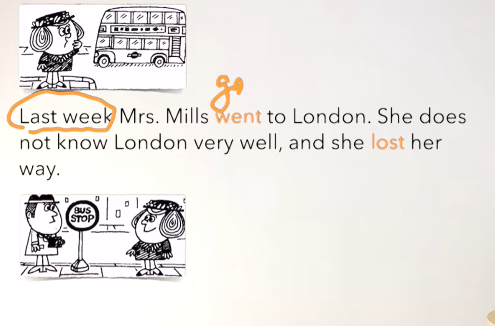
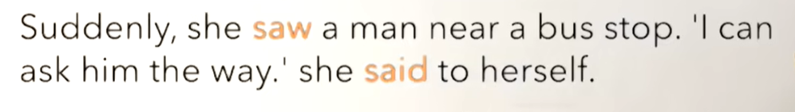
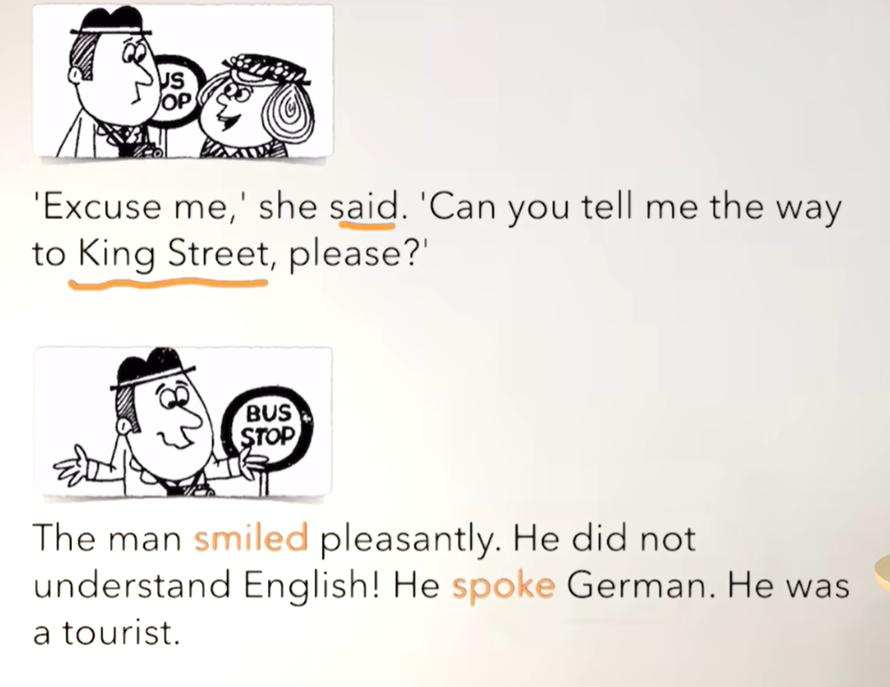
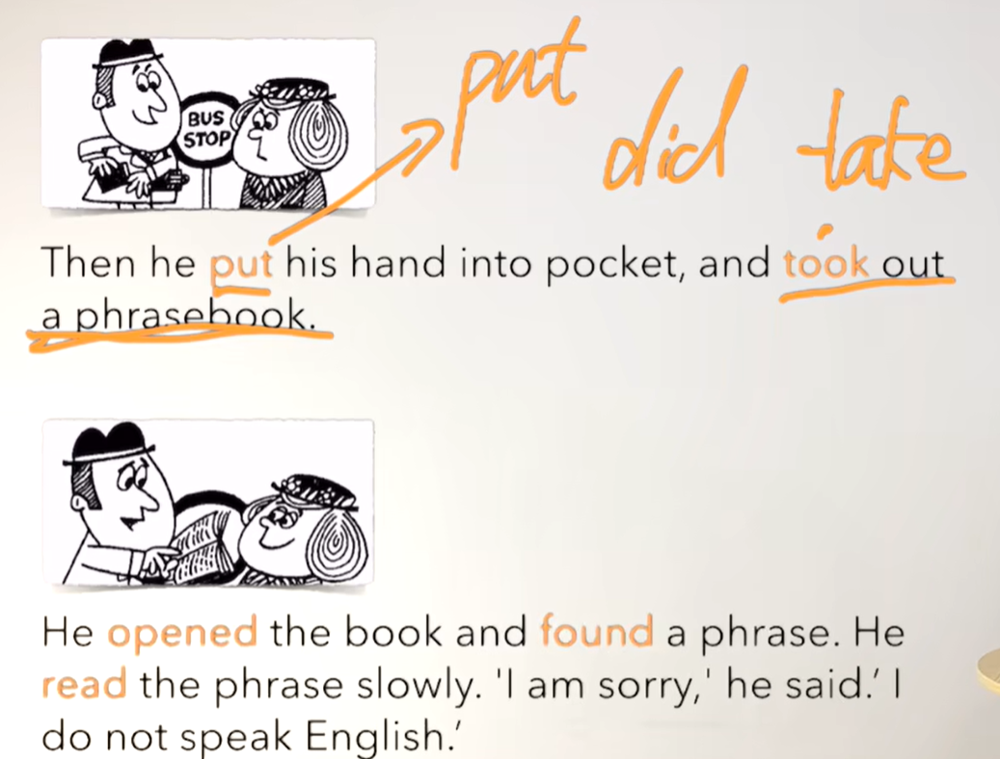
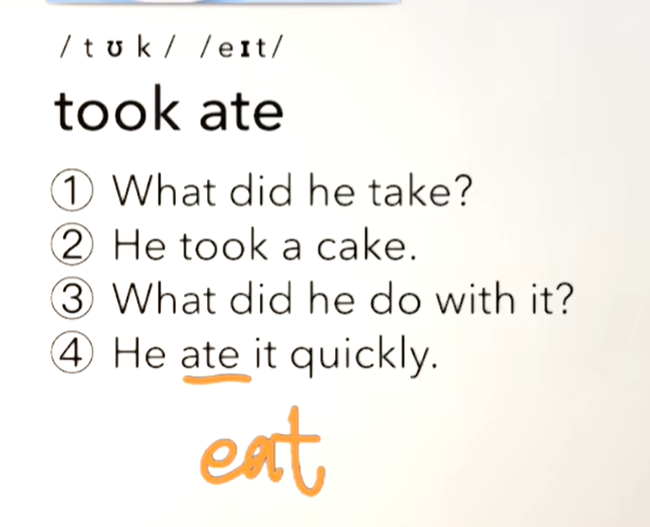

# 40、lesson73-74-动词v+副词adv


## lesson73


### 1、Question

#### 	1、如何使用副词adv？

​		副词用于修饰v动词，...地

​		副词adv主要的一个用途就是 说这个动作的 如：公交车**突然**停止，这个突然就是副词用于修饰停止这个动作

​		1、Suddenly，the car stopped near the bus stop -- 突然这个车停到了公交车站的旁边


#### 	2、如何表达紧密相连？

​			go hand in hand -- 紧密相连 == closely connected


#### 	3、如何表达我不懂？

​				I don't understand -- 我不明白


### 2、Word

#### 	1、go -- went -- v 去

​		went 是go的过去式

​	1、They go to school everyday

​	2、I went to school yesterday too -- 我昨天也去学校了

​	3、Did you go to school yesterday？ -- 你昨天去学校了吗？

​	4、When did you go to school？ -- 你什么时候去学校？


#### 	2、week -- 周

​	weekday  -- 工作日，weekend --周末

​	1、You called me last week -- 你上周给我打了个电话

​	2、Did you call me last week？

​	3、Why did you call me last week？


#### 	3、London -- 伦敦

​	She went to London last weekend


#### 	4、bus stop -- 站台，站点  suddenly -- adv 

​		副词用于修饰v动词，...地

​		副词adv主要的一个用途就是 说这个动作的 如：公交车**突然**停止，这个突然就是副词用于修饰停止这个动作

​	1、Suddenly，the car stopped near the bus stop -- 突然这个车停到了公交车站的旁边

​	2、Why did the car stop near the bus stop，suddenly？


#### 	5、smile -- v 微笑   pleasantly -- adv 愉悦地

​	1、Look，the little girl is smiling pleasantly -- 看 这个小女孩正愉快地笑着

​	2、She always smile pleasantly -- 她总是愉快的笑


#### 	6、understand -- v 明白  ，understood -- 曾经明白 -- 是过去式

​	1、I didn't understand at first. But now I understand -- 最初我不明白，但是现在我明白了

​	2、I understand -- 我明白了

​	3、I don't understand -- 我不明白

​	4、Do you understand ？ --- 你明白了吗？


#### 	7、speak -- v 说话 spoke -- speak的过去式

​	1、Do you speak English？

​	2、She spoke so quickly I didn't understand -- 她之前说话很快 我听不懂


#### 	8、hand -- n 手

​	1、hand+bag --手提包

​	2、I cleaned my hands -- 我之前清洗了我的手

​	3、Did you clean your hands？ -- 你之前清洗你的手了吗？


​	go hand in hand -- 紧密相连 == closely connected


#### 	9、pocket -- n 口袋

​		1、in the pocket -- 在口袋里面


​		2、He always puts his phone in the pocket -- 他总是把他的电话放到这个口袋里面


​		3、He put his phone in the pocket --- 之前他把他的手机放入口袋


#### 	10、phrase n -- 短语， phrasebook -- 短语书

​	1、I have a phrasebook  --- 我有一本短语手册

​	2、I must buy a phrasebook -我必须买一本短语书


#### 	11、slowly -- adv 缓慢地

​	1、walk slowly -- 走的很慢

​	2、He is old，and he is walking slowly -- 他老了，而且他走的缓慢


### 3、Homework

```
1、单词 3句

2、核心知识点
	这节主要讲了 副词 adv，adv的作用就是用来修饰动词v的。还有就是动词在过去式的变化


```


### 4、Story



​		上周Mills夫人去伦敦。她不是很了解伦敦，而且她不认识路




​	突然，她看到一个男人在公交站旁边。   ---- saw 是see的过去式

​	我能问他路呀，她对自己自言自语的说。 --- said 是 say的过去式




​	打扰了， 你能告诉我去 金街 怎么走吗？

​	这个男人愉快的笑了笑，他并不懂英文，他说德语。

​	他是一个旅客


 

​	然后他把手放入到他的口袋中，并且拿出一本短语书。

​	他打开这本书寻找一个短语，他缓慢的读这个短语。 对不起，我不说英文。


### 5、Homework

```
1、绿皮书73
2、文章熟读成诵

3、总结v动词 不规则的过去式


```


## lesson 74


### 1、Word

#### 	1、hurriedly -- adv 迅速一点 

​		以ly结尾的单词--很有可能是副词或形容词，这个我们需要关注下。

​	1、He shaved hurriedly -- 他之前迅速的刮胡子

​	2、He left the house hurriedly -- 他迅速的离开房子 -- left是leave的过去式 -- 离开

​	3、leave --- left


#### 	2、cut -- v 切，过去式还是cut

​	1、be careful，Don't cut yourself -- 小心，别切到你自己

​	2、Can you cut it for me？ -- 你能帮我切一下它吗？

​	3、I cut myself yesterday morning -- 我昨天早晨切到了自己


#### 	3、thirstily -- adv 非常渴地

​	1、He is drinking the water thirstily -- 他正在非常渴的喝水


#### 	4、greet -- v 打招呼，warmly -- adv 热情地

​	1、They are greeting each other warmly -- 他们正在非常热情地打招呼

​	2、He saw me and greeted me warmly -- 他之前看到我还热情地和我打招呼





