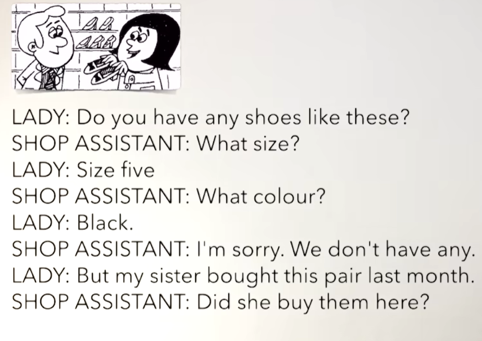
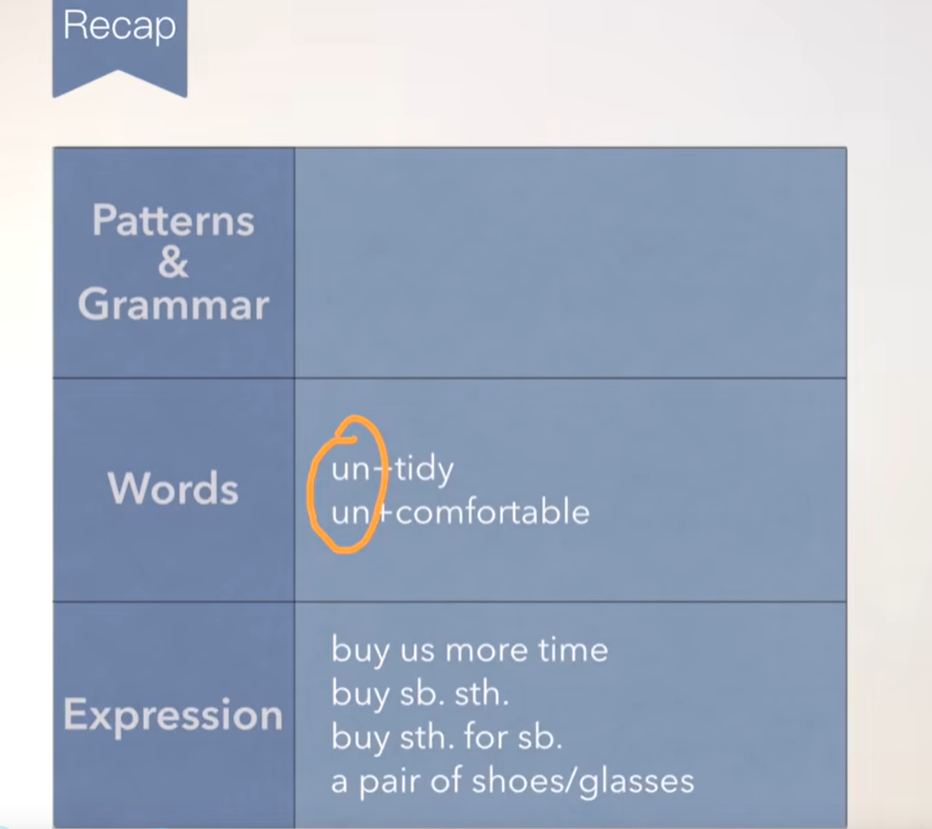
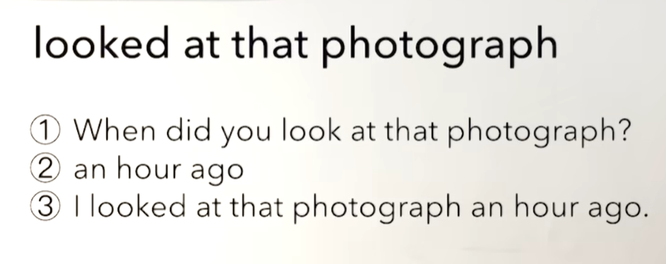

# 41、lesson75-76-给某人买某物

## lesson75

### 1、Question 

#### 	1、如何表达3年前？

​		three years ago

​		...之前 使用ago

#### 	2、如何表达买给某人某物

​		buy sb sth. / buy sth for sb 给某人买某物

#### 	3、如何表达 一双  一副？

​		a pair shoes 一双鞋

## 2、Word

#### 	1、ago -- 在...之前

​	1、N years ago --- 多少年以前

​	2、N months ago --- 多少月前

​	3、N days ago

​	4、N hours ago

​	5、N minutes ago

​	6、N seconds ago -- 多少秒之前

​	7、I met your mom 30 years ago -- 我预见你的妈妈是在三十年前

​	8、I went to Beijing 3 days ago --- 我在三天前去的北京

#### 	2、buy -- 购买 bought是过去式

​	1、buy sb sth. / buy sth for sb 给某人买某物

​	2、My dad bought this TV for us 2 months ago -- 我父亲在2个月前给我们买了这个电视

​	3、She bought her boyfriend  a watch -- 她给她的男朋友买了一块手表

​	4、buy us more time -- 给我们争取更多的时间

#### 	3、pair -- 双

​	1、a pair of shoes -- 一双鞋    a pair glasses -- 一副

​	2、She cleaned this pair of shoes yesterday  --- 她昨天打扫了这双鞋

​	3、He bought a pair of shoes for his girlfriend three days ago -- 她3天前给她女朋友买了一双鞋

#### 	4、fashion -- 时髦，时尚

​	1、in fashion -- 很时尚

​	2、This is in fashion -- 这个东西很时尚

​	3、out of fashion --- 不流行，不时尚了

​	4、Is this out of fashion --- 这个东西不流行了吗？

#### 	5、uncomfortable -- adj 不舒服

​	1、un + tidy --- 不整洁的     tidy -- 整洁的

​	2、SHe feels uncomfortable

​	3、We must call the doctor

#### 	6、wear -- 穿/戴 --- wore 是过去式

​	1、She wears a pair of black shoes -- 她穿着一双黑色的鞋

​	2、She  wore a white dress yesterday -- 昨天她穿了一件白色裙子

### 3、Story

​	你有像这样的鞋吗？

​	多大尺码？

​	5号

​	什么颜色？

​	黑色

​	对不起，我们没有这样的

​	但是我的姐姐上个月购买了这双

​	她是在我们这买的吗？

​	不，她在美国购买的。

​	我们在一个月前有一些像这样的鞋子，但是现在我们没有了

​	你能帮我拿一双吗？

​	I'm afraid 我恐怕我不能。

​	他们去年和前年还很流行，但是今年他们不流行了

​	现在这些鞋很流行

​	他们看起来很不舒服

​	他们是很不舒服，但是女人总是喜欢不舒服的鞋子  

#### 	recap

##  lesson 76

#### 	练习

 

