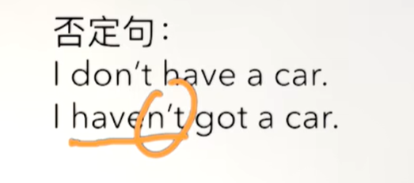
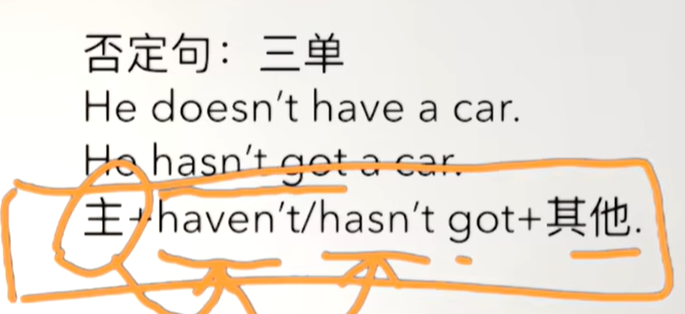
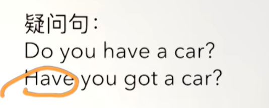
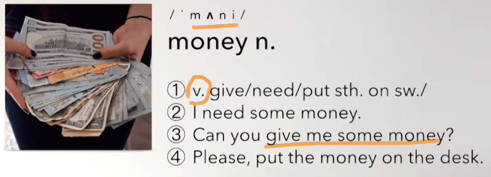
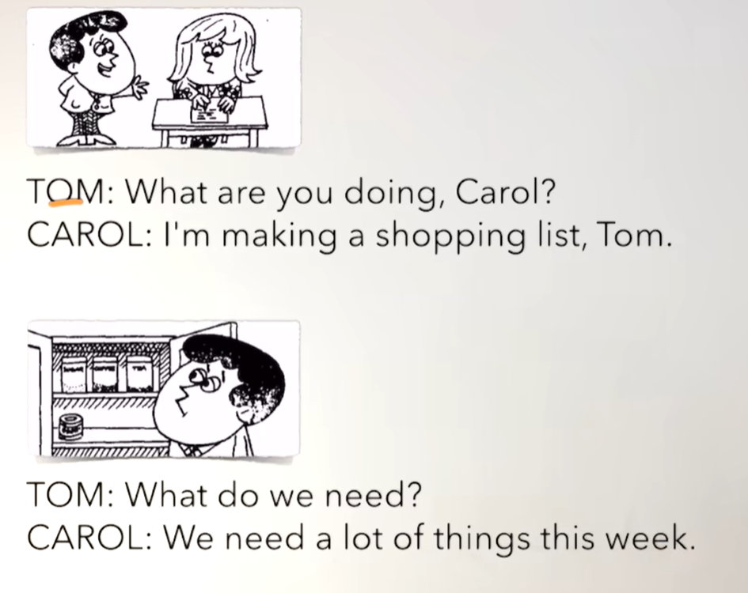
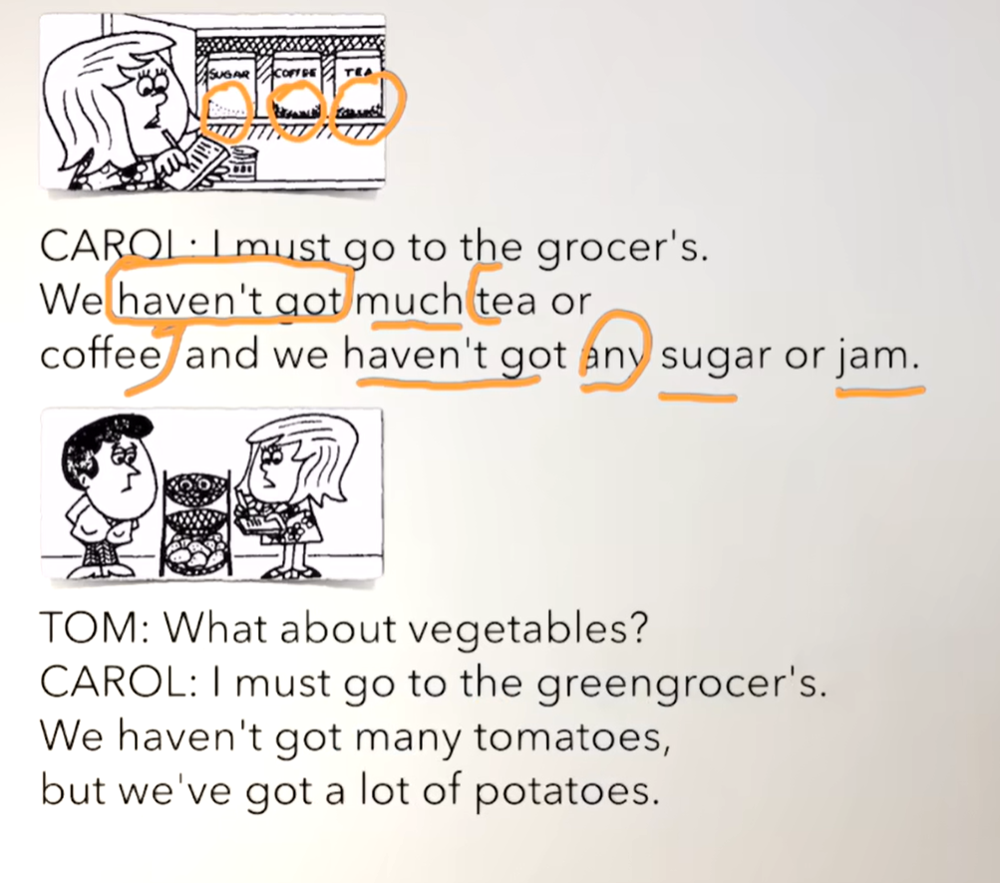
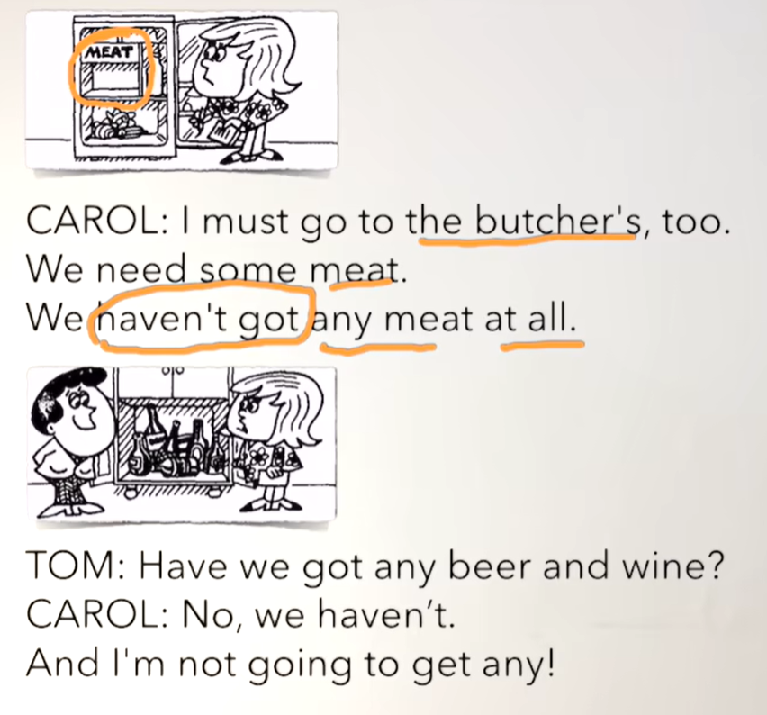
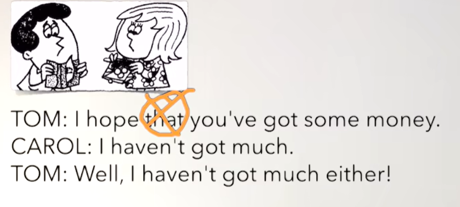

# 43、lesson79-80-many&much区别


## lesson79


### 1、Question

#### 	1、have got ？ 有

​		get的过去式是got

​		I have a car == I have got a car == 缩写 I've got









#### 	2、a lot of & many & much？

​		a lot of -- 许多，可以修饰cn，un（可数，不可数）

​	 	I have got a lot of money -- 我有许多钱

​		We have got a lot of potatoes -- 我们有许多土豆


​	much -- 许多

​	much + un -- much只加不可数名词，一般是在否定句，或疑问句中使用

​	There isn't much tea on the table --- 在桌子上没有许多茶


​	many -- 许多

​	many + cn -- 加可数名词

​	There aren't many dishes in the kitchen -- 在厨房没有许多盘子


### 2、Word

#### 	1、shopping list --- 购物清单

​	1、make a shopping list -- 制作一个购物清单

​	2、He's gonna make a shopping list			--- 一般将来时

​	3、He's making a shopping list -- 他正在制作一个购物清单 -- 现在进行时

​	4、He makes a shopping list every Friday --- 他每周五制作一个购物清单 -- 一般现在时

​	5、He **made** a shopping list last night --- 他昨晚制作了一个购物清单 -- 一般过去式

​	6、I can make a shopping list for you

​	7、You must make a shopping list


#### 	2、vegetable -- n 蔬菜

​	1、I bought some vegetables for my parents yesterday

​	2、I'm cleaning the vegetables


#### 	3、need -- v 需要

​	1、I need some help

​	2、Do you need help？


#### 	4、hope -- 希望


#### 	5、thing -- 事情，东西

​		1、Hope is a good thing -- 希望是个好东西


#### 	6、money -- n 钱

 	


### 3、Homework

```
1、单词+语法 造句 3

2、查看红皮书的语法 have got，a lot of，much，many

3、核心知识点
	这节主要是讲解了如何 have got 和 have a 表达的意思其实是一样的，只不过是有多种表达方式，如果使用have got的话，那么它的疑问句，否定句，过去式的否定句表达都是有些变化的。
	还有就是几个表达许多的词区别 a lot of 是适用比较全面的 cn可数，un不可数名词及肯否定句都能使用，而many是适用于cn可数名词中，much是适用于un不可数名词中，且疑问句中也较为常用
	
	
	
	
	

 
```


### 4、Story



​		你在做什么呢Carol？

​		我正在制作一个购物清单

​		我们需要什么？

​		我们这周需要许多东西




​	我必须去杂货店。

​	我们没有许多茶喝咖啡（不可数much）了，而且我们没有（any的否定一点也没有了）糖或者果酱了


​	那蔬菜呢？

​	我必须去蔬菜水果商店。

​	我们没有许多番茄（可数many）了，但是我们还有许多（a lot of 使用在了肯定句）土豆

​			------ many使用在了否定句中，a lot of 使用在了肯定句中--多数在肯定




​	我也必须去屠夫那里

​	我们需要一些肉

​	我们一点肉也没有了


​	我们啤酒喝红酒一点也没有了吗？

​	bu，我们没有了

​	而且我不打算买一些




​	我希望你有许多钱

​	我没有许多钱

​	好吧，我也没有许多钱


 


## lesson80


### 1、Word

#### 	1、groceries -- n 食品 杂货


#### 	2、fruit -- n 水果

​	1、I bought some fruit for you

​	2、Where did you buy these？ 你在哪购买的？

​	3、We're gonna clean these fruit in the kitchen --- 我们打算在厨房里清洗这些水果 


#### 	3、stationery -- n 文具

​	1、glue -- 胶水

​	2、envelop -- 信封

​	3、writing paper -- 信纸


#### 	4、newsagent -- n 报贩

​	1、That newsagent greeted me warmly yesterday -- 那个报贩昨天热情地欢迎我

​	2、Do you know that newsagent？ --- 你认识那个报贩吗？


#### 	5、chemist -- n  药剂师

​	1、Just go to the chemist's to get some medicine --- 去药房拿一些药


