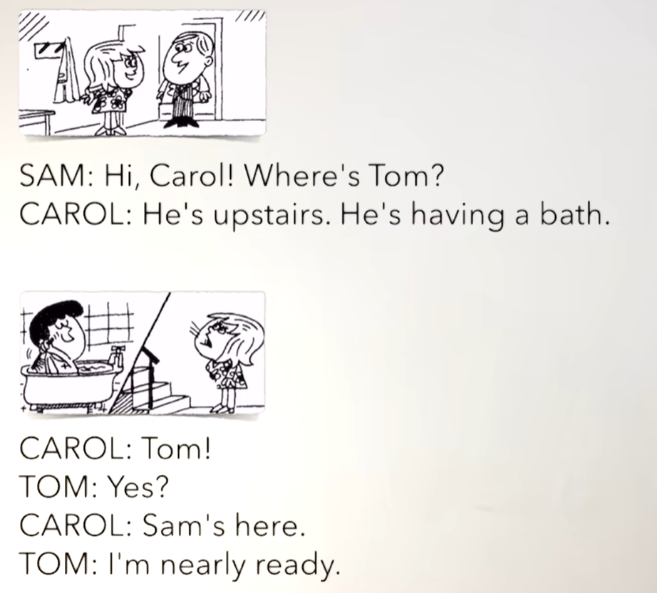
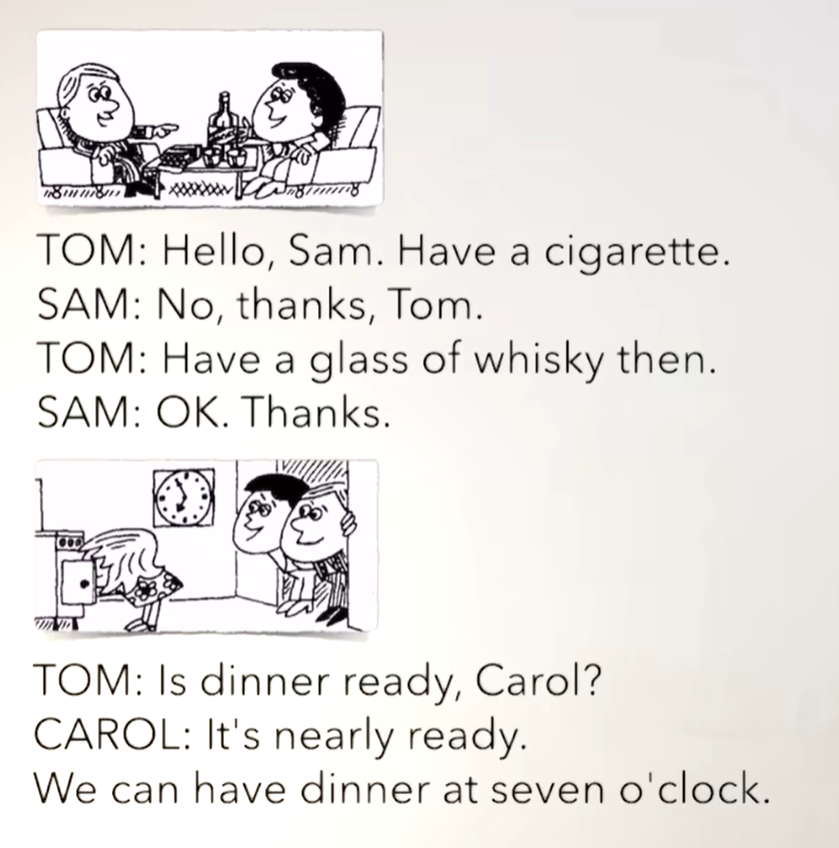
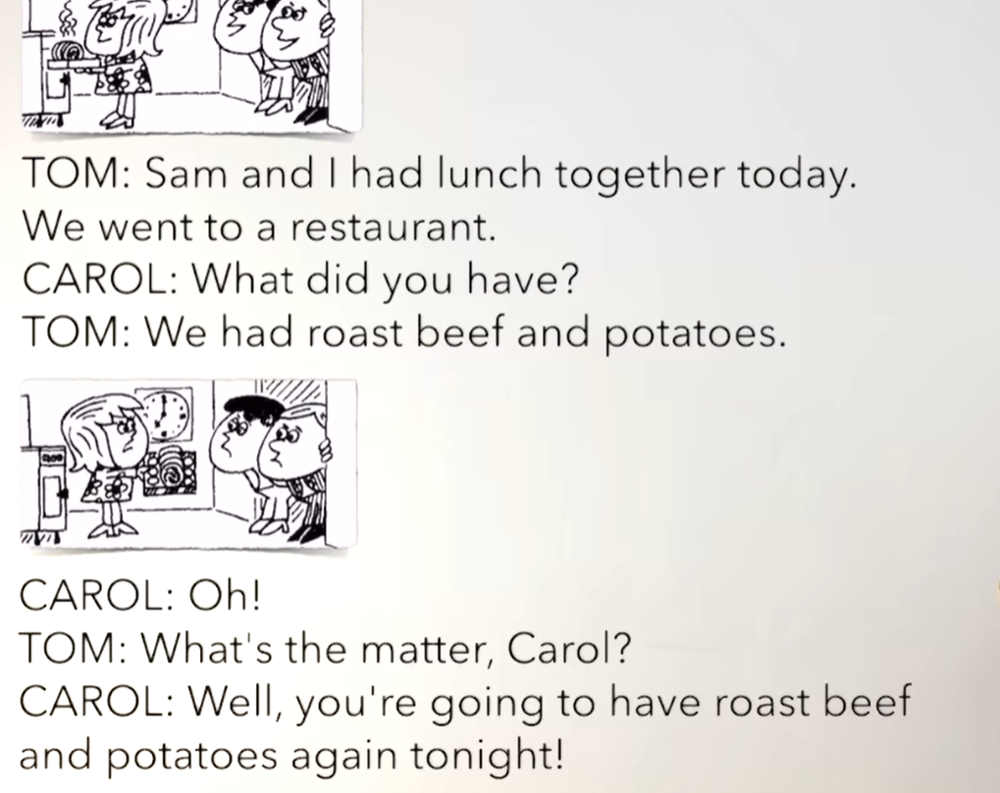
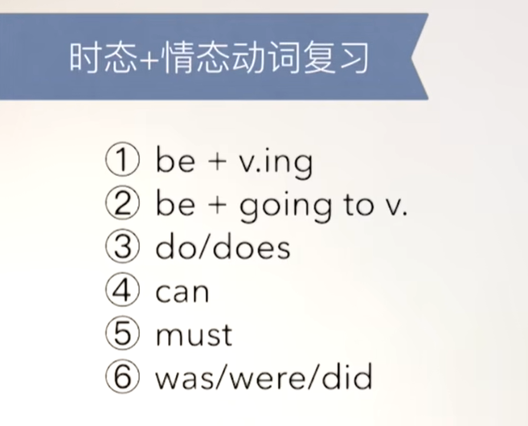
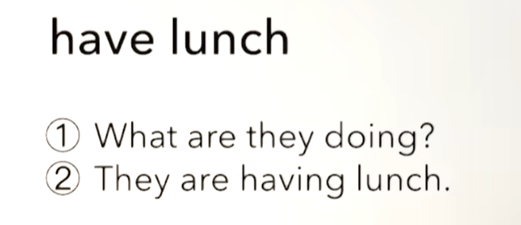
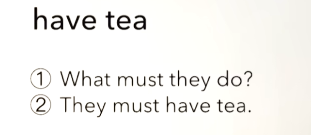
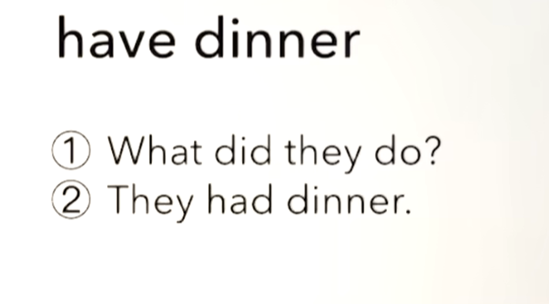
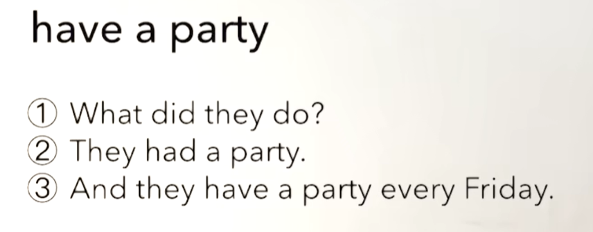

# 44、lesson81-82-have用法


## lesson 81


### 1、Question

#### 	1、have的万能用法？

​		have a bath

​		have dinner

​		have a meal -- 吃顿饭

​		have some milk -- 喝一些牛奶

​		have tea -- 喝茶

​		have coffee -- 喝咖啡

​		have a drink -- 喝一杯（指带酒精的饮品）


​		have fun -- have a good time -- 玩的开心

​		have a haircut --  剪头发

​		have a swim -- 游泳

​		have a holiday -- 度假

​		have a lesson -- 上课

​		have a cigarette -- 抽烟


​	have是一个比较万能的动词，吃喝玩乐都能表达。

​	以上这些have的用法基本都是把n名词进行动词化的结构


### 2、Word

#### 	1、bath -- n 洗澡

​	1、have a bath -- 其实就是bath，只不过是把bath动词化了

​	2、Did you have a bath？ -- 你刚才洗澡了吗？

​	3、I had a bath 2 hours ago -- 我2个小时前洗澡了 -- 注意have的时态变化

​	4、She is having a bath -- 她正在洗澡

​	5、I'm gonna have a bath tonight --- 我打算今晚去洗澡


#### 	2、ready nearly -- adv 马上就要准备好了

​	1、Are you ready？ --- 你准备好了吗？

​	2、I'm nearly ready -- 我马上就准备好了


#### 	3、dinner -- n 晚餐，正餐

​	1、have dinner -- 吃晚餐 --- 这个have 也是将名词进行动词化，这样就是吃晚餐

​	2、 I'm going to have dinner with my husband tonight

​	3、She had dinner with me last night

​	4、They're having dinner together -- 他们正在一起吃晚餐


#### 	4、restaurant -- n 餐厅

​	1、go to a restaurant -- 去餐厅

​	2、Last night，we went to a restaurant -- 昨晚，我们去了一家餐厅

​	3、Did you go to a restaurant last night？

​	


#### 	5、roast -- 烤箱

​	1、roast beef -- 烤牛肉

​	2、Do you like roast beef？ 

​	3、Yes，I want some roast beef -- 是的，我想要一些烤牛肉


### 3、Homework

```
1、单词造句3
	1、bath
		I have a bath every day	-- 我每天洗澡
		Can I have a bath？ -- 我可以洗澡吗？
		You need to have a bath -- 你需要洗澡
		
	2、nearly ready 
		The dinner is nearly ready -- 晚餐快要准备好了
		I am nearly ready -- 我快准备好了
		He is nearly ready to do his homework -- 他几乎准备好要做作业了
		
	3、dinner
		We have dinner together	-- 我们一起吃晚餐
		The dinner is very nice today -- 晚餐今天很不错
		I have dinner with my friends -- 我和朋友们一起吃晚餐
		
	4、restaurant
		Where is that restaurant? --那家餐馆在哪里？
		This is a Chinese restaurant -- 这是一家中餐馆
		She is going to the restaurant with Tom --她要和汤姆一起去一家餐馆
	5、roast
		I like to eat roast duck -- 我喜欢吃烤鸭
		This roast is very hot	-- 这块烤肉很烫
		What food is in the roast?  -- 这道烤制菜肴里有什么食材？


2、核心知识点
	这节的核心讲解了have的多种使用场景，have在很多时候都可以使用，而且在加名词n之后，可以将名词动词化，如bath是洗澡 have a bath也是洗澡的意思，但这个洗澡是动词具备动的意思。
	在使用have的时候注意有些是+ a 有些没有加，如have dinner这个需要多练习多使用去体会固定用法

```


### 4、Story



​	嗨Carol，Tom在哪？

​	他在楼上，他正在洗澡

​	Tom

​	怎么了？

​	Sam在这里

​	我马上就好了




​	你好Sam，抽支烟

​	不了，谢谢Tom

​	喝一杯威士忌

​	好的，谢谢


​	晚饭准备好了吗？Carol

​	它马上就好了

​	我们可以在七点吃晚餐




​	Sam和我今天中午一起吃的午餐，我们去的一家餐厅

​	你们吃了些什么？

​	我们吃了烤牛肉和土豆

​	噢！

​	怎么了Carol？

​	好吧，你们今晚将要再吃 烤牛肉和土豆了


## lesson 82


### 1、Word

#### 	1、breakfast -- 早餐

​	1、have breakfast -- 吃早餐

​	2、Did you have breakfast？ -- 你吃早餐了吗？


#### 	2、haircut -- n 理发

​	1、have a haircut -- 理发--动词化了

​	2、I'm having a haircut


#### 	3、party -- 聚会/派对

​	1、have a party -- 聚会

​	2、We're gonna have a party tonight -- 我们今晚要去举办个聚会


#### 	4、holiday -- n 度假

​	1、have a holiday -- 度假 -- 动词化

​	2、We're gonna have a holiday -- 我们将要去度假

​	3、You look so tired。 You must have a holiday -- 你看起来非常累，你必须去度假了


### 2、复习













 


