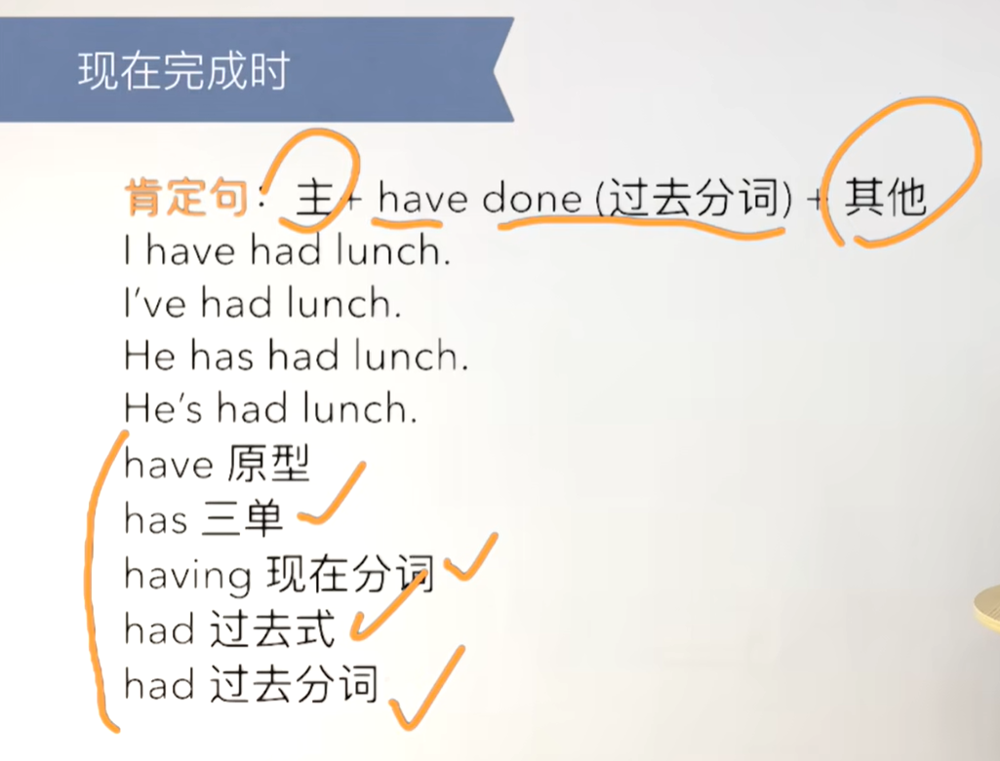
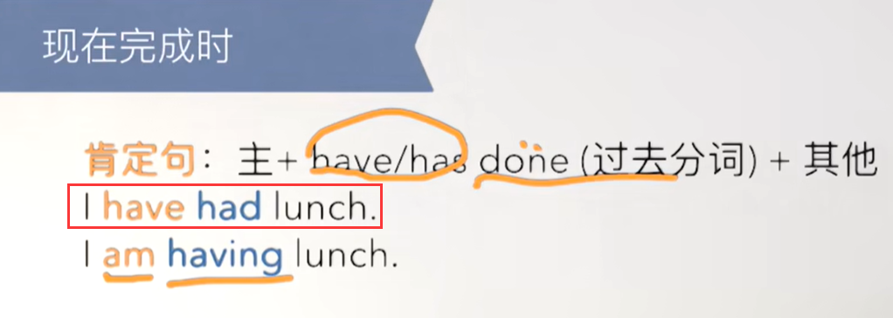
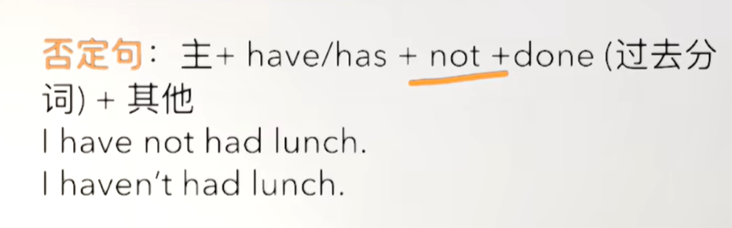
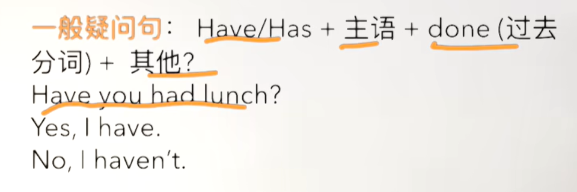
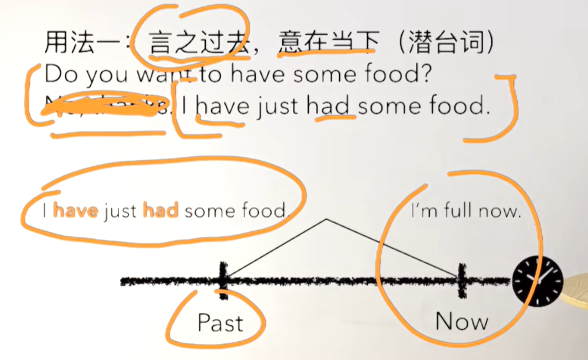
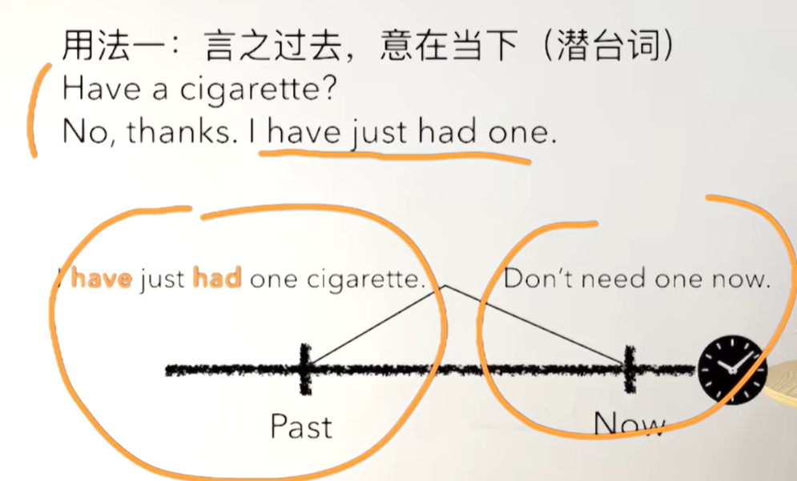
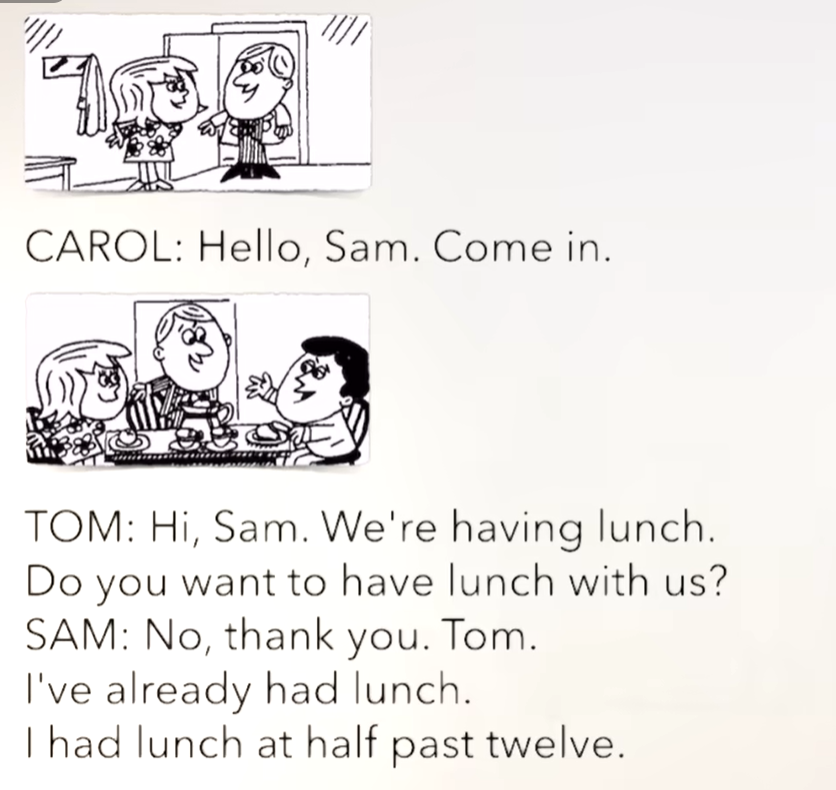
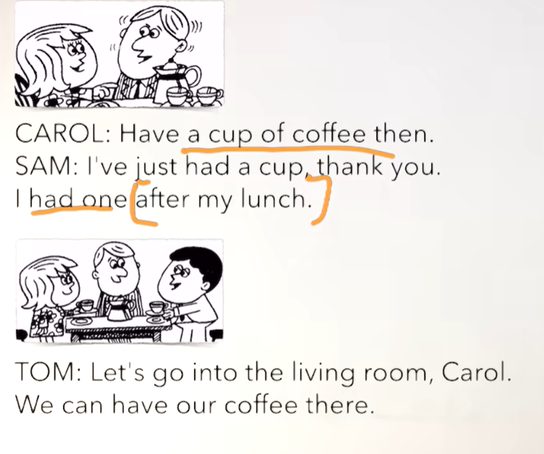
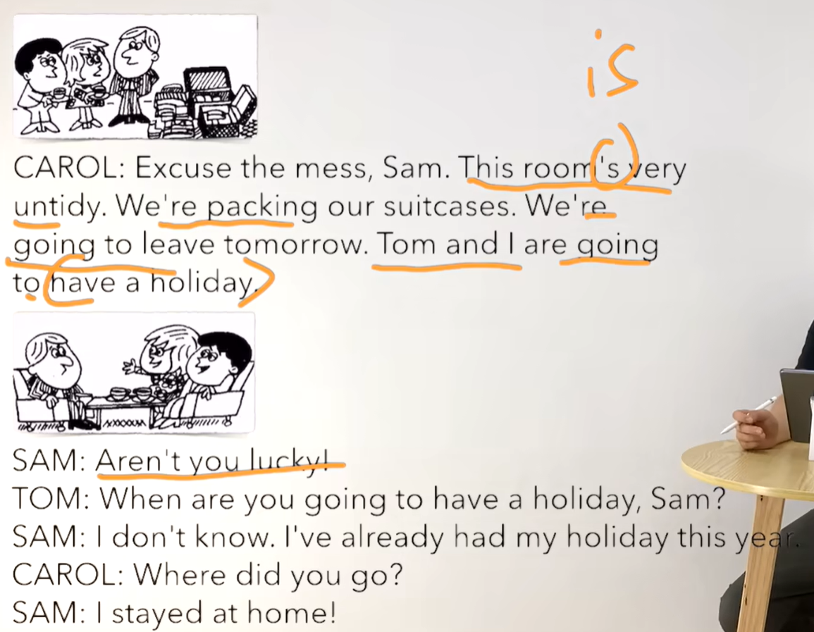

# 45、lesson83-84-have-现在完成时


## lesson 83


### 1、Question

#### 	1、现在完成时？

​		这个时态有点区别是，它不是直指现在的而是和过去有关系

​		这个时态主要表达的是，通过过去的表达来 映射当前的语境情况（与过去式的区别就是，过去式只是表达过去发生的事情，而没有映射当前的含义）




 











 


 


#### 	2、如何表达 制造混乱？

​			make a mess -- 制造混乱


### 2、Word

#### 	1、mess -- n 混乱

​	这个单词有点像 untidy --adj 不干净，不整洁，它俩的词性不同

​	1、The eggs fell on the floor and made a mess -- 鸡蛋掉到地上了，弄的一团糟

​	2、Be careful，don't make a mess -- 小心，别弄乱了


#### 	2、pack -- v 打包

​	1、pack my bag -- 整理我的包

​	2、I packed my bag yesterday -- 我昨天收拾了我的包

​	3、Did you **pack** your bag yesterday？ -- 你昨天打包你的包了吗？---v动词原形

​	4、When did you pack your bag？

​	5、Why did you pack your bag yesterday ？

​	6、I've packed my bag -- 现在完成时 -- 我已经打包好了（根据场景意味打好包 映射的其他含义）

​	7、Have you packed your bag? -- 你打包好了吗？


#### 	3、suitcase -- n 行李箱

​	1、suit + case

​	2、造句时想一些动词如：pack/clean/buy/need/want....

​	3、I packed my suitcase last night -- 我昨天晚上打包了我的行李箱 -- packed -- 过去完成式

​	4、He's going to pack his suitcase -- 他将要打包他的行李箱 -- be going to do

​	5、He is cleaning his suitcase -- 他正在打扫他的行李箱 --- cleaning 现在进行时

​	6、Are you going to buy a new suitcase？ -- 你打算去买一个新的行李箱吗？ -- be going to do 打算

​	7、Mom，can I buy a new suitcase -- can I 我能。。。 -- 妈妈我能买一个新的行李箱吗？


#### 	4、leave -- v离开 -- left过去式 -- left过去分词，already -- 已经

​	1、He's already left -- 他已经离开了 -- 典型的has + left 现在完成时

​	2、He's gonna leave，Just talk to him -- 你和他聊聊，他将要走了 --- be gonna do 一般将来时

​	3、Are you going to leave soon ？ -- 你很快就要走了吗？  -- be going to do 一般将来时


### 3、Homework

```
1、单词造句
	1、mess
		This party is very messy -- 这个派对非常乱
		Who is made a mess in the school -- 谁在学校里弄乱了？
		That bag is messy -- 那个包很乱
	
	2、pack
		I packed my bag yesterday -- 我昨天收拾了我的包
		Did you pack your bag yesterday？--你昨天收拾了你的包吗
		He is packing so quickly -- 他收拾得很快
	
	3、suitcase
		He has a red suitcase  -- 他有一个红色的手提箱
		I am opening your suitcase to check -- 我正在打开你的手提箱进行检查
		Do you like suitcases？ -- 
	
	4、leave
		They left the school  -- 他们离开学校
		He lift here -- 他离开了这里
        I left work six months ago. -- 我在六个月前离职
	

2、红皮书have + done

3、核心知识点
	这节主要讲解了 现在完成时 这个时态，现在完成时主要是 说在当前，意在之后，和表达的上下文有很大关系，一般使用的结构是 have/has + done(过去分词) -- 过去分词与动词的过去式基本一样 + ed
	例如：I have visited Paris.（我去过巴黎——强调过去的经历，现在的状态是我曾有过这种经历）
	
	
```


### 4、Story



​	你好Sam，进来吧

​	嗨Sam。我们正在吃午饭

​	你想和我们一起吃午饭吗？

​	不，谢谢Tom

​	我已经吃过午饭了

​	我在12点半的时候吃的午饭




​		那就喝一杯咖啡吧

​	我刚刚喝了一杯谢谢

​	午饭后我喝了一杯


​	我们一起去客厅吧Carol

​	我们可以在那里喝咖啡




​	不好意思有些乱Sam，这个房间非常乱。

​	我们正在打包我们的行李箱，我们将要明天离开。

​	Tom 和我将要去度假


​	难道你们不幸运吗？ -- 你们太幸运了

​	你什么时候打算去度假呢？

​	我不知道，我已经今年度过假了

​	你之前去哪了？

​	我当时呆在家里


