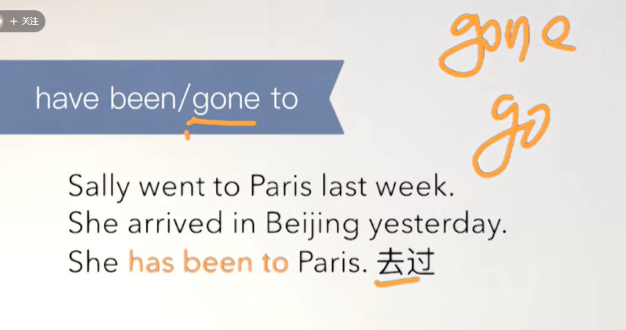
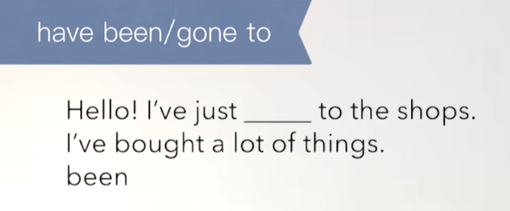
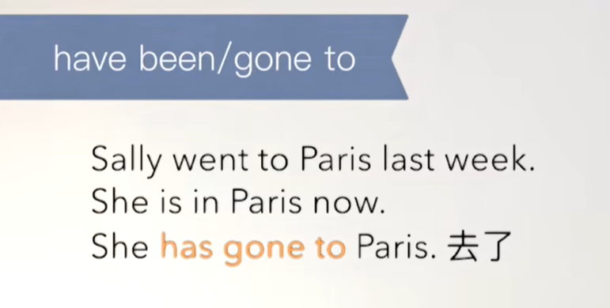
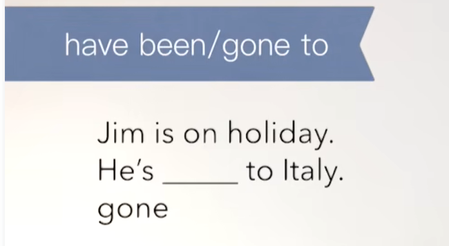
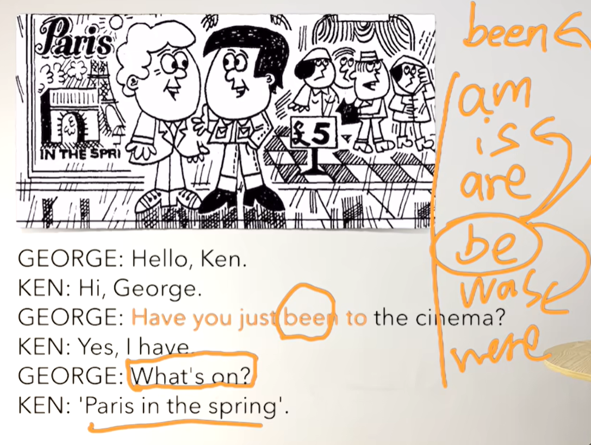
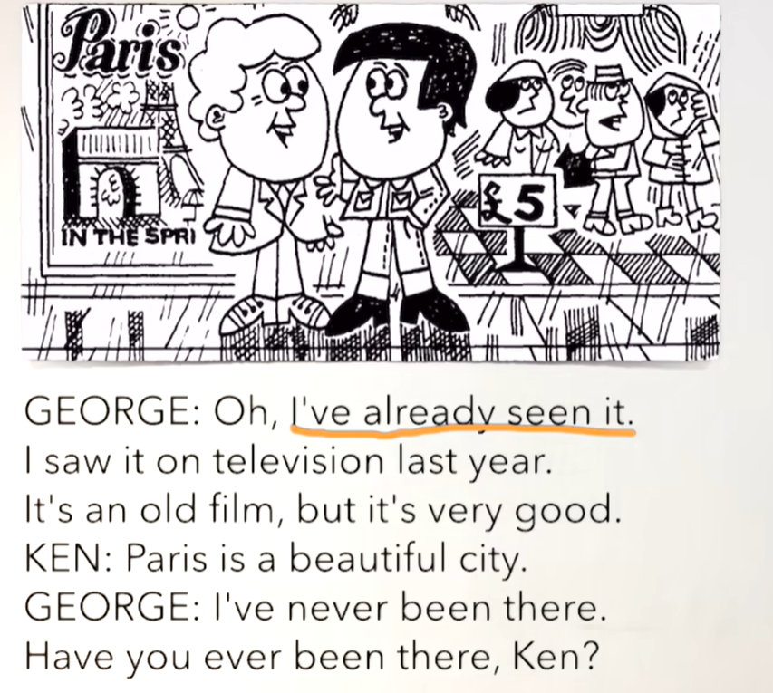
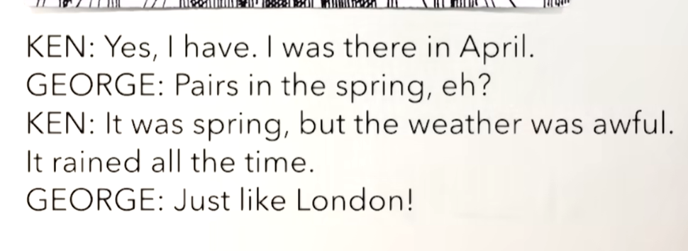

# 46、lesson85-86-have gone&have been to


## lesson 85


### 1、Question

#### 	1、如何表达 去电影院？

​		go to cinema


#### 	2、如何表达 看电影？

​		see a film -- 看电影


#### 	3、如何表达 任何时候都不要做？

​		never ever


#### 	4、have gone to 和 have been to 区别？



​		have been to -- 代表是去过，代表人去了又回来了的场景使用。





 

​		have gone to -- 去了 -- 代表人去了还没回来的场景使用








### 2、Word

#### 	1、Paris -- 巴黎 

​	1、go to Paris 

​	2、live in Paris 

​	3、I live in Paris three years ago

​	4、I went to Paris five years ago

​	5、When did you go to Paris？


#### 	2、cinema -- n 电影院，film -- n 电影

​	1、go to cinema -- 去电影院

​	2、Did you go to a cinema last night？

​	3、see a film -- 看电影

​	4、I saw a film with my girlfriend yesterday -- 我和我的女朋友昨天一起看电影

​	5、When did you see a film with your girlfriend？


#### 	3、beautiful -- adj 美

​	1、It's beautiful -- 好美

​	2、Isn't it beautiful -- 这难道不美吗？

​	3、She is beautiful -- 她很美

​	

#### 	4、city -- n 城市

​	1、I don't want to live in the city -- 我不想住在城市

​	2、Don't you want to live in the big city？ -- 难道你不想去大城市生活吗？

​	3、I want to live in the country -- 我想住在乡村


#### 	5、never -- 从来..也不会，永远不 ，ever -- 在任何时候


### 3、Homework

```
1、单词造句 3
 1、Paris
 	I want to go to Paris
 	Paris is very beautiful
 	I have been to Paris -- 我去过巴黎
 	
 2、cinema
 	I always see a film in the cinema
 	When did you go to the cinema？ -- 你什么时候去的电影院？
 	Let's go to the cinema -- 我们去电影院吧
 
 3、city
 	I like this city
 	How many people are there in the city？ -- 这座城市有多少人？
 	He left the city he lived in -- 他离开了他生活的城市
 
 4、never
 	I never walk alone at night -- 我从不在夜晚独自走路
 	He never likes to read books -- 他从不喜欢读书
	Are you never late? -- 你从不迟到吗

```


### 4、Story



​	been 是属于现在完成时，be的过去分词是 been

​	你去电影院了吗？

​	是的，我去过了

​	What's on？ -- 什么在上映？

​	巴黎之春




​	噢，我已经看过这个了，我去年在电视上看的。它是一部老电影了，但是非常好看。


​	巴黎是一个很美的城市

​	我从来没去过那里，你以前去过那里吗？Ken？




​	是的，我去过。我之前在四月份去过。

​	巴黎的春天？

​	当时是春天，但是天气很糟糕，当时一直都在下雨

​	就像伦敦一样


