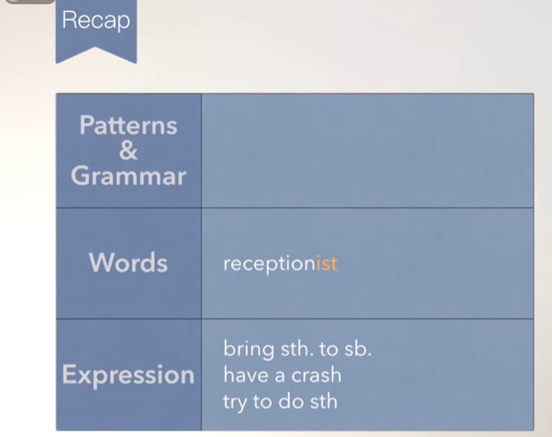
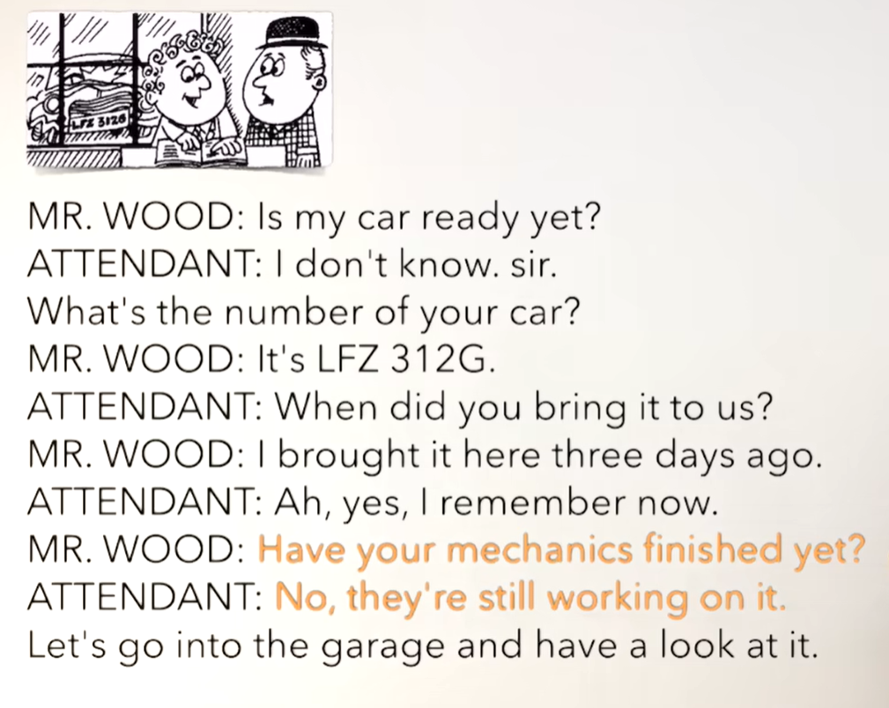
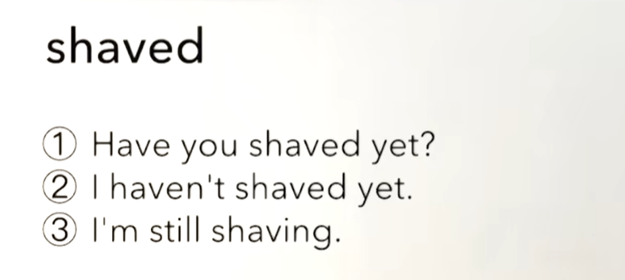
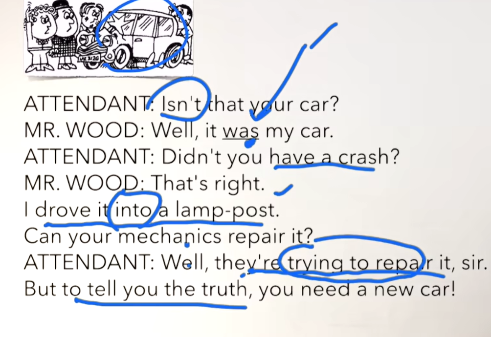
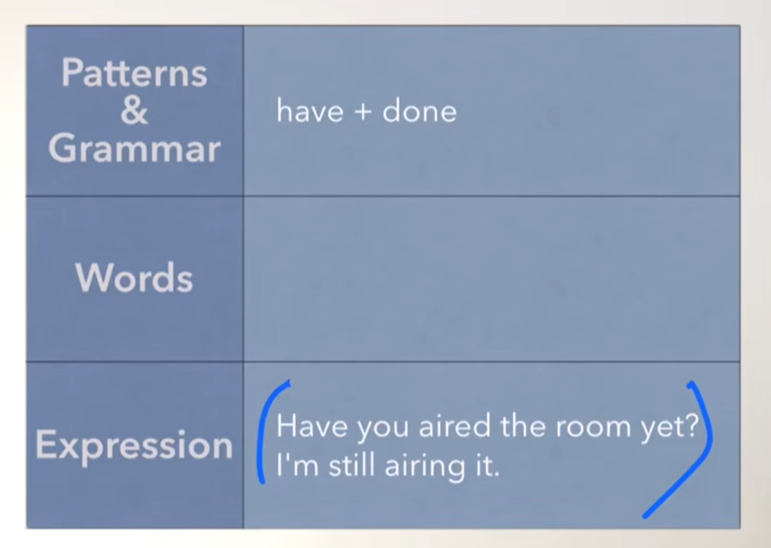
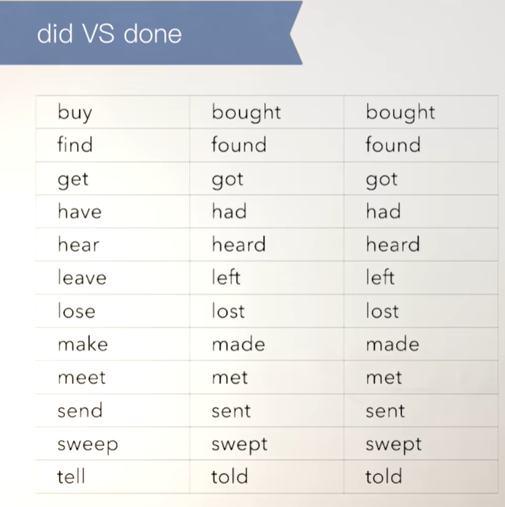

# 47、lesson87-88-Have you..yet


## lesson 87


### 1、Question

#### 	1、如何表达 前台？

​		reception -- 前台，+ist 前台工作人员 receptionist

​		Where is the reception？ -- 前台在哪里？


#### 	2、如何表达 带给某人某物？

​			bring sth to sb

​			Bring me some coffee -- 给我带来一些咖啡


#### 	3、如何表达 尝试做某事？

​			try to do sth

​			He tries to repair it every week -- 他每周都尝试去修理它


### 2、Word

#### 	1、attendant --n 前台 ，receptionist -- n 前台工作人员

​	1、I can't find the receptionist -- 我找不到前台工作人员

​	2、Where is the reception？ -- 前台在哪里？

​	3、Do you know that receptionist？ -- 你认识那个前台工作人员吗？


#### 	2、bring -- v 带来， brought -- 过去式和过去分词

​	1、Bring me some coffee -- 给我带来一些咖啡

​	2、Bring it to me -- 把它带给我

​	3、I brought my car here five days ago -- 我五天前把我的车带到了这里

​	4、Did you Bring your car here five days ago？ -- 你五天前把你的车带到这里了吗？


#### 	3、garage -- n 车库

​	1、There is a car in the garage -- 那辆车在车库里

​	2、They are having dinner in the garage -- 他们正在车库里吃晚饭

​	3、He bought a new garage last year -- 去年他买了一个新车库


#### 	4、crash -- n  撞车，事故

​	1、have a crash -- 撞车

​	2、I had a car crash last night -- 我昨天晚上撞车了

​	3、Did you have a car crash last night？ -- 你昨晚 撞车了吗？


#### 	5、lamp-post -- n 路灯

​	1、I drove into a lamp-post -- 我开车撞路灯了

​	2、How did you drive into a lamp-post？

​	3、We're gonna clean all the lamp-posts on this street -- 我们打算打扫这条街上所有路灯


#### 	6、repair -- v 修理 ，try -- v 尝试

​	1、try to do sth -- 尝试去做某事

​	2、I am trying to talk to the receptionist -- 我正在尝试和前台谈谈

​	3、Are you trying to repair my computer？ -- 你正在尝试修理我的电脑吗？

 	4、He tries to repair it every week -- 他每周都尝试去修理它

 





### 	3、Homework

```
1、单词造句 3

2、核心知识点
	这节主要讲了如何表达前台 receptionist--前台工作人员
	带给某人某物bring sth to sb
	尝试做某事 -- try to do sth
	
```


### 4、Story



​		我的车准备好了吗？

​		我不清楚先生，你的车牌号是多少？

​		它是LFZ 312G

​		你什么时候把它带到这里的？

​		我3天前把它带到这里

​		哦，是的，我现在想起来了

​		你们的修理师傅已经修完了吗？

​		没有，他们还在一直工作修理中

​		让我们去车库和看一下它






​	那是你的车吗？

​	是的，它是我的车

​	你之前出车祸了？

​	是的，我开车撞了路灯了

​	你的修理师傅可以修好它吗？

​	好吧，他们正尝试修理好它，先生

​	但是 实话和你说吧，你需要一辆新车了





### 5、Table-did&done





