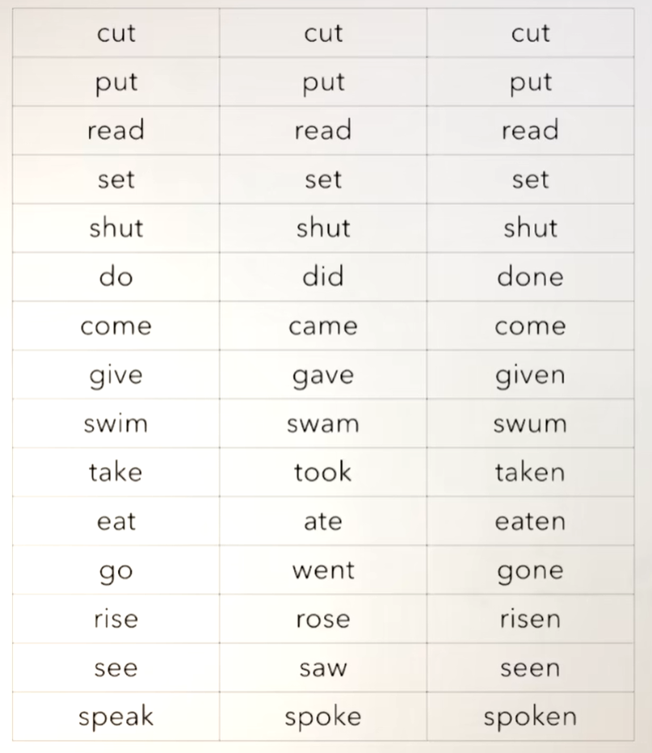

# 48、lesson89-90-have+done用法二


## lesson89


### 1、Question

#### 	1、have + done 用法二？

​		这一个时态的结构可能有不同的含义，但是结构不会变

​	虽然我们今天学 have + done 的第二个用法，但是它的结构不变

​		


​		在现在完成时的时候，一般for + 一段时间

​		如：for three years	

​		since + 时间点

​		如： since 1984 -- 自从1984....


##### 		I have been here for 2 hours -- 我已经在这里呆了俩个小时了 -- have bean 持续或重复到现在


​    


​		

####  	2、如何表达 物有所值？

​	1、worth every penny -- 值每一分钱 -- 物有所值


### 2、Word

#### 	1、believe -- 相信

​	1、Do you believe me ？ -- 你相信我吗？

​	2、I don't believe it --  我不相信它

 

#### 	2、may -- 许可

​		类似于can

​	1、May I 。。。。

​	2、I'm thirsty

​	3、May I have some water？ -- 我可以喝一些水吗？

​	4、May I close the door？ -- 我可以关上门吗？


#### 	3、why -- 为什么，because -- 因为

​	1、because + 句子 -- 相当于一个引导词

​	2、Why are you having a meal at midnight -- 你为什么大半夜的吃饭吗？

​	3、Because I'm so hungry 


#### 	4、sell --v 售 卖 - sold 过去式&过去分词

​	1、for sale -- 出售 -- sale是sell的名词方式，如果是sold就代表 已经卖出去了

​	2、They sold their house yesterday -- 他们昨天把他们的房子卖了

​	3、Did they sell their house yesterday？ -- 

​	4、When did they sell their house？ -- 他们什么时候卖掉他们的房子？


#### 	5、retire -- v 退休

​	1、My father can stay with my mon，because he has just retired -- 我父亲能和我妈妈呆在一起，因为他刚刚退休。

​	2、They retired last month -- 他们上个月退休了

​	3、Did they retire last month？ -- 他们上个月退休了吗？

​	4、When did they retire？


#### 	6、cost --v 花费

​	1、It costs 68,500 -- 它花了68500 ---- 指某个物品花费了多少

​	2、Does it cost 68,500？

​	3、How much does it cost？ -- 这个要多少钱？


#### 	7、pound -- 磅 英镑 ，penny 便士 分， pence是penny的复数


#### 	8、worth -- 值

​		1、worth every penny -- 值每一分钱 -- 物有所值


### 3、Homework

```
1、单词造句 3

2、红皮书have + done 用法二

3、核心知识点
	现在完成时的第二种用法 have + done +时间，代表持续保持 - 直到现在
	
	
	
	
	
	
```


### 4、Story


​	下午好

​	我认为这个房子在售

​	是的

​	我可以看一下它吗？

​	没问题，进来吧


​	你住在这里多久了？

​	我住在这里已经二十年了

​	二十年了，那是真长时间

​	是的，我从1976年一直在这里

​	那么为什么你想要卖掉它呢？

​	因为我刚刚退休，我想在乡下买个小房子


​	这个房子售价多少？

​	68千 500

​	那是不少钱啊

​	它物超所值

​	好吧，我喜欢这个房子，但是我还没有办法决定

​	我妻子必须要先看一下

​	女人总是拥有最终决定权


## lesson90


### 1、table

​	过去式表格、过去分词表格 




