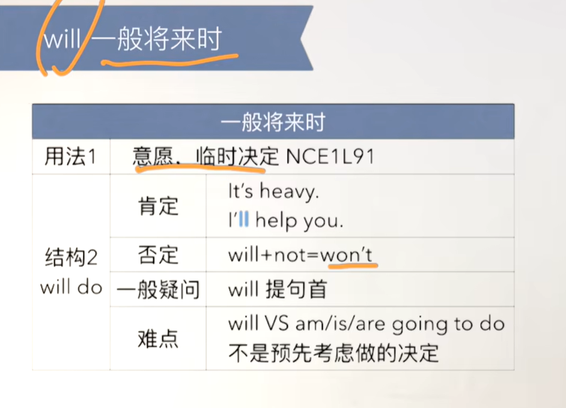
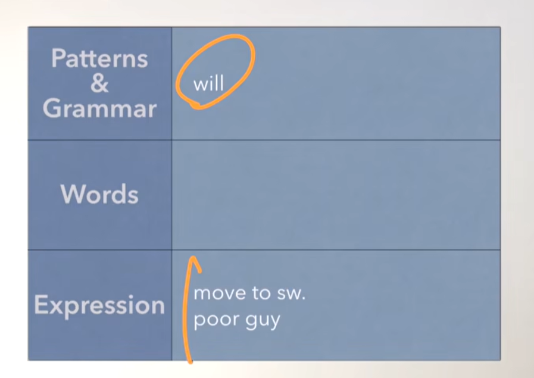
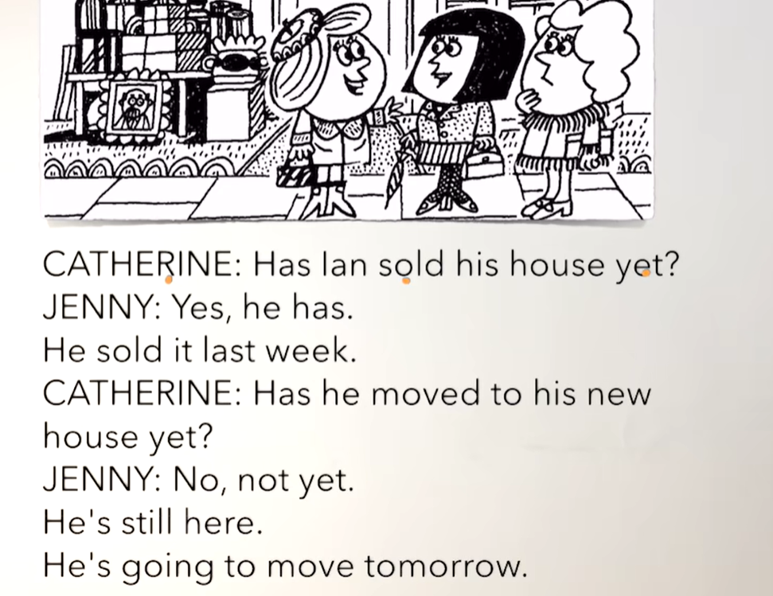
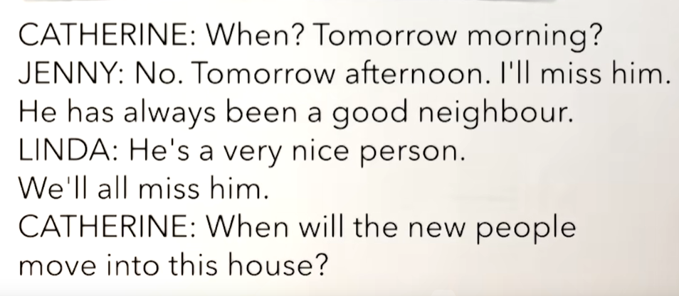
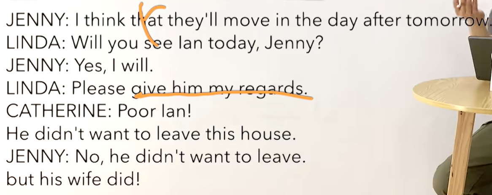
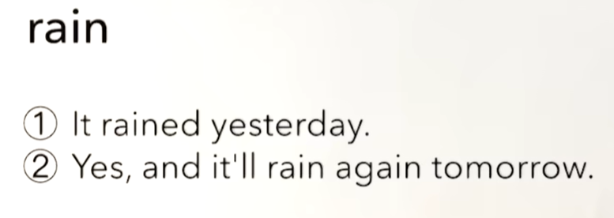
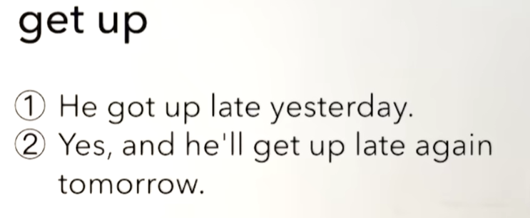
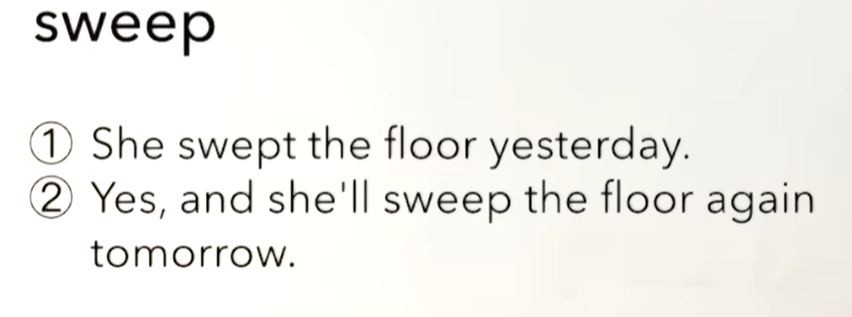

# 49、lesson91-92-will的使用


## lesson91


### 1、Question

#### 	1、如何表达 搬去某地？

​			move to sth


#### 	2、如何表达 可怜的家伙？

​			poor guy 


#### 	3、如何使用Will？





### 2、Word

#### 	1、still -- 依旧

​	1、He's still here -- 他依旧在这里

​	2、Is he still here？

​	3、Why is he still here？


#### 	2、move -- v 移动

​	1、He is going to move tomorrow -- 他打算明天搬家

​	2、move to sw. -- 搬去某地

​	3、He moved to Beijing last year。 -- 他去年搬到了北京

​	4、Did he move to Beijing last year？

​	5、When did he move to Beijing？


#### 	3、miss -v 想

​	1、They miss you a lot --- 他们特别想你

​	2、Do you miss me？ -- 你想我吗？


#### 	4、neighbour -- 邻居，neighbor -- 另一种写法

​	1、Do you like your new  neighbor -- 你喜欢你的新邻居吗？

​	2、I like them，but my husband doesn't like our  new neighbor -- 额喜欢他们，但是我的丈夫不喜欢新邻居

​	3、Why doesn't he like your neighbor？ -- 为什么你不喜欢？

​	4、They are talking to their neighbor？ -- 他们正在和他们的邻居说话


####   5、person -- people -- 人员

​		person是人的单数-一个人，people是复数 -- 多个人

​	1、There is one person in our living room Who is that？有一个人在我们的客厅，那是谁？

​	2、There are three people in our kitchen who are they？

​	3、A lot of people are dancing in the street，Why are they dancing？ -- 很多人正在街上跳舞，他们为什么在跳舞？


#### 	6、poor -- adj 穷 可怜的

​	1、Loot at these poor people Let's help them -- 你瞧瞧这些可怜的人们，让我们帮助他们吧

​	2、Oh，that poor guy -- 哦，那个可怜的家伙





### 3、Story



​	lan已经卖掉房子了吗？	

​	是的，他卖了

​	他上周卖的

​	他已经搬到他的新房子了吗？

​	不，还没有

​	他还待在这里，他打算明天搬家




​	什么时候？明天上午？

​	不是，明天下午，我会想念他的

​	他一直是一个好的邻居

​	他是一个非常好的人，我们都会想念他的

​	什么时候新人搬进这个房子？




​	我认为他们将会在后天搬过来

​	你今天要去看Jenny吗？

​	是的，我将会去

​	请带给他我的祝福

​	可怜的lan，他并不想离开这个房子

​	不，他不想离开，但是他的妻子想离开


## lesson92


### 练习

#### 1、一般过去时&一般将来时










### 4、Homework

```
1、绿皮书

2、核心知识点
	will的使用，与情态动词can的方式使用基本一样
	缩写的时候是'll
	will代表的一种意愿，将要，会，的意思
	
	
	
```


