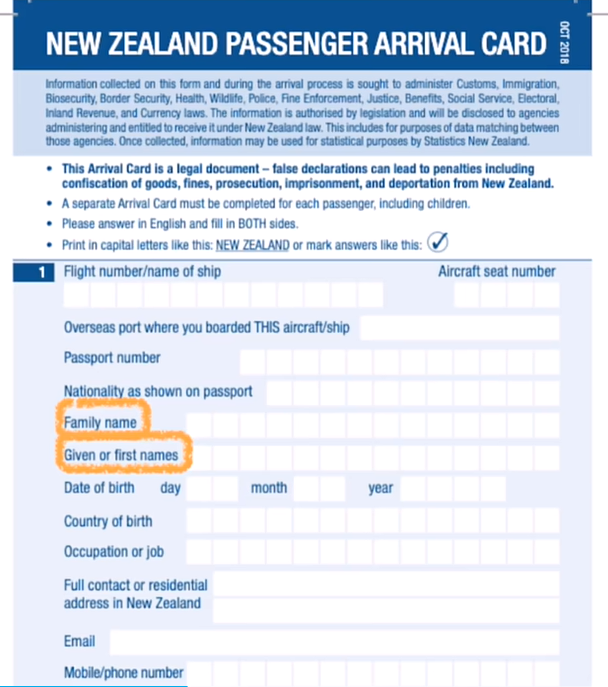
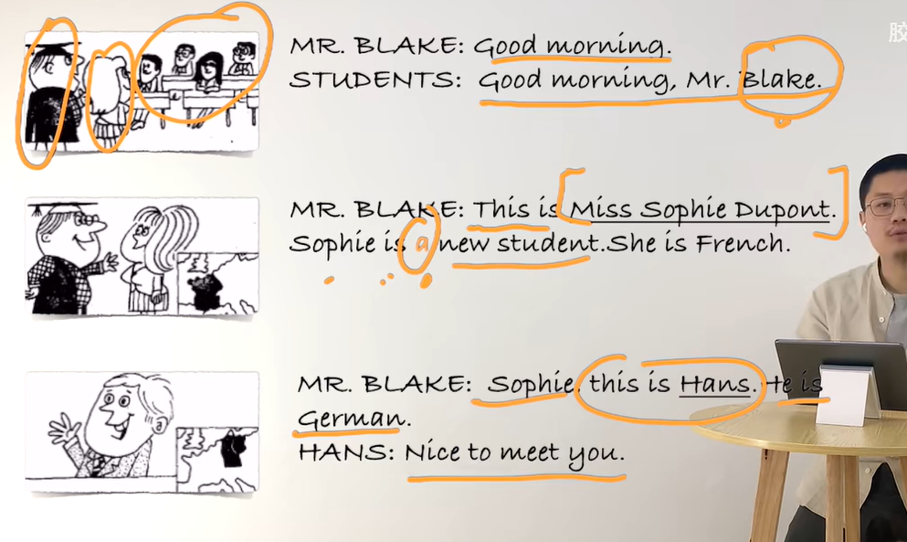

# 4、lesson5-6

## 1、单词

​	

​			一般帮别人处理比较重要的事情才知道 middle name 中间名字

​		lastname 就是姓，也就是家族名字

​			入境卡的填写

#### 	1、Mr 先生

​	

​	

#### 	2、good morning 早上好

#### 	3、new 新的

#### 	4、French 法国

#### 5、German -- 德国

#### 6、Nice to meet you -- 见到你很高兴

​		第一次见面可以使用，一般很少用，但是初次见面还是会使用的

​		比较熟的人非正式场合可以使用 what's up man

#### 	7、Japanese -- 日本

​	

​		sushi -- 寿司

#### 8、Korean -- 韩国

​		kimchi -- 泡菜

#### 	9、Chinese -- 中国人

​	

​		fusion food -- 融合类食物 -- 改良的本地口味

​		Mandarin -- 普通话 

​		Cantonese -- 粤语   --因为早期很多移民是来自于粤语地区

#### 	10、too -- 也

​			太，过于，过度；也

## 2、语法

​	

​		a book

​		她也是中国人

​	

​	这就是大家，这是所有人

## 1、单词

​	

#### 	1、make -- brand -- 品牌

​		what's brand  is this ？ 这是哪个品牌

#### 	2、Swedish -- 瑞典的

​			meatball -- 肉丸

#### 	3、English --英语

​	

#### 	4、American -- 美国人

​	

#### 	5、Italian -- 意大利人

​	

​				pasta -- 意大利面

## 	2、练习

​		

​		

