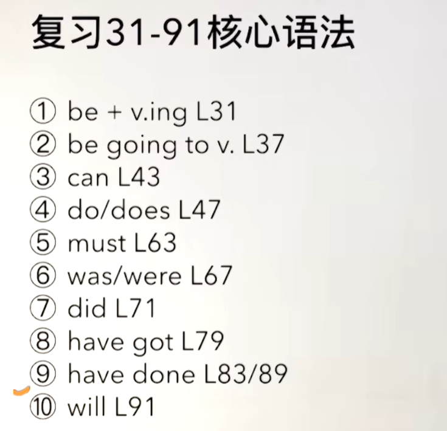
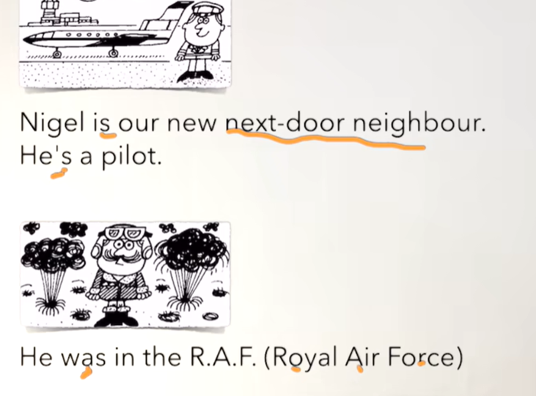
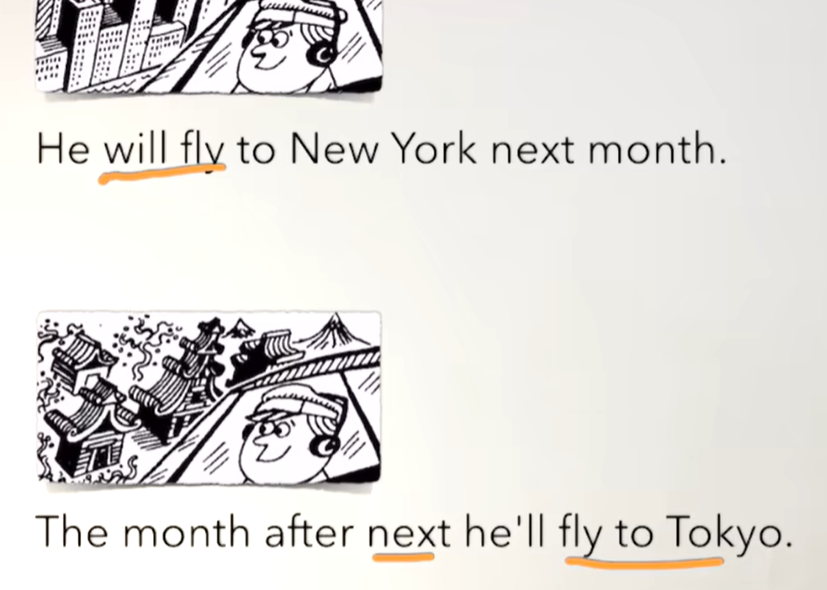
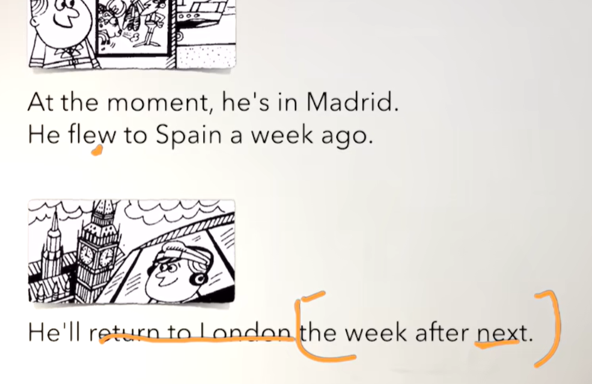
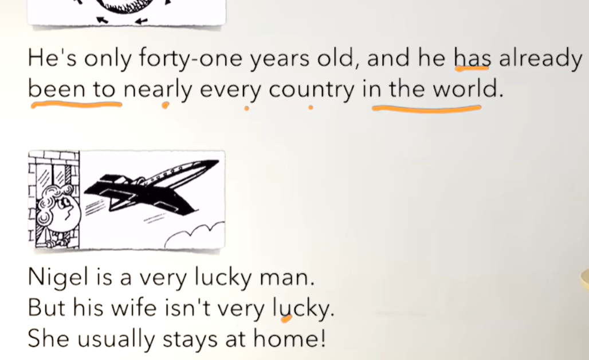

# 50、lesson93-94-复习31-91语法


## lesson93


### 1、Question

#### 	1、如何表达 返回某地？

​	1、return to sw -- 返回某地

​	2、He will return to Beijing next week -- 他将在下周返回北京


#### 	2、如何表达坐飞机去某地？

​	1、fly to sw -- 坐飞机去某地

​	2、They flew to New York this morning -- 他们今天早晨坐飞机到纽约

​	3、I will fly to Madrid tonight -- 今晚我要去马德里


### 2、Word


#### 	1、pilot -- n 飞行员

1、What's your husband‘s job？

2、He is a pilot -- 他是一名飞行员


#### 2、return -- n v 返回

​	1、return ticket -- 往返票

​	2、return to sw -- 返回某地

​	3、He will return to Beijing next week -- 他将在下周返回北京

​	4、Will he return to Beijing next week？

​	5、When will he return to Beijing？


#### 3、New York -- 纽约

​	1、Have you ever been to New York？-- 你去过纽约吗？

​	2、Sally has gone to New York -- Sally 去纽约了


#### 4、Tokyo -- 东京

​	1、I'll fly to Tokyo next month -- 我将要在下个月到东京

​	2、Will you fly to Tokyo next month？

​	3、When will you fly to Tokyo？


#### 5、Madrid -- 马德里

​	1、They moved to Madrid last year

​	2、Did they move to Madrid last year？ -- 他们去年搬去马德里了吗？


#### 6、fly --v -flew - flown -- 飞 ，过去式&过去分词

​	1、fly to sw -- 坐飞机去某地

​	2、They flew to New York this morning -- 他们今天早晨坐飞机到纽约

​	3、I will fly to Madrid tonight -- 今晚我要去马德里


### 3、复习31-91核心语法




### 4、Story



​	Nigel 是我们的新邻居

​	他是一名飞行员

​	他之前是在英国皇家空军




​	他下个月将飞到纽约

​	他下下个月 将飞到东京




​	现在，他在马德里

​	他一周前飞到了西班牙

​	他在下下周将返回伦敦




​	他仅仅41岁，但是它已经去过几乎世界的全部国家

​	Nigel 是非常幸运的人

​	但是他的妻子非常不幸

​	她总是待在家里


### 5、Homework

```
1、绿皮书

2、核心知识点
	总结了31--91课的语法关键知识点
	
```


## lesson94


### 1、Word

#### 1、Athens -- 雅典


#### 2、Berlin -- 柏林


#### 3、Bombay -- 孟买


#### 4、Geneva -- 日内瓦


#### 5、London -- 伦敦


#### 6、moscow -- 莫斯科

 

#### 7、Rome -- 罗马


