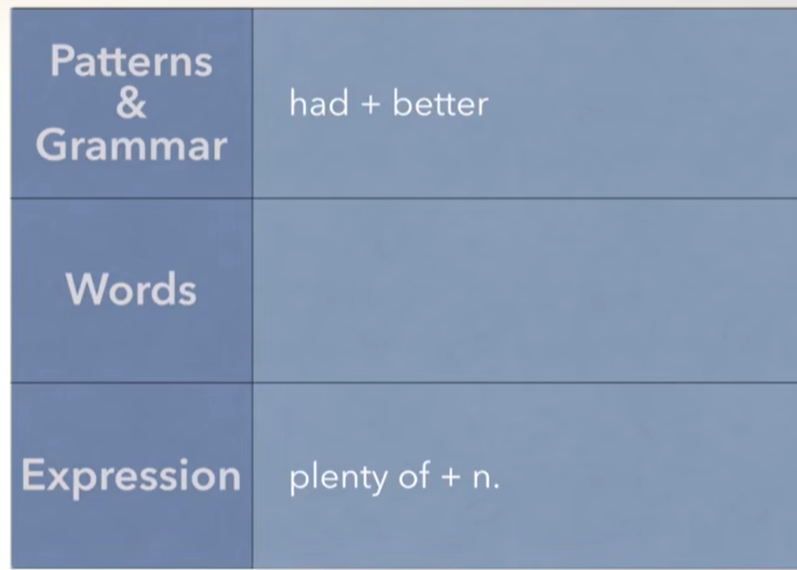
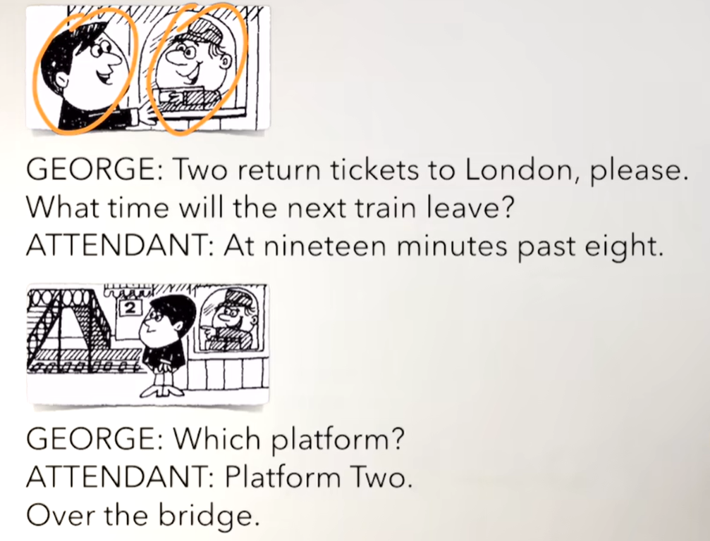
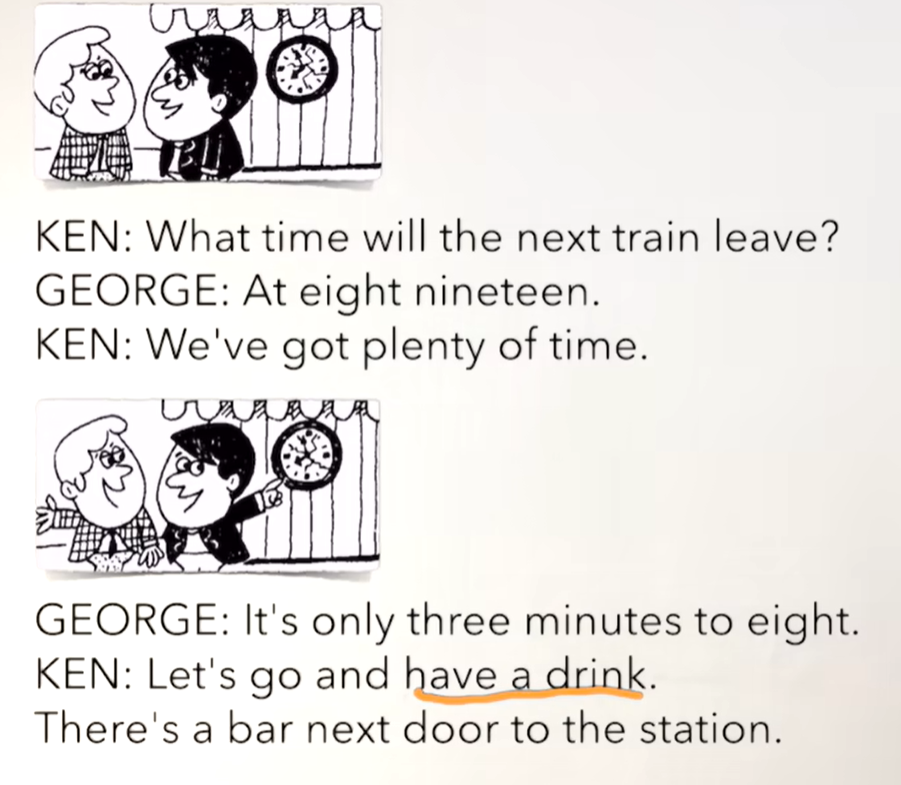
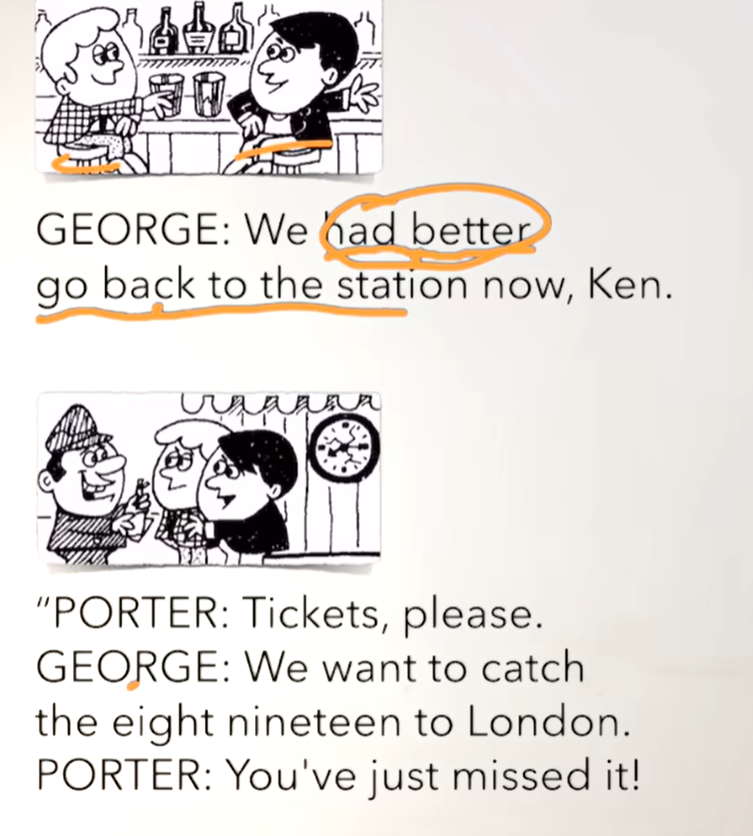
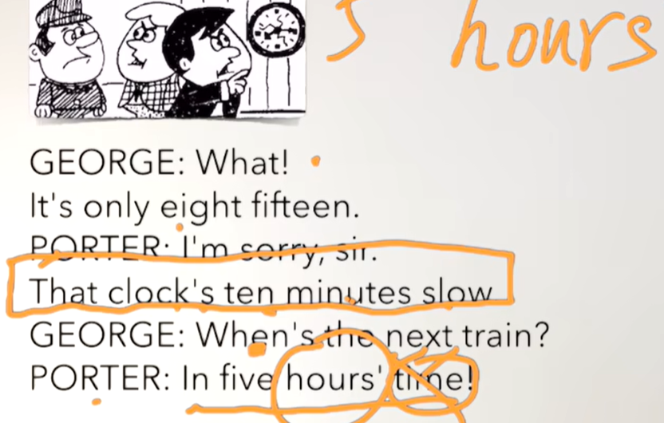

# 51、lesson95-96-had+better最好

## lesson95

### 1、Question

#### 	1、如何使用had+better？

​		语法不难，迷惑性有些

​		had better -- 这里的had不代表have的过去式或过去分词，也并不翻译为 有的含义

​		better -- good 的比较级 代表更好

​		这个had better直接翻译为 **最好**怎么怎么样，如，你最好带一把伞

​		（去做某事，否则会有麻烦/困难/危险）

​	

​		You had better take an umbrella -- 你最好带一把伞

​		可以缩写 You'd better （注意：had不表过去）

​		主语 + had better + 动词原形 + 其他

​		You’d better sleep -- 你最好去睡觉

​		You'd better return the money -- 你最好把钱还回去

​		You'd better see a doctor -- 你最好去看医生

​		否定句

​		He had better not eat any food -- 他最好不要吃太多食物

​		主语 + had better + not + 动词原形 +其他

#### 	2、如何表达 大量的，充裕的？

​	1、plenty of + n -- 大量的

​	2、There are plenty of eggs in the basket -- 篮子里有充裕的鸡蛋

​	3、We‘ve got plenty of money -- 我们有足够多的钱

#### 	3、如何表达 赶上/错过火车？

​		使用catch

​	1、He is gonna catch a train -- 他要去赶火车

### 2、Word

#### 	1、return -- n v 往返，返回

​	1、return tickets -- 往返票

​	2、You'd better buy the return tickets -- 你最好购买往返车票

#### 	2、train -- n 火车

​	1、Have you ever seen a train？ -- 你看过火车吗？

​	2、I have never seen a train -- 我从来没见过

​	3、Do you like train？ -- 你喜欢火车吗

​	4、I liked train，but now I don't -- 我喜欢过火车，但是现在我不喜欢

#### 	3、station 站（火车站） platform -- 站台

​	1、Excuse me。Where is the train station？ -- 打扰了，火车站在哪里？

​	2、The train station is over there -- 火车站在那边

​	3、Which platform？ -- 哪个站台   platform three -- 3站台

#### 	4、plenty -- 很多

​	1、plenty of + n -- 大量的

​	2、There are plenty of eggs in the basket -- 篮子里有充裕的鸡蛋

​	3、We‘ve got plenty of money -- 我们有足够多的钱

​	4、Have we got plenty of money？ -- 我们有足够多的钱吗

#### 	5、bar -- n 酒吧 

​	1、Is there a bar near here？ -- 这个附近有酒吧吗？

​	2、Excuse me，Where is the bar？

​	3、They have just cleaned the bar -- 他们刚刚打扫了这个酒吧

​	4、He went to a bar last night -- 他昨天晚上去的酒吧

#### 	6、porter -- 乘务员

​	1、Have you met that porter yet？ -- 你已经见过那个乘务员了吗？

​	2、I'm gonna meet a porter tonight -- 今晚我要去见一个乘务员

#### 	7、catch -- 抓，caught -- caught -- 赶上

​	1、He is gonna catch a train -- 他要去赶火车

​	2、They caught a bus last night -- 他们做完赶上了一辆巴士

#### 	8、miss -- 想 思念 错过

​	1、Oh man，we miss the train -- 天哪，我们错过了火车

​	2、Hurry up，don't miss the train -- 快点，别错过了火车

### 3、Story

​	俩张到伦敦的往返票

​	下一趟火车多久出发？

​	在8点19分

​	哪个站台？

​	2号站台，

​	跨过桥

​	下一趟火车几点离开？

​	8点19分

​	我们有足够的时间

​	还有3分钟八点

​	咱们去喝一杯吧

​	火车站旁边有一个酒吧

​	我们最好现在回到火车站Ken

​	票，谢谢

​	我们想要赶上8点19到伦敦的车

​	你们刚刚错过了这辆火车

​	什么

​	现在是8点15

​	对不起先生，那个表慢10分钟

​	下一趟火车是什么时间？

​	5个小时后

